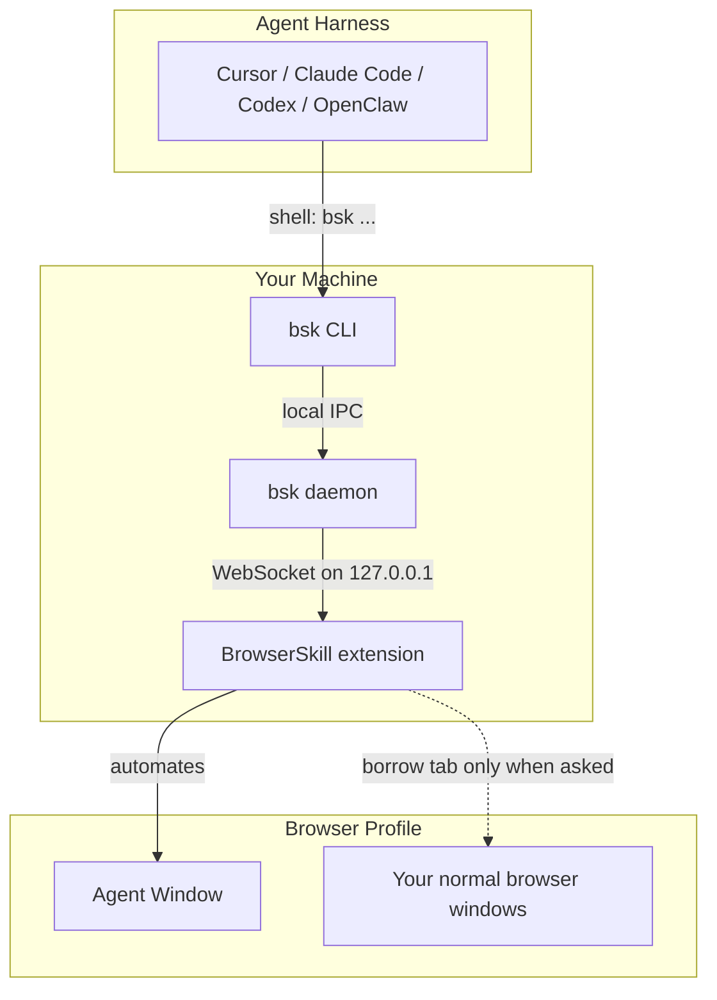

# Tencent/BrowserSkill

## Metadata
- Stars: 4454
- Primary language: TypeScript
- Default branch: main
- Latest release: cli-v0.3.0 (2026-09-17)
- License: MIT License
- Homepage: (none set)
- Fetched: 2026-09-18
- Final URL: https://github.com/Tencent/BrowserSkill

## Description
Let AI agents use your real, logged-in browser without interrupting your work. CLI + extension for browser automation across any shell-capable AI agent.

## README
# BrowserSkill

**Let AI agents use your browser without interrupting your work.**

English · 中文 (README.zh-CN.md)

**BrowserSkill** connects Cursor, Claude Code, Codex, OpenClaw, CodeBuddy,
WorkBuddy, Pi, Hermes Agent, DeepSeek Harness, and other AI agents to your already logged-in
browser.

Need the agent to touch a tab you already have open? It must borrow that tab
explicitly, return it when the task is done, and leave the rest of your browser
alone.

## BrowserSkill Advantages

- **Reuse real login state**: Agents can work with sites you are already signed
  into, without separate test accounts.
- **Keep working uninterrupted**: browser tasks run in a separate, visible
  Agent Window, so you can keep using your own browser.
- **Support any Agent**: any Agent that can call a shell can use BrowserSkill
  through the `bsk` CLI, with no lock-in to a specific model, Agent framework, or
  harness.
- **Built-in human-in-loop**: when a task hits captcha, login, confirmation
  dialogs, or other human-only steps, the Agent can ask you to take over and
  then continue afterwards.

Capture a long image in **Quick actions → Full-page screenshot**, or let an Agent use
`bsk screenshot --session <id> --full-page --out page.png`. See the
full-page screenshot guide (docs/long-screenshot.md) for page support, cancellation and export.

## Runtime Environment

BrowserSkill has two local runtime pieces: the `bsk` CLI/daemon and the browser
extension.

| Runtime | Support |
| --- | --- |
| Operating systems | macOS (Apple Silicon and Intel), Linux (x64 and ARM64), Windows x64 |
| Browsers | Chrome and Microsoft Edge are supported; other Chromium-based browsers are expected to work when they support unpacked Chromium extensions; Firefox is planned |

## Quick Start

Using an agent sandbox that reaps background processes after each command?
Follow the sandboxed agent setup (docs/sandboxed-agents.md) to keep the daemon
in a persistent host environment and connect with a shared `BSK_HOME` plus
`BSK_AUTO_START=0`. Ordinary local use keeps automatic startup by default.

**Install with your Agent (recommended)**

Already using Cursor, Claude Code, Codex, or another shell-capable agent? Just
copy this one line and send it to your agent — it will install the CLI and skill
for you, then walk you through loading the extension:

```text
Set up browser-skill on this machine by following https://raw.githubusercontent.com/Tencent/BrowserSkill/main/AGENT_INSTALL.md
```

**Manual install**

Install the CLI, then install the extension from the Chrome Web Store
(https://chromewebstore.google.com/detail/hhcmgoofomhgciiibhipgmgkgnoenaoi)
or Edge Add-ons (https://microsoftedge.microsoft.com/addons/detail/browserskill/emacgiaaaiojkkpkddmmdfhmokgmnikg).

#### 1. Install the `bsk` CLI

**macOS / Linux** (recommended — installs to `~/.local/bin`):

```bash
curl -fsSL https://raw.githubusercontent.com/Tencent/BrowserSkill/main/install.sh | sh
export PATH="${BSK_INSTALL_DIR:-$HOME/.local/bin}:$PATH"
```

**Windows** (PowerShell — installs to `~/.local/bin`):

```powershell
irm https://raw.githubusercontent.com/Tencent/BrowserSkill/main/install.ps1 | iex
```

The export makes the CLI available in the current Unix shell. A running agent may
need the same PATH setting in each shell call, or the installed binary's absolute
path. Restart the agent if it retains an old PATH after installation.

Verify the binary in the terminal or agent environment that will use it:

```bash
bsk --version
```

#### 2. Install the browser extension

Install BrowserSkill from your browser's store:

| Browser | Store listing |
| --- | --- |
| Chrome | Chrome Web Store |
| Microsoft Edge | Edge Add-ons |

On other Chromium-based browsers, install the Chrome Web Store build.

#### 3. Install the skill

BrowserSkill ships a skill that teaches your agent harness how to use `bsk`. For
Cursor, Claude Code, Codex, OpenClaw, CodeBuddy, WorkBuddy, Pi, and Hermes Agent, install it in one step:

```bash
bsk install-skill
```

Use Space to select the Agent harness you want to install into, then
press Enter to install the skill. Run `bsk install-skill --list` to see
internal variants and install paths.

For non-interactive installation, specify the intended harness, for example
`bsk install-skill --harness cursor --json`. Explicit selection also works when
the harness is not detected. `--yes` alone installs into every detected harness
and fails when none are detected.

To install your own instructions, use `bsk install-skill --harness cursor --source ./SKILL.md`.
An explicit `--source` stays custom even if its contents match the bundled skill.
Existing installations are skipped unless you add `--force`.

Daemon startup, `session start`, and `doctor` automatically update managed skills
only when their contents still match the last installed version. Local edits are
preserved and automatic updates pause. An older installation without a content
baseline is enrolled automatically only if it exactly matches the current bundled
skill; this writes the source marker without rewriting `SKILL.md`. Explicit custom
installations stay custom even when their contents match.

For differing historical files, local edits, or an unrecognized source marker,
`doctor` shows `WARN` with the reason and recovery options. These warnings do not
make the health check fail (`--json` reports `status: "warn"` and `ok: true`).
A concurrent install or sync is reported as deferred and retried on a later pass.

To keep your current instructions as an explicit customization, run
`bsk install-skill --harness cursor --source <existing-SKILL.md> --force`. To restore the bundled
skill and resume automatic updates, run `bsk install-skill --harness cursor --force`
without `--source`. This second command overwrites the existing instructions.

Other shell-capable agent harnesses are supported too. Copy
`skill/SKILL.md` into your harness's skills directory as
`browser-skill/SKILL.md` to install the skill manually. DeepSeek Harness uses a
dedicated plugin instead — see DeepSeek Harness plugin section below.

#### 4. Verify the connection

Run `bsk doctor` and follow its hints. Open the extension popup and confirm it is
connected. Explain any warnings and resolve failures before testing browser use.
Doctor can pass with no skill installed (`N/A`); verify skill discovery separately.

Start a new Agent session, confirm `browser-skill` is available in the harness,
and ask it to open `https://example.com` and summarize the page. For harnesses
with slash-command skill invocation, for example:

```text
/browser-skill open example.com and summarize what is on the page.
```

A successful first-use check reads the page and stops its BrowserSkill session.
If the skill is missing, check the target harness and install path before retrying.

### Updating

```sh
bsk update --yes
```

When it installs an update, this command restarts a running daemon with default
startup settings. For a custom port, host-managed sandbox daemon, or remote server,
stop the daemon in its owning host or supervisor, run `bsk update --yes --no-restart-daemon`.

**Upgrading to 0.3.0:** `--unattended`, `tab borrow --no-confirm`, and
`BSK_REQUEST_HELP=off` no longer bypass confirmation or disable help. Choose the
corresponding extension settings described below.

### Automation settings

The extension popup has two independent **Automation settings**, both enabled by default.
The user's saved browser settings are authoritative for every session:

| Confirm before borrowing tabs | Allow requests for human help | Behavior |
| --- | --- | --- |
| On | On | Borrowing requires approval; help requests show the existing UI. |
| On | Off | Borrowing requires approval; help requests return `disabled`. |
| Off | On | Borrowing skips confirmation; help requests show the existing UI. |
| Off | Off | Borrowing skips confirmation; help requests return `disabled`. |

`tab borrow --timeout 60s` controls the confirmation wait, not whether confirmation is required.
Protocol 1.3 retains connection compatibility with protocols 1.0–1.2. The current CLI requires
daemon protocol 1.3 for `request-help`, because older daemons can answer locally without
consulting the browser.

Run an Agent on a server and pair it with your local browser using the built-in authentication
service, or a compatible gateway. See remote browser connections (docs/remote-extension-connection.md).

## DeepSeek Harness plugin

Using DeepSeek Harness (`dsh`)? BrowserSkill ships a first-class dsh plugin on npm as
`@wxg-prc-cpg/browser-skill-dsh-plugin`. It gives the agent native `browser_*` tools and a live
view of its browser sessions in the Web UI. The plugin runs `bsk` on the agent's behalf.

```sh
dsh plugin --profile web add @wxg-prc-cpg/browser-skill-dsh-plugin
dsh --profile web
```

The plugin includes the `browser-skill` skill, so `bsk install-skill` is not needed for dsh.
Installed plugins do not update automatically:

```sh
dsh plugin --profile web update @wxg-prc-cpg/browser-skill-dsh-plugin --latest
```

## How It Works

BrowserSkill is a local bridge between your agent harness and your browser.



The agent never talks to the browser directly. It asks the `bsk` CLI to perform a
browser task; the local daemon routes that request to the extension; the
extension runs it in an Agent Window. DeepSeek Harness takes the same path
through the plugin: the agent calls injected `browser_*` tools, and the plugin invokes
`bsk` on its behalf.

## For Developers

The scroll-to primitive reference (docs/scroll-to.md) covers its CLI, protocol
and plugin entry points, visible bounds and interruption behavior.

The repository is a Cargo + pnpm workspace:

- `crates/bsk-cli` — `bsk` CLI and local daemon
- `crates/bsk-protocol` — shared wire types and JSON schemas
- `apps/extension` — browser extension
- `packages/ui` and `packages/i18n` — shared extension UI support, including English, Simplified Chinese and Korean localization
- `packages/dsh-plugin-browserskill` — DeepSeek Harness plugin (`@wxg-prc-cpg/browser-skill-dsh-plugin`)
- `evals/browser` — deterministic local pages and agent-neutral browser capability evaluation

## License

MIT

## Docs

### docs/architecture.md — browser-skill architecture

Developer-oriented overview of how the CLI, daemon, and extension fit together.

**System diagram.** The default local setup: `Agent harness (Claude Code / Cursor / Codex)` → shell `bsk ...` → `bsk CLI` ↔ (JSON Lines / UDS) ↔ `bsk daemon` ↔ (WebSocket JSON) ↔ `bsk extension MV3` → (CDP + WebExt) → `User tabs + Agent Windows` in Chromium. `SKILL.md` documents the workflow to the Agent. In remote mode, the CLI and daemon run on a server; the extension connects from the user's browser over authenticated WSS; CLI-to-daemon communication remains local IPC on the server.

**Components:**
- **bsk CLI** (`crates/bsk-cli`) — parses verb-noun subcommands (`bsk session start`, `bsk click`, …); discovers a running daemon over IPC and auto-starts one only when absent (unless `BSK_AUTO_START=0`); speaks JSON Lines over `$BSK_HOME/run/daemon.sock` (Unix) or a named pipe (Windows), default home `~/.bsk`; human-readable output by default, `--json` for structured responses. Key modules: `cli/` (Clap command tree), `ipc_client.rs` (UDS client), `daemon/` (WS server, session routing, idle shutdown).
- **bsk daemon** (same binary, `bsk daemon`) — listens on loopback WebSocket (default port 52800, configurable) for extensions; server mode supports authenticated remote extension connections with device pairing, renewal and revocation; validates `Origin: chrome-extension://…` on handshake; maintains `browsers` (connected extensions) and `sessions` (Agent Window bindings); per-session queue serializes tool calls targeting one session; forwards `tool.*` RPCs to the correct extension connection. State files under `~/.bsk/`: `daemon.lock`, `daemon.json` (`{sock_path, pid, ws_port, version}`), `daemon.log`, `daemon.pid`.
- **bsk extension** (`apps/extension`) — WXT / MV3 Chromium extension, React popup + service-worker background. Directories: `transport/` (pluggable Transport, v1 `WSTransport`), `tools/` (`ToolDispatcher` → 21 tool handlers), `session-manager/` (sessions, Agent Window, ref-store `@e1`), `browser-driver/` (CDP-backed browser operations), `entrypoints/popup/` (connection status UI), `content/` (control overlay in Agent Windows).
- **bsk-protocol** (`crates/bsk-protocol`) — shared Rust types + JSON Schema generation; TypeScript mirrors frame shapes in `apps/extension/src/transport/types.ts`, kept in sync via tests and schema dumps.

**Typical tool call:** Agent runs `bsk click @e1 --tab-id 42 --session ab12` → CLI ensures daemon running, opens UDS, sends one JSON request line → daemon resolves session `ab12` to a browser client, forwards `tool.click` over WS → extension dispatcher validates sandbox rules, invokes CDP via `BrowserDriver` → response travels back through daemon to CLI, which prints the result and exits.

**Session and sandbox model:** a session is an opaque ID (4 lowercase letters in v0.1) plus a dedicated Agent Window, session-scoped ref-store, and borrow table. Sandbox-only: write tools require tabs inside the Agent Window unless the tab was explicitly borrowed from the user profile. Session stop is mandatory in agent workflows (`bsk session stop`); the idle timeout (default 5 min) is a safety net only. Multiple sessions on one browser create multiple, fully isolated Agent Windows. Remote content reads and actions require task-created or explicitly borrowed tabs — a page-opened popup or a user tab moved into the Agent Window does not become controlled automatically.

`tab_list` scopes: `user` (user profile windows, default), `agent` (current session's Agent Window only), `all` (Agent Window + user windows for this session).

**Concurrency:** same session — daemon serializes RPCs (ref-store safety); different sessions — parallel; multiple browsers — `bsk session start --browser <id>` when more than one extension is connected.

**Connection security:** local mode binds the WebSocket to loopback; server mode permits remote access through authenticated WSS, with plaintext listeners staying on loopback behind TLS termination or for development. Extension origin allow-list at WS upgrade. Website cookies stay in the user's browser profile; remote device credentials are stored in extension-origin IndexedDB, with the built-in server storing credential hashes in its private `BSK_HOME`. `evaluate` is restricted to Agent Window tabs in sandbox mode. Operation audit, when enabled, is stored on the daemon host (including the server in remote mode).

**File-transfer boundary:** upload and download are supported only for local connections; remote sessions return `unsupported` (screenshots and other RPC content results remain available). The invoking agent/harness decides whether a transfer is authorized. The CLI is the only component that reads an upload source or writes the final download destination; the extension never receives either agent-facing path. The daemon is the authority for storage capabilities and limits, issuing opaque session-scoped transfer IDs and validating reported path/file type/symlink boundary/byte limit before taking ownership of browser-file cleanup. Upload's default mechanism arms Chrome's chooser interception before clicking, then commits one verified input with `DOM.setFileInputFiles`; explicit drop mode sends one native drag/drop transaction without a chooser fallback. Browser-side operations report `effect_state` (`none`/`committed`/`unknown`), `phase`, and `cleanup_state`.

**Repository layout:**
```
browser-skill/
├── apps/extension/       # WXT Chromium extension
├── crates/
│   ├── bsk-cli/           # `bsk` binary (CLI + daemon)
│   └── bsk-protocol/      # Wire types + schemas
├── install.sh            # CLI installer (GitHub Releases)
├── skill/SKILL.md        # Agent harness instructions
└── docs/                 # architecture, guides
```

### skill/SKILL.md — the bundled agent skill

Frontmatter: `name: browser-skill`; description: "Use when the user asks to automate their logged-in Chromium browser: visit and read pages, fill forms, scrape data, click through flows, regression-test a PR's UI, validate a deployed page, or operate a tab they identify. Requires the bsk CLI and browser extension."

Core instructions the skill gives an agent harness:

- Work in an **Agent Window** with the user's existing logins; user tabs require explicit borrowing. The skill does not install the extension or handle advice-only tasks, and it must never extract credentials, cookies, tokens, or other secrets.
- **Sandboxed hosts** (that reap background processes after each shell call) must reuse the host daemon's `BSK_HOME`, set `BSK_AUTO_START=0`, and check `bsk status --json` before considering a manual `bsk daemon start --foreground` in a persistent host task.
- **Task workflow:** define success → `bsk session start --json` (retain `session_id`; `--browser <id-or-label>` when multiple browsers; `--no-focus` for background work) → `bsk navigate ... --session <id>` then `bsk observe --session <id>` to read the page → choose an action from fresh refs (`@eN`) → always `bsk session stop <id>` on success and failure.
- **Read and interact:** `observe` for text/controls/refs; refs invalidate on navigation or large DOM changes. Command table: `click @e3`, `fill @e3 --value "text"`, `select @e3 --value "option-value"` (uses the option's value, not its label), `press Enter --ref @e3`, `hover @e3`, `scroll-to @e3`, `wheel --delta-y 600`, `focus`/`blur @e3`. `snapshot` for a static accessibility tree, `get-html` for exact markup, `screenshot` for visual content.
- **Large observations:** no default token cap; `observe --max-tokens <n>` returns a `next_cursor`/`@more` to continue with `observe --cursor <token>`. Each page replaces the ref map.
- **Borrowing:** `bsk tab list --scope user --session <id>` → `bsk tab borrow <tab-id> --session <id>` → `bsk tab return <tab-id> --session <id>`. Never invent tab IDs or keep a user tab across unrelated work.
- **Human steps and recovery:** `bsk request-help --session <id> --prompt "..." --target @e3` for login/CAPTCHA/OTP/payment/consent or after two failed attempts. Outcome table covers `continued`/`completed`, `cancelled`/`timed_out`, `disabled`, stale ref, unknown tab/session, timeout/unknown effect, `fill_value_mismatch`, and unsupported operation.
- **Screenshots and Canvas:** `bsk screenshot --session <id> [--out ...] [--ref @e3] [--full-page] [--scope current|follow]`. `--ref` and `--full-page` cannot be combined. For Canvas elements (`@eN canvas [visual:screenshot]`), observe returns text not pixels — screenshot the ref, then click via `bsk click @e3 --capture <capture-id> --image-x <x> --image-y <y> --session <id>` using original PNG coordinates; captures are single-use and expire after 2 minutes.
- **Files:** `bsk upload @e3 --file ./report.pdf --session <id>` and `bsk download @e3 --out ./report.pdf --session <id>`, using agent-local paths.
- Other tools: `console` / `network` for bounded read-only diagnostics, `emulate --device iphone-14` for one tab, `evaluate` as a last resort (never for secrets), `record start` for capturing user actions (never on banking/SSO/password-manager pages).

### AGENT_INSTALL.md — install guide for AI agents

Written as instructions addressed to an agent setting up BrowserSkill for a user. "Done" = the harness can load `browser-skill`, `bsk doctor` reports no `fail` checks, and a small browser task succeeds and cleans up its session. Never use `sudo`; the user installs the browser extension.

Five-step flow:
1. **Install the CLI** — same install.sh / install.ps1 commands as the README; verify with `bsk --version`.
2. **Install for the intended agent harness** — DeepSeek Harness uses its own plugin (skip `bsk install-skill`); other harnesses use `bsk install-skill --list --json` then `bsk install-skill --harness <id> --json`; unlisted harnesses fall back to manual `skill/SKILL.md` copy.
3. **Run `bsk doctor`** — with the same sandboxed-host `BSK_HOME`/`BSK_AUTO_START=0` discipline as the skill file; each `fail` row prints a `hint` to follow and retry once.
4. **Connect the browser extension** — direct the user to the Chrome Web Store or Edge Add-ons listing, then confirm connection in the popup (local) or via pairing link (remote).
5. **Verify skill discovery and first use** — confirm the harness lists/can invoke `browser-skill`, then run a real test: open `https://example.com`, summarize it, stop the session, and report success only after the page was read and the session stopped.

Three connection modes are distinguished up front: local (agent and browser on the same computer), remote with a configured pairing link, and remote with a server still to configure.

## Top-level structure
- `apps/extension/` — WXT/MV3 browser extension (React popup, service-worker background, CDP-backed browser driver)
- `crates/bsk-cli/` — `bsk` CLI + local daemon (Rust)
- `crates/bsk-protocol/` — shared wire types and JSON Schema generation (Rust, mirrored to TypeScript)
- `packages/dsh-plugin-browserskill/` — DeepSeek Harness plugin (npm: `@wxg-prc-cpg/browser-skill-dsh-plugin`)
- `packages/i18n/`, `packages/ui/`, `packages/vom/` — shared extension UI support and localization (English, Simplified Chinese, Korean)
- `docs/` — architecture, long-screenshot, operation-audit, remote-extension-connection, sandboxed-agents, scroll-to, wheel guides + assets
- `skill/SKILL.md` — the bundled agent-harness skill (see above)
- `evals/browser/` — deterministic local pages and agent-neutral browser capability evaluation
- `install.sh` / `install.ps1` — CLI installers (GitHub Releases)
- `AGENT_INSTALL.md` — agent-facing install/setup guide (see above)
- `CHANGELOG.md`, `README.zh-CN.md` — changelog and Chinese README
- Boilerplate skipped: `.github/`, lockfiles (`Cargo.lock`, `pnpm-lock.yaml`), tool configs (`biome.json`, `clippy.toml`, `rustfmt.toml`, `.editorconfig`, `.stylelintrc.json`)
