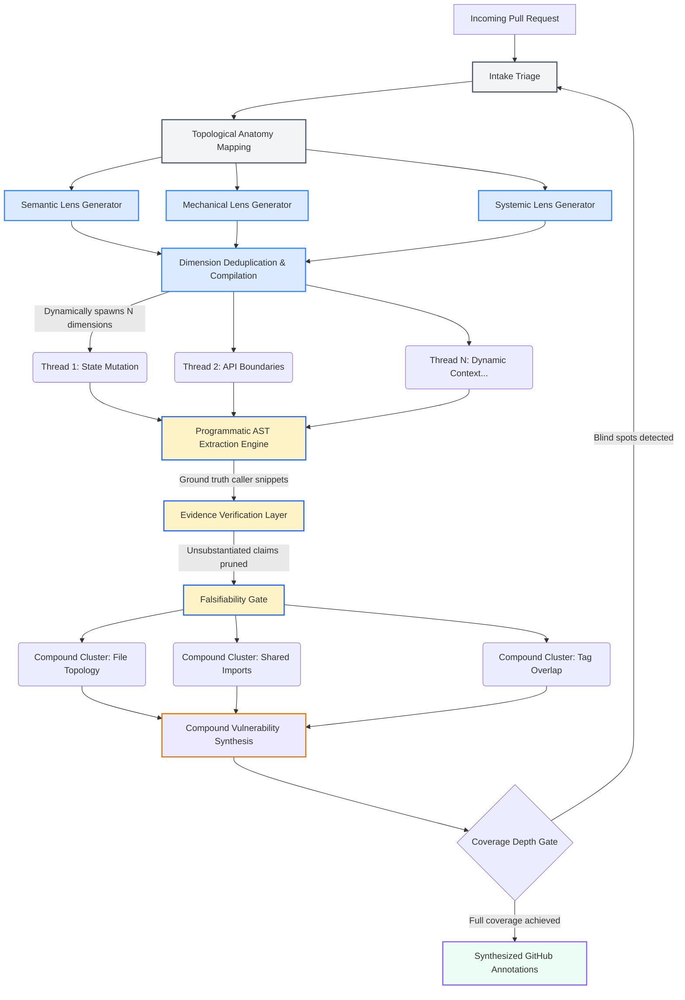

# Agent-Field/pr-af

## Metadata
- Stars: 28
- Primary language: Python
- Default branch: main
- Latest release: none
- License: Apache 2.0
- Homepage: 
- Fetched: 2026-06-06
- Final URL: https://github.com/Agent-Field/pr-af

## Description
AI-Native multi-agent Code Reviewer Built on AgentField

## README
<div align="center">

# PR-AF

### Open-Source Agentic PR Reviewer Built on [AgentField](https://github.com/Agent-Field/agentfield)

[](LICENSE)
[](https://www.python.org/downloads/)
[](https://github.com/Agent-Field/agentfield)
[](https://github.com/Agent-Field)

<p>
  <a href="#what-you-get-back">Output</a> •
  <a href="#how-it-works">How It Works</a> •
  <a href="#comparison">Comparison</a> •
  <a href="#quick-start">Quick Start</a> •
  <a href="docs/ARCHITECTURE.md">Architecture</a>
</p>

</div>

Other tools run a single LLM pass over the diff with a fixed checklist. PR-AF **builds a custom review strategy for every PR**: it examines the change, reasons about what could go wrong, spawns parallel reviewer agents with runtime-crafted prompts, challenges its own findings adversarially, and posts specific inline comments. Free, open source, one API call. A deep review of a 500-line PR costs about **$0.80 in LLM calls**.

<p align="center">
  
</p>

## One-Call DX

Trigger it with the `af` CLI (requires af ≥ 0.1.87) — it streams live progress and prints the result:

```bash
af call pr-af.review --in '{"pr_url": "https://github.com/owner/repo/pull/123"}'
```

Prefer raw HTTP? Hit the API directly with curl:

```bash
curl -X POST http://localhost:8080/api/v1/execute/async/pr-af.review \
  -H "Content-Type: application/json" \
  -d '{"input": {"pr_url": "https://github.com/owner/repo/pull/123"}}'
```

Posts inline GitHub review comments with evidence-grounded findings:

```jsonc
{
  "total_findings": 5,
  "by_severity": {"critical": 1, "important": 2, "suggestion": 2},
  "findings": [
    {
      "severity": "critical",
      "title": "SQL injection in user input handling",
      "file": "src/api/users.py",
      "line": 42,
      "body": "Raw query parameter interpolated directly into SQL. Tracer confirms no parameterization between input and cursor.execute().",
      "suggestion": "cursor.execute('SELECT * FROM users WHERE id = %s', (user_id,))",
      "evidence": "AST extraction confirms f-string SQL at users.py:42, no sanitization in call chain",
      "compound_risk": "Combined with missing auth middleware (finding #2), this is exploitable by unauthenticated users"
    }
  ],
  "review_dimensions": 4,
  "cost_usd": 0.83
}
```

Custom review strategy per PR. Evidence-grounded. Zero false positives. ~$0.80 for a 500-line PR.

---

## Dynamic Pipeline Architecture

PR-AF does not execute a static script. It structurally morphs its own execution graph based on the topology of the incoming Pull Request.

When a PR arrives, the system dynamically compiles review dimensions — evaluating the diff through semantic, mechanical, and systemic lenses. It uses these dimensions to spawn specialized, ephemeral reviewer agents tailored exclusively to the exact context of the current PR.

<p align="center">
  
</p>

> Full architecture deep-dive: [`docs/ARCHITECTURE.md`](docs/ARCHITECTURE.md)

<details>
<summary><strong>Pipeline flow (Mermaid)</strong></summary>



</details>

---

## How It Works

PR-AF uses this multi-phase cognitive pipeline to ensure rigorous, high-fidelity reviews:

### 1. Evidence Grounding (0% False Positives)
Language models inherently operate on probability, which leads to assumption-based false positives. If the system flags a missing validation check, PR-AF does not immediately accept it. Instead, it utilizes programmatic AST (Abstract Syntax Tree) extraction to pull the exact caller snippets and import contexts from the broader repository. This raw data is then evaluated through an isolated verification layer. If the initial claim cannot be irrefutably grounded in the extracted code, it is silently pruned.

### 2. Compound Vulnerability Synthesis
Standard tools analyze code linearly. PR-AF looks at the entire board to identify cross-correlated risks. It clusters isolated, seemingly minor anomalies across different files and evaluates them concurrently to detect whether they coalesce into a larger systemic exploit. For example, identifying an unprotected API key in one module and a database merge vulnerability in another will be synthesized into a single, high-severity "Coordinated Injection" finding.

### 3. Falsifiability Gates
Before any finding is compiled into the final GitHub comment, it must pass through a strict falsifiability framework. The system actively attempts to invalidate its own findings—searching for reasons why the reported anomaly might be safe, intended behavior, or securely mitigated elsewhere in the codebase structure. Only findings that survive this aggressive auto-invalidation process are surfaced to the developer.

---

## Ecosystem Comparison

There are excellent AI code review tools on the market. PR-AF is not designed to replace fast, interactive tools; it is designed for comprehensive CI/CD gating where accuracy and architectural depth matter more than execution speed.

| Feature | PR-AF (AgentField) | Claude Code CLI | Commercial SaaS (e.g. Codex, CodeRabbit) |
|---|---|---|---|
| **Best For** | Deep CI/CD architectural audits | Fast, iterative inner-loop development | Clean GitHub UX and chat-based reviews |
| **Cost** | **Free / Open Source** (BYOK API costs only) | Pay-per-token (BYOK) | ~$20 - $25 / user / month |
| **Architecture** | Massively parallel cognitive pipeline | Single-thread interactive loop | Context retrieval + LLM review |
| **Execution Time**| ~35-50 minutes | Seconds to minutes | ~2-5 minutes |
| **False Positives**| **Extremely low** (Evidence Grounding) | Moderate (relies on context window) | Low-to-Moderate (heuristic filtering) |
| **Compound Risks**| **Yes** (Dedicated Compound Synthesizer) | Unlikely (diff-focused) | Partial (depends on retrieval accuracy) |

*We highly recommend using Claude Code for your local development and running PR-AF as your final GitHub Actions gatekeeper.*

---

## Quick Start

```bash
git clone https://github.com/Agent-Field/pr-af.git && cd pr-af
cp .env.example .env          # Add OPENROUTER_API_KEY, GH_TOKEN
docker compose up --build
```

Starts AgentField control plane (`http://localhost:8080`) + PR-AF agent.

```bash
curl -X POST http://localhost:8080/api/v1/execute/async/pr-af.review \
  -H "Content-Type: application/json" \
  -d '{"input": {"pr_url": "https://github.com/owner/repo/pull/123"}}'
```

Poll for results:

```bash
curl http://localhost:8080/api/v1/executions/<execution_id>
```

## GitHub Actions Integration

The easiest way to use PR-AF is to drop it into your GitHub Actions. It requires **zero configuration** and runs securely using GitHub's built-in `GITHUB_TOKEN`.

Add this workflow to your repository at `.github/workflows/pr-af-review.yml`. It triggers automatically whenever you add the **`pr-af`** label to a Pull Request.

```yaml
name: AgentField PR Review

on:
  pull_request:
    types: [labeled]

jobs:
  pr-af-review:
    if: github.event.label.name == 'pr-af'
    runs-on: ubuntu-latest

    # Needs permissions to post comments and read code
    permissions:
      contents: read
      pull-requests: write

    steps:
      - name: Checkout PR-AF
        uses: actions/checkout@v4
        with:
          repository: Agent-Field/pr-af
          path: pr-af

      - name: Start AgentField & PR-AF
        working-directory: ./pr-af
        env:
          OPENROUTER_API_KEY: ${{ secrets.OPENROUTER_API_KEY }}
          GH_TOKEN: ${{ secrets.GITHUB_TOKEN }}
        run: |
          docker compose up -d
          sleep 15 # Wait for services to be healthy

      - name: Execute Deep Architectural Audit
        working-directory: ./pr-af
        env:
          PR_URL: ${{ github.event.pull_request.html_url }}
        run: |
          python3 scripts/ci_runner.py
```

*Note: PR-AF runs a comprehensive parallel pipeline. Reviews typically take 35-50 minutes depending on PR complexity.*

---

## From the AgentField Blog

### [How an AI-Native Engineering Team Does Code Review](https://www.agentfield.ai/blog/ai-native-code-review?utm_source=github-readme&utm_campaign=pr-af-readme&utm_id=pr-af-readme-blog-ai-native-code-review)

When the writer and the reviewer are the same intelligence, the pull request gate stops doing what it was designed to do.

<p align="center">
  <a href="https://www.agentfield.ai/blog/ai-native-code-review?utm_source=github-readme&utm_campaign=pr-af-readme&utm_id=pr-af-readme-blog-ai-native-code-review">
    
  </a>
</p>

[Read the post →](https://www.agentfield.ai/blog/ai-native-code-review?utm_source=github-readme&utm_campaign=pr-af-readme&utm_id=pr-af-readme-blog-ai-native-code-review)


## Docs

### docs/ARCHITECTURE.md
# PR-AF Architecture

PR-AF is a multi-agent pull request reviewer built on [AgentField](https://agentfield.dev). It uses a 7-phase adaptive pipeline that dynamically determines what aspects of a PR to review, spawns parallel reviewer agents with runtime-crafted prompts, challenges its own findings adversarially, and posts specific inline comments to GitHub.

This document explains the architecture for developers who want to understand the design, contribute, or adapt the patterns.

---

## The Core Insight

Most AI code reviewers run a single LLM pass over the diff with a fixed checklist prompt. PR-AF takes a fundamentally different approach: it mirrors how a **senior engineer actually reviews a PR**.

A great reviewer doesn't apply the same checklist to every PR. They:
1. Understand what the PR is trying to do and how big/complex it is
2. Identify which parts of the change are risky and WHY they're risky for THIS specific PR
3. Review different aspects in parallel (security, correctness, style) but only where relevant
4. Think about cross-cutting interactions ("does this change break that assumption?")
5. Challenge their own findings ("is this a real issue or am I nitpicking?")
6. Check what's MISSING (tests, error handling, docs)
7. Write specific, actionable comments at the exact lines that matter

PR-AF encodes this process as a multi-agent pipeline where the **review strategy emerges from the content, not from a fixed configuration**.

**What makes it different:**

- **Dynamic review dimensions.** No hardcoded reviewer categories. The planner examines the PR and REASONS about what aspects need review, then crafts specific investigation prompts at runtime. A PR touching auth gets security-focused reviewers. A PR refactoring logging gets consistency-focused reviewers. The review shape adapts to the PR shape.
- **Cross-change interaction detection.** A dedicated agent watches for interactions between findings from different reviewers — the most valuable and hardest-to-automate part of expert PR review.
- **Adversarial tension.** Separate agents find issues and challenge them. This dramatically reduces noise and false positives — the #1 complaint about AI code reviewers.
- **AI-PR awareness.** Special detection and handling for AI-generated code, which has characteristic failure modes that human-written code does not.
- **Deterministic scoring.** LLMs reason about issues; code computes severity and priority. Same findings always produce same scores.
- **Streaming pipeline.** The review layer starts consuming findings as reviewers produce them, overlapping work across phases.

---

## Pipeline Overview

The pipeline runs in 7 phases. Phases 1-3 are sequential (each builds on the previous). Phases 4-5 overlap via streaming. Phases 6-7 run after all findings are finalized.

```
┌─────────────────────────────────────────────────────────────────────┐
│                         PR-AF Pipeline                              │
│                                                                     │
│  ┌──────────┐   ┌──────────┐   ┌──────────┐                        │
│  │ Phase 1  │──▶│ Phase 2  │──▶│ Phase 3  │                        │
│  │ INTAKE   │   │ ANATOMY  │   │ PLANNING │                        │
│  │ .ai()+fb │   │ code+hrn │   │ .harness │                        │
│  └──────────┘   └──────────┘   └────┬─────┘                        │
│                                     │                               │
│                    ┌────────────────┼────────────────┐              │
│                    ▼                ▼                ▼              │
│              ┌──────────┐   ┌──────────┐   ┌──────────┐            │
│  Phase 4:    │Reviewer A│   │Reviewer B│   │Reviewer C│  ...       │
│  PARALLEL    │.harness()│   │.harness()│   │.harness()│            │
│  REVIEW      └────┬─────┘   └────┬─────┘   └────┬─────┘            │
│                   │              │              │                   │
│                   └──────────────┼──────────────┘                   │
│                                  │  findings stream                 │
│                                  ▼  (asyncio.Queue)                 │
│              ┌──────────────────────────────────────┐               │
│  Phase 5:    │  Cross-Ref     Adversary    Coverage │               │
│  REVIEW      │  Resolver      Reviewer      Gate   │               │
│  LAYER       │  .harness()   .harness()    .ai()   │               │
│              └──────────────────┬───────────────────┘               │
│                                 │                                   │
│                    ┌────────────┼────────────┐                      │
│                    ▼                         ▼                      │
│              ┌──────────┐             ┌──────────┐                  │
│  Phase 6:    │SYNTHESIS │  Phase 7:   │  OUTPUT  │                  │
│              │  (code)  │──────────▶  │  (code)  │                  │
│              └──────────┘             └──────────┘                  │
└─────────────────────────────────────────────────────────────────────┘
```

---

## Phase 1: Intake

**Primitive:** `.ai()` with `.harness()` fallback
**Purpose:** Classify the PR to drive downstream routing.

The intake classifier reads PR metadata (title, description, labels, commit messages) and diff summary statistics to determine: what kind of PR is this, how complex is it, and what areas does it touch?

Classification uses a fast `.ai()` path for clear-cut PRs. When the PR description is vague, the diff is massive, or signals are mixed, it automatically escalates to a `.harness()` that can navigate the actual diff to understand what's going on.

A critical intake signal is **AI-generation detection**. The classifier looks for characteristic patterns of AI-generated code (see [AI-PR Handling](#ai-pr-handling)) and produces a confidence score. This score doesn't trigger a separate review pass — it adjusts the review plan across ALL dimensions (more skepticism, different focus areas).

```python
class IntakeResult(BaseModel):
    """Structured JSON — drives routing decisions downstream."""
    pr_type: str          # feature | bugfix | refactor | docs | infra | mixed
    complexity: str       # trivial | standard | complex | massive
    languages: list[str]  # detected from diff file extensions + content
    areas_touched: list[str]  # semantic areas: auth, database, api, frontend, config...
    risk_signals: list[str]   # detected risk indicators: "touches auth", "modifies schema"
    ai_generated: float   # 0.0-1.0 confidence that PR is AI-generated
    review_depth: str     # quick | standard | deep (drives budget allocation)
    confident: bool       # False → escalate to .harness()
```

**Why `.ai()` first:** PR metadata (title + description + stats) is typically < 500 tokens. Fast classification handles 80%+ of PRs. The `.harness()` fallback handles the rest — massive PRs, missing descriptions, ambiguous changes.

---

## Phase 2: Anatomy

**Primitive:** Code (programmatic) + `.harness()` (semantic)
**Purpose:** Build structural understanding of the changes.

The anatomy phase has two sub-steps that can run in parallel:

### 2a: Structural Analysis (Code — NOT LLM)

Programmatic diff parsing and dependency analysis. This is computation, not reasoning — do it in code:

- **Diff parsing:** Decompose the diff into files, hunks, lines. Identify added/removed/modified lines per file. Detect file renames/moves.
- **Change clustering:** Group related files by directory, module, or import relationship. Changes to `src/auth/` files form a cluster. Changes to `tests/test_auth.py` associate with that cluster.
- **Blast radius computation:** Build a dependency graph from import/require statements. For each changed file, find files that import it, files that it imports, and files that share type dependencies. The blast radius is everything that COULD be affected by the changes but isn't in the diff itself.
- **Statistics:** Lines added/removed/modified per file, per cluster, total. File types. Test-to-code ratio.

```python
class DiffStructure(BaseModel):
    """Structured JSON — programmatic consumption by planner."""
    files: list[FileChange]        # Per-file change details
    clusters: list[ChangeCluster]  # Grouped related changes
    blast_radius: list[str]        # Files affected but not changed
    dependency_graph: dict[str, list[str]]  # import relationships
    stats: DiffStats               # Aggregate statistics
```

### 2b: Semantic Understanding (.harness())

The structural analysis tells us WHAT changed. The semantic analysis tells us WHY it matters:

- **PR narrative:** What is this PR actually trying to do? (Reads diff + PR description + commit messages)
- **Risk surface identification:** Which changes touch sensitive areas? (Auth boundaries, data handling, external APIs, configuration, infrastructure)
- **Unrelated change detection:** Are there changes in this PR that don't fit the narrative? (Common in large PRs — unrelated cleanup mixed with feature work)
- **Intent verification:** Does the diff actually accomplish what the PR description claims?

```python
class SemanticAnatomy(BaseModel):
    """Hybrid — structured fields for routing, string fields for LLM context."""
    pr_narrative: str           # Natural language: "what this PR does and why"
    risk_surfaces: list[str]    # Semantic risk areas identified
    unrelated_changes: list[str]  # Files that don't fit the PR story
    intent_gaps: list[str]      # Claimed in description but not in diff (or vice versa)
    context_notes: str          # Additional context for downstream reviewers (string for LLM consumption)
```

**Data flow:** Both sub-outputs combine into an `AnatomyResult` that the planner consumes.

---

## Phase 3: Planning — The Key Innovation

**Primitive:** `.harness()` (meta-prompting)
**Purpose:** Dynamically determine WHAT to review and craft specific reviewer prompts.

This is the most important phase in the pipeline. The planner does NOT select from a fixed menu of review types. It REASONS about what aspects of this specific PR need review and generates targeted investigation prompts for each.

### How the Planner Works

1. **Reads** the intake classification + full anatomy output
2. **Reasons** for each change cluster: "What could go wrong here? What expertise is needed? What non-obvious interactions should be checked?"
3. **Generates** a list of `ReviewDimension` objects, each containing a dynamically crafted prompt for a reviewer agent

### The Meta-Prompting Pattern

The planner is a `.harness()` that spawns reviewers by crafting their prompts at runtime. This is the Contract-AF meta-prompting pattern applied to PR review:

```python
# The planner doesn't select from a fixed menu.
# It GENERATES the review strategy from the content.

# Example: PR adds a new payment processing endpoint
planner_output = ReviewPlan(
    dimensions=[
        ReviewDimension(
            name="Payment Input Validation",
            review_prompt="""You are reviewing a new payment endpoint for input
            validation completeness. The endpoint accepts credit card data via
            POST /api/payments. Check:
            - Are all input fields validated (card number format, expiry, CVV)?
            - Is there SQL injection protection on the query in line 47?
            - Are monetary amounts validated (no negative values, overflow)?
            Focus on: src/api/payments.py (lines 30-95), src/validators/payment.py
            Context: The existing validation in src/validators/base.py uses Pydantic —
            check if the new endpoint follows the same pattern.""",
            target_files=["src/api/payments.py", "src/validators/payment.py"],
            context_files=["src/validators/base.py"],
            priority=1,
        ),
        ReviewDimension(
            name="Transaction State Consistency",
            review_prompt="""You are reviewing a payment processing flow for state
            consistency under failure. The new endpoint creates a payment record,
            charges the card via Stripe API, then updates the record. Check:
            - What happens if the Stripe call fails after the record is created?
            - Is there a transaction/rollback mechanism?
            - Are there race conditions if two requests hit simultaneously?
            Focus on: src/services/payment_service.py (lines 15-80)
            Context: Read src/services/order_service.py for how existing flows handle
            similar state transitions.""",
            target_files=["src/services/payment_service.py"],
            context_files=["src/services/order_service.py"],
            priority=1,
        ),
        # ... more dimensions crafted from the PR content
    ]
)
```

### Why This Matters

A PR modifying database migrations gets reviewers for "schema compatibility", "rollback safety", "data integrity" — not "security" and "performance" from a generic checklist.

A PR refactoring logging across 20 files gets reviewers for "behavioral preservation", "consistency", "missed files" — dimensions that would never appear in a static taxonomy.

The investigation path emerges from the content of the PR, not from a fixed configuration. Novel PRs get novel review strategies.

### Review Dimension Schema

```python
class ReviewDimension(BaseModel):
    """Each dimension becomes one parallel reviewer instance."""
    id: str               # Unique identifier
    name: str             # Human-readable name (for comments attribution)
    review_prompt: str    # THE dynamically crafted prompt (string — consumed by LLM)
    target_files: list[str]   # Files this reviewer must examine
    context_files: list[str]  # Additional files for reference (blast radius, imports)
    priority: int         # Higher = more important = gets budget first
    budget: BudgetAllocation  # Cost/time cap for this dimension

class ReviewPlan(BaseModel):
    """The planner's complete output."""
    dimensions: list[ReviewDimension]  # What to review
    cross_ref_hints: list[str]        # Suspected interactions for Phase 5 (string for LLM)
    ai_adjusted: bool                 # Whether plan was adjusted for AI-generated code
    total_budget: BudgetAllocation
```

### Budget Awareness

The planner is budget-aware. For a `quick` review depth, it generates 2-3 high-priority dimensions. For `deep`, it might generate 8-12. The planner receives the budget allocation from config and distributes it across dimensions by priority.

---

## Phase 4: Parallel Review

**Primitive:** `.harness()` × N (one per review dimension), streaming output
**Purpose:** Execute the review plan — each dimension runs as an independent agent.

### One Agent, N Prompts

There is ONE reviewer agent definition. The planner creates N instances by passing N different prompts. This is the architectural adaptability — no hardcoded reviewer types, no static dispatch.

Each reviewer instance:
- Receives its **dynamically crafted prompt** from the planner
- Has tool access to read the **target files** and **context files**
- Can **follow references** (up to 3 hops) when it discovers a relevant connection
- Can **self-escalate** by spawning a child harness for deep investigation (up to 2 children)
- **Emits findings** to a shared `asyncio.Queue` as it works (streaming to Phase 5)

### Inner Loop (Per-Reviewer Adaptation)

Each reviewer has bounded autonomy:

| Mechanism | Cap | Trigger |
|---|---|---|
| Reference following | 3 hops | Found an import/call that's relevant |
| Child harness spawning | 2 children | Critical signal needs deeper investigation |
| Early exit | - | No issues found in target files → stop early |

The child harness spawning is the inner loop's meta-prompting: a reviewer discovers something that needs deeper investigation and crafts a specific prompt for a child agent. For example, a reviewer checking error handling might discover that the error class hierarchy is unusual and spawn a child to investigate the base error class.

### Finding Schema

```python
class ReviewFinding(BaseModel):
    """Emitted to the findings queue as reviewers work."""
    dimension_id: str     # Which review dimension produced this
    dimension_name: str   # Human-readable (for comment attribution)
    file_path: str        # Path relative to repo root
    line_start: int       # Start line in the diff
    line_end: int         # End line in the diff
    hunk_context: str     # The code context around the finding
    severity: str         # critical | important | suggestion | nitpick
    title: str            # Concise title for the comment
    body: str             # Detailed explanation
    suggestion: str | None  # Concrete fix (code block) if applicable
    evidence: str         # Code references that support this finding
    confidence: float     # 0.0-1.0
    tags: list[str]       # Machine-readable category tags
```

### Concurrency Control

Reviewers run with controlled concurrency:

```python
semaphore = asyncio.Semaphore(config.max_concurrent_reviewers)  # default: 8

async def run_reviewer(dimension: ReviewDimension, queue: asyncio.Queue):
    async with semaphore:
        findings = await app.harness(
            prompt=dimension.review_prompt,
            schema=ReviewFindings,
            cwd=repo_path,
        )
        await queue.put(findings)

# All reviewers launched concurrently, semaphore controls parallelism
tasks = [run_reviewer(dim, findings_queue) for dim in plan.dimensions]
await asyncio.gather(*tasks)
await findings_queue.put(None)  # Sentinel: all reviewers done
```

---

## Phase 5: Review Layer (Streaming)

Three agents run in parallel, consuming findings from the queue as Phase 4 reviewers produce them:

### Cross-Reference Resolver (.harness())

The most valuable part of the pipeline. Watches for **interactions between findings from different reviewers** that individual reviewers couldn't see.

**What it looks for:**
- **Compound risks:** Reviewer A flags a missing null check, Reviewer B flags a path that passes null — these combine into a crash scenario
- **Assumption violations:** Change A modifies a function's behavior, Change B relies on the old behavior
- **Consistency gaps:** Change A uses pattern X, Change B uses pattern Y for the same thing
- **Transitive effects:** Change A → affects Module B (blast radius) → affects what Change C does in Module B

**How it works:**
1. Maintains a running set of all findings received so far
2. For each new finding, checks it against all previous findings
3. Uses the planner's `cross_ref_hints` as starting points for investigation
4. Can spawn up to 5 targeted deep-dive harnesses for suspicious combinations

**Middle loop budget:** Max 5 cross-ref deep-dives per pipeline run.

```
Time →

Reviewer A:  [========================]
Reviewer B:      [====================]
Reviewer C:          [================]

Cross-Ref:          [========================]  (starts when first findings arrive)
Adversary:          [========================]  (starts when first findings arrive)
Coverage:                               [====]  (checks after most findings in)
```

### Adversary Reviewer (.harness())

Challenges findings and hunts for what was missed. Explicitly incentivized to:

1. **Identify false positives:** Is this finding about a pre-existing issue, not something introduced by the PR? Is the flagged pattern actually the project's established convention?
2. **Downweight noise:** Is this a real issue or stylistic preference? Is the severity overstated?
3. **Hunt hidden traps:** What did ALL the reviewers miss? What issues exist in the interaction between changed and unchanged code that no individual reviewer could see?
4. **AI-code skepticism:** If `intake.ai_generated > 0.5`, apply additional scrutiny:
   - Do imported modules/functions actually exist?
   - Are there over-abstractions that add complexity without value?
   - Do tests assert meaningful things (not just exist)?
   - Is the code logically correct but architecturally wrong?

The adversary's output feeds directly into scoring:
- Findings confirmed by adversary → severity boost
- Findings challenged by adversary → severity discount
- Hidden traps found by adversary → new findings at appropriate severity

### Coverage Gate (.ai())

After most findings are in, the coverage gate checks completeness:

- Were all change clusters reviewed by at least one dimension?
- Are there blast radius files with significant dependency exposure that no reviewer examined?
- Does the review plan have obvious gaps given the PR type? (e.g., a feature PR with no test adequacy review)

If gaps are found, it spawns **gap reviewers** (Phase 4 agents with new prompts crafted for the uncovered areas). Gap findings flow back into cross-ref + adversary.

**Outer loop budget:** Max 2 coverage iterations.

---

## Phase 6: Synthesis (Deterministic Code)

**Primitive:** Code (NOT LLM)
**Purpose:** Score, rank, deduplicate, and format findings.

All done programmatically:

### Scoring

```python
BASE_WEIGHTS = {
    "critical": 1.0,
    "important": 0.7,
    "suggestion": 0.3,
    "nitpick": 0.1,
}

MULTIPLIERS = {
    "cross_ref_compound": 1.5,    # Cross-ref found compound risk
    "adversary_confirmed": 1.3,   # Adversary confirmed exploitation scenario
    "adversary_challenged": 0.5,  # Adversary successfully challenged
    "ai_generated_pr": 1.2,       # Extra weight for AI-generated PRs (higher noise baseline)
    "blast_radius_high": 1.2,     # Change affects many files
}

def compute_score(finding: ScoredFinding) -> float:
    base = BASE_WEIGHTS[finding.severity]
    score = base * finding.confidence
    for multiplier_key in finding.active_multipliers:
        score *= MULTIPLIERS[multiplier_key]
    return round(score, 3)
```

### Deduplication

- Exact dedup: same file + same line range + same category → merge
- Near-dedup: different reviewers found the same issue from different angles → merge, keep the better-explained version
- Dedup uses code (not LLM) for exact matches; `.ai()` gate for near-matches when descriptions differ

### Line Mapping

Map finding line numbers to the PR diff coordinate system. GitHub expects line numbers relative to the diff, not absolute file positions. This is a programmatic transformation using the parsed diff structure from Phase 2.

### Filtering

Apply confidence thresholds:
- `critical` / `important`: keep if confidence ≥ 0.3
- `suggestion`: keep if confidence ≥ 0.5
- `nitpick`: keep if confidence ≥ 0.7

### Output

```python
class SynthesisResult(BaseModel):
    findings: list[ScoredFinding]  # Sorted by composite score descending
    summary: ReviewSummary         # Aggregate stats
    review_event: str              # APPROVE | COMMENT | REQUEST_CHANGES
```

**Review event logic (code):**
- Any `critical` findings → `REQUEST_CHANGES`
- `important` findings but no `critical` → `COMMENT`
- Only `suggestion` / `nitpick` → `APPROVE` (with comments)
- Nothing found → `APPROVE` (clean)

---

## Phase 7: Output

**Primitive:** Code (GitHub API)
**Purpose:** Post the review to GitHub and emit structured output.

### GitHub PR Review API

```python
# Single API call creates review with all inline comments
POST /repos/{owner}/{repo}/pulls/{pull_number}/reviews
{
    "body": "<executive summary markdown>",
    "event": "COMMENT",  # or APPROVE / REQUEST_CHANGES
    "comments": [
        {
            "path": "src/api/payments.py",
            "line": 42,
            "side": "RIGHT",
            "body": "### ⚠️ Missing input validation\n\nThe `amount` field is passed directly..."
        }
    ]
}
```

### Comment Formatting

Each inline comment follows a consistent format:

```markdown
### {severity_emoji} {title}

{body}

{suggestion_block if applicable}

---
<sub>Found by: {dimension_name} · Confidence: {confidence} · {category}</sub>
```

Severity emojis:
- 🔴 critical
- 🟠 important
- 🔵 suggestion
- ⚪ nitpick

### Output Modes

| Mode | Description | Use Case |
|---|---|---|
| GitHub PR Review | Inline comments + summary | Primary output |
| Structured JSON | Full findings with metadata | CI/CD integration |
| SARIF | Static analysis format | GitHub Security tab |
| Markdown | Standalone report | Email, Slack, CLI |

---

## Three Nested Control Loops

| Loop | Scope | Trigger | Budget |
|---|---|---|---|
| **Inner** | Per-reviewer adaptation | Found reference / critical signal | Max 3 hops, 2 child spawns |
| **Middle** | Cross-agent deep-dives | Compound risk / interaction detected | Max 5 cross-ref deep-dives |
| **Outer** | Pipeline coverage | Gap in review coverage | Max 2 iterations |

Each loop has hard caps. Without caps, adaptive systems become unbounded cost sinks.

---

## AI-PR Handling

When the intake classifier detects signals of AI-generated code (`ai_generated > 0.5`), this doesn't trigger a separate review pass. Instead, it adjusts the review plan across ALL dimensions.

### Detection Signals

The intake classifier looks for (programmatic checks, not LLM):
- **Naming patterns:** Over-descriptive variable names (`descriptive_variable_name_for_the_user_input`)
- **Comment density:** Comments on obvious code, docstrings on trivial functions
- **Structural uniformity:** All functions roughly same length, same pattern
- **Import patterns:** Unusual or non-existent packages imported
- **Test patterns:** Tests that mirror the implementation too closely (testing the same logic, not the behavior)

### Plan Adjustments

When `ai_generated > 0.5`, the planner:
1. Adds a "hallucination check" dimension — verify that all referenced APIs, modules, and functions actually exist
2. Adjusts existing dimensions to include over-abstraction detection
3. Increases scrutiny on test adequacy — AI-generated tests often test the wrong thing
4. Applies the `ai_generated_pr` scoring multiplier (1.2x) to all findings

This is NOT a separate pipeline. It's the planner adapting its strategy — the same dynamic meta-prompting mechanism used for all PRs, just with additional context.

---

## Budget Management

```python
class BudgetConfig(BaseModel):
    """All behavioral tuning in one place."""
    # Global caps
    max_cost_usd: float = 2.0
    max_duration_seconds: int = 300  # 5 minutes

    # Phase-level
    max_concurrent_reviewers: int = 8
    phase_budgets: dict[str, float] = {
        "intake": 0.05,
        "anatomy": 0.15,
        "planning": 0.15,
        "review": 0.90,    # Most budget goes here
        "cross_ref": 0.30,
        "adversary": 0.25,
        "coverage": 0.10,
        "synthesis": 0.00,  # Code, no LLM cost
        "output": 0.00,     # Code, no LLM cost
    }

    # Loop caps
    max_reference_follows_per_reviewer: int = 3
    max_child_spawns_per_reviewer: int = 2
    max_cross_ref_deep_dives: int = 5
    max_coverage_iterations: int = 2

    # Model routing
    models: dict[str, str] = {
        "intake_gate": "budget",       # .ai() fast classification
        "anatomy_semantic": "mid",     # Narrative understanding
        "planner": "premium",          # Critical: quality of plan = quality of review
        "reviewer": "premium",         # Deep code analysis
        "cross_ref": "premium",        # Interaction detection needs best reasoning
        "adversary": "premium",        # Challenging findings needs strong reasoning
        "coverage_gate": "budget",     # Simple completeness check
        "dedup_gate": "budget",        # Near-duplicate detection
    }
```

**Model routing philosophy:** Budget models for gates and classification. Premium models for the planner (plan quality determines review quality), reviewers (deep code reasoning), cross-ref resolver (interaction detection), and adversary (challenge quality).

---

## `.ai()` vs `.harness()` Assignment

Following the decision tree from [CLAUDE.md](../../CLAUDE.md):

| Agent | Primitive | Why |
|---|---|---|
| Intake classifier | `.ai()` + fallback | Fast classification, < 500 tokens, flat schema |
| Structural analysis | **Code** | Deterministic computation |
| Semantic anatomy | `.harness()` | Navigates diff, multi-turn, rich output |
| Planner | `.harness()` | Meta-prompting: crafts child prompts, reads full anatomy |
| Reviewer (×N) | `.harness()` | Navigates code, follows references, spawns children |
| Cross-ref resolver | `.harness()` | Reasons over all findings, spawns deep-dives |
| Adversary reviewer | `.harness()` | Challenges findings, hunts hidden traps |
| Coverage gate | `.ai()` | Simple completeness check, flat schema |
| Dedup gate | `.ai()` | Near-duplicate classification, 3 fields |
| Scoring | **Code** | Deterministic formula |
| Line mapping | **Code** | Deterministic transformation |
| Comment formatting | **Code** | Template-based |
| GitHub posting | **Code** | API call |

**Every `.ai()` call has a fallback.** If the intake classifier isn't confident, it escalates to `.harness()`. If the dedup gate isn't confident, findings are kept (err on the side of reporting).

---

## Inter-Agent Data Flow (Archei Rules)

| Edge | Format | Why |
|---|---|---|
| Intake → Planner | **Structured JSON** | Code routes based on `pr_type`, `complexity` |
| Anatomy → Planner | **Hybrid** | Structured clusters for routing + string narrative for LLM context |
| Planner → Reviewers | **String** (review_prompt) | LLM consumes the dynamically crafted prompt |
| Reviewers → Queue | **Structured JSON** | Code deduplicates, scores, maps lines |
| Queue → Cross-Ref | **String** (finding descriptions) | LLM reasons about interactions |
| Queue → Adversary | **String** (finding descriptions) | LLM challenges and hunts |
| Adversary → Scoring | **Structured JSON** | Code applies multipliers |
| Scoring → Output | **Structured JSON** | Code formats comments and calls API |

---

## Comparison with Reference Architectures

| Pattern | SEC-AF | Contract-AF | PR-AF |
|---|---|---|---|
| Streaming pipeline | HUNT → PROVE queue | Analysts → Review Layer queue | Reviewers → Cross-Ref/Adversary queue |
| Adversarial tension | Hunters → Provers | Analysts → Adversary | Reviewers → Adversary |
| Meta-prompting | Strategy selection | Clause analysts spawn children | **Planner generates all reviewer prompts** |
| Dynamic depth | Depth profiles | Inner/Middle/Outer loops | Inner/Middle/Outer loops |
| .ai() gates | Severity, dedup, strategy | Intake, coverage | Intake, coverage, dedup |
| Deterministic scoring | Exploitability scores | Severity × multipliers | Severity × multipliers |
| Blast radius | `diff_analysis.py` | Cross-ref tracing | `blast_radius.py` |
| Budget management | Per-phase cost caps | Per-loop budget caps | Both |

**PR-AF's unique contribution:** The planner is a full `.harness()` that does meta-prompting at the PLAN level. In Contract-AF, the planner routes sections to fixed analyst types, and meta-prompting happens WITHIN analysts. In PR-AF, the planner itself generates the entire review strategy — there are no fixed reviewer types at all.

---

## Source Code Layout

```
src/pr_af/
├── app.py                 # FastAPI application, /review endpoint
├── config.py              # Configuration: models, budgets, caps, comment format
├── orchestrator.py        # Pipeline orchestrator (phases 1-7)
├── diff_engine.py         # Programmatic diff parsing (code, not LLM)
├── blast_radius.py        # Dependency graph + blast radius computation (code)
├── scoring.py             # Deterministic scoring engine
├── agents/
│   ├── intake.py          # PR classification (.ai() + .harness() fallback)
│   ├── anatomy.py         # Semantic understanding (.harness())
│   ├── planner.py         # Dynamic review planning (meta-prompting .harness())
│   ├── reviewer.py        # Generic reviewer (prompt-driven .harness())
│   ├── cross_ref.py       # Cross-reference interaction detection (.harness())
│   ├── adversary.py       # Adversarial challenge (.harness())
│   ├── coverage.py        # Coverage gate (.ai())
│   └── gap_reviewer.py    # Gap analysis (reuses reviewer.py with gap prompt)
├── schemas/
│   ├── input.py           # ReviewInput, GitHub PR models
│   ├── gates.py           # .ai() gate schemas (flat, 2-4 fields)
│   ├── pipeline.py        # Inter-agent schemas (IntakeResult, AnatomyResult, etc.)
│   └── output.py          # ScoredFinding, ReviewSummary, GitHubComment
├── github/
│   ├── client.py          # GitHub API client (fetch PR data, post reviews)
│   ├── models.py          # GitHub data models (PR, File, Comment)
│   └── diff_parser.py     # Parse GitHub unified diff format
└── reasoners/
    └── harnesses.py       # AgentField agent definitions
```

**`config.py`** is where you tune the system. Model assignments per agent, budget caps per loop level, comment format templates, review strictness, custom ignore patterns. Most behavioral changes start here.

**`scoring.py`** is intentionally separate from agents so scoring logic can be tested, audited, and modified without touching agent code.

**`diff_engine.py`** and **`blast_radius.py`** are pure code — no LLM calls. They handle the programmatic work that should never be delegated to an LLM.

**`agents/reviewer.py`** is a single agent that takes a dynamically crafted prompt. There are no `security_reviewer.py`, `performance_reviewer.py`, etc. The review dimensions emerge from the planner.


### docs/DX.md
# PR-AF Developer Experience

How to invoke PR-AF, what inputs it accepts, what outputs it produces, and how to integrate it into CI/CD pipelines.

---

## Input Modes

PR-AF accepts reviews through three input modes, each with different context richness and speed tradeoffs.

### Mode 1: GitHub PR URL (Full Context)

```json
POST /api/v1/execute/async/pr-af.review
{
  "input": {
    "pr_url": "https://github.com/owner/repo/pull/123",
    "depth": "auto",
    "max_cost_usd": 2.00
  }
}
```

**What's fetched via GitHub API:**
- PR metadata: title, description, labels, linked issues, author, reviewers
- Commit messages and commit SHAs (base + head)
- Diff: unified diff format with all changed files
- Full file contents at both base and head commits
- Repository file tree (for blast radius computation)

**What's cloned (optional, for deep review):**
- Full repository at HEAD for `.harness()` agents to navigate freely
- Configurable: `--clone` (full clone), `--shallow` (depth=1), `--no-clone` (API only)

**Authentication:**
- `GH_TOKEN` env var (personal access token or GitHub App installation token)
- GitHub App: preferred for CI/CD (fine-grained permissions, higher rate limits)

**Best for:** CI/CD pipelines, GitHub Action triggers, full-featured review.

### Mode 2: Diff Only (Lightweight)

```json
POST /api/v1/execute/async/pr-af.review
{
  "input": {
    "diff": "--- a/file.py\n+++ b/file.py\n@@ -1,3 +1,4 @@\n...",
    "depth": "quick",
    "max_cost_usd": 0.50
  }
}
```

**What's available:**
- The raw unified diff only
- No repo context, no PR metadata, no blast radius
- Limited to what's visible in the diff hunks

**Limitations:**
- Can't follow references or check blast radius
- Can't verify imports or check existing code patterns
- Planner generates fewer dimensions (less context to reason from)
- No GitHub comment output (no PR to post to)

**Best for:** Pre-commit hooks, local development, quick sanity checks, non-GitHub repos.

### Mode 3: Local Repo + Branch

```json
POST /api/v1/execute/async/pr-af.review
{
  "input": {
    "repo_path": "/path/to/repo",
    "base_ref": "main",
    "head_ref": "feature-branch",
    "depth": "standard",
    "max_cost_usd": 1.50
  }
}
```

**What's available:**
- Full repository on disk (fastest — no cloning needed)
- Git diff computed locally between base and head
- Full file contents at both commits
- Complete blast radius analysis

**Output options:** Markdown to stdout, JSON file, or post to GitHub if `--pr <number>` is provided.

**Best for:** Local development, self-hosted Git, testing the review before pushing.

---

## CI/CD Integration

### GitHub Action (Primary)

```yaml
name: PR Review
on:
  pull_request:
    types: [opened, synchronize, reopened]

jobs:
  review:
    runs-on: ubuntu-latest
    permissions:
      pull-requests: write
      contents: read
    steps:
      - uses: actions/checkout@v4
        with:
          fetch-depth: 0  # Full history for diff analysis

      - uses: agentfield/pr-af-action@v1
        with:
          # Required
          github-token: ${{ secrets.GITHUB_TOKEN }}

          # Review depth (default: auto)
          # auto: determines from PR size (small→quick, large→deep)
          # quick: 2-3 dimensions, budget models, fast
          # standard: 4-6 dimensions, mid-tier models
          # deep: 8-12 dimensions, premium models, full coverage
          depth: auto

          # Focus areas (default: auto)
          # auto: planner decides based on PR content
          # Or specify: security, correctness, performance, tests, style
          focus: auto

          # Budget caps
          max-cost: "2.00"        # USD
          max-duration: "300"     # seconds

          # Comment behavior
          comment-mode: inline    # inline | summary-only | both
          review-event: auto      # auto | comment | approve | request-changes

          # Ignore patterns (glob)
          ignore-paths: |
            docs/**
            *.md
            .github/**

          # AgentField configuration
          agentfield-api-key: ${{ secrets.AGENTFIELD_API_KEY }}
          model-tier: standard    # budget | standard | premium

        env:
          OPENROUTER_API_KEY: ${{ secrets.OPENROUTER_API_KEY }}
```

### GitHub App (Enterprise)

For organizations that want a persistent bot reviewer:

1. Install the PR-AF GitHub App on your org/repo
2. Configure via `.pr-af.yml` in repo root (see [Configuration](#configuration))
3. PR-AF automatically reviews all PRs that match the configured rules
4. Posts reviews as `pr-af[bot]` with configurable avatar

### Generic CI/CD (GitLab, Bitbucket, Jenkins)

```bash
# Call the API endpoint with curl or httpx
curl -X POST https://agentfield.example.com/api/v1/execute/async/pr-af.review \
  -H "Authorization: Bearer $AGENTFIELD_API_KEY" \
  -H "Content-Type: application/json" \
  -d '{
    "input": {
      "diff": "'"$(git diff $CI_MERGE_REQUEST_DIFF_BASE_SHA...$CI_COMMIT_SHA)"'",
      "depth": "standard",
      "max_cost_usd": 2.00
    }
  }' \
  -o review.json

# Post-process the JSON output with your platform's comment API
```

### Webhook Endpoint

For event-driven architectures:

```bash
# Start the PR-AF server
pr-af serve --port 8080

# Configure GitHub webhook:
# URL: https://your-server/webhook
# Events: Pull requests
# Content type: application/json
```

The server accepts GitHub webhook payloads and processes reviews asynchronously. Status is available via `/jobs/{id}`.

---

## Output Formats

### 1. GitHub PR Review (Primary)

A single GitHub review with inline comments:

```
Review Summary:
Found 5 issues: 1 critical, 2 important, 2 suggestions

🔴 [Critical] SQL injection in user input handling
   src/api/users.py:42
   The raw query parameter is interpolated directly into the SQL query...

🟠 [Important] Missing error handling on payment callback
   src/services/payment.py:87
   If the Stripe webhook fails, the order status is never updated...

...
```

Each inline comment:
```markdown
### 🟠 Missing null check before dereference

The `user.profile` access on line 42 can throw if `user` is null,
which happens when the auth middleware passes through anonymous requests
(see `src/middleware/auth.py:28`).

```suggestion
if user is None:
    raise HTTPException(status_code=401, detail="Authentication required")
profile = user.profile
```

---
<sub>Found by: Authorization Completeness · Confidence: 0.85 · correctness</sub>
```

### 2. Structured JSON

```json
{
  "review_id": "rev_abc123",
  "pr_url": "https://github.com/owner/repo/pull/123",
  "review_event": "COMMENT",
  "summary": {
    "total_findings": 5,
    "by_severity": {"critical": 1, "important": 2, "suggestion": 2},
    "review_dimensions": 4,
    "ai_generated_confidence": 0.1,
    "cost_usd": 1.23,
    "duration_seconds": 45
  },
  "findings": [
    {
      "id": "f_001",
      "dimension": "Input Validation",
      "file_path": "src/api/users.py",
      "line_start": 42,
      "line_end": 42,
      "severity": "critical",
      "confidence": 0.92,
      "title": "SQL injection in user input handling",
      "body": "The raw query parameter `user_id` is interpolated...",
      "suggestion": "Use parameterized queries: `cursor.execute('SELECT * FROM users WHERE id = %s', (user_id,))`",
      "evidence": "src/api/users.py:42 — `f\"SELECT * FROM users WHERE id = {user_id}\"`",
      "tags": ["security", "injection", "cwe-89"],
      "score": 1.196,
      "multipliers": ["adversary_confirmed"]
    }
  ],
  "metadata": {
    "intake": {"pr_type": "feature", "complexity": "standard"},
    "anatomy": {"clusters": 3, "blast_radius_files": 12},
    "plan": {"dimensions": 4, "ai_adjusted": false},
    "budget": {"spent_usd": 1.23, "cap_usd": 2.00}
  }
}
```

### 3. SARIF (Static Analysis Results Interchange Format)

For GitHub Security tab integration:

```json
{
  "$schema": "https://raw.githubusercontent.com/oasis-tcs/sarif-spec/main/sarif-2.1/schema/sarif-schema-2.1.0.json",
  "version": "2.1.0",
  "runs": [{
    "tool": {"driver": {"name": "PR-AF", "version": "1.0.0"}},
    "results": [{
      "ruleId": "pr-af/input-validation",
      "level": "error",
      "message": {"text": "SQL injection in user input handling"},
      "locations": [{
        "physicalLocation": {
          "artifactLocation": {"uri": "src/api/users.py"},
          "region": {"startLine": 42}
        }
      }]
    }]
  }]
}
```

### 4. Markdown (Standalone)

```bash
pr-af review --output markdown --output-file review.md
```

Full report with executive summary, findings by severity, and recommendations.

---

## Configuration

### Repo-Level Config (`.pr-af.yml`)

```yaml
# .pr-af.yml — checked into repo root

# Review depth
depth: auto              # auto | quick | standard | deep

# Budget
budget:
  max_cost_usd: 2.00
  max_duration_seconds: 300
  model_tier: standard   # budget | standard | premium

# Ignore patterns (glob)
ignore:
  - "docs/**"
  - "*.md"
  - ".github/**"
  - "vendor/**"
  - "node_modules/**"
  - "**/*.generated.*"

# Auto-depth rules (override 'auto' behavior)
depth_rules:
  - match: "src/auth/**"
    depth: deep           # Always deep-review auth changes
  - match: "migrations/**"
    depth: deep           # Always deep-review schema changes
  - match: "scripts/**"
    depth: quick          # Light review for scripts
  - match_label: "hotfix"
    depth: deep           # Hotfixes get deep review

# Custom review hints
# These are passed to the planner as additional context
# (not hardcoded rules — the planner decides how to use them)
hints:
  - "This project uses SQLAlchemy ORM — raw SQL queries are a code smell"
  - "All API endpoints must use Pydantic models for request/response validation"
  - "Payment-related code must handle idempotency"

# Comment preferences
comments:
  min_severity: suggestion  # Only post suggestion+ (skip nitpicks)
  max_comments: 20          # Cap inline comments to avoid overwhelming
  include_suggestions: true # Include ```suggestion blocks
  group_by_file: false      # Or group related findings
```

### Environment Variables

| Variable | Required | Description |
|---|---|---|
| `GH_TOKEN` | Yes (for GitHub output) | GitHub PAT or App installation token |
| `AGENTFIELD_API_KEY` | Yes | AgentField platform API key |
| `OPENROUTER_API_KEY` | Yes | LLM provider API key |
| `PR_AF_CONFIG` | No | Path to config file (default: `.pr-af.yml`) |
| `PR_AF_DEPTH` | No | Override review depth |
| `PR_AF_MAX_COST` | No | Override max cost |

---

## Cost Estimates

Cost depends on PR size and review depth. These assume standard complexity.

| PR Size | Quick | Standard | Deep |
|---|---|---|---|
| Small (< 100 lines, 1-3 files) | ~$0.10-$0.20 | ~$0.30-$0.60 | ~$0.80-$1.50 |
| Medium (100-500 lines, 4-10 files) | ~$0.20-$0.40 | ~$0.60-$1.20 | ~$1.50-$3.00 |
| Large (500-2000 lines, 10-30 files) | ~$0.40-$0.80 | ~$1.00-$2.00 | ~$3.00-$6.00 |
| Massive (2000+ lines, 30+ files) | ~$0.60-$1.20 | ~$1.50-$3.00 | ~$5.00-$10.00 |

The `auto` depth setting uses PR size to select: small → quick, medium → standard, large+ → deep.

**Budget caps prevent runaway costs.** If a review hits the cost cap, it stops gracefully: posts whatever findings it has, notes the early termination in the summary, and reports partial coverage.


## Top-level structure
| Path | Type | Notes |
|---|---|---|
| `.github/workflows/` | dir | CI workflows including PR-AF review integration |
| `assets/` | dir | README hero images and blog assets |
| `benchmark/` | dir | Benchmark scripts and fixtures |
| `docs/` | dir | ARCHITECTURE.md, DX.md |
| `scripts/` | dir | CI runner (`ci_runner.py`) and utilities |
| `src/pr_af/` | dir | Core application — orchestrator, agents, schemas, GitHub client |
| `tests/` | dir | Test suite |
| `Dockerfile` | file | Container image for PR-AF + AgentField |
| `docker-compose.yml` | file | Local dev: AgentField control plane + PR-AF agent |
| `main.py` | file | Application entry point |
| `pyproject.toml` | file | Python package metadata and dependencies |
| `railway.toml` | file | Railway deployment config |
