# morluto/rea

## Metadata
- Stars: 58387
- Forks: 11518
- Primary language: TypeScript
- Default branch: main
- Latest release: rea-agents-6.3.0 (2026-10-09)
- License: MIT
- Homepage: https://rea.tools
- Last pushed: 2026-10-10
- Fetched: 2026-10-10
- Final URL: https://github.com/morluto/rea

## Description
Reverse engineer anything with agents, from app behavior down to native binaries.

## README
<div align="center">

**English** · [简体中文](README_zh.md) · [繁體中文](README_zh-TW.md) · [日本語](README_ja.md) · [한국어](README_ko.md) · [Türkçe](README_tr.md) · [Русский](README_ru.md) · [Tiếng Việt](README_vi.md) · [ไทย](README_th.md) · [Deutsch](README_de.md) · [Español](README_es.md) · [Français](README_fr.md) · [Українська](README_uk.md) · [Polski](README_pl.md) · [Português (Brasil)](README_pt-BR.md) · [العربية](README_ar.md) · [فارسی](README_fa.md) · [Bahasa Indonesia](README_id.md)

# REA: Reverse Engineer Anything

### One MCP for reverse engineering across binaries, applications, and runtime behavior.

**See a feature you like. Understand how it works, down to the binary level.**

[](https://www.npmjs.com/package/rea-agents)
[](https://github.com/morluto/rea/actions/workflows/ci.yml)
[](docs/mcp-contracts.md#generated-catalog)
[](#what-you-can-analyze)
[](https://skills.sh/morluto/rea/reverse-engineer-anything)
[](LICENSE)
[](https://discord.gg/GkcryMnJDM)

<a href="https://trendshift.io/repositories/82054?utm_source=repository-badge&amp;utm_medium=badge&amp;utm_campaign=badge-repository-82054" target="_blank" rel="noopener noreferrer"></a>

**[Website](https://rea.tools/) · [Guides](https://rea.tools/guides/) · [Showcases](https://rea.tools/showcase/)**

[Quick start](#quick-start) · [How REA works](#how-rea-works) · [What you can analyze](#what-you-can-analyze) · [Showcases](#showcases) · [FAQ](#faq) · [Documentation](#documentation)

<code>npx rea-agents setup</code>

<br />


<br /><br />

<table aria-label="REA community">
<tr>
<td align="center" width="360">
  <a href="https://discord.gg/GkcryMnJDM">
    <br />
    <strong>Join the Reverse Engineering Community</strong>
  </a><br />
  <sub>Discord · Q&amp;A · Show and Tell</sub>
</td>
</tr>
</table>

<br />

</div>

---

See a feature in an app that you want in your own product? Ask your agent to investigate it with REA. It can inspect the app without its source code, explain how the feature works, show the evidence, and build a version for your project.

REA connects your agent to tools for inspecting native binaries, JavaScript and Electron apps, .NET assemblies, and websites. You can also use the same tools from your terminal. Analysis runs locally, and results include the evidence and limitations behind each conclusion.

Setup registers REA with your agent and installs matching workflow instructions. Native analysis can use an existing Hopper, Ghidra, or IDA installation; setup can optionally install Hopper with approval. Static JavaScript analysis needs no native analysis engine.

> **[Visit the REA website](https://rea.tools/)** for setup instructions, illustrated guides, and real case studies.

## Quick start

### Set up your agent

With Node.js and npm installed, run:

```bash
npx rea-agents setup
```

Choose your agents, review the proposed changes, and approve them. Setup adds
REA's MCP server and matching workflow instructions, with backups of existing
configuration. Restart your agent afterward.

Setup supports Claude Code, Codex, Cursor, Gemini CLI, Grok Build and
[other agents](docs/installation.md#supported-agents). See
[installation and setup](docs/installation.md) for provider configuration and
manual MCP registration.

### Ask your agent

```text
Understand how search works in the Notes app, show me the evidence, and build a
similar feature for my project.
```

Replace Notes with your target app and the feature you want to understand.

### Use the terminal

Inspect an extracted JavaScript/Electron app directory or ASAR:

```bash
npx -y rea-agents@latest analyze-javascript-application /absolute/path/to/app --json
```

The result includes modules, imports, Electron boundaries and their evidence.
Replace the path with your target, such as `"D:/apps/example"` on Windows.

To install the `rea` command for regular use:

```bash
npm install --global rea-agents
rea --help
```

For native analysis, configure a provider first. See the
[CLI and Evidence guide](docs/cli.md) for native commands, provider selection,
snapshots and scripting.

### Update REA

REA changes quickly, and new releases include frequent bug fixes. Keep your
installation up to date.

For an npm-installed CLI:

```bash
rea update
```

To refresh your agent registrations and skill, run the setup command printed
by the update.

If you use `npx`, update your agent setup with:

```bash
npx rea-agents@latest setup
```

Review the setup changes and restart your agent. For one-off CLI commands,
use `npx rea-agents@latest` followed by the command.

## How REA works

Your agent calls REA through MCP to inspect the target and trace relevant code.
REA returns findings with their evidence. The agent uses them to ask follow-up
questions, explain the behavior, or write and test an implementation.
CLI commands use the same workflows.


[Open the full-size figure](website/public/assets/figures/rea-investigation-flow.svg).

<a id="current-status"></a>

## What you can analyze

REA requires Node.js 22.x (>=22.19), 24.x (>=24.11), or 26+, plus npm.
Additional tools and host support depend on the target:

| Target                 | What REA returns                                                                     | Requirements and guide                                                                                                                |
| ---------------------- | ------------------------------------------------------------------------------------ | ------------------------------------------------------------------------------------------------------------------------------------- |
| Native binaries        | Pseudocode, assembly, strings, symbols, calls and references                         | Hopper, Ghidra or IDA; [native analysis](https://rea.tools/guides/native/)                                                            |
| Offline ELF layout     | Sections, segments, original symbols/relocations and static mitigation candidates    | Caller-supplied pwntools on Linux x64; [binary diagnostics](docs/binary-diagnostics.md)                                               |
| EVM bytecode           | Dispatch selectors, byte offsets, inferred arguments and mutability                  | Local raw/hex carrier; [offline EVM guide](docs/evm-bytecode.md)                                                                      |
| Recorded Linux crashes | Raw notes, every recorded thread's registers/signals and optional mapping candidates | Caller-supplied pwntools; optional GDB/pwndbg; [recorded crashes](docs/recorded-crashes.md)                                           |
| JavaScript / Electron  | Modules, imports, source maps, routes, IPC and native add-on relationships           | Node.js and npm; [application analysis](https://rea.tools/guides/javascript/)                                                         |
| Websites               | Page structure, scripts, network observations and requested screenshots              | A Chrome-family browser; [browser analysis](https://rea.tools/guides/browser/)                                                        |
| Saved network captures | Requests, responses, exposed payloads and source locations                           | HAR; mitmdump on Linux for native mitmproxy captures; [capture guide](docs/web-network-captures.md)                                   |
| .NET assemblies        | Metadata, CIL instructions, declared native dependencies and build comparisons       | None (static only); [managed-code guide](docs/managed-code-analysis.md)                                                               |
| Android APKs           | Manifest declarations, classes, decompiled methods and references                    | Headless JADX and a full JDK on Linux/macOS/Windows x64; [Android guide](docs/android-analysis.md)                                    |
| Firmware               | Regions, extraction results and native-analysis handoffs                             | Binwalk / Unblob on Linux; [firmware guide](docs/firmware-analysis.md)                                                                |
| Packages and resources | File inventories, digests, plists, Apple bundle anatomy and extracted resources      | [Artifact and JavaScript guide](docs/javascript-artifact-reconstruction.md), [Apple applications](docs/apple-application-analysis.md) |
| Process behavior       | Terminal output, interactions, exit and filesystem observations, and run comparisons | Linux/macOS with a native PTY; [process capture](docs/process-capture.md)                                                             |

Static JavaScript and .NET inspection read the supplied files without running
the application. Runtime capture runs or interacts with the selected target
using your user permissions; each runtime guide describes its effects.

<a id="choosing-a-deep-analysis-provider"></a>

Native formats and host support vary by provider. See
[Hopper and Ghidra setup](docs/installation.md#hopper), the
[IDA guide](docs/ida-provider.md), and
[experimental Windows Ghidra support](docs/windows-ghidra-p0.md).
Ghidra also supports [16-bit DOS analysis](docs/ghidra-dos.md).
For large binaries, raise its startup deadline with
`REA_GHIDRA_STARTUP_TIMEOUT_MS`.
For provider selection, see the [CLI guide](docs/cli.md#choose-a-provider).
Check [release availability](docs/installation.md#released-package-and-main)
for features added since the latest npm release.

## Showcases

[](https://rea.tools/showcase/)

### DX-Ball: reconstruct a sound-pan calculation

Follow a sound call into its position-to-pan helper, inspect the instructions,
and turn incomplete pseudocode into C. The reconstruction passes 3,205
original-x86 cases and reproduces all 63 compiled function bytes.

[Read the case study](https://rea.tools/showcase/dx-ball/) ·
[Reconstruction repository](https://github.com/N0zoM1z0/dx-ball)

### Notion: trace the Electron clipboard bridge

Find the renderer's clipboard API, follow it through preload and IPC into the
main process, and inspect the rich clipboard format.

[Read the case study](https://rea.tools/showcase/notion/)

### TH04: recover a DOS bullet-ring calculation

Inspect the original PC-98 game's 16-bit instructions, recover the fixed and
aimed angle calculations, and compare the reconstructed C++ with the
historical compiler output.

[Read the case study](https://rea.tools/showcase/th04/) ·
[Reconstruction repository](https://github.com/N0zoM1z0/th04)

If you've used REA on something interesting, we'd love to see it. Share your
case in an [issue](https://github.com/morluto/rea/issues) or a
[pull request](https://github.com/morluto/rea/pulls), including the target,
your question, how REA helped, and what you found.

## FAQ

<details>
<summary><strong>Which agents can use REA?</strong></summary>

Any agent that supports local MCP servers. Setup configures the
[supported agents](docs/installation.md#supported-agents); other clients can use
[manual MCP registration](docs/installation.md#mcp-registry).

</details>

<details>
<summary><strong>Do I need Hopper, Ghidra or IDA?</strong></summary>

Deep native analysis uses one of them. Static JavaScript and .NET inspection
work without a native analysis engine. Setup can install Hopper after approval;
Ghidra and IDA use your existing installations. See [provider setup](docs/installation.md#hopper).

</details>

<details>
<summary><strong>Do I need to start Hopper first?</strong></summary>

REA starts Hopper when an operation needs it. On macOS, a first-run dialog may
ask you to choose demo mode or activate your license. See
[Hopper startup and troubleshooting](docs/installation.md#launcher-paths-and-troubleshooting).

</details>

<details>
<summary><strong>What does installing the skill from skills.sh do?</strong></summary>

The skill supplies investigation instructions for your agent. Use `npx rea-agents setup`
to register REA's MCP server and install the matching instructions, then restart
your agent. See [skill-only installation](docs/installation.md#skill-only-installation).

</details>

<details>
<summary><strong>What code does REA return?</strong></summary>

Native analysis returns pseudocode and assembly. JavaScript/Electron analysis
recovers modules and their relationships. Your agent uses these findings to
write and test an implementation; the [showcases](#showcases) give worked examples.

</details>

<details>
<summary><strong>Does REA upload my app?</strong></summary>

REA analyzes targets locally. Your agent receives the tool results, and its
model provider has its own data policy.

</details>

<details>
<summary><strong>What should I do if I hit a bug?</strong></summary>

Update first; a recent release may already fix it.

For an npm-installed CLI:

```bash
rea update
```

For agent setup through `npx`:

```bash
npx rea-agents@latest setup
```

If you're using an agent, complete the [setup refresh](#update-rea) and restart
it. Retry the same task. If the problem persists, [open an issue](https://github.com/morluto/rea/issues)
with your REA version, target type, steps to reproduce and error output.

</details>

## Documentation

Start with the website's [worked guides](https://rea.tools/guides/).
For exact options, prerequisites and result contracts:

- [Installation and setup](docs/installation.md): agent registration, provider configuration, updates and uninstall.
- [Readiness and troubleshooting](docs/installation.md#check-readiness-for-your-task): diagnose one agent or analysis engine.
- [CLI and Evidence](docs/cli.md): commands, provider selection, snapshots, import/export and exit statuses.
- [MCP contracts](docs/mcp-contracts.md) and [agent prompts](docs/mcp-prompts.md): tool results, sessions and guided investigations.
- [Tool catalog](docs/mcp-contracts.md#generated-catalog): generated inventory of tools, providers and CLI commands.
- [Roadmap](docs/roadmap.md): planned work and capability trackers.

Report vulnerabilities through [SECURITY.md](SECURITY.md).

## Star history

🎉 **50,000 GitHub stars — thank you!**

Thanks to everyone using REA, reporting bugs, requesting features, testing builds, and contributing fixes.

<a href="https://www.star-history.com/?repos=morluto%2Frea&amp;type=date">
  <picture>
    <source media="(prefers-color-scheme: dark)" srcset="https://api.star-history.com/chart?repos=morluto/rea&amp;type=date&amp;theme=dark&amp;legend=top-left" />
    <source media="(prefers-color-scheme: light)" srcset="https://api.star-history.com/chart?repos=morluto/rea&amp;type=date" />
    
  </picture>
</a>

## Disclaimer

REA provides tools for lawful reverse-engineering research, analysis, and reconstruction. You are responsible for obtaining any required authorization and complying with applicable laws. The project does not endorse illegal or unauthorized use.

REA is an open-source software project. We have not issued or endorsed any cryptocurrency or token. Tokens using the REA name are not affiliated with the project.

## Contributing

We'd love your help with REA! [Open an issue](https://github.com/morluto/rea/issues) to
report a bug or suggest a feature, or [send a pull request](https://github.com/morluto/rea/pulls)
to improve the code or docs.

See [CONTRIBUTING.md](CONTRIBUTING.md) for development setup and checks,
[testing](docs/testing.md) for verification lanes, and the
[architecture map](docs/architecture.mermaid) for the project structure.

## License

[MIT](LICENSE)

## Docs

### docs/index.md
---
layout: home

hero:
  name: REA
  text: Reverse Engineer Anything
  tagline: Understand binaries, applications, and runtime behavior with one CLI and MCP server.
  actions:
    - theme: brand
      text: Get started
      link: /installation
    - theme: alt
      text: View on GitHub
      link: https://github.com/morluto/rea

features:
  - title: Investigate with your agent
    details: Connect REA to your coding agent, describe the app or feature you want to understand, and follow the evidence.
    link: /mcp-prompts
  - title: Inspect across formats
    details: Explore native binaries, JavaScript and Electron apps, .NET assemblies, Android packages, firmware, and websites.
    link: /installation
  - title: Keep the evidence
    details: Analysis runs locally and returns observations, limitations, and unknowns through the CLI and MCP.
    link: /mcp-contracts
---

## Start with one command

```bash
npx rea-agents setup
```

Choose your agent, review the planned changes, and approve setup. Native binary
analysis can use an existing Hopper, Ghidra, or IDA installation; static
JavaScript analysis needs no native analysis engine.

For a first result from an extracted JavaScript application or ASAR:

```bash
npx -y rea-agents@latest analyze-javascript-application /absolute/path/to/app --json
```

See [installation and setup](./installation.md) for requirements and configuration.


### docs/installation.md (excerpt: start setup, release availability, skill-only install, supported agents)
# Installation and setup

REA separates installing its CLI from configuring external software and agents.

## Start setup

Start setup with:

```bash
npx rea-agents setup
```

If npm asks to download and run REA, that approval applies only to downloading
the package. REA shows its own plan and asks before changing agent configuration
or installing Hopper.

The short command can use a REA version installed in the current project. To
request the latest release explicitly, use:

```bash
npx rea-agents@latest setup
```

REA runs the version npm selects. To update older agent registrations, run the
latest-version command and review its setup plan. For unattended package
downloads, add `--yes` before the package name; this does not approve REA's
setup changes.

For an intentional rollback, make the package request explicit:

```bash
npm exec --yes --package=rea-agents@2.4.0 -- rea setup
```

Setup continues to pin persistent MCP registrations to the exact version that
performed setup. Running current setup later migrates unversioned or older
managed registrations through the normal reviewed setup transaction.

REA supports Node.js 22.x (>=22.19), 24.x (>=24.11), and 26+. Node.js 23, 25, and prereleases are unsupported. It uses the npm already paired with that runtime and never upgrades Node.js, npm, or Homebrew.

Running `npm install rea-agents` without `--global` installs the executable only
in the current project's `node_modules/.bin`; it does not make `rea` available
on the shell `PATH`. Use the setup command above for the guided setup
journey, `npx -y rea-agents@latest` for unattended one-off commands, or install globally
with `npm install --global rea-agents` for a shell-visible `rea` command.

The optional curl wrapper installs only the global npm package:

```bash
curl -fsSL https://raw.githubusercontent.com/morluto/rea/main/install.sh | bash
```

It prints the version, runtime, npm command, and destination before installing. When a controlling terminal exists it starts `rea setup`; otherwise it prints the command to run later.

Pass options with `bash -s --`:

```bash
curl -fsSL https://raw.githubusercontent.com/morluto/rea/main/install.sh |
  bash -s -- --dry-run
```

Supported options are `--version <semver>`, `--dry-run`, `--no-setup`, `--no-prompt`, and `--verbose`. Neither `--no-prompt` nor a non-interactive shell grants permission to install external dependencies.

## Released package and main

Repository main documents its current code and generated catalog. `@latest`
selects the npm release, and persistent MCP registrations are pinned to the
version that performed setup. Installing newer instructions does not update a
running server or its registration.

The release checked on **2026-10-07** was **5.0.0** (133 MCP tools), published
from the fixed checkpoint
[`b33236ec`](https://github.com/morluto/rea/releases/tag/rea-agents-5.0.0).
The public CLI, MCP catalog and target-free session, and isolated update from
4.1.0 to 5.0.0 were verified through npm. The artifact includes Windows native
controls, Android/JADX and firmware tools, Ghidra function annotations, and
retained application-Evidence references.

Main's catalog describes the current code. A source build or a subsequent
release containing changes after this checkpoint is required for newer
functionality. Package startup alone does not verify a provider's real
platform workflow.

To check the published version, run `npm view rea-agents dist-tags.latest`.
Use the connected server's actual tool list and advertised input schemas for
feature selection. The same package version string in a development checkout
does not establish that its bytes match the npm tarball. Update a registration
through a reviewed, scoped setup plan, then restart/reconnect the agent.

## Skill-only installation

```bash
npx skills add morluto/rea --skill reverse-engineer-anything
```

This installs agent instructions and bundled references, not REA MCP
registration or analysis engines. Follow the skill's
[conditional connection guide](https://github.com/morluto/rea/blob/main/.agents/skills/reverse-engineer-anything/SKILL.md#connect-only-when-needed).
Working tools can be used immediately. If tools are missing, inspect the current
client's registration with `doctor --client codex --json` (substitute its client
ID), then plan repairs with `setup --client codex --dry-run --json`. Show and
approve the exact changes before applying that scope. An aligned registration
with tools absent from the active session needs a restart/reconnection;
`doctor` checks files and prerequisites, not the live agent connection.

Guided setup installs the package's matching skill by default. The skills.sh
route can select newer repository instructions, so follow actual server schemas
and the release boundary above. Static JavaScript CLI inspection can proceed
while MCP is unavailable:

```bash
npx -y rea-agents@latest analyze-javascript-application /absolute/path/to/app --json
```

It returns the complete Evidence record directly and requires no native engine.
Provider failures in doctor do not prevent unrelated target-free tools. To check
readiness for one task instead of auditing every integration, see
[Check readiness for your task](#check-readiness-for-your-task).

## Supported agents

Setup can configure these clients for REA's local MCP server. Grok Bot is
listed after the table because its connector is not one of these files:

| Client             | `--client` value |
| ------------------ | ---------------- |
| Claude Code        | `claude_code`    |
| Claude Desktop     | `claude_desktop` |
| Codex              | `codex`          |
| Cursor             | `cursor`         |
| Gemini CLI         | `gemini_cli`     |
| Windsurf           | `windsurf`       |
| Devin              | `devin`          |
| OpenCode           | `opencode`       |
| Antigravity        | `antigravity`    |
| GitHub Copilot CLI | `copilot_cli`    |
| Command Code       | `commandcode`    |
| Qwen Code          | `qwen_code`      |
| VS Code            | `vscode`         |
| Grok Build         | `grok_build`     |

### docs/cli.md
# CLI and Evidence

Use the CLI for a direct inspection or a script. It uses the same application
workflows and evidence contracts as REA's MCP server. Each CLI invocation is a
separate process; save results when you want to use them in a later command.

## Run a command

After [installing REA](installation.md), use `rea`. You can also run a command
without a global installation:

```bash
npx -y rea-agents@latest analyze-javascript-application /absolute/path/to/app --json
```

Use an extracted application directory or an ASAR as the target. Static
JavaScript analysis returns the application graph and Evidence directly.
Generic `rea analyze PATH` selects this workflow for directories and `.asar`
files when neither `--provider` nor `--snapshot` is supplied. See
[JavaScript artifact reconstruction](javascript-artifact-reconstruction.md)
for results, integrity checks and coverage.

The complete application Evidence can be hundreds of megabytes for a real
application. When an agent or a person reads the result, save it to a file and
project a summary, a module page or one module from the saved Evidence:

```bash
rea analyze-javascript-application /absolute/path/to/app --json > app-evidence.json
jq -c '{source: {kind: "inline", evidence: .}, view: {kind: "summary"}}' app-evidence.json > app-view.json
rea inspect-analysis-view app-view.json
```

For example, a 334 MB Obsidian application Evidence file yields a summary view
of about 10 KB. Replace the view with
`{"kind": "page", "collection": "modules", "offset": 0, "limit": 32}` for a
module page. See
[JavaScript application workflows](javascript-application-workflows.md) for
views, feature traces and comparisons that take the same saved Evidence.

## Native analysis

Configure [Hopper or Ghidra](installation.md#hopper), or the
[IDA adapter](ida-provider.md), before analyzing a native target. Substitute
your target, search text and function name or address in these examples:

```bash
rea analyze /absolute/path/to/program --provider ghidra --json
rea search /absolute/path/to/program "search" --provider ghidra --json
rea function /absolute/path/to/program main --provider ghidra --json
rea decompile /absolute/path/to/program 0x1000 --provider ghidra --json
rea xrefs /absolute/path/to/program 0x1000 --provider ghidra --json
rea trace /absolute/path/to/program "search" --provider ghidra --json
```

`analyze` and `inspect` share the native overview workflow. `function` returns
a function dossier; `decompile` returns pseudocode. For assembly instructions
alone, use `rea instructions`. A macOS `.app` bundle can be supplied directly.

Run `rea --help` or a command's `--help` for arguments and output options.
The [generated catalog](product-catalog.json) lists all CLI commands and MCP
tools. Provider-specific target support is described in the
[native guide](native-investigation.md), [DOS guide](ghidra-dos.md), and
[Windows Ghidra guide](windows-ghidra-p0.md).

## Choose a provider

List the available providers and their supported operations:

```bash
rea providers --json
rea capabilities --json
```

These commands describe binary-session providers and auxiliary capabilities.
For the complete MCP surface, use the connected server's tool list and the
session's advertised availability; individual guides describe prerequisites.

With automatic selection, REA uses the single available provider that supports
the target. When several providers support it, select one explicitly:

```bash
rea analyze /absolute/path/to/program --provider hopper
```

Set `REA_ANALYSIS_PROVIDER` for a standing preference. An explicit `--provider`
overrides it. In MCP, pass `provider_id` to `open_binary`:

```json
{
  "path": "/absolute/path/to/program",
  "provider_id": "hopper"
}
```

The selected provider remains bound to the session until an explicit switch
or close. Provider failures are returned with their original reason. For an
`ambiguous` selection error, choose from `details.candidate_ids`; for
`provider_unavailable`, run `rea doctor --provider ID --json` to diagnose the
selected engine. See [task readiness](installation.md#check-readiness-for-your-task)
and [provider selection](mcp-contracts.md#identity-and-discovery).

The session reports work still in progress through `analysis_activity`.
A client timeout can end its wait while the provider continues analyzing.
`cleanup_incomplete` identifies resources whose shutdown or removal could not
be verified. See [MCP contracts](mcp-contracts.md) for session lifecycle and
[Ghidra first-query deadlines](mcp-contracts.md#ghidra-first-query-deadlines-and-recovery)
for import, client timeouts and recovery.

## Save and reuse analysis snapshots

A snapshot retains successful analysis results for later queries. REA reuses
an exact result when the target bytes, operation, parameters, provider and
settings match. Mutations and cursor-dependent calls are excluded from the
cache. Snapshot files are local and use owner-only permissions.

Snapshots retain eligible target-scoped question histories in full, including
mutation Evidence recorded while another target was active. Observations and
related questions must still belong to the saved target. If those dependencies
cannot be retained, the entire history is excluded instead of reverting the
question to an earlier revision or disposition.

```bash
rea analyze /absolute/path/to/program --provider ghidra --snapshot /absolute/path/to/analysis/program.json
# Repeat the same query to reuse its saved result.
rea analyze /absolute/path/to/program --provider ghidra --snapshot /absolute/path/to/analysis/program.json
```

An exact CLI cache hit is read before starting a provider process.
In MCP, `open_binary` accepts `snapshot_path` to import a snapshot atomically
for its matching target; an MCP provider may still start before returning a
cached result. `close_binary` accepts `snapshot_path` and optional
`overwrite: true` to save before releasing provider resources. A failed save
leaves the session open so the caller can resolve the output failure.

The MCP save receipt reports `primitive_entries`, `workflow_entries`, and
`evidence_records` separately. Zero primitive bindings can still accompany retained workflow
results and Evidence. These are cached observations, not a saved provider
database: only eligible exact queries can reuse a result, and new or live
queries can still require provider startup. The CLI uses the same snapshot
format and preserves these records when loading and updating it.

## Import, export and compare Evidence

Evidence records retain artifact identity, source locations, observations,
inferences and unresolved findings. Validate an existing bundle, export its
canonical form, or compare two supplied bundles:

```bash
rea evidence-import /absolute/path/to/evidence/bundle.json
rea evidence-export /absolute/path/to/evidence/bundle.json /absolute/path/to/evidence/canonical.json
rea compare /absolute/path/to/evidence/left.json /absolute/path/to/evidence/right.json
```

Exports preserve an existing destination unless `--overwrite` is explicit.
For application traces and version comparisons, see
[JavaScript application workflows](javascript-application-workflows.md).
MCP [retained Evidence references](mcp-contracts.md#retained-application-evidence-inputs)
belong to one connection. Separate CLI calls consume full saved records.

## Import historical source

Import an older source tree to compare with the current artifact:

```bash
rea import-reference-source /absolute/path/to/source
```

The import records hashes and metadata for the supplied files, separately
from observations of the current app. File names do not automatically exclude
files. Set `REA_REFERENCE_SECRET_PATTERNS_JSON` to a JSON array of ignore
patterns when you want to exclude selected paths.

JavaScript and TypeScript import parsing requires valid UTF-8. Malformed source
bytes retain their original hashes and sizes with a decoding diagnostic; REA
does not infer module targets from replacement characters.

Historical-source import requires safe no-follow file opens on Linux or
macOS. Native Windows returns `unsupported_host`; use Linux REA inside WSL
or another supported host. See
[source-to-bundle comparison](javascript-application-workflows.md#historical-source-to-bundle-comparison)
for mapping identities, inferences and unknowns.

## Capture runtime behavior

Choose the guide for the target and intended interaction:

- [Browser observation](browser-observation.md): inspect a selected page through CDP.
- [Browser scenarios](browser-scenario-contract.md): run declared interactions and capture their results.
- [Electron observation](electron-observation.md): inspect an Electron renderer or capture an application scenario.
- [Node/Electron Inspector](javascript-runtime-observation.md): record script locations and execution contexts.
- [Process capture](process-capture.md): run an executable and compare terminal, exit and filesystem observations.

Runtime requests name the target and actions. Launched targets run with your
user permissions; consult the chosen guide for host requirements and effects.

## Output and exit status

The default terminal format is TOON. Use `--json` when saving results for a
JSON consumer. `--json` is indented on a terminal and compact when piped or
redirected, which keeps large results smaller for agents and scripts; pipe
through `jq .` for indented files. Output selection and formatting do not change
operation status.

| Status    | Meaning                                                                                                                                              |
| --------- | ---------------------------------------------------------------------------------------------------------------------------------------------------- |
| `0`       | The operation completed. Its result may include partial evidence, warnings or unresolved questions.                                                  |
| `1`       | The operation could not complete. Structured output identifies invalid input, permissions, cancellation, timeouts or another failure when available. |
| `128 + N` | Signal `N` ended the process, where the shell or runtime preserves the conventional signal-derived status.                                           |

`setup --dry-run` returns `planned` and exits `0`; a cancelled setup also exits
`0`. Setup returns `1` for `needs_confirmation` or `needs_human`.
`doctor` returns `1` when required checks in its selected readiness scope fail;
unavailable optional providers remain informational for unrelated tasks.

Enable `pipefail` in a supporting shell so a downstream formatter preserves
REA's failure status:

```bash
set -o pipefail
rea inspect-artifact ./app.asar --json | jq . > inspection.json
```

### docs/mcp-prompts.md
# Guided MCP prompts and completion

REA exposes six provider-neutral investigation workflows through the MCP
`prompts` capability. They complement the generated tool catalog; they do not add, remove, or
invoke tools by themselves.

## Prompt inventory

| Prompt                            | Purpose                                                                              |
| --------------------------------- | ------------------------------------------------------------------------------------ |
| `investigate_feature`             | Trace a feature from discovery into relevant function evidence.                      |
| `compare_application_versions`    | Compare two shipped artifacts, with optional static and runtime follow-up.           |
| `verify_reconstruction`           | Evaluate a finite reconstruction specification against retained comparison Evidence. |
| `trace_crash`                     | Correlate a crash symptom with static paths and optional process capture evidence.   |
| `audit_residual_unknowns`         | Audit current residual-unknown heads and evidence-qualified resolution.              |
| `prepare_bounded_process_capture` | Design a bounded controlled process experiment before execution.                     |

Every rendered prompt provides optional starting points using current REA tool
names. Agents can call tools directly, skip irrelevant suggestions, and inspect
provider or target state only when it helps answer the request or a tool
requires it. The prompts also ask agents to keep observations, inferences, and
unknowns distinct. Requested prompt arguments and completion choices are
rendered as untrusted selection data, not instructions or authorization.
Tool results include their Evidence inline. Prompts do not require a bundle or
resource fetch to read a result; an Evidence ID is only a reference when a
prompt argument or tool explicitly accepts one.

For a JavaScript/Electron application directory, `investigate_feature` points
directly to `analyze_javascript_application` with `input_path`; it does not
require `open_binary`. When that Evidence, or `inspect_binary_layout` Evidence,
is already retained, it suggests `inspect_analysis_view` before tracing a
feature seed. The CLI equivalent is `rea analyze <directory>`.
`open_binary` and the doctor target check admit files and macOS app bundles.
A directory outside that opening route is reported with an available analysis
action; this does not establish support for every directory format.

For target paths in `compare_application_versions`, the prompt suggests
opening each target before calling `inspect_artifact`; inspection operates on
the active target and returns the graph and findings together inline.

Use standard MCP discovery and retrieval:

```json
{ "method": "prompts/list", "params": {} }
```

```json
{
  "method": "prompts/get",
  "params": {
    "name": "investigate_feature",
    "arguments": {
      "feature": "offline search",
      "document": "Notes"
    }
  }
}
```

The server advertises `listChanged: true`. Updating a registered guided prompt
emits `notifications/prompts/list_changed`, allowing clients to refresh their
cached prompt catalog.

## Session-aware completion

MCP `completion/complete` completes guided-prompt arguments; it does not define
completion for arbitrary tool-call arguments. REA attaches completion to
optional prompt arguments that accept a session value. Suggestions provide
identifiers only; they do not retrieve or replace the inline Evidence result.

```json
{
  "method": "completion/complete",
  "params": {
    "ref": {
      "type": "ref/prompt",
      "name": "investigate_feature"
    },
    "argument": {
      "name": "procedure",
      "value": "0x10"
    },
    "context": {
      "arguments": {
        "document": "Notes"
      }
    }
  }
}
```

Completion sources are live projections of the current session:

| Argument family     | Source and filtering                                                                                                                                 |
| ------------------- | ---------------------------------------------------------------------------------------------------------------------------------------------------- |
| Document            | Current provider `list_documents` result.                                                                                                            |
| Procedure           | The complete `list_procedures` inventory; all procedure addresses and uniquely named procedures are offered. Optional document context is forwarded. |
| Provider            | `auto` plus sorted deep candidates from the current binary session; target-free completion does not start them.                                      |
| Evidence            | Evidence IDs retained in the current session ledger, offered only for prompt arguments that accept Evidence references.                              |
| Process capture     | IDs for retained Evidence whose operation and validated result identify process capture.                                                             |
| Artifact manifest   | Manifest IDs from schema-valid retained artifact inventories.                                                                                        |
| Artifact occurrence | Occurrence IDs present in schema-valid retained artifact inventory pages.                                                                            |
| Residual unknown    | Current non-resolved unknown heads only.                                                                                                             |

Suggestions are Unicode-normalized, case-insensitive prefix matches. The server
deduplicates them and sorts by code point for deterministic results. Procedure
completion derives candidates from the complete inventory, so a name is offered
only when it identifies one address in that inventory. Completion returns all
matching values; it does not expose paging controls.

## Lifecycle and safety

Completion has no cache in REA. Opening or switching a target changes document
and procedure suggestions on the next request. Closing the binary clears its
Evidence ledger and residual-unknown registry, so identifiers from the closed
session are no longer suggested. Provider errors, unsupported operations, and
malformed provider output produce an empty completion list rather than an
unverified identifier.

Suggestions are starting points, not tool calls. A tool acts on the target,
operation, and lifecycle fields in its own request; selecting a suggestion does
not execute it or broaden those fields.

### docs/tool-design.md
# MCP tool design

## Decide whether to add a tool

Design around the analyst question. Inspect the current canonical contracts,
provider capabilities, and nearest existing tool before changing the surface.
Extend a tool when intent and result contract match; add one for a distinct
outcome or materially different authority. Public names and semantics remain
provider-neutral, with exact coverage reported per provider.

Keep the catalog complete; report capability/session availability instead of
truncating schemas. Serialized bytes alone do not establish agent usability.

## Choose the tool shape

| Shape                 | Use it for                                  | Result                                                                    |
| --------------------- | ------------------------------------------- | ------------------------------------------------------------------------- |
| `inspect`             | Facts about one target, object, or resource | Relevant fields, locations, and facet availability                        |
| `search` / `list`     | Candidate discovery                         | Stable ordering and context; pagination when the query or format needs it |
| `trace`               | Relationships across evidence               | Typed edges, supporting facts, and unresolved paths                       |
| `compare`             | Explicitly paired artifacts or observations | Identity, comparable coverage, and supported deltas                       |
| `workflow`            | A recurring outcome needing composition     | Inline answer, contributing evidence, and partial facets                  |
| `observe` / `capture` | Runtime behavior                            | Authority, launch/attach effects, lifecycle, and cleanup status           |

These are task shapes, not mandatory prefixes. Name tools for the action and
object callers reason about. Avoid unrelated discovery/execution/mutation modes
inside one tool.

## Prefer primitives; compose workflows

A primitive reports a reusable fact about an identified object or relationship.
A format-specific decoder qualifies; one application's business interpretation
belongs outside the general contract. Expose provider APIs when they add a
useful capability that existing tools cannot express.

Compose a workflow when repeated use demonstrates a multi-source outcome REA
can join without hiding caller choices or uncertainty. Batch homogeneous reads
when that removes repeated work while preserving per-item outcomes. Keep prompts
optional and avoid prescribing call sequences that a direct tool can replace.

Agents can compose experiments with ordinary commands, scripts, and local
fixture servers. Custom orchestration languages, replay engines, or separate
prepare/execute plans need an observed requirement those primitives cannot
satisfy. A plan without execution does not establish runtime behavior.

## Define the contract

- Use strict inputs with explicit target identity and required fields. Preserve
  meaningful target, action, capture, and output choices; remove ignored options
  and repeated permission declarations.
- Return complete evidence inline, with artifact/provider identity, source
  locations, Evidence references, and relevant confidence and limitations.
  Missing coverage is unknown, not absence. Avoid extra lookups solely to
  understand the answer or its provenance.
- Keep observed, derived, and inferred relationships distinct. Preserve
  unresolved edges and partial provider facts instead of requiring every
  provider to supply the same metadata.
- Declare process, filesystem, network, UI, and mutation effects truthfully;
  enforce the requested target and lifecycle.
- Add limits only for real format, protocol, authority, or measured resource
  constraints. Report pagination, truncation, cancellation, and partial failure.
  An assumed agent budget is insufficient justification for a limit.

## Implement and evaluate

Put provider protocols/parsing in adapters and shared CLI/MCP workflows in the
application layer. Share Evidence provenance, unknown projection, and session
retention semantics; matching payloads alone do not establish parity.

Measure the resource before choosing a budget and enforce it before the costly
step. Account for value alternatives, trace-frame products, retained records,
serialization expansion, and temporary-file growth separately. Derive facet
completeness from examined records and exhaustiveness, rather than diagnostic
prose or an empty failure list. Preserve observations independently of cleanup
success.

Update canonical contracts, output schemas, examples, generated artifacts, and
relevant docs together. Verify converted advertised schemas and success,
malformed, unavailable, cancellation, and partial outcomes through affected
consumers. Real-engine claims require the matching provider lane; see
[testing.md](testing.md).

When discoverability changes, evaluate representative broad, direct, and negative
tasks on the intended host. Record host/model/catalog, selected tools, arguments,
errors, retries, and task outcomes. Schema validity and keyword heuristics do not
establish successful tool selection. See [mcp-contracts.md](mcp-contracts.md) for
shipped runtime behavior.

### docs/roadmap.md
# REA roadmap

The [platform tracker](https://github.com/morluto/rea/issues/32),
[process/Hopper tracker](https://github.com/morluto/rea/issues/48), and
[browser tracker](https://github.com/morluto/rea/issues/39) track capability and
verification work. Available tools and setup are documented in the
[investigation guides](https://rea.tools/guides/),
[installation guide](installation.md), and
[generated catalog](mcp-contracts.md#generated-catalog).

## Priorities

- Expand native architecture, type, and indirect-call verification.
- Connect static findings and runtime observations across application layers.
- Improve obfuscated managed-code comparisons and verified native links.
- Extend process, protocol, filesystem, reconnect, and build-comparison coverage.
- Evaluate additional providers and targets when an analyst workflow demonstrates
  a capability gap.

## Admission criteria

New capabilities must return useful evidence through shared CLI/MCP workflows,
preserve observations and unknowns, and declare actual authority and lifecycle
constraints. Agents compose experiments using ordinary commands, scripts, and
fixture servers; custom orchestration needs a demonstrated requirement.

Provider and platform claims require their corresponding
[real verification lanes](testing.md#real-toolchain-verification-lanes).
See [tool design](tool-design.md) for choosing a tool boundary and
[Ghidra semantics](ghidra-provider.md) for the existing deep-provider contract.

Setup remains additive, reuses existing tools, and requires approval for disclosed
configuration and Hopper installation changes. Additional installer choices need
an implemented toolchain and explicit scope; setup does not install or upgrade
unrelated runtimes or dependencies.

### docs/architecture.mermaid

```mermaid
graph TD
    subgraph "Entry Points"
        CLI["src/cli.ts + src/cli/<br/>One-shot CLI adapter<br/>setup, diagnostics, analysis, decompilation"]
        MAIN["src/main.ts + src/main/<br/>MCP stdio server adapter<br/>config, session, process lifetime"]
        DISPATCH["scripts/rea.mjs<br/>Executable dispatcher<br/>routes mcp / one-shot"]
    end

    subgraph "Production Composition"
        COMPOSITION["src/composition/<br/>fresh typed provider and session factories<br/>one-shot binding and independent optional loading"]
    end

    subgraph "Adapters"
        SERVER["src/server/<br/>MCP request translation<br/>createServer, tool registration, toolResult"]
        HOPPER_BRIDGE["bridge/hopper_bridge.py<br/>Runs inside Hopper<br/>adapts operations to Hopper Python API"]
        GHIDRA_BRIDGE["bridge/ghidra/ReaGhidraBridge.java<br/>Packaged HeadlessScript<br/>inventory, decompiler, references, CFG"]
        INSTALL["src/cli/ + src/application/Setup*<br/>Host installation adapters<br/>macOS: verified vendor DMG to ~/Applications<br/>Linux: verified vendor package + apt/dnf/pacman"]
    end

    subgraph "Application Layer"
        APP["src/application/<br/>Shared CLI/MCP workflows<br/>enhanced analysis and investigations"]
        SESSION["SessionProviderRouter + BinarySession<br/>one immutable deep binding per target<br/>disjoint auxiliary routing"]
        REGISTRY["AnalysisProviderRegistry<br/>sorted deep candidates<br/>deterministic selection, no fallback"]
        RECORDS["src/application/investigation/<br/>composed InvestigationRecords + narrow ports<br/>EvidenceLedger and Unknown ownership"]
        SNAPSHOT["BinarySessionRecords + AnalysisSnapshotCache<br/>binary target/profile snapshots<br/>compatibility facade and post-commit notifications"]
        JS_RECON["src/application/javascript/ + src/artifacts/javascript/<br/>JavaScript artifact reconstruction<br/>directory/ASAR reads<br/>AST-only bundle projection"]
    end

    subgraph "Provider Layers"
        PWNTOOLS["src/native/pwntools/ + src/native/pwndbg/<br/>BYO offline ELF/core adapters<br/>owned snapshots/Python and optional core-only GDB<br/>unchanged upstream parsers, ABI structures and mapping API"]
        EVM["src/evm/<br/>unchanged EVMole/WASM in bounded owned worker<br/>explicit carrier parsing and inferred interface adapter"]
        HOPPER["src/hopper/<br/>Hopper launch & Unix-socket protocol<br/>BridgeLauncher, HopperClient, protocol"]
        GHIDRA["src/ghidra/<br/>Ghidra discovery, profile & function analysis<br/>snapshot, Unix/Windows transport, bounded lifecycle"]
        IDA["src/ida/<br/>Upstream MCP contract adaptation<br/>live GUI binding or owned headless database"]
        IDA_MCP["External ida-pro-mcp<br/>GUI proxy or database supervisor<br/>upstream installation and engine lifecycle"]
        AUX["src/artifacts/ + src/native/<br/>artifact inventory and extraction<br/>format readers and native capabilities"]
        BROWSER["src/browser/<br/>CDP / Playwright capture<br/>captured scripts and native module resolution<br/>execution/: coverage, listener and source attribution"]
        JS_CODEC["src/javascript/sourceMaps/<br/>pinned upstream map codec<br/>owned heap-limited Node process, complete point evidence"]
        INSPECTOR["src/inspector/<br/>passive V8 Inspector discovery and capture<br/>script and target locations"]
        DOTNET["src/dotnet/<br/>Managed static metadata provider<br/>PE/CLI metadata inventory, members, IL"]
        FIRMWARE["src/firmware/<br/>Binwalk / Unblob adapters<br/>owned processes, report normalization, private extraction"]
        ANDROID["src/android/<br/>Static APK adapter<br/>owned SDK stdio, pinned headless JADX, normalization"]
        REFERENCE["src/reference/<br/>Filesystem reference-source reader<br/>bounded traversal, validation, errors"]
    end

    subgraph "Provider Process Foundation"
        PROCESS["src/process/<br/>owned process groups, private roots<br/>deadlines, bounded file reads and diagnostics, cleanup"]
        WINDOWS["src/windows/<br/>Windows host boundary adapters<br/>package loader, opaque handles, owned jobs and private runtimes"]
        WINDOWS_NATIVE["native/windows/src/<br/>Node-API implementation<br/>NTFS admission, protected DACLs and atomic Job Object assignment"]
    end

    subgraph "Contracts Layer"
        CONTRACTS["src/contracts/<br/>Caller-visible schemas for analysis, managed, browser, Electron, application, and session tools"]
        ERRORS["src/contracts/errorSchemas.ts<br/>Shared analysis error schemas<br/>CLI diagnostics, generated error catalog"]
    end

    subgraph "Domain Layer"
        DOMAIN["src/domain/<br/>Pure side-effect-free modules<br/>evidence, comparisons, application graphs"]
    end

    subgraph "Configuration"
        CONFIG["src/config/<br/>Zod-validated env parsing<br/>provider settings and origins"]
    end

    subgraph "Tests"
        TESTS["tests/<br/>Vitest suite<br/>fixtures/ holds fake launcher, bridge, and CDP seams"]
    end

    subgraph "Evaluation"
        EVALUATION["src/evaluation/<br/>Agent release evaluation<br/>session transcript scoring"]
    end

    DISPATCH --> CLI
    DISPATCH --> MAIN
    MAIN --> CONFIG
    MAIN --> SERVER
    MAIN --> APP
    CLI --> APP
    MAIN --> COMPOSITION
    CLI --> COMPOSITION
    SERVER --> COMPOSITION
    COMPOSITION --> SESSION
    APP --> FIRMWARE
    FIRMWARE --> PROCESS
    FIRMWARE --> CONTRACTS
    APP --> ANDROID
    ANDROID --> PROCESS
    ANDROID --> CONTRACTS
    ANDROID --> DOMAIN
    CLI --> ERRORS
    APP --> SESSION
    SESSION --> REGISTRY
    SESSION --> SNAPSHOT
    SNAPSHOT --> RECORDS
    APP -->|record callbacks| RECORDS
    SERVER -->|narrow record ports| RECORDS
    RECORDS --> DOMAIN
    COMPOSITION --> PWNTOOLS
    PWNTOOLS --> PROCESS
    PWNTOOLS --> DOMAIN
    COMPOSITION --> HOPPER
    COMPOSITION --> GHIDRA
    COMPOSITION --> IDA
    COMPOSITION --> AUX
    IDA --> IDA_MCP
    IDA --> CONTRACTS
    IDA --> DOMAIN
    SESSION --> AUX
    APP --> JS_RECON
    APP --> INSTALL
    SERVER --> CONTRACTS
    SERVER --> APP
    APP --> BROWSER
    APP -->|source-map codec port| JS_CODEC
    JS_CODEC --> PROCESS
    JS_CODEC --> DOMAIN
    APP -->|runtime observation port| INSPECTOR
    INSPECTOR -->|shared CDP and file-location helpers| BROWSER
    INSPECTOR --> DOMAIN
    APP --> DOTNET
    DOTNET --> DOMAIN
    HOPPER --> HOPPER_BRIDGE
    GHIDRA --> GHIDRA_BRIDGE
    HOPPER --> PROCESS
    GHIDRA --> PROCESS
    GHIDRA --> WINDOWS
    PROCESS --> WINDOWS
    WINDOWS --> WINDOWS_NATIVE
    APP --> PROCESS
    APP --> DOMAIN
    JS_RECON --> AUX
    JS_RECON --> DOMAIN
    APP --> REFERENCE
    REFERENCE --> DOMAIN
    CONTRACTS --> DOMAIN
    HOPPER --> DOMAIN
    GHIDRA --> DOMAIN
    AUX --> DOMAIN
    BROWSER --> DOMAIN
    PROCESS --> DOMAIN
    TESTS -.-> MAIN
    TESTS -.-> HOPPER
    TESTS -.-> GHIDRA
    TESTS -.-> IDA
    TESTS -.-> PROCESS
    TESTS -.-> BROWSER
    TESTS -.-> EVALUATION
    TESTS -.-> ERRORS

    COMPOSITION --> EVM
    APP -->|EVM interface port| EVM
    EVM --> PROCESS
    EVM --> DOMAIN
```


### third_party/README.md
# Upstream analysis engines

REA integrates existing tools through provider adapters. Upstream source remains
unmodified and retains its own license; it is not copied into REA's domain or
application code.

## jadx-headless-mcp

- Source: <https://github.com/1013503897/jadx-headless-mcp>
- Submodule: `third_party/jadx-headless-mcp`
- Release: `v0.7.1`
- Commit: `5844800a486d2248fa949b74c9896285f5b54de2`
- License: Apache-2.0; see the submodule's `LICENSE`.
- Release identity: `src/android/JadxRelease.ts`.
- REA integration: `src/android/`; no upstream patches in this version.

Fetch source for inspection with:

```sh
git submodule update --init third_party/jadx-headless-mcp
```

Normal REA builds and installed npm packages do not require this submodule or a
Gradle build. Supply a separately obtained JAR with `REA_JADX_MCP_JAR`; REA never
downloads engines during an analysis operation. The audited release JAR is
identified by SHA-256. A caller-supplied build reporting the supported protocol
version retains its actual digest and an unknown source revision unless its
bytes match the audited release.

When updating: review upstream protocol and license changes, update the gitlink
and release identity together, exercise the adapter's producer regressions, and
run the real APK CLI/MCP lane. Never attribute modified engine bytes to the
audited source revision.

## Public APK fixture

`scripts/fetch-android-fixtures.mjs` explicitly downloads the audited engine and
Appium ApiDemos v6.0.18 into ignored `_reference/apk-integration/`. Both downloads
are checked against fixed SHA-256 values. Fixture provenance is recorded in
`scripts/fixtures/android-apidemos.json`; the source uses Apache-2.0. This is a
static analysis fixture: no emulator, device, SDK installation or app execution
is needed. APKs and JARs are neither tracked nor included in npm packages.

## Firmware engines

| Engine | Source | Release | Pinned commit | License |
| --- | --- | --- | --- | --- |
| Binwalk | <https://github.com/ReFirmLabs/binwalk> | v3.1.0 | `4fdab3d464d97b68e0af9088df3f9e2e1545b21c` | MIT, upstream `LICENSE` |
| Unblob | <https://github.com/onekey-sec/unblob> | 26.6.4 | `1fcc7a0a584a70a96c31f5a276c20944d199a089` | MIT, upstream `LICENSE` |

Source remains unmodified in `third_party/binwalk` and `third_party/unblob`.
Release records live in `src/firmware/FirmwareRelease.ts`; REA adapters own the
CLI/report interpretation and lifecycle in `src/firmware/`. Caller-supplied
executables retain their actual launcher digest and unknown source revision;
version output alone does not establish source identity. REA does not bundle
extractors or download/install firmware engines during analysis.

On updates: inspect actual pinned CLI and report producers, preserve licenses,
update gitlinks/release records, run report regressions and the real firmware
lane. See [firmware setup and coverage](../docs/firmware-analysis.md).

### AGENTS.md (repo agent instructions)
# Repository Guidelines

## Product and Authority

REA is a local-only reverse-engineering tool with shared CLI/MCP workflows. Distinguish observations, derivations, inferences, and unknowns; preserve Evidence provenance and session semantics through both adapters. Provider support and setup live in [README.md](README.md#choosing-a-deep-analysis-provider) and its linked guides.

Ghidra uses ephemeral databases without modifying executable bytes or controlling a GUI; Windows Ghidra P0 has no mutation authority. IDA analysis is read-only; never save or close an attached GUI database.

Configuration changes must be additive and idempotent, with backups. Installers must not install or upgrade unrelated software, including Homebrew, Node.js, npm, Java, or Ghidra. Ghidra and IDA are bring-your-own. `rea setup` must show its planned changes and require approval before writing files or installing Hopper.

Preserve caller-selected inputs and local evidence, including output, URLs, paths, digests, and metadata. Redact transport authentication credentials and explicitly marked sensitive values; do not infer secrecy from names or text patterns. Do not persist the ambient environment merely because a child inherits it.

## Architecture and Cleanup

Dependencies flow inward: domain semantics and contracts, provider adapters, shared application workflows, then CLI/MCP adapters. Keep engine protocols and provider-specific code out of domain/application layers. See [docs/architecture.mermaid](docs/architecture.mermaid) when changing composition.

Give each interpretation and resource a clear owner. Preserve identity, omission, uncertainty, and source evidence across boundaries. Retain ownership of resources whose cleanup failed. Reuse `src/process/` supervision and identity primitives; a PID and executable path alone do not establish ownership after exit or reuse.

Assess brittleness in touched code during implementation, debugging, review, and maintenance. Fix the producing representation or ownership rule before adding downstream repairs. Normalize once at the owning boundary using format-aware parsers. Remove superseded representations, aliases, wrappers, and redundant tests after verifying affected consumers. Introduce abstractions only when they remove observed complexity.

Parse unknown boundary values and model expected failures with the tagged error algebra and `Result`. Preserve partial facts and meaningful failure reasons. Keep identity and lookup values separate from display formatting; preserve source values and explicit unknowns when normalization loses information. Absolute paths, file URLs, and HTTP paths have different semantics.

Validate advertised JSON Schemas after SDK conversion against their declared dialect and actual clients. Bind handlers to named contracts with exact types; catalog ordering must never select an operation or schema.

## Development

Use [.nvmrc](.nvmrc) and `package.json#packageManager` for the pinned toolchain. Cursor Cloud may place older Node.js first on `PATH`; environment setup installs the pinned toolchain under `/usr/local/bin`.

- `npm ci`: install locked dependencies.
- `npm run build:cached`: build the runtime and packaged skill.
- `npm run test:local -- PATH...`: source tests without building.
- `npm run test:focused -- PATH...`: exact tests with their required artifacts.
- `npm run check:fast`: cached typecheck/lint and the pre-push check.
- `npm run docs:check`: validate generated documentation.

Use relevant checks for the change. The complete local gate, `npm run check:pr`, is optional for broad changes or CI diagnosis. See [CONTRIBUTING.md](CONTRIBUTING.md) for development, generated-file ownership, and release conventions.

`docs/public/product-catalog.json`, `docs/verification/managed-conformance-*.json`, and `skills/` are ignored outputs. Edit source contracts and `.agents/skills/reverse-engineer-anything/`, then regenerate as needed. `.cache/mcp-tool-catalog.json` is test metadata; runtime builds and source checking do not consume it. Never commit binaries, provider project documents, credentials, `dist/`, `node_modules/`, or local planning artifacts.

## Tool and Test Changes

For tool design, follow [docs/tool-design.md](docs/tool-design.md): start from the analyst question, reuse existing contracts, preserve caller choices, and return useful evidence inline. Limits must follow real format, protocol, authority, or resource constraints. Account for representation expansion before allocation; derive completeness from examined coverage.

For test changes or provider claims, use [docs/testing.md](docs/testing.md). Prefer real public CLI/MCP workflows, then production-boundary integration, then producer goldens. Keep module tests for distinct semantics stronger workflows cannot reliably reproduce. Preserve malformed-input, cancellation, cleanup, permission, capacity, and target-identity coverage when pruning. Report unverified coverage explicitly; simulated providers do not establish real-provider behavior.

Use Conventional Commit subjects and PR titles. Mark breaking changes with `!` or a `BREAKING CHANGE:` footer. Describe behavior changes, relevant validation, and real-provider verification scope.

<!-- BEGIN:turborepo-agent-rules -->

# This is NOT the Turborepo you know

Turborepo configuration, task behavior, and CLI commands can vary between installed versions and may differ from your training data. Resolve the `turbo` package from this file's directory or relevant workspace; in monorepos, it may not be visible from the repository root. For example, run `node -p "require.resolve('turbo/package.json')"` from a workspace that depends on `turbo`.

Read `docs/README.md` inside that installed package first, then read the relevant pages from its `docs/` directory before changing Turborepo configuration or commands. Heed deprecation notices. These bundled docs match the installed package version and are available without network access.

This block is written and re-added by `turbo` before repository-scoped commands when an AI agent is detected. In the Turborepo source repository, its template is defined in `crates/turborepo-cli/src/cli/agent_guidance.rs`. Removing the managed block while updates are enabled means a later qualifying invocation will add it again. Set `"agentGuidance": false` in the root `turbo.json` or `turbo.jsonc` to opt out; this does not remove an existing block. Keep the block committed with your work to avoid an uncommitted change on the next agent invocation.
<!-- END:turborepo-agent-rules -->

## Top-level structure
- `src/` — TypeScript runtime: CLI adapter (`cli.ts`, `cli/`), MCP stdio server (`main.ts`, `server/`), shared workflows (`application/`), `composition/`, `contracts/`, `domain/`, `config/`, and provider adapters: `hopper/`, `ghidra/`, `ida/`, `native/`, `dotnet/`, `android/`, `firmware/`, `evm/`, `browser/`, `inspector/`, `javascript/`, `artifacts/`, `process/`, `windows/`, `reference/`, `evaluation/`
- `bridge/` — engine-side bridges: `hopper_bridge.py`, `ghidra/`, `android/`, `mitmproxy/`, `native/`, `process/`, `pwndbg/`, `pwntools/`
- `native/windows/` — Node-API Windows host implementation (job objects, DACLs)
- `docs/` — guides and contracts (installation, cli, mcp-contracts, mcp-prompts, tool-design, testing, roadmap, architecture.mermaid, per-target guides: android, apple, browser, electron, evm, firmware, ghidra, ida, javascript, managed-code, native, process-capture, web-network-captures), plus a `.vitepress/` site config
- `.agents/skills/` — agent skills source: `reverse-engineer-anything/`, `rea-tool-design/` (packaged skill published to skills.sh)
- `website/` — rea.tools site source (README, style guide, figures, evidence, wrangler.toml for Cloudflare)
- `tests/` — Vitest suites: acceptance, boundary, composition, conformance, evaluation, fixtures, process-global
- `scripts/` — build/verify/generate scripts (`rea.mjs` dispatcher, MCP tool catalog, skill metadata, conformance fixtures)
- `third_party/` — unmodified upstream engines as submodules: binwalk, unblob, jadx-headless-mcp, evmole, pwndbg, pwntools, wakaru, ghidra-nativeaot, web-network-captures
- `AGENTS.md`, `CONTRIBUTING.md`, `SECURITY.md`, `CHANGELOG.md` (~285 KB), 18 translated `README_*.md` files
- Root config: `package.json`, `turbo.json`, `vitest.config.ts`, `server.json` (MCP Registry manifest), `install.sh`, `release-please-config.json`
