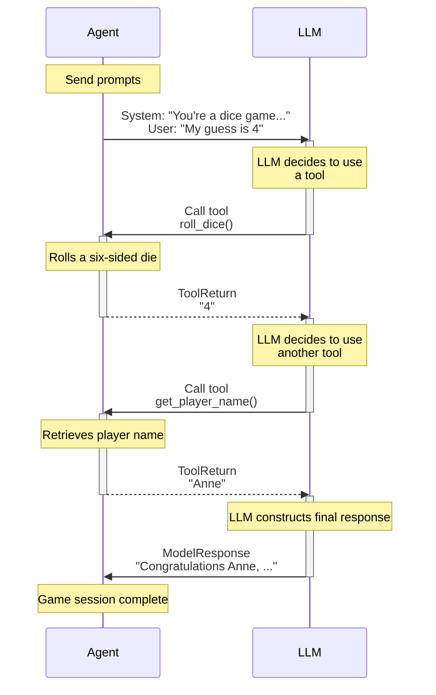

# pydantic/pydantic-ai

## Metadata
- Stars: 18459
- Primary language: Python
- Default branch: main
- Latest release: v1.107.1 (2026-07-10)
- License: MIT License
- Homepage: https://pydantic.dev/pydantic-ai
- Fetched: 2026-07-13
- Final URL: https://github.com/pydantic/pydantic-ai

## Description
AI Agent Framework, the Pydantic way

## README
<div align="center">
  <a href="https://ai.pydantic.dev/">
    <picture>
      <source media="(prefers-color-scheme: dark)" srcset="https://pydantic.dev/docs/ai/img/pydantic-ai-dark.svg">
      
    </picture>
  </a>
</div>
<div align="center">
  <h3>GenAI Agent Framework, the Pydantic way</h3>
</div>
<div align="center">
  <a href="https://github.com/pydantic/pydantic-ai/actions/workflows/ci.yml?query=branch%3Amain"></a>
  <a href="https://coverage-badge.samuelcolvin.workers.dev/redirect/pydantic/pydantic-ai"></a>
  <a href="https://pypi.python.org/pypi/pydantic-ai"></a>
  <a href="https://github.com/pydantic/pydantic-ai"></a>
  <a href="https://github.com/pydantic/pydantic-ai/blob/main/LICENSE"></a>
  <a href="https://logfire.pydantic.dev/docs/join-slack/"></a>
</div>

---

**Documentation**: [ai.pydantic.dev](https://ai.pydantic.dev/)

---

### <em>Pydantic AI is a Python agent framework designed to help you quickly, confidently, and painlessly build production grade applications and workflows with Generative AI.</em>


FastAPI revolutionized web development by offering an innovative and ergonomic design, built on the foundation of [Pydantic Validation](https://docs.pydantic.dev) and modern Python features like type hints.

Yet despite virtually every Python agent framework and LLM library using Pydantic Validation, when we began to use LLMs in [Pydantic Logfire](https://pydantic.dev/logfire), we couldn't find anything that gave us the same feeling.

We built Pydantic AI with one simple aim: to bring that FastAPI feeling to GenAI app and agent development.

## Why use Pydantic AI

1. **Built by the Pydantic Team**:
[Pydantic Validation](https://docs.pydantic.dev/latest/) is the validation layer of the OpenAI SDK, the Google ADK, the Anthropic SDK, LangChain, LlamaIndex, AutoGPT, Transformers, CrewAI, Instructor and many more. _Why use the derivative when you can go straight to the source?_ :smiley:

2. **Model-agnostic**:
Supports virtually every [model](https://ai.pydantic.dev/models/overview) and provider: OpenAI, Anthropic, Gemini, DeepSeek, Grok, Cohere, Mistral, and Perplexity; Azure AI Foundry, Amazon Bedrock, Google Cloud, Ollama, LiteLLM, Groq, OpenRouter, Together AI, Fireworks AI, Cerebras, Hugging Face, GitHub, Heroku, Vercel, Nebius, OVHcloud, Alibaba Cloud, SambaNova, and Z.AI. If your favorite model or provider is not listed, you can easily implement a [custom model](https://ai.pydantic.dev/models/overview#custom-models).

3. **Seamless Observability**:
Tightly [integrates](https://ai.pydantic.dev/logfire) with [Pydantic Logfire](https://pydantic.dev/logfire), our general-purpose OpenTelemetry observability platform, for real-time debugging, evals-based performance monitoring, and behavior, tracing, and cost tracking. If you already have an observability platform that supports OTel, you can [use that too](https://ai.pydantic.dev/logfire#alternative-observability-backends).

4. **Fully Type-safe**:
Designed to give your IDE or AI coding agent as much context as possible for auto-completion and [type checking](https://ai.pydantic.dev/agents#static-type-checking), moving entire classes of errors from runtime to write-time for a bit of that Rust "if it compiles, it works" feel.

5. **Powerful Evals**:
Enables you to systematically test and [evaluate](https://ai.pydantic.dev/evals) the performance and accuracy of the agentic systems you build, and monitor the performance over time in Pydantic Logfire.

6. **Extensible by Design**:
Build agents from composable [capabilities](https://ai.pydantic.dev/capabilities) that bundle tools, hooks, instructions, and model settings into reusable units. Use built-in capabilities for [web search](https://ai.pydantic.dev/capabilities#provider-adaptive-tools), [thinking](https://ai.pydantic.dev/capabilities#thinking), and [MCP](https://ai.pydantic.dev/capabilities#provider-adaptive-tools), pick from the [Pydantic AI Harness](https://ai.pydantic.dev/harness/overview) capability library, build your own, or install [third-party capability packages](https://ai.pydantic.dev/extensibility). Define agents entirely in [YAML/JSON](https://ai.pydantic.dev/agent-spec) — no code required.

7. **MCP and UI**:
Integrates the [Model Context Protocol](https://ai.pydantic.dev/mcp/overview) and various [UI event stream](https://ai.pydantic.dev/ui/overview) standards to give your agent access to external tools and data and build interactive applications with streaming event-based communication.

8. **Human-in-the-Loop Tool Approval**:
Easily lets you flag that certain tool calls [require approval](https://ai.pydantic.dev/deferred-tools#human-in-the-loop-tool-approval) before they can proceed, possibly depending on tool call arguments, conversation history, or user preferences.

9. **Durable Execution**:
Enables you to build [durable agents](https://ai.pydantic.dev/durable_execution/overview/) that can preserve their progress across transient API failures and application errors or restarts, and handle long-running, asynchronous, and human-in-the-loop workflows with production-grade reliability.

10. **Streamed Outputs**:
Provides the ability to [stream](https://ai.pydantic.dev/output#streamed-results) structured output continuously, with immediate validation, ensuring real time access to generated data.

11. **Graph Support**:
Provides a powerful way to define [graphs](https://ai.pydantic.dev/graph) using type hints, for use in complex applications where standard control flow can degrade to spaghetti code.

Realistically though, no list is going to be as convincing as [giving it a try](#next-steps) and seeing how it makes you feel!

## Hello World Example

Here's a minimal example of Pydantic AI:

```python
from pydantic_ai import Agent

# Define a very simple agent including the model to use, you can also set the model when running the agent.
agent = Agent(
    'anthropic:claude-sonnet-4-6',
    # Register static instructions using a keyword argument to the agent.
    # For more complex dynamically-generated instructions, see the example below.
    instructions='Be concise, reply with one sentence.',
)

# Run the agent synchronously, conducting a conversation with the LLM.
result = agent.run_sync('Where does "hello world" come from?')
print(result.output)
"""
The first known use of "hello, world" was in a 1974 textbook about the C programming language.
"""
```

_(This example is complete, it can be run "as is", assuming you've [installed the `pydantic_ai` package](https://ai.pydantic.dev/install))_

The exchange will be very short: Pydantic AI will send the instructions and the user prompt to the LLM, and the model will return a text response.

Not very interesting yet, but we can easily add [tools](https://ai.pydantic.dev/tools), [dynamic instructions](https://ai.pydantic.dev/agents#instructions), [structured outputs](https://ai.pydantic.dev/output), or composable [capabilities](https://ai.pydantic.dev/capabilities) to build more powerful agents.

Here's the same agent with [thinking](https://ai.pydantic.dev/capabilities#thinking) and [web search](https://ai.pydantic.dev/capabilities#provider-adaptive-tools) capabilities:

```python
from pydantic_ai import Agent
from pydantic_ai.capabilities import Thinking, WebSearch

agent = Agent(
    'anthropic:claude-sonnet-4-6',
    instructions='Be concise, reply with one sentence.',
    capabilities=[Thinking(), WebSearch()],
)

result = agent.run_sync('What was the mass of the largest meteorite found this year?')
print(result.output)
```

## Tools & Dependency Injection Example

Here is a concise example using Pydantic AI to build a support agent for a bank:

**(Better documented example [in the docs](https://ai.pydantic.dev/#tools-dependency-injection-example))**

```python
from dataclasses import dataclass

from pydantic import BaseModel, Field
from pydantic_ai import Agent, RunContext

from bank_database import DatabaseConn


# SupportDependencies is used to pass data, connections, and logic into the model that will be needed when running
# instructions and tool functions. Dependency injection provides a type-safe way to customise the behavior of your agents.
@dataclass
class SupportDependencies:
    customer_id: int
    db: DatabaseConn


# This Pydantic model defines the structure of the output returned by the agent.
class SupportOutput(BaseModel):
    support_advice: str = Field(description='Advice returned to the customer')
    block_card: bool = Field(description="Whether to block the customer's card")
    risk: int = Field(description='Risk level of query', ge=0, le=10)


# This agent will act as first-tier support in a bank.
# Agents are generic in the type of dependencies they accept and the type of output they return.
# In this case, the support agent has type `Agent[SupportDependencies, SupportOutput]`.
support_agent = Agent(
    'openai:gpt-5.2',
    deps_type=SupportDependencies,
    # The response from the agent will be guaranteed to be a SupportOutput,
    # if validation fails the agent is prompted to try again.
    output_type=SupportOutput,
    instructions=(
        'You are a support agent in our bank, give the '
        'customer support and judge the risk level of their query.'
    ),
)


# Dynamic instructions can make use of dependency injection.
# Dependencies are carried via the `RunContext` argument, which is parameterized with the `deps_type` from above.
# If the type annotation here is wrong, static type checkers will catch it.
@support_agent.instructions
async def add_customer_name(ctx: RunContext[SupportDependencies]) -> str:
    customer_name = await ctx.deps.db.customer_name(id=ctx.deps.customer_id)
    return f"The customer's name is {customer_name!r}"


# The `tool` decorator let you register functions which the LLM may call while responding to a user.
# Again, dependencies are carried via `RunContext`, any other arguments become the tool schema passed to the LLM.
# Pydantic is used to validate these arguments, and errors are passed back to the LLM so it can retry.
@support_agent.tool
async def customer_balance(
        ctx: RunContext[SupportDependencies], include_pending: bool
) -> float:
    """Returns the customer's current account balance."""
    # The docstring of a tool is also passed to the LLM as the description of the tool.
    # Parameter descriptions are extracted from the docstring and added to the parameter schema sent to the LLM.
    balance = await ctx.deps.db.customer_balance(
        id=ctx.deps.customer_id,
        include_pending=include_pending,
    )
    return balance


...  # In a real use case, you'd add more tools and a longer system prompt


async def main():
    deps = SupportDependencies(customer_id=123, db=DatabaseConn())
    # Run the agent asynchronously, conducting a conversation with the LLM until a final response is reached.
    # Even in this fairly simple case, the agent will exchange multiple messages with the LLM as tools are called to retrieve an output.
    result = await support_agent.run('What is my balance?', deps=deps)
    # The `result.output` will be validated with Pydantic to guarantee it is a `SupportOutput`. Since the agent is generic,
    # it'll also be typed as a `SupportOutput` to aid with static type checking.
    print(result.output)
    """
    support_advice='Hello John, your current account balance, including pending transactions, is $123.45.' block_card=False risk=1
    """

    result = await support_agent.run('I just lost my card!', deps=deps)
    print(result.output)
    """
    support_advice="I'm sorry to hear that, John. We are temporarily blocking your card to prevent unauthorized transactions." block_card=True risk=8
    """
```

## Next Steps

To try Pydantic AI for yourself, [install it](https://ai.pydantic.dev/install) and follow the instructions [in the examples](https://ai.pydantic.dev/examples/setup).

Read the [docs](https://ai.pydantic.dev/agents/) to learn more about building applications with Pydantic AI.

Read the [API Reference](https://ai.pydantic.dev/api/agent/) to understand Pydantic AI's interface.

Join [Slack](https://logfire.pydantic.dev/docs/join-slack/) or file an issue on [GitHub](https://github.com/pydantic/pydantic-ai/issues) if you have any questions.

## Part of the Pydantic Stack

The Pydantic Stack is everything you need to ship production-grade AI agents:

- [Pydantic AI](https://pydantic.dev/pydantic-ai?utm_source=github&utm_medium=readme&utm_campaign=pydantic-ai) - Type-safe agent framework
- [Pydantic Logfire](https://pydantic.dev/logfire?utm_source=github&utm_medium=readme&utm_campaign=pydantic-ai) - AI-first, full-stack observability
- [Logfire AI Gateway](https://pydantic.dev/ai-gateway?utm_source=github&utm_medium=readme&utm_campaign=pydantic-ai) - Unified LLM proxy

## Docs

=== docs/index.md ===
---
title: Pydantic AI
---

# Pydantic AI {.hide}

--8<-- "docs/.partials/index-header.html"

FastAPI revolutionized web development by offering an innovative and ergonomic design, built on the foundation of [Pydantic Validation](https://docs.pydantic.dev) and modern Python features like type hints.

Yet despite virtually every Python agent framework and LLM library using Pydantic Validation, when we began to use LLMs in [Pydantic Logfire](https://pydantic.dev/logfire), we couldn't find anything that gave us the same feeling.

We built Pydantic AI with one simple aim: to bring that FastAPI feeling to GenAI app and agent development.

## Why use Pydantic AI

1. **Built by the Pydantic Team**:
[Pydantic Validation](https://docs.pydantic.dev/latest/) is the validation layer of the OpenAI SDK, the Google ADK, the Anthropic SDK, LangChain, LlamaIndex, AutoGPT, Transformers, CrewAI, Instructor and many more. _Why use the derivative when you can go straight to the source?_ :smiley:

2. **Model-agnostic**:
Supports virtually every [model](models/overview.md) and provider: OpenAI, Anthropic, Gemini, DeepSeek, Grok, Cohere, Mistral, and Perplexity; Azure AI Foundry, Amazon Bedrock, Google Cloud, Ollama, LiteLLM, Groq, OpenRouter, Together AI, Fireworks AI, Cerebras, Hugging Face, GitHub, Heroku, Vercel, Nebius, OVHcloud, Alibaba Cloud, SambaNova, and Z.AI. If your favorite model or provider is not listed, you can easily implement a [custom model](models/overview.md#custom-models).

3. **Seamless Observability**:
Tightly [integrates](logfire.md) with [Pydantic Logfire](https://pydantic.dev/logfire), our general-purpose OpenTelemetry observability platform, for real-time debugging, evals-based performance monitoring, and behavior, tracing, and cost tracking. If you already have an observability platform that supports OTel, you can [use that too](logfire.md#alternative-observability-backends).

4. **Fully Type-safe**:
Designed to give your IDE or AI coding agent as much context as possible for auto-completion and [type checking](agent.md#static-type-checking), moving entire classes of errors from runtime to write-time for a bit of that Rust "if it compiles, it works" feel.

5. **Powerful Evals**:
Enables you to systematically test and [evaluate](evals.md) the performance and accuracy of the agentic systems you build, and monitor the performance over time in Pydantic Logfire.

6. **Extensible by Design**:
Build agents from composable [capabilities](capabilities.md) that bundle tools, hooks, instructions, and model settings into reusable units. Use built-in capabilities for [web search](capabilities.md#provider-adaptive-tools), [thinking](capabilities.md#thinking), and [MCP](capabilities.md#provider-adaptive-tools), pick from the [Pydantic AI Harness](harness/overview.md) capability library, build your own, or install [third-party capability packages](extensibility.md). Define agents entirely in [YAML/JSON](agent-spec.md) — no code required.

7. **MCP and UI**:
Integrates the [Model Context Protocol](mcp/overview.md) and various [UI event stream](ui/overview.md) standards to give your agent access to external tools and data and build interactive applications with streaming event-based communication.

8. **Human-in-the-Loop Tool Approval**:
Easily lets you flag that certain tool calls [require approval](deferred-tools.md#human-in-the-loop-tool-approval) before they can proceed, possibly depending on tool call arguments, conversation history, or user preferences.

9. **Durable Execution**:
Enables you to build [durable agents](durable_execution/overview.md) that can preserve their progress across transient API failures and application errors or restarts, and handle long-running, asynchronous, and human-in-the-loop workflows with production-grade reliability.

10. **Streamed Outputs**:
Provides the ability to [stream](output.md#streamed-results) structured output continuously, with immediate validation, ensuring real time access to generated data.

11. **Graph Support**:
Provides a powerful way to define [graphs](graph.md) using type hints, for use in complex applications where standard control flow can degrade to spaghetti code.

Realistically though, no list is going to be as convincing as [giving it a try](#next-steps) and seeing how it makes you feel!

**Sign up for our newsletter, *The Pydantic Stack*, with updates & tutorials on Pydantic AI, Logfire, and Pydantic:**

  <form method="POST" action="https://eu.customerioforms.com/forms/submit_action?site_id=53d2086c3c4214eaecaa&form_id=14b22611745b458&success_url=https://ai.pydantic.dev/" class="md-typeset" style="display: flex; align-items: center; gap: 0.5rem; width: 100%;">
      <input
      type="email"
      id="email_input"
      name="email"
      class="md-input md-input--stretch"
      style="flex: 1; background: var(--md-default-bg-color); color: var(--md-default-fg-color);"
      required
      placeholder="Email"
      data-1p-ignore
      data-lpignore="true"
      data-protonpass-ignore="true"
      data-bwignore="true"
      />
      <input type="hidden" id="source_input" name="source" value="pydantic-ai" />
      <button type="submit" class="md-button md-button--primary">Subscribe</button>
  </form>

## Hello World Example

Here's a minimal example of Pydantic AI:

```python {title="hello_world.py"}
from pydantic_ai import Agent

agent = Agent(  # (1)!
    'anthropic:claude-sonnet-4-6',
    instructions='Be concise, reply with one sentence.',  # (2)!
)

result = agent.run_sync('Where does "hello world" come from?')  # (3)!
print(result.output)
"""
The first known use of "hello, world" was in a 1974 textbook about the C programming language.
"""
```

1. We configure the agent to use [Anthropic's Claude Sonnet 4.6](api/models/anthropic.md) model, but you can also set the model when running the agent.
2. Register static [instructions](agent.md#instructions) using a keyword argument to the agent.
3. [Run the agent](agent.md#running-agents) synchronously, starting a conversation with the LLM.

_(This example is complete, it can be run "as is", assuming you've [installed the `pydantic_ai` package](install.md))_

The exchange will be very short: Pydantic AI will send the instructions and the user prompt to the LLM, and the model will return a text response.

Not very interesting yet, but we can easily add [tools](tools.md), [dynamic instructions](agent.md#instructions), [structured outputs](output.md), or composable [capabilities](capabilities.md) to build more powerful agents.

Here's the same agent with [thinking](capabilities.md#thinking) and [web search](capabilities.md#provider-adaptive-tools) capabilities:

```python {title="hello_world_capabilities.py"}
from pydantic_ai import Agent
from pydantic_ai.capabilities import Thinking, WebSearch

agent = Agent(
    'anthropic:claude-sonnet-4-6',
    instructions='Be concise, reply with one sentence.',
    capabilities=[Thinking(), WebSearch(local='duckduckgo')],
)

result = agent.run_sync('What was the mass of the largest meteorite found this year?')
print(result.output)
"""
The largest meteorite recovered this year weighed approximately 7.6 kg, found in the Sahara Desert in January.
"""
```

## Tools & Dependency Injection Example

Here is a concise example using Pydantic AI to build a support agent for a bank:

```python {title="bank_support.py"}
from dataclasses import dataclass

from pydantic import BaseModel, Field
from pydantic_ai import Agent, RunContext

from bank_database import DatabaseConn


@dataclass
class SupportDependencies:  # (3)!
    customer_id: int
    db: DatabaseConn  # (12)!


class SupportOutput(BaseModel):  # (13)!
    support_advice: str = Field(description='Advice returned to the customer')
    block_card: bool = Field(description="Whether to block the customer's card")
    risk: int = Field(description='Risk level of query', ge=0, le=10)


support_agent = Agent(  # (1)!
    'openai:gpt-5.2',  # (2)!
    deps_type=SupportDependencies,
    output_type=SupportOutput,  # (9)!
    instructions=(  # (4)!
        'You are a support agent in our bank, give the '
        'customer support and judge the risk level of their query.'
    ),
)


@support_agent.instructions  # (5)!
async def add_customer_name(ctx: RunContext[SupportDependencies]) -> str:
    customer_name = await ctx.deps.db.customer_name(id=ctx.deps.customer_id)
    return f"The customer's name is {customer_name!r}"


@support_agent.tool  # (6)!
async def customer_balance(
    ctx: RunContext[SupportDependencies], include_pending: bool
) -> float:
    """Returns the customer's current account balance."""  # (7)!
    return await ctx.deps.db.customer_balance(
        id=ctx.deps.customer_id,
        include_pending=include_pending,
    )


...  # (11)!


async def main():
    deps = SupportDependencies(customer_id=123, db=DatabaseConn())
    result = await support_agent.run('What is my balance?', deps=deps)  # (8)!
    print(result.output)  # (10)!
    """
    support_advice='Hello John, your current account balance, including pending transactions, is $123.45.' block_card=False risk=1
    """

    result = await support_agent.run('I just lost my card!', deps=deps)
    print(result.output)
    """
    support_advice="I'm sorry to hear that, John. We are temporarily blocking your card to prevent unauthorized transactions." block_card=True risk=8
    """
```

1. This [agent](agent.md) will act as first-tier support in a bank. Agents are generic in the type of dependencies they accept and the type of output they return. In this case, the support agent has type `#!python Agent[SupportDependencies, SupportOutput]`.
2. Here we configure the agent to use [OpenAI's GPT-5 model](api/models/openai.md), you can also set the model when running the agent.
3. The `SupportDependencies` dataclass is used to pass data, connections, and logic into the model that will be needed when running [instructions](agent.md#instructions) and [tool](tools.md) functions. Pydantic AI's system of dependency injection provides a [type-safe](agent.md#static-type-checking) way to customise the behavior of your agents, and can be especially useful when running [unit tests](testing.md) and evals.
4. Static [instructions](agent.md#instructions) can be registered with the [`instructions` keyword argument][pydantic_ai.agent.Agent.__init__] to the agent.
5. Dynamic [instructions](agent.md#instructions) can be registered with the [`@agent.instructions`][pydantic_ai.agent.Agent.instructions] decorator, and can make use of dependency injection. Dependencies are carried via the [`RunContext`][pydantic_ai.tools.RunContext] argument, which is parameterized with the `deps_type` from above. If the type annotation here is wrong, static type checkers will catch it.
6. The [`@agent.tool`](tools.md) decorator let you register functions which the LLM may call while responding to a user. Again, dependencies are carried via [`RunContext`][pydantic_ai.tools.RunContext], any other arguments become the tool schema passed to the LLM. Pydantic is used to validate these arguments, and errors are passed back to the LLM so it can retry.
7. The docstring of a tool is also passed to the LLM as the description of the tool. Parameter descriptions are [extracted](tools.md#function-tools-and-schema) from the docstring and added to the parameter schema sent to the LLM.
8. [Run the agent](agent.md#running-agents) asynchronously, conducting a conversation with the LLM until a final response is reached. Even in this fairly simple case, the agent will exchange multiple messages with the LLM as tools are called to retrieve an output.
9. The response from the agent will be guaranteed to be a `SupportOutput`. If validation fails [reflection](agent.md#reflection-and-self-correction), the agent is prompted to try again.
10. The output will be validated with Pydantic to guarantee it is a `SupportOutput`, since the agent is generic, it'll also be typed as a `SupportOutput` to aid with static type checking.
11. In a real use case, you'd add more tools and longer instructions to the agent to extend the context it's equipped with and support it can provide.
12. This is a simple sketch of a database connection, used to keep the example short and readable. In reality, you'd be connecting to an external database (e.g. PostgreSQL) to get information about customers.
13. This [Pydantic](https://docs.pydantic.dev) model is used to constrain the structured data returned by the agent. From this simple definition, Pydantic builds the JSON Schema that tells the LLM how to return the data, and performs validation to guarantee the data is correct at the end of the run.

!!! tip "Complete `bank_support.py` example"
    The code included here is incomplete for the sake of brevity (the definition of `DatabaseConn` is missing); you can find the complete `bank_support.py` example [here](examples/bank-support.md).

## Instrumentation with Pydantic Logfire

Even a simple agent with just a handful of tools can result in a lot of back-and-forth with the LLM, making it nearly impossible to be confident of what's going on just from reading the code.
To understand the flow of the above runs, we can watch the agent in action using Pydantic Logfire.

To do this, we need to [set up Logfire](logfire.md#using-logfire), and add the following to our code:

```python {title="bank_support_with_logfire.py" hl_lines="6-10" test="skip" lint="skip"}
...
from pydantic_ai import Agent, RunContext

from bank_database import DatabaseConn

import logfire

logfire.configure()  # (1)!
logfire.instrument_pydantic_ai()  # (2)!
logfire.instrument_sqlite3()  # (3)!

...

support_agent = Agent(
    'openai:gpt-5.2',
    deps_type=SupportDependencies,
    output_type=SupportOutput,
    instructions=(
        'You are a support agent in our bank, give the '
        'customer support and judge the risk level of their query.'
    ),
)
```

1. Configure the Logfire SDK, this will fail if project is not set up.
2. This will instrument all Pydantic AI agents used from here on out. To instrument only a specific agent, add an [`Instrumentation`][pydantic_ai.capabilities.Instrumentation] entry to the agent's `capabilities=[...]`.
3. In our demo, `DatabaseConn` uses [`sqlite3`][] to connect to a PostgreSQL database, so [`logfire.instrument_sqlite3()`](https://logfire.pydantic.dev/docs/integrations/databases/sqlite3/)
   is used to log the database queries.

That's enough to get the following view of your agent in action:

/// public-trace | https://logfire-eu.pydantic.dev/public-trace/a2957caa-b7b7-4883-a529-777742649004?spanId=31aade41ab896144
    title: 'Logfire instrumentation for the bank agent'
///

See [Monitoring and Performance](logfire.md) to learn more.

## `llms.txt`

The Pydantic AI documentation is available in the [llms.txt](https://llmstxt.org/) format.
This format is defined in Markdown and suited for LLMs and AI coding assistants and agents.

Two formats are available:

- [`llms.txt`](https://ai.pydantic.dev/llms.txt): a file containing a brief description
  of the project, along with links to the different sections of the documentation. The structure
  of this file is described in details [here](https://llmstxt.org/#format).
- [`llms-full.txt`](https://ai.pydantic.dev/llms-full.txt): Similar to the `llms.txt` file,
  but every link content is included. Note that this file may be too large for some LLMs.

As of today, these files are not automatically leveraged by IDEs or coding agents, but they will use it if you provide a link or the full text.


## Next Steps

To try Pydantic AI for yourself, [install it](install.md) and follow the instructions [in the examples](examples/setup.md).

Read the [docs](agent.md) to learn more about building applications with Pydantic AI.

Read the [API Reference](api/agent.md) to understand Pydantic AI's interface.

Join [Slack](https://logfire.pydantic.dev/docs/join-slack/) or file an issue on [:simple-github: GitHub](https://github.com/pydantic/pydantic-ai/issues) if you have any questions.

=== docs/agent.md ===
## Introduction

Agents are Pydantic AI's primary interface for interacting with LLMs.

In some use cases a single Agent will control an entire application or component,
but multiple agents can also interact to embody more complex workflows.

The [`Agent`][pydantic_ai.Agent] class has full API documentation, but conceptually you can think of an agent as a container for:

| **Component**                                             | **Description**                                                                                           |
| --------------------------------------------------------- | --------------------------------------------------------------------------------------------------------- |
| [Instructions](#instructions)                             | A set of instructions for the LLM written by the developer.                                               |
| [Function tool(s)](tools.md) and [toolsets](toolsets.md)  | Functions that the LLM may call to get information while generating a response.                           |
| [Structured output type](output.md)                       | The structured datatype the LLM must return at the end of a run, if specified.                            |
| [Dependency type constraint](dependencies.md)             | Dynamic instructions functions, tools, and output functions may all use dependencies when they're run.          |
| [LLM model](api/models/base.md)                           | Optional default LLM model associated with the agent. Can also be specified when running the agent.       |
| [Model Settings](#additional-configuration)               | Optional default model settings to help fine tune requests. Can also be specified when running the agent. |
| [Capabilities](capabilities.md)                           | Reusable bundles of tools, hooks, instructions, and model settings that extend agent behavior.            |

While each of these can be configured individually, [capabilities](capabilities.md) let you bundle related behavior into reusable units that are easier to compose, share, and [load from configuration files](agent-spec.md).

In typing terms, agents are generic in their dependency and output types, e.g., an agent which required dependencies of type `#!python Foobar` and produced outputs of type `#!python list[str]` would have type `Agent[Foobar, list[str]]`. In practice, you shouldn't need to care about this, it should just mean your IDE can tell you when you have the right type, and if you choose to use [static type checking](#static-type-checking) it should work well with Pydantic AI.

Here's a toy example of an agent that simulates a roulette wheel:

```python {title="roulette_wheel.py"}
from pydantic_ai import Agent, RunContext

roulette_agent = Agent(  # (1)!
    'openai:gpt-5.2',
    deps_type=int,
    output_type=bool,
    system_prompt=(
        'Use the `roulette_wheel` function to see if the '
        'customer has won based on the number they provide.'
    ),
)


@roulette_agent.tool
async def roulette_wheel(ctx: RunContext[int], square: int) -> str:  # (2)!
    """check if the square is a winner"""
    return 'winner' if square == ctx.deps else 'loser'


# Run the agent
success_number = 18  # (3)!
result = roulette_agent.run_sync('Put my money on square eighteen', deps=success_number)
print(result.output)  # (4)!
#> True

result = roulette_agent.run_sync('I bet five is the winner', deps=success_number)
print(result.output)
#> False
```

1. Create an agent, which expects an integer dependency and produces a boolean output. This agent will have type `#!python Agent[int, bool]`.
2. Define a tool that checks if the square is a winner. Here [`RunContext`][pydantic_ai.tools.RunContext] is parameterized with the dependency type `int`; if you got the dependency type wrong you'd get a typing error.
3. In reality, you might want to use a random number here e.g. `random.randint(0, 36)`.
4. `result.output` will be a boolean indicating if the square is a winner. Pydantic performs the output validation, and it'll be typed as a `bool` since its type is derived from the `output_type` generic parameter of the agent.

!!! tip "Agents are designed for reuse, like FastAPI Apps"
    You can instantiate one agent and use it globally throughout your application, as you would a small [FastAPI][fastapi.FastAPI] app or an [APIRouter][fastapi.APIRouter], or dynamically create as many agents as you want. Both are valid and supported ways to use agents.

## Running Agents

There are five ways to run an agent:

1. [`agent.run()`][pydantic_ai.agent.AbstractAgent.run] — an async function which returns a [`RunResult`][pydantic_ai.agent.AgentRunResult] containing a completed response.
2. [`agent.run_sync()`][pydantic_ai.agent.AbstractAgent.run_sync] — a plain, synchronous function which returns a [`RunResult`][pydantic_ai.agent.AgentRunResult] containing a completed response (internally, this just calls `loop.run_until_complete(self.run())`).
3. [`agent.run_stream()`][pydantic_ai.agent.AbstractAgent.run_stream] — an async context manager which returns a [`StreamedRunResult`][pydantic_ai.result.StreamedRunResult], which contains methods to stream text and structured output as an async iterable. [`agent.run_stream_sync()`][pydantic_ai.agent.AbstractAgent.run_stream_sync] is a synchronous variation that returns a [`StreamedRunResultSync`][pydantic_ai.result.StreamedRunResultSync] with synchronous versions of the same methods.
4. [`agent.run_stream_events()`][pydantic_ai.agent.AbstractAgent.run_stream_events] — an async context manager which yields an async iterator over [`AgentStreamEvent`s][pydantic_ai.messages.AgentStreamEvent] ending with an [`AgentRunResultEvent`][pydantic_ai.run.AgentRunResultEvent] containing the final run result.
5. [`agent.iter()`][pydantic_ai.agent.Agent.iter] — a context manager which returns an [`AgentRun`][pydantic_ai.agent.AgentRun], an async iterable over the nodes of the agent's underlying [`Graph`][pydantic_graph.graph_builder.Graph].

Here's a simple example demonstrating the first four:

```python {title="run_agent.py"}
from pydantic_ai import Agent, AgentRunResultEvent, AgentStreamEvent

agent = Agent('openai:gpt-5.2')

result_sync = agent.run_sync('What is the capital of Italy?')
print(result_sync.output)
#> The capital of Italy is Rome.


async def main():
    result = await agent.run('What is the capital of France?')
    print(result.output)
    #> The capital of France is Paris.

    async with agent.run_stream('What is the capital of the UK?') as response:
        async for text in response.stream_text():
            print(text)
            #> The capital of
            #> The capital of the UK is
            #> The capital of the UK is London.

    collected: list[AgentStreamEvent | AgentRunResultEvent] = []
    async with agent.run_stream_events('What is the capital of Mexico?') as events:
        async for event in events:
            collected.append(event)
    print(collected)
    """
    [
        PartStartEvent(index=0, part=TextPart(content='The capital of ')),
        FinalResultEvent(tool_name=None, tool_call_id=None),
        PartDeltaEvent(index=0, delta=TextPartDelta(content_delta='Mexico is Mexico ')),
        PartDeltaEvent(index=0, delta=TextPartDelta(content_delta='City.')),
        PartEndEvent(
            index=0, part=TextPart(content='The capital of Mexico is Mexico City.')
        ),
        AgentRunResultEvent(
            result=AgentRunResult(output='The capital of Mexico is Mexico City.')
        ),
    ]
    """
```

_(This example is complete, it can be run "as is" — you'll need to add `asyncio.run(main())` to run `main`)_

You can also pass messages from previous runs to continue a conversation or provide context, as described in [Messages and Chat History](message-history.md).

### Streaming Events and Final Output

As shown in the example above, [`run_stream()`][pydantic_ai.agent.AbstractAgent.run_stream] makes it easy to stream the agent's final output as it comes in.
It also takes an optional `event_stream_handler` argument that you can use to gain insight into what is happening during the run before the final output is produced.

The example below shows how to stream events and text output. You can also [stream structured output](output.md#streaming-structured-output).

!!! note
    The `run_stream()` and `run_stream_sync()` methods will consider the first output that matches the [output type](output.md#structured-output) (which could be text, an [output tool](output.md#tool-output) call, or a [deferred](deferred-tools.md) tool call) to be the final output of the agent run, even when the model generates (additional) tool calls after this "final" output.

	These "dangling" tool calls will not be executed unless the agent's [`end_strategy`][pydantic_ai.agent.Agent.end_strategy] is set to `'graceful'` or `'exhaustive'`, and even then their results will not be sent back to the model as the agent run will already be considered completed. In short, if the model returns both tool calls and text, and the agent's output type is `str`, **the tool calls will not run** in streaming mode with the default setting.

    If you want to always keep running the agent when it performs tool calls, and stream all events from the model's streaming response and the agent's execution of tools,
    use [`agent.run_stream_events()`][pydantic_ai.agent.AbstractAgent.run_stream_events] or [`agent.iter()`][pydantic_ai.agent.AbstractAgent.iter] instead, as described in the following sections.

```python {title="run_stream_event_stream_handler.py"}
import asyncio
from collections.abc import AsyncIterable
from datetime import date

from pydantic_ai import (
    Agent,
    AgentStreamEvent,
    FinalResultEvent,
    FunctionToolCallEvent,
    FunctionToolResultEvent,
    PartDeltaEvent,
    PartStartEvent,
    RunContext,
    TextPartDelta,
    ThinkingPartDelta,
    ToolCallPartDelta,
)

weather_agent = Agent(
    'openai:gpt-5.2',
    system_prompt='Providing a weather forecast at the locations the user provides.',
)


@weather_agent.tool
async def weather_forecast(
    ctx: RunContext,
    location: str,
    forecast_date: date,
) -> str:
    return f'The forecast in {location} on {forecast_date} is 24°C and sunny.'


output_messages: list[str] = []

async def handle_event(event: AgentStreamEvent):
    if isinstance(event, PartStartEvent):
        output_messages.append(f'[Request] Starting part {event.index}: {event.part!r}')
    elif isinstance(event, PartDeltaEvent):
        if isinstance(event.delta, TextPartDelta):
            output_messages.append(f'[Request] Part {event.index} text delta: {event.delta.content_delta!r}')
        elif isinstance(event.delta, ThinkingPartDelta):
            output_messages.append(f'[Request] Part {event.index} thinking delta: {event.delta.content_delta!r}')
        elif isinstance(event.delta, ToolCallPartDelta):
            output_messages.append(f'[Request] Part {event.index} args delta: {event.delta.args_delta}')
    elif isinstance(event, FunctionToolCallEvent):
        output_messages.append(
            f'[Tools] The LLM calls tool={event.part.tool_name!r} with args={event.part.args} (tool_call_id={event.part.tool_call_id!r})'
        )
    elif isinstance(event, FunctionToolResultEvent):
        output_messages.append(f'[Tools] Tool call {event.tool_call_id!r} returned => {event.part.content}')
    elif isinstance(event, FinalResultEvent):
        output_messages.append(f'[Result] The model starting producing a final result (tool_name={event.tool_name})')


async def event_stream_handler(
    ctx: RunContext,
    event_stream: AsyncIterable[AgentStreamEvent],
):
    async for event in event_stream:
        await handle_event(event)

async def main():
    user_prompt = 'What will the weather be like in Paris on Tuesday?'

    async with weather_agent.run_stream(user_prompt, event_stream_handler=event_stream_handler) as run:
        async for output in run.stream_text():
            output_messages.append(f'[Output] {output}')


if __name__ == '__main__':
    asyncio.run(main())

    print(output_messages)
    """
    [
        "[Request] Starting part 0: ToolCallPart(tool_name='weather_forecast', tool_call_id='0001')",
        '[Request] Part 0 args delta: {"location":"Pa',
        '[Request] Part 0 args delta: ris","forecast_',
        '[Request] Part 0 args delta: date":"2030-01-',
        '[Request] Part 0 args delta: 01"}',
        '[Tools] The LLM calls tool=\'weather_forecast\' with args={"location":"Paris","forecast_date":"2030-01-01"} (tool_call_id=\'0001\')',
        "[Tools] Tool call '0001' returned => The forecast in Paris on 2030-01-01 is 24°C and sunny.",
        "[Request] Starting part 0: TextPart(content='It will be ')",
        '[Result] The model starting producing a final result (tool_name=None)',
        '[Output] It will be ',
        '[Output] It will be warm and sunny ',
        '[Output] It will be warm and sunny in Paris on ',
        '[Output] It will be warm and sunny in Paris on Tuesday.',
    ]
    """
```

_(This example is complete, it can be run "as is")_

### Streaming All Events

Like `agent.run_stream()`, [`agent.run()`][pydantic_ai.agent.AbstractAgent.run_stream] takes an optional `event_stream_handler`
argument that lets you stream all events from the model's streaming response and the agent's execution of tools.
Unlike `run_stream()`, it always runs the agent graph to completion even if text was received ahead of tool calls that looked like it could've been the final result.

For convenience, a [`agent.run_stream_events()`][pydantic_ai.agent.AbstractAgent.run_stream_events] method is also available as a wrapper around `run(event_stream_handler=...)`. It is an async context manager that yields an async iterator over [`AgentStreamEvent`s][pydantic_ai.messages.AgentStreamEvent] ending with an [`AgentRunResultEvent`][pydantic_ai.run.AgentRunResultEvent] carrying the final run result.

!!! note
    As they return raw events as they come in, the `run_stream_events()` and `run(event_stream_handler=...)` methods require you to piece together the streamed text and structured output yourself from the `PartStartEvent` and subsequent `PartDeltaEvent`s.

    To get the best of both worlds, at the expense of some additional complexity, you can use [`agent.iter()`][pydantic_ai.agent.AbstractAgent.iter] as described in the next section, which lets you [iterate over the agent graph](#iterating-over-an-agents-graph) and [stream both events and output](#streaming-all-events-and-output) at every step.

```python {title="run_events.py" requires="run_stream_event_stream_handler.py"}
import asyncio

from pydantic_ai import AgentRunResultEvent

from run_stream_event_stream_handler import handle_event, output_messages, weather_agent


async def main():
    user_prompt = 'What will the weather be like in Paris on Tuesday?'

    async with weather_agent.run_stream_events(user_prompt) as events:
        async for event in events:
            if isinstance(event, AgentRunResultEvent):
                output_messages.append(f'[Final Output] {event.result.output}')
            else:
                await handle_event(event)

if __name__ == '__main__':
    asyncio.run(main())

    print(output_messages)
    """
    [
        "[Request] Starting part 0: ToolCallPart(tool_name='weather_forecast', tool_call_id='0001')",
        '[Request] Part 0 args delta: {"location":"Pa',
        '[Request] Part 0 args delta: ris","forecast_',
        '[Request] Part 0 args delta: date":"2030-01-',
        '[Request] Part 0 args delta: 01"}',
        '[Tools] The LLM calls tool=\'weather_forecast\' with args={"location":"Paris","forecast_date":"2030-01-01"} (tool_call_id=\'0001\')',
        "[Tools] Tool call '0001' returned => The forecast in Paris on 2030-01-01 is 24°C and sunny.",
        "[Request] Starting part 0: TextPart(content='It will be ')",
        '[Result] The model starting producing a final result (tool_name=None)',
        "[Request] Part 0 text delta: 'warm and sunny '",
        "[Request] Part 0 text delta: 'in Paris on '",
        "[Request] Part 0 text delta: 'Tuesday.'",
        '[Final Output] It will be warm and sunny in Paris on Tuesday.',
    ]
    """
```

_(This example is complete, it can be run "as is")_

### Iterating Over an Agent's Graph

Under the hood, each `Agent` in Pydantic AI uses **pydantic-graph** to manage its execution flow. **pydantic-graph** is a generic, type-centric library for building and running finite state machines in Python. It doesn't actually depend on Pydantic AI — you can use it standalone for workflows that have nothing to do with GenAI — but Pydantic AI makes use of it to orchestrate the handling of model requests and model responses in an agent's run.

In many scenarios, you don't need to worry about pydantic-graph at all; calling `agent.run(...)` simply traverses the underlying graph from start to finish. However, if you need deeper insight or control — for example to inject your own logic at specific stages — Pydantic AI exposes the lower-level iteration process via [`Agent.iter`][pydantic_ai.agent.Agent.iter]. This method returns an [`AgentRun`][pydantic_ai.agent.AgentRun], which you can async-iterate over, or manually drive node-by-node via the [`next`][pydantic_ai.agent.AgentRun.next] method. Once the agent's graph returns an [`End`][pydantic_graph.basenode.End], you have the final result along with a detailed history of all steps.

#### `async for` iteration

Here's an example of using `async for` with `iter` to record each node the agent executes:

```python {title="agent_iter_async_for.py"}
from pydantic_ai import Agent

agent = Agent('openai:gpt-5.2')


async def main():
    nodes = []
    # Begin an AgentRun, which is an async-iterable over the nodes of the agent's graph
    async with agent.iter('What is the capital of France?') as agent_run:
        async for node in agent_run:
            # Each node represents a step in the agent's execution
            nodes.append(node)
    print(nodes)
    """
    [
        UserPromptNode(
            user_prompt='What is the capital of France?',
            instructions_functions=[],
            system_prompts=(),
            system_prompt_functions=[],
            system_prompt_dynamic_functions={},
        ),
        ModelRequestNode(
            request=ModelRequest(
                parts=[
                    UserPromptPart(
                        content='What is the capital of France?',
                        timestamp=datetime.datetime(...),
                    )
                ],
                timestamp=datetime.datetime(...),
                run_id='...',
                conversation_id='...',
            )
        ),
        CallToolsNode(
            model_response=ModelResponse(
                parts=[TextPart(content='The capital of France is Paris.')],
                usage=RequestUsage(input_tokens=56, output_tokens=7),
                model_name='gpt-5.2',
                timestamp=datetime.datetime(...),
                run_id='...',
                conversation_id='...',
            )
        ),
        End(data=FinalResult(output='The capital of France is Paris.')),
    ]
    """
    print(agent_run.result.output)
    #> The capital of France is Paris.
```

_(This example is complete, it can be run "as is" — you'll need to add `asyncio.run(main())` to run `main`)_

- The `AgentRun` is an async iterator that yields each node (`BaseNode` or `End`) in the flow.
- The run ends when an `End` node is returned.

#### Using `.next(...)` manually

You can also drive the iteration manually by passing the node you want to run next to the `AgentRun.next(...)` method. This allows you to inspect or modify the node before it executes or skip nodes based on your own logic, and to catch errors in `next()` more easily:

```python {title="agent_iter_next.py"}
from pydantic_ai import Agent
from pydantic_graph import End

agent = Agent('openai:gpt-5.2')


async def main():
    async with agent.iter('What is the capital of France?') as agent_run:
        node = agent_run.next_node  # (1)!

        all_nodes = [node]

        # Drive the iteration manually:
        while not isinstance(node, End):  # (2)!
            node = await agent_run.next(node)  # (3)!
            all_nodes.append(node)  # (4)!

        print(all_nodes)
        """
        [
            UserPromptNode(
                user_prompt='What is the capital of France?',
                instructions_functions=[],
                system_prompts=(),
                system_prompt_functions=[],
                system_prompt_dynamic_functions={},
            ),
            ModelRequestNode(
                request=ModelRequest(
                    parts=[
                        UserPromptPart(
                            content='What is the capital of France?',
                            timestamp=datetime.datetime(...),
                        )
                    ],
                    timestamp=datetime.datetime(...),
                    run_id='...',
                    conversation_id='...',
                )
            ),
            CallToolsNode(
                model_response=ModelResponse(
                    parts=[TextPart(content='The capital of France is Paris.')],
                    usage=RequestUsage(input_tokens=56, output_tokens=7),
                    model_name='gpt-5.2',
                    timestamp=datetime.datetime(...),
                    run_id='...',
                    conversation_id='...',
                )
            ),
            End(data=FinalResult(output='The capital of France is Paris.')),
        ]
        """
```

1. We start by grabbing the first node that will be run in the agent's graph.
2. The agent run is finished once an `End` node has been produced; instances of `End` cannot be passed to `next`.
3. When you call `await agent_run.next(node)`, it executes that node in the agent's graph, updates the run's history, and returns the _next_ node to run.
4. You could also inspect or mutate the new `node` here as needed.

_(This example is complete, it can be run "as is" — you'll need to add `asyncio.run(main())` to run `main`)_

#### Accessing usage and final output

You can retrieve usage statistics (tokens, requests, etc.) at any time from the [`AgentRun`][pydantic_ai.agent.AgentRun] object via `agent_run.usage`. This property returns a [`RunUsage`][pydantic_ai.usage.RunUsage] object containing the usage data.

Once the run finishes, `agent_run.result` becomes an [`AgentRunResult`][pydantic_ai.agent.AgentRunResult] object containing the final output (and related metadata).

#### Streaming All Events and Output

Here is an example of streaming an agent run in combination with `async for` iteration:

```python {title="streaming_iter.py"}
import asyncio
from dataclasses import dataclass
from datetime import date

from pydantic_ai import (
    Agent,
    FinalResultEvent,
    FunctionToolCallEvent,
    FunctionToolResultEvent,
    PartDeltaEvent,
    PartStartEvent,
    RunContext,
    TextPartDelta,
    ThinkingPartDelta,
    ToolCallPartDelta,
)


@dataclass
class WeatherService:
    async def get_forecast(self, location: str, forecast_date: date) -> str:
        # In real code: call weather API, DB queries, etc.
        return f'The forecast in {location} on {forecast_date} is 24°C and sunny.'

    async def get_historic_weather(self, location: str, forecast_date: date) -> str:
        # In real code: call a historical weather API or DB
        return f'The weather in {location} on {forecast_date} was 18°C and partly cloudy.'


weather_agent = Agent[WeatherService, str](
    'openai:gpt-5.2',
    deps_type=WeatherService,
    output_type=str,  # We'll produce a final answer as plain text
    system_prompt='Providing a weather forecast at the locations the user provides.',
)


@weather_agent.tool
async def weather_forecast(
    ctx: RunContext[WeatherService],
    location: str,
    forecast_date: date,
) -> str:
    if forecast_date >= date.today():
        return await ctx.deps.get_forecast(location, forecast_date)
    else:
        return await ctx.deps.get_historic_weather(location, forecast_date)


output_messages: list[str] = []


async def main():
    user_prompt = 'What will the weather be like in Paris on Tuesday?'

    # Begin a node-by-node, streaming iteration
    async with weather_agent.iter(user_prompt, deps=WeatherService()) as run:
        async for node in run:
            if Agent.is_user_prompt_node(node):
                # A user prompt node => The user has provided input
                output_messages.append(f'=== UserPromptNode: {node.user_prompt} ===')
            elif Agent.is_model_request_node(node):
                # A model request node => We can stream tokens from the model's request
                output_messages.append('=== ModelRequestNode: streaming partial request tokens ===')
                async with node.stream(run.ctx) as request_stream:
                    final_result_found = False
                    async for event in request_stream:
                        if isinstance(event, PartStartEvent):
                            output_messages.append(f'[Request] Starting part {event.index}: {event.part!r}')
                        elif isinstance(event, PartDeltaEvent):
                            if isinstance(event.delta, TextPartDelta):
                                output_messages.append(
                                    f'[Request] Part {event.index} text delta: {event.delta.content_delta!r}'
                                )
                            elif isinstance(event.delta, ThinkingPartDelta):
                                output_messages.append(
                                    f'[Request] Part {event.index} thinking delta: {event.delta.content_delta!r}'
                                )
                            elif isinstance(event.delta, ToolCallPartDelta):
                                output_messages.append(
                                    f'[Request] Part {event.index} args delta: {event.delta.args_delta}'
                                )
                        elif isinstance(event, FinalResultEvent):
                            output_messages.append(
                                f'[Result] The model started producing a final result (tool_name={event.tool_name})'
                            )
                            final_result_found = True
                            break

                    if final_result_found:
                        # Once the final result is found, we can call `AgentStream.stream_text()` to stream the text.
                        # A similar `AgentStream.stream_output()` method is available to stream structured output.
                        async for output in request_stream.stream_text():
                            output_messages.append(f'[Output] {output}')
            elif Agent.is_call_tools_node(node):
                # A handle-response node => The model returned some data, potentially calls a tool
                output_messages.append('=== CallToolsNode: streaming partial response & tool usage ===')
                async with node.stream(run.ctx) as handle_stream:
                    async for event in handle_stream:
                        if isinstance(event, FunctionToolCallEvent):
                            output_messages.append(
                                f'[Tools] The LLM calls tool={event.part.tool_name!r} with args={event.part.args} (tool_call_id={event.part.tool_call_id!r})'
                            )
                        elif isinstance(event, FunctionToolResultEvent):
                            output_messages.append(
                                f'[Tools] Tool call {event.tool_call_id!r} returned => {event.part.content}'
                            )
            elif Agent.is_end_node(node):
                # Once an End node is reached, the agent run is complete
                assert run.result is not None
                assert run.result.output == node.data.output
                output_messages.append(f'=== Final Agent Output: {run.result.output} ===')


if __name__ == '__main__':
    asyncio.run(main())

    print(output_messages)
    """
    [
        '=== UserPromptNode: What will the weather be like in Paris on Tuesday? ===',
        '=== ModelRequestNode: streaming partial request tokens ===',
        "[Request] Starting part 0: ToolCallPart(tool_name='weather_forecast', tool_call_id='0001')",
        '[Request] Part 0 args delta: {"location":"Pa',
        '[Request] Part 0 args delta: ris","forecast_',
        '[Request] Part 0 args delta: date":"2030-01-',
        '[Request] Part 0 args delta: 01"}',
        '=== CallToolsNode: streaming partial response & tool usage ===',
        '[Tools] The LLM calls tool=\'weather_forecast\' with args={"location":"Paris","forecast_date":"2030-01-01"} (tool_call_id=\'0001\')',
        "[Tools] Tool call '0001' returned => The forecast in Paris on 2030-01-01 is 24°C and sunny.",
        '=== ModelRequestNode: streaming partial request tokens ===',
        "[Request] Starting part 0: TextPart(content='It will be ')",
        '[Result] The model started producing a final result (tool_name=None)',
        '[Output] It will be ',
        '[Output] It will be warm and sunny ',
        '[Output] It will be warm and sunny in Paris on ',
        '[Output] It will be warm and sunny in Paris on Tuesday.',
        '=== CallToolsNode: streaming partial response & tool usage ===',
        '=== Final Agent Output: It will be warm and sunny in Paris on Tuesday. ===',
    ]
    """
```

_(This example is complete, it can be run "as is")_

### Additional Configuration

#### Usage Limits

Pydantic AI offers a [`UsageLimits`][pydantic_ai.usage.UsageLimits] structure to help you limit your
usage (tokens, requests, and tool calls) on model runs.

You can apply these settings by passing the `usage_limits` argument to the `run{_sync,_stream}` functions.

Consider the following example, where we limit the number of output tokens:

```py
from pydantic_ai import Agent, UsageLimitExceeded, UsageLimits

agent = Agent('anthropic:claude-sonnet-4-6')

result_sync = agent.run_sync(
    'What is the capital of Italy? Answer with just the city.',
    usage_limits=UsageLimits(output_tokens_limit=10),
)
print(result_sync.output)
#> Rome
print(result_sync.usage)
#> RunUsage(input_tokens=62, output_tokens=1, requests=1)

try:
    result_sync = agent.run_sync(
        'What is the capital of Italy? Answer with a paragraph.',
        usage_limits=UsageLimits(output_tokens_limit=10),
    )
except UsageLimitExceeded as e:
    print(e)
    #> Exceeded the output_tokens_limit of 10 (output_tokens=32)
```

Restricting the number of requests can be useful in preventing infinite loops or excessive tool calling:

```py
from typing_extensions import TypedDict

from pydantic_ai import Agent, ModelRetry, UsageLimitExceeded, UsageLimits


class NeverOutputType(TypedDict):
    """
    Never ever coerce data to this type.
    """

    never_use_this: str


agent = Agent(
    'anthropic:claude-sonnet-4-6',
    retries={'tools': 3},
    output_type=NeverOutputType,
    system_prompt='Any time you get a response, call the `infinite_retry_tool` to produce another response.',
)


@agent.tool_plain(retries=5)  # (1)!
def infinite_retry_tool() -> int:
    raise ModelRetry('Please try again.')


try:
    result_sync = agent.run_sync(
        'Begin infinite retry loop!', usage_limits=UsageLimits(request_limit=3)  # (2)!
    )
except UsageLimitExceeded as e:
    print(e)
    #> The next request would exceed the request_limit of 3
```

1. This tool has the ability to retry 5 times before erroring, simulating a tool that might get stuck in a loop.
2. This run will error after 3 requests, preventing the infinite tool calling.

##### Capping tool calls

If you need a limit on the number of successful tool invocations within a single run, use `tool_calls_limit`:

```py
from pydantic_ai import Agent
from pydantic_ai.exceptions import UsageLimitExceeded
from pydantic_ai.usage import UsageLimits

agent = Agent('anthropic:claude-sonnet-4-6')

@agent.tool_plain
def do_work() -> str:
    return 'ok'

try:
    # Allow at most one executed tool call in this run
    agent.run_sync('Please call the tool twice', usage_limits=UsageLimits(tool_calls_limit=1))
except UsageLimitExceeded as e:
    print(e)
    #> The next tool call(s) would exceed the tool_calls_limit of 1 (tool_calls=2).
```

!!! note
    - Usage limits are especially relevant if you've registered many tools. Use `request_limit` to bound the number of model turns, and `tool_calls_limit` to cap the number of successful tool executions within a run.
    - The `tool_calls_limit` is checked before executing tool calls. If the model returns parallel tool calls that would exceed the limit, no tools will be executed.

Tools and [capabilities](capabilities.md) can read the run's limits from [`ctx.usage_limits`][pydantic_ai.tools.RunContext.usage_limits] (alongside [`ctx.usage`][pydantic_ai.tools.RunContext.usage] for usage so far), so a budget-aware tool or capability can disclose or adapt to the remaining budget without being configured with a duplicate copy of the limits. It reflects what the run is already enforcing and is read-only by convention.

#### Model (Run) Settings

Pydantic AI offers a [`settings.ModelSettings`][pydantic_ai.settings.ModelSettings] structure to help you fine tune your requests.
This structure allows you to configure common parameters that influence the model's behavior, such as `temperature`, `max_tokens`, `top_k`,
`timeout`, and more.

There are three ways to apply these settings, with a clear precedence order:

1. **Model-level defaults** - Set when creating a model instance via the `settings` parameter. These serve as the base defaults for that model.
2. **Agent-level defaults** - Set during [`Agent`][pydantic_ai.agent.Agent] initialization via the `model_settings` argument. These are merged with model defaults, with agent settings taking precedence.
3. **Run-time overrides** - Passed to `run{_sync,_stream}` functions via the `model_settings` argument. These have the highest priority and are merged with the combined agent and model defaults.

For example, if you'd like to set the `temperature` setting to `0.0` to ensure less random behavior,
you can do the following:

```py
from pydantic_ai import Agent, ModelSettings
from pydantic_ai.models.openai import OpenAIChatModel

# 1. Model-level defaults
model = OpenAIChatModel(
    'gpt-5.2',
    settings=ModelSettings(temperature=0.8, max_tokens=500)  # Base defaults
)

# 2. Agent-level defaults (overrides model defaults by merging)
agent = Agent(model, model_settings=ModelSettings(temperature=0.5))

# 3. Run-time overrides (highest priority)
result_sync = agent.run_sync(
    'What is the capital of Italy?',
    model_settings=ModelSettings(temperature=0.0)  # Final temperature: 0.0
)
print(result_sync.output)
#> The capital of Italy is Rome.
```

The final request uses `temperature=0.0` (run-time), `max_tokens=500` (from model), demonstrating how settings merge with run-time taking precedence.

##### Dynamic model settings

Both agent-level and run-level `model_settings` accept a callable that receives a
[`RunContext`][pydantic_ai.tools.RunContext] and returns [`ModelSettings`][pydantic_ai.settings.ModelSettings].
The callable is invoked before each model request, so settings can vary per step.
The current resolved settings so far are available via `ctx.model_settings` inside the callable.

Settings are resolved in layers, each merged on top of the previous:

1. **Model defaults** (`model.settings`)
2. **Agent-level** (`Agent(model_settings=...)`)
3. **Capability-level** (e.g. from [`Thinking()`][pydantic_ai.capabilities.Thinking] — see [Capabilities](capabilities.md#providing-model-settings))
4. **Run-level** (`agent.run(model_settings=...)`)

Inside a callable, `ctx.model_settings` contains the merged result of all *previous* layers (position-dependent). For example, an agent-level callable sees only model defaults, while a run-level callable sees model defaults + agent-level + capability-level settings. To reset a field set by a previous layer, set it explicitly (e.g. `{'temperature': None}`).

```python
from pydantic_ai import Agent, ModelSettings

agent = Agent(
    'test',
    model_settings=lambda ctx: ModelSettings(
        temperature=0.0 if ctx.run_step <= 1 else 0.7,
    ),
)
```

!!! note "Model Settings Support"
    Model-level settings are supported by all concrete model implementations (OpenAI, Anthropic, Google, etc.). Wrapper models like [`FallbackModel`](models/overview.md#fallback-model) and [`WrapperModel`][pydantic_ai.models.wrapper.WrapperModel] don't have their own settings - they use the settings of their underlying models.

#### Run metadata

Run metadata lets you tag each agent execution with contextual details (for example, a tenant ID to filter traces and logs)
and read it after completion via [`AgentRun.metadata`][pydantic_ai.agent.AgentRun],
[`AgentRunResult.metadata`][pydantic_ai.agent.AgentRunResult], or
[`StreamedRunResult.metadata`][pydantic_ai.result.StreamedRunResult].
The resolved metadata is attached to the [`RunContext`][pydantic_ai.tools.RunContext] during the run and,
when instrumentation is enabled, added to the run span attributes for observability tools.

Configure metadata on an [`Agent`][pydantic_ai.agent.Agent] or pass it to a run.
Both accept either a static dictionary or a callable that receives the [`RunContext`][pydantic_ai.tools.RunContext].
Metadata is computed (if a callable) and applied when the run starts, then recomputed after a run ends successfully,
so it can include end-of-run values.
Agent-level metadata and per-run metadata are merged, with per-run values overriding agent-level ones.

```python {title="run_metadata.py"}
from dataclasses import dataclass

from pydantic_ai import Agent


@dataclass
class Deps:
    tenant: str


agent = Agent[Deps](
    'openai:gpt-5.2',
    deps_type=Deps,
    metadata=lambda ctx: {'tenant': ctx.deps.tenant},  # agent-level metadata
)

result = agent.run_sync(
    'What is the capital of France?',
    deps=Deps(tenant='tenant-123'),
    metadata=lambda ctx: {'num_requests': ctx.usage.requests},  # per-run metadata
)
print(result.output)
#> The capital of France is Paris.
print(result.metadata)
#> {'tenant': 'tenant-123', 'num_requests': 1}
```

#### Concurrency Limiting

You can limit the number of concurrent agent runs using the `max_concurrency` parameter.
This is useful when you want to prevent overwhelming external resources or enforce rate limits when running many agent instances in parallel.

```python {title="agent_concurrency.py"}
import asyncio

from pydantic_ai import Agent, ConcurrencyLimit

# Simple limit: allow up to 10 concurrent runs
agent = Agent('openai:gpt-5', max_concurrency=10)


# With backpressure: limit concurrent runs and queue depth
agent_with_backpressure = Agent(
    'openai:gpt-5',
    max_concurrency=ConcurrencyLimit(max_running=10, max_queued=100),
)


async def main():
    # These will be rate-limited to 10 concurrent runs
    results = await asyncio.gather(
        *[agent.run(f'Question {i}') for i in range(20)]
    )
    print(len(results))
    #> 20
```

When the concurrency limit is reached, additional calls to [`agent.run()`][pydantic_ai.agent.AbstractAgent.run] or [`agent.iter()`][pydantic_ai.agent.Agent.iter]
will wait until a slot becomes available. If you configure `max_queued` and the queue fills up,
a [`ConcurrencyLimitExceeded`][pydantic_ai.exceptions.ConcurrencyLimitExceeded] exception is raised.

When instrumentation is enabled, waiting operations appear as "waiting for concurrency" spans
with attributes showing queue depth and limits.

### Model specific settings

If you wish to further customize model behavior, you can use a subclass of [`ModelSettings`][pydantic_ai.settings.ModelSettings], like
[`GoogleModelSettings`][pydantic_ai.models.google.GoogleModelSettings], associated with your model of choice.

For example:

```py
from pydantic_ai import Agent, UnexpectedModelBehavior
from pydantic_ai.models.google import GoogleModelSettings

agent = Agent('google:gemini-3-flash-preview')

try:
    result = agent.run_sync(
        'Write a list of 5 very rude things that I might say to the universe after stubbing my toe in the dark:',
        model_settings=GoogleModelSettings(
            temperature=0.0,  # general model settings can also be specified
            gemini_safety_settings=[
                {
                    'category': 'HARM_CATEGORY_HARASSMENT',
                    'threshold': 'BLOCK_LOW_AND_ABOVE',
                },
                {
                    'category': 'HARM_CATEGORY_HATE_SPEECH',
                    'threshold': 'BLOCK_LOW_AND_ABOVE',
                },
            ],
        ),
    )
except UnexpectedModelBehavior as e:
    print(e)  # (1)!
    """
    Content filter 'SAFETY' triggered, body:
    <safety settings details>
    """
```

1. This error is raised because the safety thresholds were exceeded.

## Runs vs. Conversations

An agent **run** might represent an entire conversation — there's no limit to how many messages can be exchanged in a single run. However, a **conversation** might also be composed of multiple runs, especially if you need to maintain state between separate interactions or API calls.

Here's an example of a conversation comprised of multiple runs:

```python {title="conversation_example.py" hl_lines="13"}
from pydantic_ai import Agent

agent = Agent('openai:gpt-5.2')

# First run
result1 = agent.run_sync('Who was Albert Einstein?')
print(result1.output)
#> Albert Einstein was a German-born theoretical physicist.

# Second run, passing previous messages
result2 = agent.run_sync(
    'What was his most famous equation?',
    message_history=result1.new_messages(),  # (1)!
)
print(result2.output)
#> Albert Einstein's most famous equation is (E = mc^2).
```

1. Continue the conversation; without `message_history` the model would not know who "his" was referring to.

_(This example is complete, it can be run "as is")_

## Type safe by design {#static-type-checking}

Pydantic AI is designed to work well with static type checkers, like mypy and pyright.

!!! tip "Typing is (somewhat) optional"
    Pydantic AI is designed to make type checking as useful as possible for you if you choose to use it, but you don't have to use types everywhere all the time.

    That said, because Pydantic AI uses Pydantic, and Pydantic uses type hints as the definition for schema and validation, some types (specifically type hints on parameters to tools, and the `output_type` arguments to [`Agent`][pydantic_ai.Agent]) are used at runtime.

    We (the library developers) have messed up if type hints are confusing you more than helping you, if you find this, please create an [issue](https://github.com/pydantic/pydantic-ai/issues) explaining what's annoying you!

In particular, agents are generic in both the type of their dependencies and the type of the outputs they return, so you can use the type hints to ensure you're using the right types.

Consider the following script with type mistakes:

```python {title="type_mistakes.py" hl_lines="18 28"}
from dataclasses import dataclass

from pydantic_ai import Agent, RunContext


@dataclass
class User:
    name: str


agent = Agent(
    'test',
    deps_type=User,  # (1)!
    output_type=bool,
)


@agent.system_prompt
def add_user_name(ctx: RunContext[str]) -> str:  # (2)!
    return f"The user's name is {ctx.deps}."


def foobar(x: bytes) -> None:
    pass


result = agent.run_sync('Does their name start with "A"?', deps=User('Anne'))
foobar(result.output)  # (3)!
```

1. The agent is defined as expecting an instance of `User` as `deps`.
2. But here `add_user_name` is defined as taking a `str` as the dependency, not a `User`.
3. Since the agent is defined as returning a `bool`, this will raise a type error since `foobar` expects `bytes`.

Running `mypy` on this will give the following output:

```bash
➤ uv run mypy type_mistakes.py
type_mistakes.py:18: error: Argument 1 to "system_prompt" of "Agent" has incompatible type "Callable[[RunContext[str]], str]"; expected "Callable[[RunContext[User]], str]"  [arg-type]
type_mistakes.py:28: error: Argument 1 to "foobar" has incompatible type "bool"; expected "bytes"  [arg-type]
Found 2 errors in 1 file (checked 1 source file)
```

Running `pyright` would identify the same issues.

## System Prompts

System prompts might seem simple at first glance since they're just strings (or sequences of strings that are concatenated), but crafting the right system prompt is key to getting the model to behave as you want.

!!! tip
    For most use cases, you should use `instructions` instead of "system prompts".

    If you know what you are doing though and want to preserve system prompt messages in the message history sent to the
    LLM in subsequent completions requests, you can achieve this using the `system_prompt` argument/decorator.

    See the section below on [Instructions](#instructions) for more information.

Generally, system prompts fall into two categories:

1. **Static system prompts**: These are known when writing the code and can be defined via the `system_prompt` parameter of the [`Agent` constructor][pydantic_ai.agent.Agent.__init__].
2. **Dynamic system prompts**: These depend in some way on context that isn't known until runtime, and should be defined via functions decorated with [`@agent.system_prompt`][pydantic_ai.agent.Agent.system_prompt].

You can add both to a single agent; they're appended in the order they're defined at runtime.

Here's an example using both types of system prompts:

```python {title="system_prompts.py"}
from datetime import date

from pydantic_ai import Agent, RunContext

agent = Agent(
    'openai:gpt-5.2',
    deps_type=str,  # (1)!
    system_prompt="Use the customer's name while replying to them.",  # (2)!
)


@agent.system_prompt  # (3)!
def add_the_users_name(ctx: RunContext[str]) -> str:
    return f"The user's name is {ctx.deps}."


@agent.system_prompt
def add_the_date() -> str:  # (4)!
    return f'The date is {date.today()}.'


result = agent.run_sync('What is the date?', deps='Frank')
print(result.output)
#> Hello Frank, the date today is 2032-01-02.
```

1. The agent expects a string dependency.
2. Static system prompt defined at agent creation time.
3. Dynamic system prompt defined via a decorator with [`RunContext`][pydantic_ai.tools.RunContext], this is called just after `run_sync`, not when the agent is created, so can benefit from runtime information like the dependencies used on that run.
4. Another dynamic system prompt, system prompts don't have to have the `RunContext` parameter.

_(This example is complete, it can be run "as is")_

## Instructions

Instructions are similar to system prompts. The main difference is that when an explicit `message_history` is provided
in a call to `Agent.run` and similar methods, _instructions_ from any existing messages in the history are not included
in the request to the model — only the instructions of the _current_ agent are included.

You should use:

- `instructions` when you want your request to the model to only include system prompts for the _current_ agent
- `system_prompt` when you want your request to the model to _retain_ the system prompts used in previous requests (possibly made using other agents)

In general, we recommend using `instructions` instead of `system_prompt` unless you have a specific reason to use `system_prompt`.

Instructions, like system prompts, can be specified at different times:

1. **Static instructions**: These are known when writing the code and can be defined via the `instructions` parameter of the [`Agent` constructor][pydantic_ai.agent.Agent.__init__].
2. **Dynamic instructions**: These rely on context that is only available at runtime and should be defined using functions decorated with [`@agent.instructions`][pydantic_ai.agent.Agent.instructions]. Unlike dynamic system prompts, which may be reused when `message_history` is present, dynamic instructions are always reevaluated.
3. **Runtime instructions**: These are additional instructions for a specific run that can be passed to one of the [run methods](#running-agents) using the `instructions` argument.

All three types of instructions can be added to a single agent, and they are appended in the order they are defined at runtime. Each instruction is internally classified as either **static** (literal strings from the `instructions` parameter) or **dynamic** (from `@agent.instructions` functions, runtime instructions, or [toolset](toolsets.md) instructions). Static instructions are always sorted before dynamic ones. This ordering enables providers that support prompt caching (like [Anthropic](models/anthropic.md#smart-instruction-caching) and [Bedrock](models/bedrock.md#prompt-caching)) to cache the stable static prefix while leaving dynamic instructions outside the cache boundary.

Here's an example using a static instruction as well as dynamic instructions:

```python {title="instructions.py"}
from datetime import date

from pydantic_ai import Agent, RunContext

agent = Agent(
    'openai:gpt-5.2',
    deps_type=str,  # (1)!
    instructions="Use the customer's name while replying to them.",  # (2)!
)


@agent.instructions  # (3)!
def add_the_users_name(ctx: RunContext[str]) -> str:
    return f"The user's name is {ctx.deps}."


@agent.instructions
def add_the_date() -> str:  # (4)!
    return f'The date is {date.today()}.'


result = agent.run_sync('What is the date?', deps='Frank')
print(result.output)
#> Hello Frank, the date today is 2032-01-02.
```

1. The agent expects a string dependency.
2. Static instructions defined at agent creation time.
3. Dynamic instructions defined via a decorator with [`RunContext`][pydantic_ai.tools.RunContext],
   this is called just after `run_sync`, not when the agent is created, so can benefit from runtime
   information like the dependencies used on that run.
4. Another dynamic instruction, instructions don't have to have the `RunContext` parameter.

_(This example is complete, it can be run "as is")_

Note that returning an empty string will result in no instruction message added.

Instructions can also come from [capabilities](capabilities.md) via [`get_instructions()`][pydantic_ai.capabilities.AbstractCapability.get_instructions], or from [template strings](agent-spec.md#template-strings) rendered against the agent's dependencies.

## Reflection and self-correction

Validation errors from both function tool parameter validation and [structured output validation](output.md#structured-output) can be passed back to the model with a request to retry.

You can also raise [`ModelRetry`][pydantic_ai.exceptions.ModelRetry] from within a [tool](tools.md) or [output function](output.md#output-functions) to tell the model it should retry generating a response.

- The default retry count is **1** but can be altered for the [entire agent][pydantic_ai.agent.Agent.__init__] with `retries` or [`AgentRetries`][pydantic_ai.agent.AgentRetries], a [specific tool][pydantic_ai.agent.Agent.tool], or [outputs][pydantic_ai.agent.Agent.__init__]. The output side of the agent retry budget can also be overridden per run via `agent.run(retries={'output': ...})` and friends.
- You can access the current retry count from within a tool, output validator, or output function via [`ctx.retry`][pydantic_ai.tools.RunContext.retry].

### How output retries are enforced

Pydantic AI enforces the output retry budget differently depending on how the model returns its final output:

- **Text output path** (`output_type=str`, text-only outputs, empty or unusable model responses): a single global budget is shared across the whole run. Each invalid response consumes one unit of the budget; when it's exhausted, the run raises [`UnexpectedModelBehavior`][pydantic_ai.exceptions.UnexpectedModelBehavior] with message `'Exceeded maximum output retries (N)'`.
- **Tool output path** ([`output_type=ToolOutput(...)`](output.md#tool-output), structured outputs): the output retry budget is the *default per-tool limit*. See [Tool Output](output.md#tool-output) for per-tool overrides via [`ToolOutput(max_retries=N)`][pydantic_ai.output.ToolOutput.max_retries].

For how the budget appears inside [output validators](output.md#output-validator-functions) — including what `ctx.max_retries` and `ctx.retry` reflect on each path — see the [Output validators](output.md#output-validator-functions) section.

Tool retries are tracked per tool — see [Tool Execution and Retries](tools-advanced.md#tool-retries) for the per-tool counter model and the three configuration levels.

Here's an example:

```python {title="tool_retry.py"}
from pydantic import BaseModel

from pydantic_ai import Agent, RunContext, ModelRetry

from fake_database import DatabaseConn


class ChatResult(BaseModel):
    user_id: int
    message: str


agent = Agent(
    'openai:gpt-5.2',
    deps_type=DatabaseConn,
    output_type=ChatResult,
)


@agent.tool(retries=2)
def get_user_by_name(ctx: RunContext[DatabaseConn], name: str) -> int:
    """Get a user's ID from their full name."""
    print(name)
    #> John
    #> John Doe
    user_id = ctx.deps.users.get(name=name)
    if user_id is None:
        raise ModelRetry(
            f'No user found with name {name!r}, remember to provide their full name'
        )
    return user_id


result = agent.run_sync(
    'Send a message to John Doe asking for coffee next week', deps=DatabaseConn()
)
print(result.output)
"""
user_id=123 message='Hello John, would you be free for coffee sometime next week? Let me know what works for you!'
"""
```

## Debugging and Monitoring

Agents require a different approach to observability than traditional software. With traditional web endpoints or data pipelines, you can largely predict behavior by reading the code. With agents, this is much harder. The model's decisions are stochastic, and that stochasticity compounds through the agentic loop as the agent reasons, calls tools, observes results, and reasons again. You need to actually see what happened.

This means setting up your application to record what's happening in a way you can review afterward, both during development (to understand and iterate) and in production (to debug issues and monitor behavior). The ergonomics matter too: a plaintext dump of everything that happened isn't a practical way to review agent behavior, even during development. You want tooling that lets you step through each decision and tool call interactively.

We recommend [Pydantic Logfire](https://logfire.pydantic.dev/docs/), which has been designed with Pydantic AI workflows in mind.

### Tracing with Logfire

```python
import logfire

logfire.configure()
logfire.instrument_pydantic_ai()
```

With Logfire instrumentation enabled, every agent run creates a detailed trace showing:

- **Messages exchanged** with the model (system, user, assistant)
- **Tool calls** including arguments and return values
- **Token usage** per request and cumulative
- **Latency** for each operation
- **Errors** with full context

This visibility is invaluable for:

- Understanding why an agent made a specific decision
- Debugging unexpected behavior
- Optimizing performance and costs
- Monitoring production deployments

### Systematic Testing with Evals

For systematic evaluation of agent behavior beyond runtime debugging, [Pydantic Evals](evals.md) provides a code-first framework for testing AI systems:

```python {test="skip" lint="skip" format="skip"}
from pydantic_evals import Case, Dataset

dataset = Dataset(
    name='agent_eval',
    cases=[
        Case(name='capital_question', inputs='What is the capital of France?', expected_output='Paris'),
    ]
)
report = dataset.evaluate_sync(my_agent_function)
```

Evals let you define test cases, run them against your agent, and score the results. When combined with Logfire, evaluation results appear in the web UI for visualization and comparison across runs. See the [Logfire integration guide](evals/how-to/logfire-integration.md) for setup.

### Using Other Backends

Pydantic AI's instrumentation is built on [OpenTelemetry](https://opentelemetry.io/), so you can send traces to any compatible backend. Even if you use the Logfire SDK for its convenience, you can configure it to send data to other backends. See [alternative backends](logfire.md#using-opentelemetry) for setup instructions.

[Full Logfire integration guide →](logfire.md)

## Model errors

If models behave unexpectedly (e.g., the retry limit is exceeded, or their API returns `503`), agent runs will raise [`UnexpectedModelBehavior`][pydantic_ai.exceptions.UnexpectedModelBehavior].

In these cases, [`capture_run_messages`][pydantic_ai.capture_run_messages] can be used to access the messages exchanged during the run to help diagnose the issue.

```python {title="agent_model_errors.py"}
from pydantic_ai import Agent, ModelRetry, UnexpectedModelBehavior, capture_run_messages

agent = Agent('openai:gpt-5.2')


@agent.tool_plain
def calc_volume(size: int) -> int:  # (1)!
    if size == 42:
        return size**3
    else:
        raise ModelRetry('Please try again.')


with capture_run_messages() as messages:  # (2)!
    try:
        result = agent.run_sync('Please get me the volume of a box with size 6.')
    except UnexpectedModelBehavior as e:
        print('An error occurred:', e)
        #> An error occurred: Tool 'calc_volume' exceeded max retries count of 1
        print('cause:', repr(e.__cause__))
        #> cause: ModelRetry('Please try again.')
        print('messages:', messages)
        """
        messages:
        [
            ModelRequest(
                parts=[
                    UserPromptPart(
                        content='Please get me the volume of a box with size 6.',
                        timestamp=datetime.datetime(...),
                    )
                ],
                timestamp=datetime.datetime(...),
                run_id='...',
                conversation_id='...',
            ),
            ModelResponse(
                parts=[
                    ToolCallPart(
                        tool_name='calc_volume',
                        args={'size': 6},
                        tool_call_id='pyd_ai_tool_call_id',
                    )
                ],
                usage=RequestUsage(input_tokens=62, output_tokens=4),
                model_name='gpt-5.2',
                timestamp=datetime.datetime(...),
                run_id='...',
                conversation_id='...',
            ),
            ModelRequest(
                parts=[
                    RetryPromptPart(
                        content='Please try again.',
                        tool_name='calc_volume',
                        tool_call_id='pyd_ai_tool_call_id',
                        timestamp=datetime.datetime(...),
                    )
                ],
                timestamp=datetime.datetime(...),
                run_id='...',
                conversation_id='...',
            ),
            ModelResponse(
                parts=[
                    ToolCallPart(
                        tool_name='calc_volume',
                        args={'size': 6},
                        tool_call_id='pyd_ai_tool_call_id',
                    )
                ],
                usage=RequestUsage(input_tokens=72, output_tokens=8),
                model_name='gpt-5.2',
                timestamp=datetime.datetime(...),
                run_id='...',
                conversation_id='...',
            ),
        ]
        """
    else:
        print(result.output)
```

1. Define a tool that will raise `ModelRetry` repeatedly in this case.
2. [`capture_run_messages`][pydantic_ai.capture_run_messages] is used to capture the messages exchanged during the run.

_(This example is complete, it can be run "as is")_

When a run is cut short by an exception while streaming, an exception inside a tool, or external cancellation, Pydantic AI still captures partial state where it can. Partial [`ModelResponse`][pydantic_ai.messages.ModelResponse] and [`ModelRequest`][pydantic_ai.messages.ModelRequest] messages have `state='interrupted'` so persistence layers and UIs can distinguish them from complete messages.

For model responses, interrupted messages contain the response parts streamed before the interruption. For model requests, interrupted messages contain the tool results that completed before tool execution stopped. Half-finished tool call parts are not turned into synthetic tool results; only completed tool returns are captured.

In this example, `get_volume` completes before `get_mass` raises, so the interrupted request contains the completed `get_volume` return:

```python {title="capture_interrupted_run.py"}
from pydantic_ai import Agent, ModelRequest, capture_run_messages
from pydantic_ai.messages import (
    ModelMessage,
    ModelResponse,
    ToolCallPart,
    ToolReturnPart,
)
from pydantic_ai.models.function import AgentInfo, FunctionModel


def call_tools(_messages: list[ModelMessage], _info: AgentInfo) -> ModelResponse:
    return ModelResponse(
        parts=[
            ToolCallPart(tool_name='get_volume', args={'size': 6}, tool_call_id='volume_call'),
            ToolCallPart(tool_name='get_mass', args={'size': 6}, tool_call_id='mass_call'),
        ]
    )


agent = Agent(FunctionModel(function=call_tools))


@agent.tool_plain(sequential=True)
def get_volume(size: int) -> int:
    return size**3


@agent.tool_plain(sequential=True)
def get_mass(size: int) -> int:
    raise RuntimeError('missing density')


with capture_run_messages() as messages:
    try:
        agent.run_sync('Calculate volume and mass.')
    except RuntimeError as exc:
        print(f'Run failed: {exc}')
        #> Run failed: missing density

interrupted_request = next(
    message for message in messages if isinstance(message, ModelRequest) and message.state == 'interrupted'
)
assert any(
    isinstance(part, ToolReturnPart) and part.tool_name == 'get_volume' and part.content == 216
    for part in interrupted_request.parts
)
```

!!! note
    If you call [`run`][pydantic_ai.agent.AbstractAgent.run], [`run_sync`][pydantic_ai.agent.AbstractAgent.run_sync], or [`run_stream`][pydantic_ai.agent.AbstractAgent.run_stream] more than once within a single `capture_run_messages` context, `messages` will represent the messages exchanged during the first call only.

    `capture_run_messages` contexts can be nested: each context captures the runs for which it is the innermost active context. A run started inside a nested context is captured by that nested context, not by any enclosing one. This means you can wrap a nested agent run (for example inside a tool that calls another agent) in its own `capture_run_messages` to inspect that inner run's messages independently.

## Agent Specs

Agents can also be defined declaratively in YAML or JSON using [agent specs](agent-spec.md). This separates agent configuration from application code:

```yaml {test="skip"}
model: anthropic:claude-opus-4-6
instructions: You are a helpful assistant.
capabilities:
  - WebSearch
  - Thinking:
      effort: high
```

```python {test="skip" lint="skip"}
from pydantic_ai import Agent

agent = Agent.from_file('agent.yaml')
```

See [Agent Specs](agent-spec.md) for the full spec format, template strings, and custom capability registration.

=== docs/capabilities.md ===
# Capabilities

A capability is a reusable, composable unit of agent behavior. Instead of threading multiple arguments through your `Agent` constructor — [instructions](agent.md#instructions) here, [model settings](agent.md#model-run-settings) there, a [toolset](toolsets.md) somewhere else, a [history processor](message-history.md#processing-message-history) on yet another parameter — you can bundle related behavior into a single capability and pass it via the [`capabilities`][pydantic_ai.agent.Agent.__init__] parameter.

Capabilities can provide any combination of:

* **Tools** — via [toolsets](toolsets.md) or [native tools](native-tools.md)
* **Lifecycle hooks** — intercept and modify model requests, tool calls, and the overall run
* **Instructions** — static or dynamic [instruction](agent.md#instructions) additions
* **Model settings** — static or per-step [model settings](agent.md#model-run-settings)

This makes them the primary extension point for Pydantic AI. Whether you're building a memory system, a guardrail, a cost tracker, or an approval workflow, a capability is the right abstraction.

## On-demand capabilities {#on-demand-capabilities}

A multi-workflow agent normally sends every workflow's instructions and tool schemas on every turn, and applies every workflow's settings and hooks for the whole run — even though most requests need just one workflow. That cost grows with each workflow you add: more input tokens, and worse tool selection once the visible tool set passes the ~30–50-tool mark where models start picking the wrong one (the same pressure behind [tool search](tools-advanced.md#tool-search)).

Mark a capability with `defer_loading=True` and give it a stable `id`, and it collapses to a one-line catalog entry — its `id` plus an optional `description` — that the model pulls in on demand. Here's the minimal shape:

```python {title="on_demand_capability.py"}
from pydantic_ai import Agent
from pydantic_ai.capabilities import Capability

refunds = Capability(
    id='refunds',
    description='Use for refund eligibility, refund status, or processing a refund.',
    instructions='Always confirm the order ID before issuing a refund.',
    defer_loading=True,
)


@refunds.tool_plain
def refund_status(order_id: str) -> str:
    """Look up the refund status for an order."""
    return f'Order {order_id}: refund issued on 2026-05-01.'


agent = Agent(
    'openai-responses:gpt-5.4',
    instructions='You are a customer support assistant.',
    capabilities=[refunds],
)
```

On the first turn, the refund workflow is collapsed to a catalog entry. The model sees its base instructions, the framework-managed `load_capability` tool, and the catalog appended to the instructions:

```
The following capabilities are deferred and can be loaded using the `load_capability` tool:
- refunds: Use for refund eligibility, refund status, or processing a refund.
```

The model does not receive the refund instructions, and `refund_status` is not callable yet. Depending on the active model, Pydantic AI may also send provider/tool-search plumbing to preserve the hidden state; that plumbing does not expose the refund tool until the capability is loaded. The exchange unfolds across model requests within a single `agent.run_sync` call:

1. **Request 1.** The model sees the catalog above and the user's prompt. It calls the `load_capability` tool with `id='refunds'`.
2. **Load.** Pydantic AI returns the capability's instructions — *"Always confirm the order ID before issuing a refund."* — as the tool result, and registers `refund_status` for the next request.
3. **Request 2.** The model now sees those instructions in history and `refund_status` in its tool list. It calls `refund_status(order_id='ABC-123')` and answers the user from the result.

Already-loaded capabilities stay loaded for the rest of the run — the model never needs to re-open one.

Loading activates the whole bundle, not just instructions: the capability's function tools, model settings, and lifecycle hooks come live together (see [What you can defer](#what-you-can-defer)). It's a one-line change to a capability you already register, it works on [every provider](#cross-provider-behavior), and it [survives history replay](#resumable-across-runs).

!!! note
    The `load_capability` tool name is reserved whenever any on-demand capability is present. Capability `id` values must be stable and explicit — see [Resumable across runs](#resumable-across-runs).

!!! note "Deferred instructions reach client-facing message history"
    A deferred capability's instructions come back as the `load_capability` tool *result*, so they land in the run's message history — including the copy a [UI adapter](ui/overview.md) serializes to the client. Instructions on an always-on capability stay in the server-side system prompt instead. If a capability's instructions shouldn't be exposed to the client, keep it always-on rather than deferred.

### What you can defer

Every part of a capability bundle activates together as a single unit:

| Part | Before load | After load |
|---|---|---|
| Instructions (static or dynamic) | Not sent | Returned as the `load_capability` tool result; included in subsequent requests |
| Function tools | Not exposed | Exposed on the next request |
| Model settings (static or per-step) | Not applied | Merged into the run's settings for subsequent requests |
| Lifecycle [hooks](#hooking-into-the-lifecycle) | Do not fire | Fire after the capability is loaded |
| [Native tools](native-tools.md) | Not exposed | Exposed on the next request — see [Cache implications](#cache-implications) |

### When to use it

**Reach for on-demand capabilities when:**

- the agent serves multiple distinct workflows (refunds, returns, fraud review, account security…) where most turns need one
- a workflow needs *more than instructions* — its own tools, raised reasoning effort, an approval hook — and those should travel together as a unit
- you want skills-style progressive disclosure but also want the loaded bundle to bring tools and settings, not just a runbook

**Skip it when:**

- the capability is used on most turns — the discovery round-trip costs more than the tokens it saves
- you have a flat catalog of individually-discoverable tools with no shared instructions — use [tool search](tools-advanced.md#tool-search) instead, which discovers individual tools by name rather than loading bundles

If you've used [Anthropic's Agent Skills](https://www.anthropic.com/engineering/equipping-agents-for-the-real-world-with-agent-skills), this is the same idea generalised: a skill is a markdown file the model can pull in on demand. An on-demand capability does that *plus* typed function tools, per-step model settings, and lifecycle hooks.

### Retrofitting an existing capability

`defer_loading=True` is not specific to the [`Capability`][pydantic_ai.capabilities.Capability] convenience class. The shared fields live on [`AbstractCapability`][pydantic_ai.capabilities.AbstractCapability], and built-in capabilities expose `id`, `description`, and `defer_loading` on construction. For custom capabilities, set those attributes on the instance.

```python {title="defer_existing_capability.py"}
from pydantic_ai import Agent
from pydantic_ai.capabilities import MCP

agent = Agent(
    'openai-responses:gpt-5.4',
    capabilities=[
        MCP(
            url='https://mcp.example.com/analytics',
            native=True,
            id='analytics-mcp',
            description='Use for analytics queries, dashboards, and metric lookups.',
            defer_loading=True,
        ),
    ],
)
```

Until the model loads `analytics-mcp`, none of the MCP server's tool definitions enter the prompt. The same flag works on [`WebSearch`][pydantic_ai.capabilities.WebSearch], [`WebFetch`][pydantic_ai.capabilities.WebFetch], [`Hooks`][pydantic_ai.capabilities.Hooks], and any custom [`AbstractCapability`][pydantic_ai.capabilities.AbstractCapability] subclass — see [Building custom capabilities](#building-custom-capabilities) for adding `defer_loading` to your own subclass.

!!! note "Deferred `MCP`: set a stable `id`"
    [`MCP`][pydantic_ai.capabilities.MCP] derives its `id` from the server URL when you omit one, so `defer_loading=True` works without an explicit `id`. Pass one anyway if you persist and [resume](#resumable-across-runs) conversations: a URL-derived id changes if the URL does (different environment, path version, …), which silently breaks the resumed capability's loaded state.

### Resumable across runs {#resumable-across-runs}

Loaded-capability state lives in message history, not in the agent. When a conversation is persisted to a database and resumed later — possibly on a different process, machine, or model — Pydantic AI reconstructs the loaded set from the `load_capability` tool call/return pairs in history. Capabilities the model loaded earlier stay loaded; capabilities it never loaded stay collapsed in the catalog. No re-discovery round-trip on resume.

This is why deferred capabilities require a stable explicit `id`: history replay matches calls to capabilities by id, so a class-derived id would silently break the moment a class is renamed. The same property makes cross-provider replay work — a run that loaded `refunds` on Anthropic and continued on OpenAI Responses keeps `refunds` loaded after the switch.

History carries *which* capability ids were loaded, not the capabilities themselves: the resuming agent must be constructed with the same capabilities (matching `id`s), just as it must be constructed with the same tools. State lives in history; definitions live in code.

### Runtime state in `RunContext`

Several [`RunContext`][pydantic_ai.tools.RunContext] fields expose progressive-disclosure state to tools, hooks, and capability-owned callbacks:

- `ctx.loaded_capability_ids` — deferred capability IDs explicitly loaded through the `load_capability` tool, reconstructed from message history and updated when a capability loads during the current step.
- `ctx.available_capability_ids` — the currently-live capability IDs: always-available capabilities plus `ctx.loaded_capability_ids`.
- `ctx.capability_loaded` — only meaningful while Pydantic AI is running a capability-owned hook or callback. It is scoped to that capability; deferred hooks and callbacks are skipped until this value would be true.
- `ctx.discovered_tool_names` — deferred function tools revealed by tool search. This is tool-level discovery, separate from capability-level loading.
- `ctx.available_tool_names` — function tool names currently known as available: always-visible tools from the current step's assembled tool manager plus tool-search discoveries reconstructed from history. Early hooks such as `before_run` may see only the history-derived discovered names, or an empty set if none exist yet, before tool definitions have been prepared. See [Hook ordering](hooks.md#hook-ordering) for how hook timing affects what is populated.
- `ctx.usage_limits` — the [`UsageLimits`][pydantic_ai.usage.UsageLimits] the run is enforcing (defaulting to `UsageLimits()` when none were passed, so it's only `None` outside of a run), alongside `ctx.usage` for the usage so far. A capability can read the run's limits to disclose or adapt to the remaining budget (e.g. budget disclosure) without being configured with a duplicate copy. Treat it as read-only: it's the live object the run enforces against, so mutating a field would change what the run enforces on subsequent requests.

Loading a capability updates the capability state immediately, but the loaded bundle's function tools, native tools, and model settings take effect on the next model request.

### Cross-provider behavior

On-demand capabilities work on every model. Where the provider exposes a native progressive-disclosure surface — Anthropic tool search on Sonnet 4.5+/Opus 4.5+/Haiku 4.5+, OpenAI Responses `tool_search` on GPT-5.4+ — Pydantic AI uses that surface so deferred function tools stay out of the prompt prefix. Standalone deferred tools can use the provider's hosted search; tools owned by on-demand capabilities use client-executed local search through the native surface so tools from unloaded capabilities cannot leak. On other providers, a local `search_tools` function tool handles discovery: the initial context shrinks the same way, but cache stability across loads is not guaranteed.

#### Cache implications {#cache-implications}

Calling the `load_capability` tool reveals capability behavior between requests. Whether that breaks the provider's prompt-cache prefix depends on what's revealed:

| What loads | Cache prefix |
|---|---|
| Instructions only | **Stable** — instructions land in the message history, not the request prefix. |
| Function tools on a model with native [tool search](tools-advanced.md#tool-search) (OpenAI Responses, Anthropic) | **Stable** — the function tools visible to the provider don't change across loads. |
| Function tools on other models (local `search_tools` fallback) | **May break between turns** — function-tool visibility changes as capabilities load. |
| Native tools | **Always breaks the prefix on load** — native tool definitions are part of the request prefix on every provider. |

When preserving the cache prefix matters, prefer instruction-only or function-tool-only on-demand capabilities on a model with native tool search. The provider-specific mechanics that keep the prefix stable live in [tools-advanced.md](tools-advanced.md#tool-search).

### The `Capability` convenience class

[`Capability`][pydantic_ai.capabilities.Capability] bundles instructions, function tools, and toolsets without subclassing. Register tools with the decorator that mirrors [`@agent.tool`](tools.md#registering-function-tools-via-decorator):

```python {title="capability_decorator.py"}
from pydantic_ai import RunContext
from pydantic_ai.capabilities import Capability

refunds = Capability(
    id='refunds',
    description='Use for refund eligibility and refund status.',
    instructions='Always confirm the order ID before issuing a refund.',
    defer_loading=True,
)


@refunds.tool
def refund_status(ctx: RunContext[None], order_id: str) -> str:
    """Look up the refund status for an order."""
    return f'Order {order_id}: refund issued on 2026-05-01.'
```

In addition to `@capability.tool` and `@capability.tool_plain`, you can pass existing functions or [`Tool`][pydantic_ai.tools.Tool] instances via `tools=`, or hand in one or more [toolsets](toolsets.md) via `toolsets=`. For dynamic instructions, use the [`@capability.instructions`][pydantic_ai.capabilities.Capability.instructions] decorator. For a dynamic catalog entry, pass a callable as `description=`.

`@capability.tool` and `@capability.tool_plain` mirror [`@agent.tool`](tools.md#registering-function-tools-via-decorator) exactly, including the `defer_loading` argument. On a deferred capability that per-tool flag is a no-op — the capability gates all its tools as a unit — so it only has an effect on a non-deferred `Capability`, where it opts an individual tool into [tool search](tools-advanced.md#tool-search) discovery.

For anything beyond instructions, function tools, toolsets, and descriptions — model settings, hooks, native tools, wrapper toolsets, or custom per-run logic — subclass [`AbstractCapability`][pydantic_ai.capabilities.AbstractCapability] directly. When subclassing, override [`get_description`][pydantic_ai.capabilities.AbstractCapability.get_description] if the catalog entry needs to vary by run.

### Beyond instructions: tools, settings, hooks, native tools {#beyond-instructions}

The [`Capability`][pydantic_ai.capabilities.Capability] example above deferred instructions and a function tool, but the same flag gates the whole bundle — what the model knows, what it can do, and how it does it (see [What you can defer](#what-you-can-defer)). The snippets below show the remaining pieces in turn: model settings, hooks, and native tools.

#### Deferred model settings

[`get_model_settings`][pydantic_ai.capabilities.AbstractCapability.get_model_settings] is collected during capability assembly, but its settings are only applied after the deferred capability is loaded. That means per-step settings like raised reasoning effort only apply for workflows the model opts into:

```python {title="deferred_model_settings.py"}
from dataclasses import dataclass
from typing import Any

from pydantic_ai import Agent, ModelSettings
from pydantic_ai.capabilities import AbstractCapability


@dataclass
class DeepReasoning(AbstractCapability[Any]):
    def get_model_settings(self) -> ModelSettings:
        return ModelSettings(extra_body={'reasoning_effort': 'high'})


agent = Agent(
    'openai-responses:gpt-5.4',
    capabilities=[
        DeepReasoning(
            id='deep-reasoning',
            description='Use for multi-step planning or hard analytical problems.',
            defer_loading=True,
        ),
    ],
)
```

#### Lifecycle hooks with deferred workflows

Hooks can live on deferred capabilities too. They do not run until the model loads the capability that owns them:

```python {title="deferred_hooks.py"}
from dataclasses import dataclass

from pydantic_ai import Agent
from pydantic_ai.capabilities import AbstractCapability


@dataclass
class AccountSecurityWorkflow(AbstractCapability[None]):
    id: str = 'account-security'
    description: str = 'Use when the next action may be destructive.'
    defer_loading: bool = True

    def get_instructions(self) -> str:
        return 'Confirm the customer identity before taking destructive action.'

    async def before_tool_execute(self, ctx, *, call, tool_def, args):
        # Inspect the call, prompt the operator, raise to block.
        return args


agent = Agent('openai-responses:gpt-5.4', capabilities=[AccountSecurityWorkflow()])
```

!!! note "Checking other capabilities"
    `ctx.capability_loaded` is scoped to the capability whose hook is currently running. For an always-on hook capability, it is always true. To check whether another deferred capability has been loaded, look for its ID in `ctx.loaded_capability_ids`, for example `if 'account-security' in ctx.loaded_capability_ids:`. If a hook must enforce a rule before a workflow is loaded, keep that hook in an always-available capability and inspect `ctx.loaded_capability_ids`.

#### Deferred native tools

Any [native capability](#native-capabilities) (`WebSearch`, `WebFetch`, `MCP`, …) can be deferred the same way. The native tool definition only enters the request after the `load_capability` tool loads the capability — see [Cache implications](#cache-implications) for the trade-off:

```python {title="deferred_native_tool.py"}
from pydantic_ai import Agent
from pydantic_ai.capabilities import WebSearch

agent = Agent(
    'anthropic:claude-sonnet-4-6',
    capabilities=[
        WebSearch(
            local='duckduckgo',
            id='web-research',
            description='Use when the question requires up-to-date information.',
            defer_loading=True,
        ),
    ],
)
```

### Putting it together: a multi-workflow support agent

A realistic on-demand capability rarely consists of just one piece. The example below defines a customer-support agent with two deferred workflows that exercise different parts of the bundle:

- `orders` — instructions plus a function tool, defined inline with [`Capability`][pydantic_ai.capabilities.Capability].
- `account-security` — instructions, a function tool, raised reasoning effort, *and* an approval hook, all bundled as one [`AbstractCapability`][pydantic_ai.capabilities.AbstractCapability] subclass.

For those workflows, turn 1 exposes only the two-line catalog. Base instructions, always-on tools, the framework-managed `load_capability` tool, and any provider/tool-search plumbing still appear as usual. Loading `account-security` activates the runbook, the destructive tool, the higher reasoning effort, *and* the approval gate together — that's what we mean by bundle-level disclosure.

```python {title="support_agent.py"}
from dataclasses import dataclass

from pydantic_ai import Agent, ModelSettings, RunContext
from pydantic_ai.capabilities import AbstractCapability, Capability
from pydantic_ai.toolsets import AgentToolset, FunctionToolset


@dataclass
class Store:
    orders: dict[str, str]


# Workflow 1: instructions + function tool, defined inline.
orders = Capability[Store](
    id='orders',
    description='Use for order tracking, delivery status, or questions involving an order ID.',
    instructions='Quote the order ID and item name when discussing an order.',
    defer_loading=True,
)


@orders.tool
def order_status(ctx: RunContext[Store], order_id: str) -> str:
    """Look up shipping or delivery status for an order."""
    return ctx.deps.orders.get(order_id, f'No order found with id {order_id}.')


# Workflow 2: instructions + tool + per-step model settings + approval hook,
# all hidden until the model loads `account-security`.
security_tools = FunctionToolset[Store]()


@security_tools.tool
def revoke_sessions(ctx: RunContext[Store], account_id: str) -> str:
    """Revoke all active sessions for an account."""
    return f'Revoked sessions for {account_id}.'


@dataclass
class AccountSecurity(AbstractCapability[Store]):
    id: str = 'account-security'
    description: str = 'Use for suspicious logins, account takeover, or session revocation.'
    defer_loading: bool = True

    def get_instructions(self) -> str:
        return 'Confirm the customer identity before revoking sessions.'

    def get_toolset(self) -> AgentToolset[Store]:
        return security_tools

    def get_model_settings(self) -> ModelSettings:
        # Raise reasoning effort just for sensitive workflows.
        return ModelSettings(extra_body={'reasoning_effort': 'high'})

    async def before_tool_execute(self, ctx, *, call, tool_def, args):
        # Approval gate for destructive actions, active once the model has loaded `account-security`.
        return args


support_agent = Agent(
    'openai-responses:gpt-5.4',
    deps_type=Store,
    instructions='You are a customer-support agent for an e-commerce store.',
    capabilities=[orders, AccountSecurity()],
)
```

A "where is my order?" request loads only `orders`. A "someone is logging into my account" request loads only `account-security` — and from that point on, every tool call in the run passes through the approval hook *and* benefits from the raised reasoning effort, without either being visible to the model on requests that never touched the workflow.

### Enforcing read-before-act

Want the model to actually *read the runbook* before taking a destructive action? Make the runbook a deferred capability, then check `ctx.loaded_capability_ids` in a one-method hook:

```python {title="runbook_required.py"}
from dataclasses import dataclass, field

from pydantic_ai import Agent, ModelRetry
from pydantic_ai.capabilities import AbstractCapability, Capability


@dataclass
class RunbookRequired(AbstractCapability[None]):
    """Bounces a tool call back until the matching runbook has been loaded."""

    requirements: dict[str, str] = field(default_factory=dict)

    async def before_tool_execute(self, ctx, *, call, tool_def, args):
        required = self.requirements.get(tool_def.name)
        if required and required not in ctx.loaded_capability_ids:
            raise ModelRetry(
                f'Call the `load_capability` tool with `id={required!r}` and follow its '
                f'guidance before calling `{tool_def.name}`.'
            )
        return args


refund_policy = Capability(
    id='refund-policy',
    description='Read before issuing refunds. Eligibility rules and approval limits.',
    instructions=(
        'Refunds over $500 require manager approval. '
        'Refunds outside the 30-day window require a documented exception.'
    ),
    defer_loading=True,
)


agent = Agent(
    'openai-responses:gpt-5.4',
    capabilities=[
        refund_policy,
        RunbookRequired(requirements={'issue_refund': 'refund-policy'}),
    ],
)


@agent.tool_plain
def issue_refund(order_id: str, amount: float) -> str:
    """Issue a refund for an order."""
    return f'Refund of ${amount} issued for {order_id}.'
```

The model sees `issue_refund` from turn 1. If it tries to call it before opening `refund-policy`, the hook bounces the call back with a message pointing at the exact `load_capability` tool call to make. The model loads the policy, the policy text lands in its recent context, and the refund runs *within* the rules — and only then. Same shape for any tool-and-runbook pair.

Because the loaded set is just runtime data on [`RunContext`][pydantic_ai.tools.RunContext], the pattern generalises: dynamic instructions can warn when a risky pair of workflows is open, audit hooks can tag traces with the loaded set, escalation hooks can require an extra confirmation when both `payments` and `account-security` are active.

### Loading skills from Markdown files

If you already keep your skills as Markdown files with YAML frontmatter — the format used by [Anthropic Agent Skills](https://www.anthropic.com/engineering/equipping-agents-for-the-real-world-with-agent-skills) — you can wrap each one in a [`Capability`][pydantic_ai.capabilities.Capability] with a few lines of glue.

Given a skill file `skills/refunds.md`:

```markdown {title="skills/refunds.md"}
---
id: refunds
description: Use for refund eligibility, refund status, or processing a refund.
---
Always confirm the order ID before issuing a refund.
Never issue refunds over $500 without manager approval.
```

Load it into an agent as an on-demand capability:

```python {title="skill_from_markdown.py" test="skip"}
from pathlib import Path

import yaml

from pydantic_ai import Agent
from pydantic_ai.capabilities import Capability


def load_skill(path: Path) -> Capability:
    _, frontmatter, body = path.read_text().split('---', 2)
    meta = yaml.safe_load(frontmatter)
    return Capability(
        id=meta['id'],
        description=meta['description'],
        instructions=body.strip(),
        defer_loading=True,
    )


agent = Agent(
    'openai-responses:gpt-5.4',
    instructions='You are a customer support assistant.',
    capabilities=[load_skill(p) for p in Path('skills').glob('*.md')],
)
```

Each file shows up in the model's catalog as its `id` plus `description`; the body is only sent once the model calls the `load_capability` tool. To go beyond instructions — add function tools, model settings, or hooks for a particular skill — subclass [`AbstractCapability`][pydantic_ai.capabilities.AbstractCapability] as in the examples above.

!!! note "Composes with"
    On-demand capabilities are orthogonal to the rest of the framework — they layer onto features you may already be using:

    - **[Tool search](tools-advanced.md#tool-search)** — capability-level `defer_loading=True` gates the whole bundle as a unit; for per-*tool* discovery, set tool-level `defer_loading=True` on a non-deferred capability or on `@agent.tool`.
    - **[MCP servers](mcp/client.md)** — the [`MCP`][pydantic_ai.capabilities.MCP] capability accepts `defer_loading=True`, hiding the server's full tool list until the model opts in.
    - **[Native tools](native-tools.md)** — [`WebSearch`][pydantic_ai.capabilities.WebSearch], [`WebFetch`][pydantic_ai.capabilities.WebFetch], [`ImageGeneration`][pydantic_ai.capabilities.ImageGeneration], and [`MCP`][pydantic_ai.capabilities.MCP] all defer the same way as function tools (see [Cache implications](#cache-implications)).
    - **[Hooks](hooks.md)** — lifecycle hooks declared on a deferred capability (or via a deferred [`Hooks`][pydantic_ai.capabilities.Hooks] capability) stay dormant until the model opts in.
    - **[Message history](message-history.md)** — loaded state round-trips through history, so persisted conversations resume in the same state (see [Resumable across runs](#resumable-across-runs)).

## Native capabilities

Pydantic AI ships with several capabilities that cover common needs:

| Capability | What it provides | Spec |
|---|---|:---:|
| [`Thinking`][pydantic_ai.capabilities.Thinking] | Enables model [thinking/reasoning](thinking.md) at configurable effort | Yes |
| [`Hooks`][pydantic_ai.capabilities.Hooks] | Decorator-based [lifecycle hook](hooks.md) registration | — |
| [`Instrumentation`][pydantic_ai.capabilities.Instrumentation] | OpenTelemetry/Logfire tracing — see [Debugging and Monitoring](logfire.md) | Yes |
| [`WebSearch`][pydantic_ai.capabilities.WebSearch] | Web search — native by default, optional [local fallback](common-tools.md#duckduckgo-search-tool) via `local='duckduckgo'` | Yes |
| [`WebFetch`][pydantic_ai.capabilities.WebFetch] | URL fetching — native by default, optional [local fallback](common-tools.md#web-fetch-tool) via `local=True` | Yes |
| [`ImageGeneration`][pydantic_ai.capabilities.ImageGeneration] | Image generation — native by default, optional subagent fallback via `fallback_model` | Yes |
| [`XSearch`][pydantic_ai.capabilities.XSearch] | X search — native on xAI, explicit subagent fallback via `fallback_model` | Yes |
| [`MCP`][pydantic_ai.capabilities.MCP] | MCP server — runs locally by default; `native=True` opts into the model provider's native MCP support | Yes |
| [`ToolSearch`][pydantic_ai.capabilities.ToolSearch] | Discovery of [deferred tools](tools-advanced.md#tool-search) — native when supported, local `search_tools` function tool otherwise | Yes |
| [`PrepareTools`][pydantic_ai.capabilities.PrepareTools] | Filters or modifies function [tool definitions](tools.md) per step | — |
| [`PrepareOutputTools`][pydantic_ai.capabilities.PrepareOutputTools] | Filters or modifies [output tool][pydantic_ai.output.ToolOutput] definitions per step | — |
| [`PrefixTools`][pydantic_ai.capabilities.PrefixTools] | Wraps a capability and prefixes its tool names | Yes |
| [`NativeTool`][pydantic_ai.capabilities.NativeTool] | Registers a [native tool](native-tools.md) with the agent | Yes |
| [`Capability`][pydantic_ai.capabilities.Capability] | Bundles instructions, function tools, and toolsets without subclassing | — |
| [`Toolset`][pydantic_ai.capabilities.Toolset] | Wraps an [`AbstractToolset`][pydantic_ai.toolsets.AbstractToolset] | — |
| [`IncludeToolReturnSchemas`][pydantic_ai.capabilities.IncludeToolReturnSchemas] | Includes return type schemas in tool definitions sent to the model | Yes |
| [`SetToolMetadata`][pydantic_ai.capabilities.SetToolMetadata] | Merges metadata key-value pairs onto selected tools | Yes |
| [`HandleDeferredToolCalls`][pydantic_ai.capabilities.HandleDeferredToolCalls] | Resolves [deferred tool calls](deferred-tools.md#resolving-deferred-calls-with-a-handler) inline with a handler function | — |
| [`ProcessHistory`][pydantic_ai.capabilities.ProcessHistory] | Wraps a [history processor](message-history.md#processing-message-history) | — |
| [`ProcessEventStream`][pydantic_ai.capabilities.ProcessEventStream] | Forwards agent stream events to a handler function | — |
| [`ThreadExecutor`][pydantic_ai.capabilities.ThreadExecutor] | Uses a custom thread executor for [sync functions](tools-advanced.md#thread-executor-for-long-running-servers) | — |

The **Spec** column indicates whether the capability can be used in [agent specs](agent-spec.md) (YAML/JSON). Capabilities marked **—** take non-serializable arguments (callables, toolset objects) and can only be used in Python code.

```python {title="native_capabilities.py"}
from pydantic_ai import Agent
from pydantic_ai.capabilities import Thinking, WebSearch

agent = Agent(
    'anthropic:claude-opus-4-6',
    instructions='You are a research assistant. Be thorough and cite sources.',
    capabilities=[
        Thinking(effort='high'),
        WebSearch(local='duckduckgo'),
    ],
)
```

[Instructions](agent.md#instructions) and [model settings](agent.md#model-run-settings) are configured directly via the `instructions` and `model_settings` parameters on `Agent` (or [`AgentSpec`][pydantic_ai.agent.spec.AgentSpec]). Capabilities are for behavior that goes beyond simple configuration — tools, lifecycle hooks, and custom extensions. They compose well, especially when you want to reuse the same configuration across multiple agents or load it from a [spec file](agent-spec.md).

### Thinking

The [`Thinking`][pydantic_ai.capabilities.Thinking] capability enables model [thinking/reasoning](thinking.md) at a configurable effort level. It's the simplest way to enable thinking across providers:

```python {title="thinking_capability.py"}
from pydantic_ai import Agent
from pydantic_ai.capabilities import Thinking

agent = Agent('anthropic:claude-sonnet-4-6', capabilities=[Thinking(effort='high')])
result = agent.run_sync('What is the capital of France?')
print(result.output)
#> The capital of France is Paris.
```

See [Thinking](thinking.md) for provider-specific details and the [unified thinking settings](thinking.md#unified-thinking-settings).

### Compaction

Provider-specific compaction capabilities manage conversation context size by compacting older messages into summaries:

| Provider | Capability | Details |
|----------|-----------|---------|
| OpenAI Responses API | [`OpenAICompaction`][pydantic_ai.models.openai.OpenAICompaction] | [OpenAI compaction](models/openai.md#message-compaction) |
| Anthropic | [`AnthropicCompaction`][pydantic_ai.models.anthropic.AnthropicCompaction] | [Anthropic compaction](models/anthropic.md#message-compaction) |

### ThreadExecutor

The [`ThreadExecutor`][pydantic_ai.capabilities.ThreadExecutor] capability provides a custom [`Executor`][concurrent.futures.Executor] for running sync tool functions and other sync callbacks in threads. This is useful in long-running servers (e.g. FastAPI) where the default ephemeral threads from [`anyio.to_thread.run_sync`][anyio.to_thread.run_sync] can accumulate under sustained load:

```python {test="skip"}
from concurrent.futures import ThreadPoolExecutor

from pydantic_ai import Agent
from pydantic_ai.capabilities import ThreadExecutor

executor = ThreadPoolExecutor(max_workers=16, thread_name_prefix='agent-worker')
agent = Agent('openai:gpt-5.2', capabilities=[ThreadExecutor(executor)])
```

See [Thread executor for long-running servers](tools-advanced.md#thread-executor-for-long-running-servers) for more details.

### Hooks

The [`Hooks`][pydantic_ai.capabilities.Hooks] capability provides decorator-based [lifecycle hook](hooks.md) registration — the easiest way to intercept model requests, tool calls, and other events without subclassing [`AbstractCapability`][pydantic_ai.capabilities.AbstractCapability]:

```python {test="skip" lint="skip"}
from pydantic_ai import Agent, ModelRequestContext, RunContext
from pydantic_ai.capabilities import Hooks

hooks = Hooks()

@hooks.on.before_model_request
async def log_request(ctx: RunContext, request_context: ModelRequestContext) -> ModelRequestContext:
    agent_name = ctx.agent.name if ctx.agent else 'unknown'
    print(f'[{agent_name}] Sending {len(request_context.messages)} messages')
    return request_context

agent = Agent('openai:gpt-5.2', name='my_agent', capabilities=[hooks])
```

All hooks receive [`RunContext`][pydantic_ai.tools.RunContext], which provides access to the running agent via [`ctx.agent`][pydantic_ai.tools.RunContext.agent] — useful for logging, metrics, and other cross-cutting concerns that need to identify which agent is running.

Hooks can also push follow-up messages into the conversation via
[`RunContext.enqueue`][pydantic_ai.tools.RunContext.enqueue] — useful for capability
authors that need to surface an event to the model mid-run without rebuilding the
cached system prompt. See [Injecting messages mid-run](message-history.md#injecting-messages-mid-run).

See the dedicated [Hooks](hooks.md) page for the full API: decorator and constructor registration, timeouts, tool filtering, wrap hooks, per-event hooks, and more.

### Provider-adaptive tools

[`WebSearch`][pydantic_ai.capabilities.WebSearch], [`WebFetch`][pydantic_ai.capabilities.WebFetch], [`ImageGeneration`][pydantic_ai.capabilities.ImageGeneration], [`XSearch`][pydantic_ai.capabilities.XSearch], and [`MCP`][pydantic_ai.capabilities.MCP] each cover a single capability (web search, URL fetch, image generation, X search, MCP) across two implementations:

- **Native** — invoked by the model provider when the model supports it. The work happens on the provider's side (e.g. Anthropic's web search runs server-side, returning results inline).
- **Local** — runs in your Python process. Used when the model doesn't support the native tool; your code does the work (e.g. calling DuckDuckGo directly).

Because these capabilities contribute model-facing tools, their `id`, `description`, and `defer_loading` fields are meaningful: set them when that tool should stay hidden until the model loads the matching workflow with the `load_capability` tool. This includes [`ImageGeneration`][pydantic_ai.capabilities.ImageGeneration] when image generation should only be available for an image-specific workflow, whether it resolves to a native image tool or a fallback subagent tool.

Configure each side via the `native=` and `local=` kwargs. `native=` accepts `True` (use the capability's default [native tool](native-tools.md) instance), `False` (disable native), or an explicit instance like `WebSearchTool(...)` for fine-grained config. `local=` accepts `True` (the bundled local fallback), `False` (disable local), a named strategy string where supported, or any callable, [`Tool`][pydantic_ai.tools.Tool], or [`AbstractToolset`][pydantic_ai.toolsets.AbstractToolset]. Optional installs needed for the local fallback are opt-in — the capability raises a [`UserError`][pydantic_ai.exceptions.UserError] at construction (with an install hint) when you ask for a local strategy whose extra isn't installed.

```python {title="provider_adaptive_tools.py" test="skip" lint="skip"}
from pydantic_ai import Agent
from pydantic_ai.capabilities import MCP, ImageGeneration, WebFetch, WebSearch, XSearch

agent = Agent(
    'anthropic:claude-sonnet-4-6',
    capabilities=[
        # Native when supported; DuckDuckGo fallback on unsupported models
        WebSearch(local='duckduckgo'),
        # Native when supported; markdownify-based fallback on unsupported models
        WebFetch(local=True),
        # Native when supported; subagent fallback via `fallback_model`
        ImageGeneration(fallback_model='openai-responses:gpt-5.4'),
        # Native on xAI; on other models, explicitly delegate to an xAI model
        XSearch(fallback_model='xai:grok-4.3'),
        # Runs the MCP server locally by default; pass `native=True` to also advertise native MCP
        MCP('https://mcp.example.com/api'),
    ],
)
```

`MCP` defaults the other way from the others: because MCP carries credentials, it runs locally by default and you opt into native MCP with `native=True`. The others default to native and you opt into local with `local=`.

[`XSearch`][pydantic_ai.capabilities.XSearch] is slightly different from [`WebSearch`][pydantic_ai.capabilities.WebSearch] and [`WebFetch`][pydantic_ai.capabilities.WebFetch]: there is no default non-xAI fallback. If your agent is not running on an xAI model, set `fallback_model` explicitly to an xAI model that supports [`XSearchTool`][pydantic_ai.native_tools.XSearchTool].

Some constraint fields require the native tool (the bundled local fallback can't enforce them) — passing them locks the capability to the native path. If the model doesn't support the native tool, the capability raises a [`UserError`][pydantic_ai.exceptions.UserError].

```python {title="constraints.py" test="skip" lint="skip"}
# Limit to 5 searches per run — requires native (the local fallback can't track call count)
WebSearch(max_uses=5)

# Only fetch example.com — enforced locally when native is unavailable
WebFetch(allowed_domains=['example.com'], local=True)
```

#### WebSearch

[`WebSearch`][pydantic_ai.capabilities.WebSearch] defaults to native-only. Backed by [`WebSearchTool`][pydantic_ai.native_tools.WebSearchTool] on the native side (see [Web Search Tool](native-tools.md#web-search-tool) for provider support and configuration) — pass `native=WebSearchTool(...)` directly when you need full control over the native instance.

For the local side, pass `local='duckduckgo'` (or `local=True`) for a [DuckDuckGo](common-tools.md#duckduckgo-search-tool) fallback (requires the `duckduckgo` optional group); for other search providers, use a [Tavily][pydantic_ai.common_tools.tavily.tavily_search_tool] or [Exa][pydantic_ai.common_tools.exa.ExaSearchTool] wrapper from [`common_tools`](common-tools.md), or any callable, [`Tool`][pydantic_ai.tools.Tool], or [`AbstractToolset`][pydantic_ai.toolsets.AbstractToolset].

Native constraint fields: `search_context_size`, `user_location`, `blocked_domains`, `allowed_domains`, `max_uses`. The domain and `max_uses` constraints require native support (the shipped DuckDuckGo fallback doesn't enforce them).

```python {title="web_search.py" test="skip" lint="skip"}
from pydantic_ai.capabilities import WebSearch

# Native-only — raises on models without native web search
WebSearch()

# Native preferred; DuckDuckGo fallback (needs `pydantic-ai-slim[duckduckgo]`)
WebSearch(local='duckduckgo')

# Native preferred; custom callable as fallback
def my_search(query: str) -> str: ...
WebSearch(local=my_search)
```

#### WebFetch

[`WebFetch`][pydantic_ai.capabilities.WebFetch] defaults to native-only. Backed by [`WebFetchTool`][pydantic_ai.native_tools.WebFetchTool] on the native side (see [Web Fetch Tool](native-tools.md#web-fetch-tool) for provider support and configuration) — pass `native=WebFetchTool(...)` directly for full control.

For the local side, pass `local=True` for the bundled [markdownify-based fetch tool](common-tools.md#web-fetch-tool) (requires the `web-fetch` optional group), or any callable, [`Tool`][pydantic_ai.tools.Tool], or [`AbstractToolset`][pydantic_ai.toolsets.AbstractToolset].

Native constraint fields: `allowed_domains`, `blocked_domains`, `max_uses`, `enable_citations`, `max_content_tokens`. Only `max_uses` requires native; domain filters are enforced locally when native isn't available.

```python {title="web_fetch.py" test="skip" lint="skip"}
from pydantic_ai.capabilities import WebFetch

# Native-only — raises on models without native web fetch
WebFetch()

# Native preferred; markdownify-based fallback (needs `pydantic-ai-slim[web-fetch]`)
WebFetch(local=True)

# Domain filters enforced locally when native isn't available
WebFetch(allowed_domains=['example.com'], local=True)
```

#### ImageGeneration

[`ImageGeneration`][pydantic_ai.capabilities.ImageGeneration] defaults to native-only. Backed by [`ImageGenerationTool`][pydantic_ai.native_tools.ImageGenerationTool] on the native side (see [Image Generation Tool](native-tools.md#image-generation-tool) for provider support and configuration) — pass `native=ImageGenerationTool(...)` directly for full control.

For the local side, pass `fallback_model='…'` to delegate unsupported requests to a subagent running an image-generation-capable model (e.g. `openai-responses:gpt-5.4`), or `local=` with any callable, [`Tool`][pydantic_ai.tools.Tool], or [`AbstractToolset`][pydantic_ai.toolsets.AbstractToolset] for a custom generator.

```python {title="image_generation.py" test="skip" lint="skip"}
from pydantic_ai.capabilities import ImageGeneration

# Native-only — raises on models without native image generation
ImageGeneration()

# Native preferred; subagent fallback for unsupported models
ImageGeneration(fallback_model='openai-responses:gpt-5.4')

# Native preferred; custom callable as fallback
def my_generator(prompt: str) -> bytes: ...
ImageGeneration(local=my_generator)
```

#### MCP

[`MCP`][pydantic_ai.capabilities.MCP] is the primary entry point for [MCP](mcp/overview.md) in Pydantic AI. It runs the MCP server locally by default — keeping credentials, hooks, and tracing under your control — and supports both URL-based servers and direct client / toolset / transport inputs.

Backed by [`MCPServerTool`][pydantic_ai.native_tools.MCPServerTool] on the native side (see [MCP Server Tool](native-tools.md#mcp-server-tool) for provider support and configuration) — pass `native=MCPServerTool(...)` directly when you need full control (e.g. a different `id`, `authorization_token`, or `description` than the capability would derive). On the local side, `local=` accepts any [`MCPToolset`][pydantic_ai.mcp.MCPToolset] input (URL, `fastmcp.Client`, transport, in-process `FastMCP` server, script path, …) — non-toolset inputs are wrapped in `MCPToolset` automatically.

```python {title="mcp.py" test="skip" lint="skip"}
from pydantic_ai.capabilities import MCP
from pydantic_ai.native_tools import MCPServerTool

# URL-based MCP server, running locally (requires `pydantic-ai-slim[mcp]`)
MCP('https://mcp.example.com/api')

# Local client without a URL — pass any `MCPToolset` input
# (URL, `fastmcp.Client`, transport, in-process `FastMCP` server, script path, etc.)
MCP(local=my_fastmcp_client)

# Native preferred; URL-based local fallback
MCP('https://mcp.example.com/api', native=True)

# Strict native-only (no local — does not require the `mcp` extra)
MCP('https://mcp.example.com/api', native=True, local=False)

# Explicit native + explicit local — independent configuration on each side
# (e.g. provider-relay URL for native, direct connection for local)
MCP(
    native=MCPServerTool(
        id='public-mcp',
        url='https://relay.example.com/mcp',
        authorization_token='relay-token',
    ),
    local=my_fastmcp_client,
)
```

For lower-level access — managing the [`MCPToolset`][pydantic_ai.mcp.MCPToolset] lifecycle directly, advanced transport / client configuration, or using MCP servers without going through a capability — see the [MCP documentation](mcp/overview.md).

#### Building your own

All four capabilities are subclasses of [`NativeOrLocalTool`][pydantic_ai.capabilities.NativeOrLocalTool], which you can use directly or subclass to build your own provider-adaptive tools. For example, to pair [`CodeExecutionTool`][pydantic_ai.native_tools.CodeExecutionTool] with a local fallback:

```python {title="custom_native_or_local.py" test="skip" lint="skip"}
from pydantic_ai.native_tools import CodeExecutionTool
from pydantic_ai.capabilities import NativeOrLocalTool

cap = NativeOrLocalTool(native=CodeExecutionTool(), local=my_local_executor)
```

### ToolSearch

The [`ToolSearch`][pydantic_ai.capabilities.ToolSearch] capability handles discovery of tools marked with `defer_loading=True`, so agents with large toolsets only pay tokens for the tools the model needs. Like the [provider-adaptive tools](#provider-adaptive-tools) above, it picks the best path for the active model — native server-executed search on Anthropic and OpenAI Responses, a local `search_tools` function tool elsewhere — and is auto-injected into every agent with zero overhead when no deferred tools exist.

Pass an explicit [`ToolSearch`][pydantic_ai.capabilities.ToolSearch] to pick a specific [`strategy`][pydantic_ai.capabilities.ToolSearch.strategy] (`'keywords'`, `'bm25'`, `'regex'`, or a custom callable) or tune the local fallback:

```python {title="tool_search_capability.py"}
from pydantic_ai import Agent
from pydantic_ai.capabilities import ToolSearch

agent = Agent('anthropic:claude-sonnet-4-6', capabilities=[ToolSearch(strategy='keywords')])
```

See [Tool Search](tools-advanced.md#tool-search) for when to reach for it, the full strategy table, and provider support details.

### PrepareTools and PrepareOutputTools

[`PrepareTools`][pydantic_ai.capabilities.PrepareTools] and [`PrepareOutputTools`][pydantic_ai.capabilities.PrepareOutputTools] wrap a [`ToolsPrepareFunc`][pydantic_ai.tools.ToolsPrepareFunc] as a capability, for filtering or modifying [tool definitions](tools.md) per step. `PrepareTools` handles function tools; `PrepareOutputTools` handles [output tools][pydantic_ai.output.ToolOutput].

```python {title="prepare_tools_native.py"}
from pydantic_ai import Agent, RunContext, ToolDefinition
from pydantic_ai.capabilities import PrepareTools


async def hide_dangerous(ctx: RunContext, tool_defs: list[ToolDefinition]) -> list[ToolDefinition]:
    return [td for td in tool_defs if not td.name.startswith('delete_')]


agent = Agent('openai:gpt-5.2', capabilities=[PrepareTools(hide_dangerous)])


@agent.tool_plain
def delete_file(path: str) -> str:
    """Delete a file."""
    return f'deleted {path}'


@agent.tool_plain
def read_file(path: str) -> str:
    """Read a file."""
    return f'contents of {path}'


result = agent.run_sync('hello')
# The model only sees `read_file`, not `delete_file`
```

For more complex tool preparation logic, see [Tool preparation](#tool-preparation) under lifecycle hooks.

### PrefixTools

[`PrefixTools`][pydantic_ai.capabilities.PrefixTools] wraps another capability and prefixes all of its tool names, useful for namespacing when composing multiple capabilities that might have conflicting tool names:

```python {title="prefix_tools_example.py" test="skip" lint="skip"}
from pydantic_ai import Agent
from pydantic_ai.capabilities import MCP, PrefixTools

agent = Agent(
    'openai:gpt-5.2',
    capabilities=[
        PrefixTools(MCP(url='https://api1.example.com', native=True), prefix='api1'),
        PrefixTools(MCP(url='https://api2.example.com', native=True), prefix='api2'),
    ],
)
```

Every [`AbstractCapability`][pydantic_ai.capabilities.AbstractCapability] has a convenience method [`prefix_tools`][pydantic_ai.capabilities.AbstractCapability.prefix_tools] that returns a [`PrefixTools`][pydantic_ai.capabilities.PrefixTools] wrapper:

```python {title="prefix_convenience.py" test="skip" lint="skip"}
MCP(url='https://mcp.example.com/api', native=True).prefix_tools('mcp')
```

### IncludeToolReturnSchemas

[`IncludeToolReturnSchemas`][pydantic_ai.capabilities.IncludeToolReturnSchemas] includes return type schemas in tool definitions sent to the model. For models that natively support return schemas (e.g. Google Gemini), the schema is passed as a structured field in the API request. For other models, it is injected into the tool description as JSON text.

```python {title="include_return_schemas.py" lint="skip"}
from pydantic_ai import Agent
from pydantic_ai.capabilities import IncludeToolReturnSchemas
from pydantic_ai.models.test import TestModel


test_model = TestModel()
agent = Agent(test_model, capabilities=[IncludeToolReturnSchemas()])


@agent.tool_plain
def get_temperature(city: str) -> float:
    """Get the temperature for a city."""
    return 21.0


result = agent.run_sync('What is the temperature in Paris?')
params = test_model.last_model_request_parameters
assert params is not None
td = params.function_tools[0]
assert td.include_return_schema is True
```

_(This example is complete, it can be run "as is")_

Use the `tools` parameter to select which tools should include return schemas. It accepts a list of tool names, a metadata dict for matching, or a callable predicate:

```python {title="include_return_schemas_selective.py" lint="skip"}
from pydantic_ai import Agent
from pydantic_ai.capabilities import IncludeToolReturnSchemas
from pydantic_ai.models.test import TestModel


test_model = TestModel()
agent = Agent(
    test_model,
    capabilities=[IncludeToolReturnSchemas(tools=['get_temperature'])],
)


@agent.tool_plain
def get_temperature(city: str) -> float:
    """Get the temperature for a city."""
    return 21.0


@agent.tool_plain
def get_greeting(name: str) -> str:
    """Get a greeting."""
    return f'Hello, {name}!'


result = agent.run_sync('Hello')
params = test_model.last_model_request_parameters
assert params is not None
temp_tool = next(t for t in params.function_tools if t.name == 'get_temperature')
greet_tool = next(t for t in params.function_tools if t.name == 'get_greeting')
assert temp_tool.include_return_schema is True
assert greet_tool.include_return_schema is None
```

_(This example is complete, it can be run "as is")_

The same effect can be achieved at the toolset level using [`.include_return_schemas()`][pydantic_ai.toolsets.AbstractToolset.include_return_schemas] — see [toolset composition](toolsets.md#including-return-schemas).

### SetToolMetadata

[`SetToolMetadata`][pydantic_ai.capabilities.SetToolMetadata] merges metadata key-value pairs onto selected tools. This is useful for tagging tools with configuration that other capabilities or custom logic can inspect:

```python {title="set_tool_metadata.py" lint="skip"}
from pydantic_ai import Agent
from pydantic_ai.capabilities import SetToolMetadata
from pydantic_ai.models.test import TestModel


test_model = TestModel()
agent = Agent(
    test_model,
    capabilities=[SetToolMetadata(tools=['search'], sensitive=True)],
)


@agent.tool_plain
def search(query: str) -> str:
    """Search for information."""
    return f'Results for: {query}'


@agent.tool_plain
def greet(name: str) -> str:
    """Greet someone."""
    return f'Hello, {name}!'


result = agent.run_sync('Search for pydantic')
params = test_model.last_model_request_parameters
assert params is not None
search_tool = next(t for t in params.function_tools if t.name == 'search')
greet_tool = next(t for t in params.function_tools if t.name == 'greet')
assert search_tool.metadata is not None and search_tool.metadata.get('sensitive') is True
assert greet_tool.metadata is None or greet_tool.metadata.get('sensitive') is None
```

_(This example is complete, it can be run "as is")_

The same effect can be achieved at the toolset level using [`.with_metadata()`][pydantic_ai.toolsets.AbstractToolset.with_metadata] — see [toolset composition](toolsets.md#setting-tool-metadata).

### ReinjectSystemPrompt

[`ReinjectSystemPrompt`][pydantic_ai.capabilities.ReinjectSystemPrompt] ensures the agent's configured [`system_prompt`](agent.md#system-prompts) is at the head of the first [`ModelRequest`][pydantic_ai.messages.ModelRequest] on every model request. By default, if any [`SystemPromptPart`][pydantic_ai.messages.SystemPromptPart] is already present in the history, the capability is a no-op (so multi-agent handoff and user-managed system prompts remain authoritative). Set `replace_existing=True` to instead strip any existing `SystemPromptPart`s before prepending the agent's configured prompt — useful when the history comes from an untrusted source and the server's prompt must win.

Useful when `message_history` comes from a source that doesn't round-trip system prompts — UI frontends, database persistence layers, conversation compaction pipelines. Without this capability, an agent configured with a `system_prompt` will silently run without it if the history doesn't already include one.

```python {title="reinject_system_prompt.py"}
from pydantic_ai import Agent
from pydantic_ai.capabilities import ReinjectSystemPrompt
from pydantic_ai.messages import ModelRequest, ModelResponse, TextPart, UserPromptPart

agent = Agent('test', system_prompt='You are a helpful assistant.', capabilities=[ReinjectSystemPrompt()])

# History that's missing the system prompt (e.g. reconstructed from a UI frontend).
history = [
    ModelRequest(parts=[UserPromptPart(content='Hi')]),
    ModelResponse(parts=[TextPart(content='Hello!')]),
]

# Without the capability, the agent would run without its configured system prompt.
# With the capability, the system prompt is reinjected at the head of the first request.
result = agent.run_sync('Follow up', message_history=history)
first_request = result.all_messages()[0]
assert isinstance(first_request, ModelRequest)
assert first_request.parts[0].content == 'You are a helpful assistant.'
```

_(This example is complete, it can be run "as is")_

The [UI adapters](ui/ag-ui.md) (AG-UI, Vercel AI) automatically add this capability with `replace_existing=True` in their `manage_system_prompt='server'` mode.

## Building custom capabilities

To build your own capability, subclass [`AbstractCapability`][pydantic_ai.capabilities.AbstractCapability] and override the methods you need. There are two categories: **configuration methods** that are called at agent construction (except [`get_wrapper_toolset`][pydantic_ai.capabilities.AbstractCapability.get_wrapper_toolset] which is called per-run), and **lifecycle hooks** that fire during each run.

Custom capability classes can be plain classes or dataclasses. The shared metadata attributes — [`id`][pydantic_ai.capabilities.AbstractCapability.id], [`description`][pydantic_ai.capabilities.AbstractCapability.description], and [`defer_loading`][pydantic_ai.capabilities.AbstractCapability.defer_loading] — are optional declarations on the capability object for always-available capabilities. If `id` is omitted there, Pydantic AI derives a run-local id from the class name and disambiguates duplicates within the run. Deferred capabilities require an explicit stable `id`.

```python {title="custom_capability_plain.py"}
from typing import Any

from pydantic_ai.capabilities import AbstractCapability


class MyCapability(AbstractCapability[Any]):
    """A custom capability."""
```

Use a dataclass when you want generated constructor parameters for your own configuration fields, or for the shared metadata fields:

```python {title="custom_capability_dataclass.py"}
from dataclasses import dataclass

from pydantic_ai.capabilities import AbstractCapability


@dataclass
class MyCapability(AbstractCapability[None]):
    label: str
```

If you define a custom `__init__`, set only the metadata you want to expose. There is no `super().__init__()` or `__post_init__()` requirement:

```python {title="custom_capability_init.py"}
from pydantic_ai.capabilities import AbstractCapability


class MyCapability(AbstractCapability[None]):
    def __init__(
        self,
        label: str,
        *,
        id: str | None = None,
        description: str | None = None,
        defer_loading: bool = False,
    ) -> None:
        self.id = id
        self.description = description
        self.defer_loading = defer_loading
        self.label = label
```

When [`defer_loading=True`](#on-demand-capabilities), provide a stable explicit `id`; history replay depends on it, and Pydantic AI rejects deferred capabilities without one. For always-available capabilities, omitting `id` still derives a run-local id from the class name.

### Providing tools

A capability that provides tools returns a [toolset](toolsets.md) from [`get_toolset`][pydantic_ai.capabilities.AbstractCapability.get_toolset]. This can be a pre-built [`AbstractToolset`][pydantic_ai.toolsets.AbstractToolset] instance, or a callable that receives [`RunContext`][pydantic_ai.tools.RunContext] and returns one dynamically:

```python {title="custom_capability_tools.py"}
from dataclasses import dataclass
from typing import Any

from pydantic_ai import Agent
from pydantic_ai.capabilities import AbstractCapability
from pydantic_ai.toolsets import AgentToolset, FunctionToolset

math_toolset = FunctionToolset()


@math_toolset.tool_plain
def add(a: float, b: float) -> float:
    """Add two numbers."""
    return a + b


@math_toolset.tool_plain
def multiply(a: float, b: float) -> float:
    """Multiply two numbers."""
    return a * b


@dataclass
class MathTools(AbstractCapability[Any]):
    """Provides basic math operations."""

    def get_toolset(self) -> AgentToolset[Any] | None:
        return math_toolset


agent = Agent('openai:gpt-5.2', capabilities=[MathTools()])
result = agent.run_sync('What is 2 + 3?')
print(result.output)
#> The answer is 5.0
```

For [native tools](native-tools.md), override [`get_native_tools`][pydantic_ai.capabilities.AbstractCapability.get_native_tools] to return a sequence of [`AgentNativeTool`][pydantic_ai.tools.AgentNativeTool] instances (which includes both [`AbstractNativeTool`][pydantic_ai.native_tools.AbstractNativeTool] objects and callables that receive [`RunContext`][pydantic_ai.tools.RunContext]).

#### Toolset wrapping

[`get_wrapper_toolset`][pydantic_ai.capabilities.AbstractCapability.get_wrapper_toolset] lets a capability wrap the agent's entire assembled toolset with a [`WrapperToolset`](toolsets.md#changing-tool-execution). This is more powerful than providing tools — it can intercept tool execution, add logging, or apply cross-cutting behavior.

The wrapper receives the combined non-output toolset (after the [`prepare_tools`](#tool-preparation) hook has wrapped it). Output tools are added separately and are not affected.

```python {title="wrapper_toolset_example.py"}
from dataclasses import dataclass
from typing import Any

from pydantic_ai import Agent
from pydantic_ai.capabilities import AbstractCapability
from pydantic_ai.toolsets import AbstractToolset
from pydantic_ai.toolsets.wrapper import WrapperToolset


@dataclass
class LoggingToolset(WrapperToolset[Any]):
    """Logs all tool calls."""

    async def call_tool(
        self, tool_name: str, tool_args: dict[str, Any], *args: Any, **kwargs: Any
    ) -> Any:
        print(f'  Calling tool: {tool_name}')
        return await super().call_tool(tool_name, tool_args, *args, **kwargs)


@dataclass
class LogToolCalls(AbstractCapability[Any]):
    """Wraps the agent's toolset to log all tool calls."""

    def get_wrapper_toolset(self, toolset: AbstractToolset[Any]) -> AbstractToolset[Any]:
        return LoggingToolset(wrapped=toolset)


agent = Agent('openai:gpt-5.2', capabilities=[LogToolCalls()])


@agent.tool_plain
def greet(name: str) -> str:
    """Greet someone."""
    return f'Hello, {name}!'


result = agent.run_sync('hello')
# Tool calls are logged as they happen
```

!!! note
    `get_wrapper_toolset` wraps the non-output *toolset* once per run (during toolset assembly). The [`prepare_tools`](#tool-preparation) and [`prepare_output_tools`](#tool-preparation) hooks also flow through `PreparedToolset` wrappers, so all three integrate at the toolset level — `get_wrapper_toolset` runs around `prepare_tools` (it sees the prepared defs), and `prepare_output_tools` wraps the output toolset independently.

### Providing instructions

[`get_instructions`][pydantic_ai.capabilities.AbstractCapability.get_instructions] adds [instructions](agent.md#instructions) to the agent. Since it's called once at agent construction, return a callable if you need dynamic values:

```python {title="custom_capability_config.py"}
from dataclasses import dataclass
from datetime import datetime
from typing import Any

from pydantic_ai import Agent, RunContext
from pydantic_ai.capabilities import AbstractCapability


@dataclass
class KnowsCurrentTime(AbstractCapability[Any]):
    """Tells the agent what time it is."""

    def get_instructions(self):
        def _get_time(ctx: RunContext[Any]) -> str:
            return f'The current date and time is {datetime.now().isoformat()}.'

        return _get_time


agent = Agent('openai:gpt-5.2', capabilities=[KnowsCurrentTime()])
result = agent.run_sync('What time is it?')
print(result.output)
#> The current time is 3:45 PM.
```

Instructions can also use [template strings](agent-spec.md#template-strings) (`TemplateStr('Hello {{name}}')`) for Handlebars-style templates rendered against the agent's [dependencies](dependencies.md). In Python code, a callable with [`RunContext`][pydantic_ai.tools.RunContext] is generally preferred for IDE autocomplete.

### Providing model settings

[`get_model_settings`][pydantic_ai.capabilities.AbstractCapability.get_model_settings] returns [model settings](agent.md#model-run-settings) as a dict or a callable for per-step settings.

When model settings need to vary per step — for example, enabling thinking only on retry, or forcing a specific [`tool_choice`](tools-advanced.md#dynamic-tool-choice-via-capabilities) until a tool has been called — return a callable:

```python {title="dynamic_settings.py"}
from dataclasses import dataclass

from pydantic_ai import Agent, ModelSettings, RunContext
from pydantic_ai.capabilities import AbstractCapability


@dataclass
class ThinkingOnRetry(AbstractCapability):
    """Enables thinking mode when the agent is retrying."""

    def get_model_settings(self):
        def resolve(ctx: RunContext) -> ModelSettings:
            if ctx.run_step > 1:
                return ModelSettings(thinking='high')
            return ModelSettings()

        return resolve


agent = Agent('openai:gpt-5.2', capabilities=[ThinkingOnRetry()])
result = agent.run_sync('hello')
print(result.output)
#> Hello! How can I help you today?
```

The callable receives a [`RunContext`][pydantic_ai.tools.RunContext] where `ctx.model_settings` contains the merged result of all layers resolved before this capability (model defaults and agent-level settings).

### Configuration methods reference

| Method | Return type | Purpose |
|---|---|---|
| [`get_toolset()`][pydantic_ai.capabilities.AbstractCapability.get_toolset] | [`AgentToolset`][pydantic_ai.toolsets.AgentToolset] ` \| None` | A [toolset](toolsets.md) to register (or a callable for [dynamic toolsets](toolsets.md#dynamically-building-a-toolset)) |
| [`get_native_tools()`][pydantic_ai.capabilities.AbstractCapability.get_native_tools] | `Sequence[`[`AgentNativeTool`][pydantic_ai.tools.AgentNativeTool]`]` | [Native tools](native-tools.md) to register (including callables) |
| [`get_wrapper_toolset()`][pydantic_ai.capabilities.AbstractCapability.get_wrapper_toolset] | [`AbstractToolset`][pydantic_ai.toolsets.AbstractToolset] ` \| None` | [Wrap the agent's assembled toolset](#toolset-wrapping) |
| [`get_instructions()`][pydantic_ai.capabilities.AbstractCapability.get_instructions] | [`AgentInstructions`][pydantic_ai._instructions.AgentInstructions] ` \| None` | [Instructions](agent.md#instructions) (static strings, [template strings](agent-spec.md#template-strings), or callables) |
| [`get_model_settings()`][pydantic_ai.capabilities.AbstractCapability.get_model_settings] | [`AgentModelSettings`][pydantic_ai.agent.abstract.AgentModelSettings] ` \| None` | [Model settings](agent.md#model-run-settings) dict, or a callable for per-step settings |

### Hooking into the lifecycle

Capabilities can hook into five lifecycle points, each with up to four variants:

* **`before_*`** — fires before the action, can modify inputs
* **`after_*`** — fires after the action succeeds (in reverse capability order), can modify outputs
* **`wrap_*`** — full middleware control: receives a `handler` callable and decides whether/how to call it
* **`on_*_error`** — fires when the action fails (after `wrap_*` has had its chance to recover), can observe, transform, or recover from errors

!!! tip
    For quick, application-level hooks without subclassing, use the [`Hooks`](hooks.md) capability instead.

#### Run hooks

| Hook | Signature | Purpose |
|---|---|---|
| [`before_run`][pydantic_ai.capabilities.AbstractCapability.before_run] | `(ctx: RunContext) -> None` | Observe-only notification that a run is starting |
| [`after_run`][pydantic_ai.capabilities.AbstractCapability.after_run] | `(ctx: RunContext, *, result: AgentRunResult) -> AgentRunResult` | Modify the final result |
| [`wrap_run`][pydantic_ai.capabilities.AbstractCapability.wrap_run] | `(ctx: RunContext, *, handler: WrapRunHandler) -> AgentRunResult` | Wrap the entire run |
| [`on_run_error`][pydantic_ai.capabilities.AbstractCapability.on_run_error] | `(ctx: RunContext, *, error: BaseException) -> AgentRunResult` | Handle run errors (see [error hooks](#error-hooks)) |

`wrap_run` supports error recovery: if `handler()` raises and `wrap_run` catches the exception and returns a result instead, the error is suppressed and the recovery result is used. This works with both [`agent.run()`][pydantic_ai.agent.AbstractAgent.run] and [`agent.iter()`][pydantic_ai.agent.Agent.iter].

#### Node hooks

| Hook | Signature | Purpose |
|---|---|---|
| [`before_node_run`][pydantic_ai.capabilities.AbstractCapability.before_node_run] | `(ctx: RunContext, *, node: AgentNode) -> AgentNode` | Observe or replace the node before execution |
| [`after_node_run`][pydantic_ai.capabilities.AbstractCapability.after_node_run] | `(ctx: RunContext, *, node: AgentNode, result: NodeResult) -> NodeResult` | Modify the result (next node or `End`) |
| [`wrap_node_run`][pydantic_ai.capabilities.AbstractCapability.wrap_node_run] | `(ctx: RunContext, *, node: AgentNode, handler: WrapNodeRunHandler) -> NodeResult` | Wrap each graph node execution |
| [`on_node_run_error`][pydantic_ai.capabilities.AbstractCapability.on_node_run_error] | `(ctx: RunContext, *, node: AgentNode, error: Exception) -> NodeResult` | Handle node errors (see [error hooks](#error-hooks)) |

[`wrap_node_run`][pydantic_ai.capabilities.AbstractCapability.wrap_node_run] fires for every node in the [agent graph](agent.md#iterating-over-an-agents-graph) ([`UserPromptNode`][pydantic_ai.UserPromptNode], [`ModelRequestNode`][pydantic_ai.ModelRequestNode], [`CallToolsNode`][pydantic_ai.CallToolsNode]). Override this to observe node transitions, add per-step logging, or modify graph progression:

!!! note
    `wrap_node_run` hooks are called automatically by [`agent.run()`][pydantic_ai.agent.AbstractAgent.run], [`agent.run_stream()`][pydantic_ai.agent.AbstractAgent.run_stream], and [`agent_run.next()`][pydantic_ai.run.AgentRun.next]. However, they are **not** called when iterating with bare `async for node in agent_run:` over [`agent.iter()`][pydantic_ai.agent.Agent.iter], since that uses the graph run's internal iteration. Always use `agent_run.next(node)` to advance the run if you need `wrap_node_run` hooks to fire.

```python {title="node_logging_example.py"}
from __future__ import annotations

from dataclasses import dataclass, field
from typing import Any

from pydantic_ai import Agent, RunContext
from pydantic_ai.capabilities import (
    AbstractCapability,
    AgentNode,
    NodeResult,
    WrapNodeRunHandler,
)


@dataclass
class NodeLogger(AbstractCapability[Any]):
    """Logs each node that executes during a run."""

    nodes: list[str] = field(default_factory=list)

    async def wrap_node_run(
        self, ctx: RunContext[Any], *, node: AgentNode[Any], handler: WrapNodeRunHandler[Any]
    ) -> NodeResult[Any]:
        self.nodes.append(type(node).__name__)
        return await handler(node)


logger = NodeLogger()
agent = Agent('openai:gpt-5.2', capabilities=[logger])
agent.run_sync('hello')
print(logger.nodes)
#> ['UserPromptNode', 'ModelRequestNode', 'CallToolsNode']
```

You can also use `wrap_node_run` to modify graph progression — for example, limiting the number of model requests per run:

```python {title="node_modification_example.py" test="skip" lint="skip"}
from dataclasses import dataclass
from typing import Any

from pydantic_graph import End

from pydantic_ai import ModelRequestNode, RunContext
from pydantic_ai.capabilities import AbstractCapability, AgentNode, NodeResult, WrapNodeRunHandler
from pydantic_ai.result import FinalResult


@dataclass
class MaxModelRequests(AbstractCapability[Any]):
    """Limits the number of model requests per run by ending early."""

    max_requests: int = 5
    count: int = 0

    async def for_run(self, ctx: RunContext[Any]) -> 'MaxModelRequests':
        return MaxModelRequests(max_requests=self.max_requests)  # fresh per run

    async def wrap_node_run(
        self, ctx: RunContext[Any], *, node: AgentNode[Any], handler: WrapNodeRunHandler[Any]
    ) -> NodeResult[Any]:
        if isinstance(node, ModelRequestNode):
            self.count += 1
            if self.count > self.max_requests:
                return End(FinalResult(output='Max model requests reached'))
        return await handler(node)
```

See [Iterating Over an Agent's Graph](agent.md#iterating-over-an-agents-graph) for more about the agent graph and its node types.

#### Model request hooks

| Hook | Signature | Purpose |
|---|---|---|
| [`before_model_request`][pydantic_ai.capabilities.AbstractCapability.before_model_request] | `(ctx: RunContext, request_context: ModelRequestContext) -> ModelRequestContext` | Modify messages, settings, parameters, or model before the model call |
| [`after_model_request`][pydantic_ai.capabilities.AbstractCapability.after_model_request] | `(ctx: RunContext, *, request_context: ModelRequestContext, response: ModelResponse) -> ModelResponse` | Modify the model's response |
| [`wrap_model_request`][pydantic_ai.capabilities.AbstractCapability.wrap_model_request] | `(ctx: RunContext, *, request_context: ModelRequestContext, handler: WrapModelRequestHandler) -> ModelResponse` | Wrap the model call |
| [`on_model_request_error`][pydantic_ai.capabilities.AbstractCapability.on_model_request_error] | `(ctx: RunContext, *, request_context: ModelRequestContext, error: Exception) -> ModelResponse` | Handle model request errors (see [error hooks](#error-hooks)) |

[`ModelRequestContext`][pydantic_ai.models.ModelRequestContext] bundles `model`, `messages`, `model_settings`, and `model_request_parameters` into a single object, making the signature future-proof. To swap the model for a given request, set `request_context.model` to a different [`Model`][pydantic_ai.models.Model] instance.

To skip the model call entirely and provide a replacement response, raise [`SkipModelRequest(response)`][pydantic_ai.exceptions.SkipModelRequest] from `before_model_request` or `wrap_model_request`.

#### Tool hooks

Tool processing has two phases: **validation** (parsing and validating the model's JSON arguments against the tool's schema) and **execution** (running the tool function). Each phase has its own hooks.

All tool hooks receive a `tool_def` parameter with the [`ToolDefinition`][pydantic_ai.tools.ToolDefinition].

**Validation hooks** — `args` is the raw `str | dict[str, Any]` from the model before validation, or the validated `dict[str, Any]` after:

| Hook | Signature | Purpose |
|---|---|---|
| [`before_tool_validate`][pydantic_ai.capabilities.AbstractCapability.before_tool_validate] | `(ctx: RunContext, *, call: ToolCallPart, tool_def: ToolDefinition, args: RawToolArgs) -> RawToolArgs` | Modify raw args before validation (e.g. JSON repair) |
| [`after_tool_validate`][pydantic_ai.capabilities.AbstractCapability.after_tool_validate] | `(ctx: RunContext, *, call: ToolCallPart, tool_def: ToolDefinition, args: ValidatedToolArgs) -> ValidatedToolArgs` | Modify validated args |
| [`wrap_tool_validate`][pydantic_ai.capabilities.AbstractCapability.wrap_tool_validate] | `(ctx: RunContext, *, call: ToolCallPart, tool_def: ToolDefinition, args: RawToolArgs, handler: WrapToolValidateHandler) -> ValidatedToolArgs` | Wrap the validation step |
| [`on_tool_validate_error`][pydantic_ai.capabilities.AbstractCapability.on_tool_validate_error] | `(ctx: RunContext, *, call: ToolCallPart, tool_def: ToolDefinition, args: RawToolArgs, error: Exception) -> ValidatedToolArgs` | Handle validation errors (see [error hooks](#error-hooks)) |

To skip validation and provide pre-validated args, raise [`SkipToolValidation(args)`][pydantic_ai.exceptions.SkipToolValidation] from `before_tool_validate` or `wrap_tool_validate`.

**Execution hooks** — `args` is always the validated `dict[str, Any]`:

| Hook | Signature | Purpose |
|---|---|---|
| [`before_tool_execute`][pydantic_ai.capabilities.AbstractCapability.before_tool_execute] | `(ctx: RunContext, *, call: ToolCallPart, tool_def: ToolDefinition, args: ValidatedToolArgs) -> ValidatedToolArgs` | Modify args before execution |
| [`after_tool_execute`][pydantic_ai.capabilities.AbstractCapability.after_tool_execute] | `(ctx: RunContext, *, call: ToolCallPart, tool_def: ToolDefinition, args: ValidatedToolArgs, result: Any) -> Any` | Modify execution result |
| [`wrap_tool_execute`][pydantic_ai.capabilities.AbstractCapability.wrap_tool_execute] | `(ctx: RunContext, *, call: ToolCallPart, tool_def: ToolDefinition, args: ValidatedToolArgs, handler: WrapToolExecuteHandler) -> Any` | Wrap execution |
| [`on_tool_execute_error`][pydantic_ai.capabilities.AbstractCapability.on_tool_execute_error] | `(ctx: RunContext, *, call: ToolCallPart, tool_def: ToolDefinition, args: ValidatedToolArgs, error: Exception) -> Any` | Handle execution errors (see [error hooks](#error-hooks)) |

To skip execution and provide a replacement result, raise [`SkipToolExecution(result)`][pydantic_ai.exceptions.SkipToolExecution] from `before_tool_execute` or `wrap_tool_execute`.

#### Output hooks

Like tool processing, [output](output.md) processing has two phases: **validation** (parsing the model's raw output against the output schema) and **processing** (extracting the value and calling any [output function](output.md#output-functions)). Each phase has its own hooks.

All output hooks receive an `output_context` parameter with [`OutputContext`][pydantic_ai.capabilities.OutputContext] (mode, output type, schema info, and tool call details for [tool output](output.md#tool-output)).

**Validate hooks** fire only for structured output that requires parsing (prompted, native, tool, union output). They do not fire for plain text or image output. **Process hooks** fire for **all output types** including text, structured, and image output. For [tool output](output.md#tool-output), only output hooks fire — tool hooks are skipped entirely.

**Validation hooks** — fire for structured output only; `output` is `str` (raw text) or `dict` (tool args):

| Hook | Signature | Purpose |
|---|---|---|
| [`before_output_validate`][pydantic_ai.capabilities.AbstractCapability.before_output_validate] | `(ctx, *, output_context, output: RawOutput) -> RawOutput` | Modify raw output before validation (e.g. JSON repair) |
| [`after_output_validate`][pydantic_ai.capabilities.AbstractCapability.after_output_validate] | `(ctx, *, output_context, output: Any) -> Any` | Modify validated output |
| [`wrap_output_validate`][pydantic_ai.capabilities.AbstractCapability.wrap_output_validate] | `(ctx, *, output_context, output: RawOutput, handler) -> Any` | Wrap the validation step |
| [`on_output_validate_error`][pydantic_ai.capabilities.AbstractCapability.on_output_validate_error] | `(ctx, *, output_context, output: RawOutput, error: ValidationError \| ModelRetry) -> Any` | Handle validation errors (see [error hooks](#error-hooks)) |

**Processing hooks** — fire for all output types; `output` is the validated/raw output. Output validators ([`@agent.output_validator`][pydantic_ai.Agent.output_validator]) run inside the processing pipeline (within `wrap_output_process`), so `after_output_process` sees the fully validated result:

| Hook | Signature | Purpose |
|---|---|---|
| [`before_output_process`][pydantic_ai.capabilities.AbstractCapability.before_output_process] | `(ctx, *, output_context, output: Any) -> Any` | Modify output before processing |
| [`after_output_process`][pydantic_ai.capabilities.AbstractCapability.after_output_process] | `(ctx, *, output_context, output: Any) -> Any` | Modify processed result |
| [`wrap_output_process`][pydantic_ai.capabilities.AbstractCapability.wrap_output_process] | `(ctx, *, output_context, output: Any, handler) -> Any` | Wrap processing |
| [`on_output_process_error`][pydantic_ai.capabilities.AbstractCapability.on_output_process_error] | `(ctx, *, output_context, output: Any, error: Exception) -> Any` | Handle processing errors (see [error hooks](#error-hooks)) |

Output validate and process hooks can raise [`ModelRetry`][pydantic_ai.exceptions.ModelRetry] to ask the model to try again with a custom message — the same pattern used in [output functions](output.md#output-functions) and [output validators](output.md#output-validator-functions). See [Triggering retries with `ModelRetry`](hooks.md#triggering-retries-with-modelretry) for the full pattern.

#### Tool preparation

Capabilities can filter or modify which tool definitions the model sees on each step via two hooks:

- [`prepare_tools`][pydantic_ai.capabilities.AbstractCapability.prepare_tools] — receives **function** tools only. Use this for filtering or modifications to tools the model can call directly.
- [`prepare_output_tools`][pydantic_ai.capabilities.AbstractCapability.prepare_output_tools] — receives [output tools][pydantic_ai.output.ToolOutput] only, with `ctx.retry`/`ctx.max_retries` reflecting the **output** side of the agent retry budget, matching the [output hook](#output-hooks) lifecycle.

Both hooks operate at the toolset level — the result flows into both the model's request parameters and `ToolManager.tools`, so filtering also blocks tool execution.

```python {title="prepare_tools_example.py"}
from dataclasses import dataclass
from typing import Any

from pydantic_ai import Agent, RunContext, ToolDefinition
from pydantic_ai.capabilities import AbstractCapability


@dataclass
class HideDangerousTools(AbstractCapability[Any]):
    """Hides tools matching certain name prefixes from the model."""

    hidden_prefixes: tuple[str, ...] = ('delete_', 'drop_')

    async def prepare_tools(
        self, ctx: RunContext[Any], tool_defs: list[ToolDefinition]
    ) -> list[ToolDefinition]:
        return [td for td in tool_defs if not any(td.name.startswith(p) for p in self.hidden_prefixes)]


agent = Agent('openai:gpt-5.2', capabilities=[HideDangerousTools()])


@agent.tool_plain
def delete_file(path: str) -> str:
    """Delete a file."""
    return f'deleted {path}'


@agent.tool_plain
def read_file(path: str) -> str:
    """Read a file."""
    return f'contents of {path}'


result = agent.run_sync('hello')
# The model only sees `read_file`, not `delete_file`
```

For simple cases, the built-in [`PrepareTools`][pydantic_ai.capabilities.PrepareTools] / [`PrepareOutputTools`][pydantic_ai.capabilities.PrepareOutputTools] capabilities wrap a callable without a custom subclass.

#### Event stream hook

For runs with event streaming ([`run_stream_events`][pydantic_ai.agent.AbstractAgent.run_stream_events], [`event_stream_handler`][pydantic_ai.agent.Agent.__init__], [UI event streams](ui/overview.md)), capabilities can observe or transform the event stream:

| Hook | Signature | Purpose |
|---|---|---|
| [`wrap_run_event_stream`][pydantic_ai.capabilities.AbstractCapability.wrap_run_event_stream] | `(ctx: RunContext, *, stream: AsyncIterable[AgentStreamEvent]) -> AsyncIterable[AgentStreamEvent]` | Observe, filter, or transform streamed events |

```python {title="event_stream_example.py"}
from collections.abc import AsyncIterable
from dataclasses import dataclass
from typing import Any

from pydantic_ai import AgentStreamEvent, RunContext
from pydantic_ai.capabilities import AbstractCapability
from pydantic_ai.messages import (
    PartStartEvent,
    TextPart,
    ToolCallEvent,
    ToolResultEvent,
)


@dataclass
class StreamAuditor(AbstractCapability[Any]):
    """Logs tool calls and text output during streamed runs."""

    async def wrap_run_event_stream(
        self,
        ctx: RunContext[Any],
        *,
        stream: AsyncIterable[AgentStreamEvent],
    ) -> AsyncIterable[AgentStreamEvent]:
        async for event in stream:
            if isinstance(event, ToolCallEvent):
                print(f'Tool called: {event.part.tool_name}')
            elif isinstance(event, ToolResultEvent):
                print(f'Tool result: {event.part.content!r}')
            elif isinstance(event, PartStartEvent) and isinstance(event.part, TextPart):
                print(f'Text: {event.part.content!r}')
            yield event
```

Matching against [`ToolCallEvent`][pydantic_ai.messages.ToolCallEvent] and [`ToolResultEvent`][pydantic_ai.messages.ToolResultEvent] handles both function tool calls ([`FunctionToolCallEvent`][pydantic_ai.messages.FunctionToolCallEvent] / [`FunctionToolResultEvent`][pydantic_ai.messages.FunctionToolResultEvent]) and output tool calls ([`OutputToolCallEvent`][pydantic_ai.messages.OutputToolCallEvent] / [`OutputToolResultEvent`][pydantic_ai.messages.OutputToolResultEvent]). Match against the specific subclass when you need to treat them differently.

For building web UIs that transform streamed events into protocol-specific formats (like SSE), see the [UI event streams](ui/overview.md) documentation and the [`UIEventStream`][pydantic_ai.ui.UIEventStream] base class.

#### Error hooks

Each lifecycle point has an `on_*_error` hook — the error counterpart to `after_*`. While `after_*` hooks fire on success, `on_*_error` hooks fire on failure (after `wrap_*` has had its chance to recover):

```
before_X → wrap_X(handler)
  ├─ success ─────────→ after_X (modify result)
  └─ failure → on_X_error
        ├─ re-raise ──→ (error propagates, after_X not called)
        └─ recover ───→ after_X (modify recovered result)
```

Error hooks use **raise-to-propagate, return-to-recover** semantics:

- **Raise the original error** — propagates the error unchanged *(default)*
- **Raise a different exception** — transforms the error
- **Return a result** — suppresses the error and uses the returned value

| Hook | Fires when | Recovery type |
|---|---|---|
| [`on_run_error`][pydantic_ai.capabilities.AbstractCapability.on_run_error] | Agent run fails | Return [`AgentRunResult`][pydantic_ai.run.AgentRunResult] |
| [`on_node_run_error`][pydantic_ai.capabilities.AbstractCapability.on_node_run_error] | Graph node fails | Return next node or [`End`][pydantic_graph.basenode.End] |
| [`on_model_request_error`][pydantic_ai.capabilities.AbstractCapability.on_model_request_error] | Model request fails | Return [`ModelResponse`][pydantic_ai.messages.ModelResponse] |
| [`on_tool_validate_error`][pydantic_ai.capabilities.AbstractCapability.on_tool_validate_error] | Tool validation fails | Return validated args `dict` |
| [`on_tool_execute_error`][pydantic_ai.capabilities.AbstractCapability.on_tool_execute_error] | Tool execution fails | Return any tool result |
| [`on_output_validate_error`][pydantic_ai.capabilities.AbstractCapability.on_output_validate_error] | Output validation fails | Return validated output |
| [`on_output_process_error`][pydantic_ai.capabilities.AbstractCapability.on_output_process_error] | Output execution fails | Return any output result |

```python {title="error_hooks_example.py" test="skip" lint="skip"}
from dataclasses import dataclass, field
from typing import Any

from pydantic_ai import ModelRequestContext, RunContext
from pydantic_ai.capabilities import AbstractCapability
from pydantic_ai.messages import ModelResponse, TextPart


@dataclass
class ErrorLogger(AbstractCapability[Any]):
    """Logs all errors that occur during agent runs."""

    errors: list[str] = field(default_factory=list)

    async def on_model_request_error(
        self, ctx: RunContext[Any], *, request_context: ModelRequestContext, error: Exception
    ) -> ModelResponse:
        self.errors.append(f'Model error: {error}')
        # Return a fallback response to recover
        return ModelResponse(parts=[TextPart(content='Service temporarily unavailable.')])

    async def on_tool_execute_error(
        self, ctx: RunContext[Any], *, call: Any, tool_def: Any, args: dict[str, Any], error: Exception
    ) -> Any:
        self.errors.append(f'Tool {call.tool_name} failed: {error}')
        raise error  # Re-raise to let the normal retry flow handle it
```

#### Deferred tool calls

Capabilities can resolve [deferred tool calls](deferred-tools.md) — calls that require approval, or that are executed externally — directly from the agent run, without ending the run and waiting for a follow-up:

| Hook | Signature | Purpose |
|---|---|---|
| [`handle_deferred_tool_calls`][pydantic_ai.capabilities.AbstractCapability.handle_deferred_tool_calls] | `(ctx: RunContext, *, requests: DeferredToolRequests) -> DeferredToolResults \| None` | Resolve some or all pending approval/external calls inline |

Multiple capabilities can each handle a subset: dispatch accumulates results across the chain, passing only the still-unresolved requests to the next capability. Returning `None` (or a [`DeferredToolResults`][pydantic_ai.tools.DeferredToolResults] with no entries) declines handling. Anything still unresolved bubbles up as a [`DeferredToolRequests`][pydantic_ai.tools.DeferredToolRequests] output for the caller to handle.

For application code that just needs to plug in a handler, use the dedicated [`HandleDeferredToolCalls`][pydantic_ai.capabilities.HandleDeferredToolCalls] capability — see [Resolving deferred calls with a handler](deferred-tools.md#resolving-deferred-calls-with-a-handler).

### Wrapping capabilities

[`WrapperCapability`][pydantic_ai.capabilities.WrapperCapability] wraps another capability and delegates all methods to it — similar to [`WrapperToolset`][pydantic_ai.toolsets.WrapperToolset] for toolsets. Subclass it to override specific methods while delegating the rest:

```python {title="wrapper_capability_example.py" test="skip" lint="skip"}
from dataclasses import dataclass
from typing import Any

from pydantic_ai import ModelRequestContext, RunContext
from pydantic_ai.capabilities import WrapperCapability


@dataclass
class AuditedCapability(WrapperCapability[Any]):
    """Wraps any capability and logs its model requests."""

    async def before_model_request(
        self, ctx: RunContext[Any], request_context: ModelRequestContext
    ) -> ModelRequestContext:
        print(f'Request from {type(self.wrapped).__name__}')
        return await super().before_model_request(ctx, request_context)
```

The built-in [`PrefixTools`][pydantic_ai.capabilities.PrefixTools] is an example of a `WrapperCapability` — it wraps another capability and prefixes its tool names.

### Per-run state isolation

By default, a capability instance is shared across all runs of an agent. If your capability accumulates mutable state that should not leak between runs, override [`for_run`][pydantic_ai.capabilities.AbstractCapability.for_run] to return a fresh instance:

```python {title="per_run_state.py"}
from dataclasses import dataclass
from typing import Any

from pydantic_ai import Agent, ModelRequestContext, RunContext
from pydantic_ai.capabilities import AbstractCapability


@dataclass
class RequestCounter(AbstractCapability[Any]):
    """Counts model requests per run."""

    count: int = 0

    async def for_run(self, ctx: RunContext[Any]) -> 'RequestCounter':
        return RequestCounter()  # fresh instance for each run

    async def before_model_request(
        self, ctx: RunContext[Any], request_context: ModelRequestContext
    ) -> ModelRequestContext:
        self.count += 1
        return request_context


counter = RequestCounter()
agent = Agent('openai:gpt-5.2', capabilities=[counter])

# The shared counter stays at 0 because for_run returns a fresh instance
agent.run_sync('first run')
agent.run_sync('second run')
print(counter.count)
#> 0
```

### Dynamically building a capability

Capabilities can be built dynamically ahead of each agent run using a function that takes the agent [`RunContext`][pydantic_ai.tools.RunContext] and returns a capability or `None`. This is useful when the capability — its instructions, model settings, hooks, or contributed toolset — depends on information specific to a run, like its [dependencies](./dependencies.md).

To register a dynamic capability, pass a function that takes [`RunContext`][pydantic_ai.tools.RunContext] to the `capabilities` argument of the [`Agent`][pydantic_ai.Agent] constructor or `agent.run()`. Sync and async functions are both supported. The function is called once per run and the returned capability replaces it for the rest of the run, so its instructions, model settings, toolsets, native tools, and hooks all flow through normally.

```python {title="dynamic_capability.py"}
from dataclasses import dataclass
from typing import Literal

from pydantic_ai import Agent, RunContext
from pydantic_ai.capabilities import AbstractCapability
from pydantic_ai.models.test import TestModel


@dataclass
class Skill(AbstractCapability[str]):
    """Per-user skill loaded from a database at run time."""

    name: str
    role: Literal['admin', 'guest']

    def get_instructions(self) -> str:
        return f'You can use the {self.name} skill (role: {self.role}).'


# Pretend this comes from a database keyed by user.
SKILLS = {
    'alice': Skill(name='refunds', role='admin'),
    'bob': Skill(name='lookup', role='guest'),
}


def user_skill(ctx: RunContext[str]) -> AbstractCapability[str] | None:
    return SKILLS.get(ctx.deps)


agent = Agent(TestModel(), deps_type=str, capabilities=[user_skill])

result = agent.run_sync('hi', deps='alice')
print(result.all_messages()[0].instructions)
#> You can use the refunds skill (role: admin).
```

_(This example is complete, it can be run "as is")_

To return more than one capability from a single factory, wrap them in a [`CombinedCapability`][pydantic_ai.capabilities.CombinedCapability].

!!! note "Durable execution (Temporal, DBOS, Prefect)"

    A dynamic capability whose resolved capability contributes only instructions, model settings, native tools, hooks, or `prepare_tools`/`get_wrapper_toolset` (i.e. no `get_toolset()` of its own) works seamlessly with durable execution — the factory runs in the workflow alongside the rest of the agent loop. This covers the common "load this user's skill from the database and add its instructions" pattern.

    However, dynamic capabilities that contribute their own toolset via `get_toolset()` are not yet supported with durable execution. The toolset is only known at run time, so it bypasses the durable wrapper's construction-time toolset registration and would attempt I/O directly inside the workflow. As a workaround, register the toolsets statically via `Agent(toolsets=[...])` (where they get wrapped properly) and have the dynamic capability reference them indirectly — e.g. via [`prepare_tools`][pydantic_ai.capabilities.AbstractCapability.prepare_tools] to scope which tools are visible per-run, rather than constructing the toolset inside the factory. Full support is tracked in [#5253](https://github.com/pydantic/pydantic-ai/issues/5253).

### Composition and middleware semantics

When multiple capabilities are passed to an agent, they are composed into a single [`CombinedCapability`][pydantic_ai.capabilities.CombinedCapability] that follows **middleware semantics** — the same pattern used by web frameworks like Django and Starlette:

* **Configuration** is merged: instructions concatenate, model settings merge additively (later capabilities override earlier ones), toolsets combine, native tools collect.
* **`before_*`** hooks fire in capability order (outermost to innermost): `cap1 → cap2 → cap3`.
* **`after_*`** hooks fire in reverse order (innermost to outermost): `cap3 → cap2 → cap1`.
* **`wrap_*`** hooks nest as middleware: `cap1` wraps `cap2` wraps `cap3` wraps the actual operation. The first capability is the **outermost** layer.
* **`get_wrapper_toolset`** follows the same nesting: the first capability's wrapper is outermost.

This means the first capability in the list has the first and last say on the operation — it sees the original input before any other capability, and it sees the final output after all inner capabilities have processed it.

### Ordering

By default, capabilities are composed in the order you list them. When a capability needs to be at a specific position regardless of where the user lists it, override [`get_ordering`][pydantic_ai.capabilities.AbstractCapability.get_ordering] to return a [`CapabilityOrdering`][pydantic_ai.capabilities.CapabilityOrdering]:

```python {title="capability_ordering_example.py"}
from dataclasses import dataclass
from typing import Any

from pydantic_ai.capabilities import (
    AbstractCapability,
    CapabilityOrdering,
    CombinedCapability,
)


@dataclass
class InstrumentationCapability(AbstractCapability[Any]):
    """Must wrap all other capabilities to trace everything."""

    def get_ordering(self) -> CapabilityOrdering:
        return CapabilityOrdering(position='outermost')


@dataclass
class PlainCapability(AbstractCapability[Any]):
    pass


# InstrumentationCapability ends up first regardless of list order
combined = CombinedCapability([PlainCapability(), InstrumentationCapability()])
assert type(combined.capabilities[0]) is InstrumentationCapability
```

The available constraints are:

* **`position`** — `'outermost'` or `'innermost'`. Places the capability in a tier before (or after) all capabilities without that position. Multiple capabilities can share a tier; original list order breaks ties within it.
* **`wraps`** — list of capabilities this one wraps around (is outside of). Each entry can be a capability **type** (matches all instances via `issubclass`) or a specific **instance** (matches by identity). Use when your capability needs to see the output of another: `CapabilityOrdering(wraps=[OtherCapability])`.
* **`wrapped_by`** — list of capabilities that wrap around this one (are outside of it). Accepts types or instances, like `wraps`. The inverse of `wraps`.
* **`requires`** — list of capability types that must be present. Raises [`UserError`][pydantic_ai.exceptions.UserError] if any are missing. Does not imply ordering.

When constraints are declared, [`CombinedCapability`][pydantic_ai.capabilities.CombinedCapability] topologically sorts its children at construction time, preserving user-provided order as a tiebreaker.

[`Hooks`][pydantic_ai.capabilities.Hooks] supports ordering via the `ordering` parameter, so you can declare ordering constraints without subclassing:

```python {title="hooks_ordering_example.py"}
from pydantic_ai.capabilities import CapabilityOrdering, CombinedCapability, Hooks

logging_hooks = Hooks(ordering=CapabilityOrdering(position='outermost'))
rate_limit_hooks = Hooks(ordering=CapabilityOrdering(wrapped_by=[logging_hooks]))

# logging_hooks ends up outermost; rate_limit_hooks is wrapped by it
combined = CombinedCapability([rate_limit_hooks, logging_hooks])
assert combined.capabilities[0] is logging_hooks
assert combined.capabilities[1] is rate_limit_hooks
```

## Examples

### Guardrail (PII redaction)

A guardrail is a capability that intercepts model requests or responses to enforce safety rules. Here's one that scans model responses for potential PII and redacts it:

```python {title="guardrail_example.py"}
import re
from dataclasses import dataclass
from typing import Any

from pydantic_ai import Agent, ModelRequestContext, RunContext
from pydantic_ai.capabilities import AbstractCapability
from pydantic_ai.messages import ModelResponse, TextPart


@dataclass
class PIIRedactionGuardrail(AbstractCapability[Any]):
    """Redacts email addresses and phone numbers from model responses."""

    async def after_model_request(
        self,
        ctx: RunContext[Any],
        *,
        request_context: ModelRequestContext,
        response: ModelResponse,
    ) -> ModelResponse:
        for part in response.parts:
            if isinstance(part, TextPart):
                # Redact email addresses
                part.content = re.sub(
                    r'[a-zA-Z0-9._%+-]+@[a-zA-Z0-9.-]+\.[a-zA-Z]{2,}',
                    '[EMAIL REDACTED]',
                    part.content,
                )
                # Redact phone numbers (simple US pattern)
                part.content = re.sub(
                    r'\b\d{3}[-.]?\d{3}[-.]?\d{4}\b',
                    '[PHONE REDACTED]',
                    part.content,
                )
        return response


agent = Agent('openai:gpt-5.2', capabilities=[PIIRedactionGuardrail()])
result = agent.run_sync("What's Jane's contact info?")
print(result.output)
#> You can reach Jane at [EMAIL REDACTED] or [PHONE REDACTED].
```

### Logging middleware

The `wrap_*` pattern is useful when you need to observe or time both the input and output of an operation. Here's a capability that logs every model request and tool call:

```python {title="logging_middleware_example.py"}
from dataclasses import dataclass
from typing import Any

from pydantic_ai import Agent, ModelRequestContext, RunContext, ToolDefinition
from pydantic_ai.capabilities import (
    AbstractCapability,
    WrapModelRequestHandler,
    WrapToolExecuteHandler,
)
from pydantic_ai.messages import ModelResponse, ToolCallPart


@dataclass
class VerboseLogging(AbstractCapability[Any]):
    """Logs model requests and tool executions."""

    async def wrap_model_request(
        self,
        ctx: RunContext[Any],
        *,
        request_context: ModelRequestContext,
        handler: WrapModelRequestHandler,
    ) -> ModelResponse:
        print(f'  Model request (step {ctx.run_step}, {len(request_context.messages)} messages)')
        #>   Model request (step 1, 1 messages)
        response = await handler(request_context)
        print(f'  Model response: {len(response.parts)} parts')
        #>   Model response: 1 parts
        return response

    async def wrap_tool_execute(
        self,
        ctx: RunContext[Any],
        *,
        call: ToolCallPart,
        tool_def: ToolDefinition,
        args: dict[str, Any],
        handler: WrapToolExecuteHandler,
    ) -> Any:
        print(f'  Tool call: {call.tool_name}({args})')
        result = await handler(args)
        print(f'  Tool result: {result!r}')
        return result


agent = Agent('openai:gpt-5.2', capabilities=[VerboseLogging()])
result = agent.run_sync('hello')
print(f'Output: {result.output}')
#> Output: Hello! How can I help you today?
```

## Pydantic AI Harness

[**Pydantic AI Harness**](harness/overview.md) is the official capability library for Pydantic AI -- standalone capabilities like memory, guardrails, context management, and [code mode](https://github.com/pydantic/pydantic-ai-harness/tree/main/pydantic_ai_harness/code_mode) live there rather than in core. See [What goes where?](harness/overview.md#what-goes-where) for the full breakdown, or jump to the [capability matrix](https://github.com/pydantic/pydantic-ai-harness#capability-matrix).

## Third-party capabilities

Capabilities are the recommended way for third-party packages to extend Pydantic AI, since they can bundle tools with hooks, instructions, and model settings. See [Extensibility](extensibility.md) for the full ecosystem, including [third-party toolsets](toolsets.md#third-party-toolsets) that can also be wrapped as capabilities.

### Task Management

Capabilities for task planning and progress tracking help agents organize complex work:

* [`pydantic-ai-todo`](https://github.com/vstorm-co/pydantic-ai-todo) - `TodoCapability` with `add_todo`, `read_todos`, `write_todos`, `update_todo_status`, and `remove_todo` tools. Supports subtasks, dependencies, and PostgreSQL persistence. Also available as a lower-level `TodoToolset`.

### Context Management

Capabilities for managing long conversations help agents stay within context limits:

* [`summarization-pydantic-ai`](https://github.com/vstorm-co/summarization-pydantic-ai) - Four capabilities for managing long conversations: `ContextManagerCapability` (real-time token tracking, auto-compression at a configurable threshold, and large tool-output truncation); `SummarizationCapability` (LLM-powered history compression); `SlidingWindowCapability` (zero-cost message trimming); `LimitWarnerCapability` (injects a finish-soon hint before hard context limits). Also available as standalone `history_processors`: `SummarizationProcessor`, `SlidingWindowProcessor`, and `LimitWarnerProcessor`.

### Multi-Agent Orchestration

Capabilities for spawning and delegating to specialized subagents help agents tackle complex, parallelizable work:

* [`subagents-pydantic-ai`](https://github.com/vstorm-co/subagents-pydantic-ai) - `SubAgentCapability` adds tools for multi-agent delegation: `task` (spawn a subagent), `check_task`, `wait_tasks`, `list_active_tasks`, `soft_cancel_task`, `hard_cancel_task`, and `answer_subagent`. Supports sync, async, and auto execution modes, nested subagents, and runtime agent creation. Also available as a lower-level toolset via `create_subagent_toolset`.

### Guardrails & Safety

Capabilities for cost control, input/output filtering, and tool permissions help keep agents safe and within budget:

* [`pydantic-ai-shields`](https://github.com/vstorm-co/pydantic-ai-shields) - Ready-to-use guardrail capabilities: `CostTracking` (tracks token usage and USD cost per run, raises `BudgetExceededError` on budget overrun); `ToolGuard` (block or require approval for specific tools); `InputGuard` and `OutputGuard` (custom sync or async validation functions); `PromptInjection`, `PiiDetector`, `SecretRedaction`, `BlockedKeywords`, and `NoRefusals` content shields.

### File Operations & Sandboxing

Capabilities for filesystem access and sandboxed code execution help agents work with files and run code safely:

* [`pydantic-ai-backend`](https://github.com/vstorm-co/pydantic-ai-backend) - `ConsoleCapability` registers `ls`, `read_file`, `write_file`, `edit_file`, `glob`, `grep`, and `execute` tools with a fine-grained permission system. Backends include `StateBackend` (in-memory, for testing), `LocalBackend` (real filesystem), `DockerSandbox` (isolated container execution), and `CompositeBackend` (routing across backends). Also available as a lower-level `ConsoleToolset`.

### Agent Skills

Capabilities that implement [Agent Skills](https://agentskills.io) support help agents efficiently discover and perform specific tasks:

* [`pydantic-ai-skills`](https://github.com/DougTrajano/pydantic-ai-skills) - `SkillsCapability` implements Agent Skills support with progressive disclosure (load skills on-demand to reduce tokens). Supports filesystem and programmatic skills; compatible with [agentskills.io](https://agentskills.io).

To add your package to this page, open a pull request.

## Publishing capabilities

To make a custom capability usable in [agent specs](agent-spec.md), it needs a [`get_serialization_name`][pydantic_ai.capabilities.AbstractCapability.get_serialization_name] (defaults to the class name) and a constructor that accepts serializable arguments. The default [`from_spec`][pydantic_ai.capabilities.AbstractCapability.from_spec] implementation calls `cls(*args, **kwargs)`, so for simple dataclasses no override is needed:

```python {title="custom_spec_capability.py"}
from dataclasses import dataclass
from typing import Any

from pydantic_ai import Agent, AgentSpec
from pydantic_ai.capabilities import AbstractCapability


@dataclass
class RateLimit(AbstractCapability[Any]):
    """Limits requests per minute."""

    rpm: int = 60


# In YAML: `- RateLimit: {rpm: 30}`
# In Python:
agent = Agent.from_spec(
    AgentSpec(model='test', capabilities=[{'RateLimit': {'rpm': 30}}]),
    custom_capability_types=[RateLimit],
)
```

Users register custom capability types via the `custom_capability_types` parameter on [`Agent.from_spec`][pydantic_ai.Agent.from_spec] or [`Agent.from_file`][pydantic_ai.Agent.from_file].

Override [`from_spec`][pydantic_ai.capabilities.AbstractCapability.from_spec] when the constructor takes types that can't be represented in YAML/JSON. The spec fields should mirror the dataclass fields, but with serializable types:

```python {title="from_spec_override_example.py" test="skip" lint="skip"}
from collections.abc import Callable
from dataclasses import dataclass, field
from typing import Any

from pydantic_ai import RunContext, ToolDefinition
from pydantic_ai.capabilities import AbstractCapability


@dataclass
class ConditionalTools(AbstractCapability[Any]):
    """Hides tools unless a condition is met."""

    condition: Callable[[RunContext[Any]], bool]  # not serializable
    hidden_tools: list[str] = field(default_factory=list)

    @classmethod
    def from_spec(cls, hidden_tools: list[str]) -> 'ConditionalTools[Any]':
        # In the spec, there's no condition callable — always hide
        return cls(condition=lambda ctx: True, hidden_tools=hidden_tools)

    async def prepare_tools(
        self, ctx: RunContext[Any], tool_defs: list[ToolDefinition]
    ) -> list[ToolDefinition]:
        if self.condition(ctx):
            return [td for td in tool_defs if td.name not in self.hidden_tools]
        return tool_defs
```

In YAML this would be `- ConditionalTools: {hidden_tools: [dangerous_tool]}`. In Python code, the full constructor is available: `ConditionalTools(condition=my_check, hidden_tools=['dangerous_tool'])`.

See [Extensibility](extensibility.md) for packaging conventions and the broader extension ecosystem.

=== docs/tools.md ===
# Function Tools

Function tools provide a mechanism for models to perform actions and retrieve extra information to help them generate a response.

They're useful when you want to enable the model to take some action and use the result, when it is impractical or impossible to put all the context an agent might need into the instructions, or when you want to make agents' behavior more deterministic or reliable by deferring some of the logic required to generate a response to another (not necessarily AI-powered) tool.

If you want a model to be able to call a function as its final action, without the result being sent back to the model, you can use an [output function](output.md#output-functions) instead.

There are a number of ways to register tools with an agent:

- via the [`@agent.tool`][pydantic_ai.agent.Agent.tool] decorator — for tools that need access to the agent [context][pydantic_ai.tools.RunContext]
- via the [`@agent.tool_plain`][pydantic_ai.agent.Agent.tool_plain] decorator — for tools that do not need access to the agent [context][pydantic_ai.tools.RunContext]
- via the [`tools`][pydantic_ai.agent.Agent.__init__] keyword argument to `Agent` which can take either plain functions, or instances of [`Tool`][pydantic_ai.tools.Tool]

For more advanced use cases, the [toolsets](toolsets.md) feature lets you manage collections of tools (built by you or provided by an [MCP server](mcp/client.md) or other [third party](third-party-tools.md#third-party-tools)) and register them with an agent in one go via the [`toolsets`][pydantic_ai.agent.Agent.__init__] keyword argument to `Agent`. Internally, all `tools` and `toolsets` are gathered into a single [combined toolset](toolsets.md#combining-toolsets) that's made available to the model.

!!! info "Function tools vs. RAG"
    Function tools are basically the "R" of RAG (Retrieval-Augmented Generation) — they augment what the model can do by letting it request extra information.

    The main semantic difference between Pydantic AI Tools and RAG is RAG is synonymous with vector search, while Pydantic AI tools are more general-purpose. For vector search, you can use our [embeddings](embeddings.md) support to generate embeddings across multiple providers.

!!! info "Function Tools vs. Structured Outputs"
    As the name suggests, function tools use the model's "tools" or "functions" API to let the model know what is available to call. Tools or functions are also used to define the schema(s) for [structured output](output.md) when using the default [tool output mode](output.md#tool-output), thus a model might have access to many tools, some of which call function tools while others end the run and produce a final output.

## Registering via Decorator {#registering-function-tools-via-decorator}

`@agent.tool` is considered the default decorator since in the majority of cases tools will need access to the agent [context][pydantic_ai.tools.RunContext].

Here's an example using both:

```python {title="dice_game.py"}
import random

from pydantic_ai import Agent, RunContext

agent = Agent(
    'google:gemini-3-flash-preview',  # (1)!
    deps_type=str,  # (2)!
    instructions=(
        "You're a dice game, you should roll the die and see if the number "
        "you get back matches the user's guess. If so, tell them they're a winner. "
        "Use the player's name in the response."
    ),
)


@agent.tool_plain  # (3)!
def roll_dice() -> str:
    """Roll a six-sided die and return the result."""
    return str(random.randint(1, 6))


@agent.tool  # (4)!
def get_player_name(ctx: RunContext[str]) -> str:
    """Get the player's name."""
    return ctx.deps


dice_result = agent.run_sync('My guess is 4', deps='Anne')  # (5)!
print(dice_result.output)
#> Congratulations Anne, you guessed correctly! You're a winner!
```

1. This is a pretty simple task, so we can use the fast and cheap Gemini flash model.
2. We pass the user's name as the dependency, to keep things simple we use just the name as a string as the dependency.
3. This tool doesn't need any context, it just returns a random number. You could probably use dynamic instructions in this case.
4. This tool needs the player's name, so it uses `RunContext` to access dependencies which are just the player's name in this case.
5. Run the agent, passing the player's name as the dependency.

_(This example is complete, it can be run "as is")_

Let's print the messages from that game to see what happened:

```python {title="dice_game_messages.py" requires="dice_game.py"}
from dice_game import dice_result

print(dice_result.all_messages())
"""
[
    ModelRequest(
        parts=[
            UserPromptPart(
                content='My guess is 4',
                timestamp=datetime.datetime(...),
            )
        ],
        timestamp=datetime.datetime(...),
        instructions="You're a dice game, you should roll the die and see if the number you get back matches the user's guess. If so, tell them they're a winner. Use the player's name in the response.",
        run_id='...',
        conversation_id='...',
    ),
    ModelResponse(
        parts=[
            ToolCallPart(
                tool_name='roll_dice', args={}, tool_call_id='pyd_ai_tool_call_id'
            )
        ],
        usage=RequestUsage(input_tokens=54, output_tokens=2),
        model_name='gemini-3-flash-preview',
        timestamp=datetime.datetime(...),
        run_id='...',
        conversation_id='...',
    ),
    ModelRequest(
        parts=[
            ToolReturnPart(
                tool_name='roll_dice',
                content='4',
                tool_call_id='pyd_ai_tool_call_id',
                timestamp=datetime.datetime(...),
            )
        ],
        timestamp=datetime.datetime(...),
        instructions="You're a dice game, you should roll the die and see if the number you get back matches the user's guess. If so, tell them they're a winner. Use the player's name in the response.",
        run_id='...',
        conversation_id='...',
    ),
    ModelResponse(
        parts=[
            ToolCallPart(
                tool_name='get_player_name', args={}, tool_call_id='pyd_ai_tool_call_id'
            )
        ],
        usage=RequestUsage(input_tokens=55, output_tokens=4),
        model_name='gemini-3-flash-preview',
        timestamp=datetime.datetime(...),
        run_id='...',
        conversation_id='...',
    ),
    ModelRequest(
        parts=[
            ToolReturnPart(
                tool_name='get_player_name',
                content='Anne',
                tool_call_id='pyd_ai_tool_call_id',
                timestamp=datetime.datetime(...),
            )
        ],
        timestamp=datetime.datetime(...),
        instructions="You're a dice game, you should roll the die and see if the number you get back matches the user's guess. If so, tell them they're a winner. Use the player's name in the response.",
        run_id='...',
        conversation_id='...',
    ),
    ModelResponse(
        parts=[
            TextPart(
                content="Congratulations Anne, you guessed correctly! You're a winner!"
            )
        ],
        usage=RequestUsage(input_tokens=56, output_tokens=12),
        model_name='gemini-3-flash-preview',
        timestamp=datetime.datetime(...),
        run_id='...',
        conversation_id='...',
    ),
]
"""
```

We can represent this with a diagram:



## Registering via Agent Argument {#registering-function-tools-via-agent-argument}

As well as using the decorators, we can register tools via the `tools` argument to the [`Agent` constructor][pydantic_ai.agent.Agent.__init__]. This is useful when you want to reuse tools, and can also give more fine-grained control over the tools.

```python {title="dice_game_tool_kwarg.py"}
import random

from pydantic_ai import Agent, RunContext, Tool

instructions = """\
You're a dice game, you should roll the die and see if the number
you get back matches the user's guess. If so, tell them they're a winner.
Use the player's name in the response.
"""


def roll_dice() -> str:
    """Roll a six-sided die and return the result."""
    return str(random.randint(1, 6))


def get_player_name(ctx: RunContext[str]) -> str:
    """Get the player's name."""
    return ctx.deps


agent_a = Agent(
    'google:gemini-3-flash-preview',
    deps_type=str,
    tools=[roll_dice, get_player_name],  # (1)!
    instructions=instructions,
)
agent_b = Agent(
    'google:gemini-3-flash-preview',
    deps_type=str,
    tools=[  # (2)!
        Tool(roll_dice, takes_ctx=False),
        Tool(get_player_name, takes_ctx=True),
    ],
    instructions=instructions,
)

dice_result = {}
dice_result['a'] = agent_a.run_sync('My guess is 6', deps='Yashar')
dice_result['b'] = agent_b.run_sync('My guess is 4', deps='Anne')
print(dice_result['a'].output)
#> Tough luck, Yashar, you rolled a 4. Better luck next time.
print(dice_result['b'].output)
#> Congratulations Anne, you guessed correctly! You're a winner!
```

1. The simplest way to register tools via the `Agent` constructor is to pass a list of functions, the function signature is inspected to determine if the tool takes [`RunContext`][pydantic_ai.tools.RunContext].
2. `agent_a` and `agent_b` are identical — but we can use [`Tool`][pydantic_ai.tools.Tool] to reuse tool definitions and give more fine-grained control over how tools are defined, e.g. setting their name or description, or using a custom [`prepare`](tools-advanced.md#tool-prepare) method.

_(This example is complete, it can be run "as is")_

## Tool Output {#function-tool-output}

Tools can return anything that Pydantic can serialize to JSON. For advanced output options including multi-modal content and metadata, see [Advanced Tool Features](tools-advanced.md#function-tool-output).

## Tool Schema {#function-tools-and-schema}

Function parameters are extracted from the function signature, and all parameters except `RunContext` are used to build the schema for that tool call.

Even better, Pydantic AI extracts the docstring from functions and (thanks to [griffe](https://mkdocstrings.github.io/griffe/)) extracts parameter descriptions from the docstring and adds them to the schema.

[Griffe supports](https://mkdocstrings.github.io/griffe/reference/docstrings/#docstrings) extracting parameter descriptions from `google`, `numpy`, and `sphinx` style docstrings. Pydantic AI will infer the format to use based on the docstring, but you can explicitly set it using [`docstring_format`][pydantic_ai.tools.DocstringFormat]. You can also enforce parameter requirements by setting `require_parameter_descriptions=True`. This will raise a [`UserError`][pydantic_ai.exceptions.UserError] if a parameter description is missing.

To demonstrate a tool's schema, here we use [`FunctionModel`][pydantic_ai.models.function.FunctionModel] to print the schema a model would receive:

```python {title="tool_schema.py"}
from pydantic_ai import Agent, ModelMessage, ModelResponse, TextPart
from pydantic_ai.models.function import AgentInfo, FunctionModel

agent = Agent()


@agent.tool_plain(docstring_format='google', require_parameter_descriptions=True)
def foobar(a: int, b: str, c: dict[str, list[float]]) -> str:
    """Get me foobar.

    Args:
        a: apple pie
        b: banana cake
        c: carrot smoothie
    """
    return f'{a} {b} {c}'


def print_schema(messages: list[ModelMessage], info: AgentInfo) -> ModelResponse:
    tool = info.function_tools[0]
    print(tool.description)
    #> Get me foobar.
    print(tool.parameters_json_schema)
    """
    {
        'additionalProperties': False,
        'properties': {
            'a': {'description': 'apple pie', 'type': 'integer'},
            'b': {'description': 'banana cake', 'type': 'string'},
            'c': {
                'additionalProperties': {'items': {'type': 'number'}, 'type': 'array'},
                'description': 'carrot smoothie',
                'type': 'object',
            },
        },
        'required': ['a', 'b', 'c'],
        'type': 'object',
    }
    """
    return ModelResponse(parts=[TextPart('foobar')])


agent.run_sync('hello', model=FunctionModel(print_schema))
```

_(This example is complete, it can be run "as is")_

If a tool has a single parameter that can be represented as an object in JSON schema (e.g. dataclass, TypedDict, pydantic model), the schema for the tool is simplified to be just that object.

Here's an example where we use [`TestModel.last_model_request_parameters`][pydantic_ai.models.test.TestModel.last_model_request_parameters] to inspect the tool schema that would be passed to the model.

```python {title="single_parameter_tool.py"}
from pydantic import BaseModel

from pydantic_ai import Agent
from pydantic_ai.models.test import TestModel

agent = Agent()


class Foobar(BaseModel):
    """This is a Foobar"""

    x: int
    y: str
    z: float = 3.14


@agent.tool_plain
def foobar(f: Foobar) -> str:
    return str(f)


test_model = TestModel()
result = agent.run_sync('hello', model=test_model)
print(result.output)
#> {"foobar":"x=0 y='a' z=3.14"}
print(test_model.last_model_request_parameters.function_tools)
"""
[
    ToolDefinition(
        name='foobar',
        parameters_json_schema={
            'properties': {
                'x': {'type': 'integer'},
                'y': {'type': 'string'},
                'z': {'default': 3.14, 'type': 'number'},
            },
            'required': ['x', 'y'],
            'title': 'Foobar',
            'type': 'object',
        },
        description='This is a Foobar',
    )
]
"""
```

_(This example is complete, it can be run "as is")_


!!! tip "Debugging Tool Calls"
    Understanding tool behavior is crucial for agent development. By instrumenting your agent with [Logfire](logfire.md), you can see:

    - What arguments were passed to each tool
    - What each tool returned
    - How long each tool took to execute
    - Any errors that occurred

    This visibility helps you understand why an agent made specific decisions and identify issues in tool implementations.

## Injecting Follow-up Messages from a Tool

A tool can push extra messages into the conversation via
[`RunContext.enqueue`][pydantic_ai.tools.RunContext.enqueue] — useful when a tool wants
to add follow-up context, redirect the agent's plan, or surface an event the model
should react to. See [Injecting messages mid-run](message-history.md#injecting-messages-mid-run)
for the full pattern.

## See Also

For more tool features and integrations, see:

- [Advanced Tool Features](tools-advanced.md) - Custom schemas, dynamic tools, tool execution and retries
- [Toolsets](toolsets.md) - Managing collections of tools
- [Native Tools](native-tools.md) - Native tools provided by LLM providers
- [Common Tools](common-tools.md) - Ready-to-use tool implementations
- [Third-Party Tools](third-party-tools.md) - Integrations with MCP, LangChain, and other tool libraries
- [Deferred Tools](deferred-tools.md) - Tools requiring approval or external execution

=== docs/output.md ===
"Output" refers to the final value returned from [running an agent](agent.md#running-agents). This can be either plain text, [structured data](#structured-output), an [image](#image-output), or the result of a [function](#output-functions) called with arguments provided by the model.

The output is wrapped in [`AgentRunResult`][pydantic_ai.agent.AgentRunResult] or [`StreamedRunResult`][pydantic_ai.result.StreamedRunResult] so that you can access other data, like [usage][pydantic_ai.usage.RunUsage] of the run and [message history](message-history.md#accessing-messages-from-results).

Both `AgentRunResult` and `StreamedRunResult` are generic in the data they wrap, so typing information about the data returned by the agent is preserved.

A run ends when the model responds with one of the output types, or, if no output type is specified or `str` is one of the allowed options, when a plain text response is received. A run can also be cancelled if usage limits are exceeded, see [Usage Limits](agent.md#usage-limits).

Here's an example using a Pydantic model as the `output_type`, forcing the model to respond with data matching our specification:

```python {title="olympics.py" line_length="90"}
from pydantic import BaseModel

from pydantic_ai import Agent


class CityLocation(BaseModel):
    city: str
    country: str


agent = Agent('google:gemini-3-flash-preview', output_type=CityLocation)
result = agent.run_sync('Where were the olympics held in 2012?')
print(result.output)
#> city='London' country='United Kingdom'
print(result.usage)
#> RunUsage(input_tokens=57, output_tokens=8, requests=1)
```

_(This example is complete, it can be run "as is")_

## Structured output data {#structured-output}

The [`Agent`][pydantic_ai.Agent] class constructor takes an `output_type` argument that takes one or more types or [output functions](#output-functions). It supports simple scalar types, list and dict types (including `TypedDict`s and [`StructuredDict`s](#structured-dict)), dataclasses and Pydantic models, as well as type unions -- generally everything supported as type hints in a Pydantic model. You can also pass a list of multiple choices.

By default, Pydantic AI leverages the model's tool calling capability to make it return structured data. When multiple output types are specified (in a union or list), each member is registered with the model as a separate output tool in order to reduce the complexity of the schema and maximise the chances a model will respond correctly. This has been shown to work well across a wide range of models. If you'd like to change the names of the output tools, use a model's native structured output feature, or pass the output schema to the model in its [instructions](agent.md#instructions), you can use an [output mode](#output-modes) marker class.

When no output type is specified, or when `str` is among the output types, any plain text response from the model will be used as the output data.
If `str` is not among the output types, the model is forced to return structured data or call an output function.

If the output type schema is not of type `"object"` (e.g. it's `int` or `list[int]`), the output type is wrapped in a single element object, so the schema of all tools registered with the model are object schemas.

Structured outputs (like tools) use Pydantic to build the JSON schema used for the tool, and to validate the data returned by the model.

!!! note "Type checking considerations"
    The Agent class is generic in its output type, and this type is carried through to `AgentRunResult.output` and `StreamedRunResult.output` so that your IDE or static type checker can warn you when your code doesn't properly take into account all the possible values those outputs could have.

    Static type checkers like pyright and mypy will do their best to infer the agent's output type from the `output_type` you've specified, but they're not always able to do so correctly when you provide functions or multiple types in a union or list, even though Pydantic AI will behave correctly. When this happens, your type checker will complain even when you're confident you've passed a valid `output_type`, and you'll need to help the type checker by explicitly specifying the generic parameters on the `Agent` constructor. This is shown in the second example below and the output functions example further down.

    Specifically, there are three valid uses of `output_type` where you'll need to do this:

    1. When using a union of types, e.g. `output_type=Foo | Bar`. Until [PEP-747](https://peps.python.org/pep-0747/) "Annotating Type Forms" lands in Python 3.15, type checkers do not consider these a valid value for `output_type`. In addition to the generic parameters on the `Agent` constructor, you'll need to add `# type: ignore` to the line that passes the union to `output_type`. Alternatively, you can use a list: `output_type=[Foo, Bar]`.
    2. With mypy: When using a list, as a functionally equivalent alternative to a union, or because you're passing in [output functions](#output-functions). Pyright does handle this correctly, and we've filed [an issue](https://github.com/python/mypy/issues/19142) with mypy to try and get this fixed.
    3. With mypy: when using an async output function. Pyright does handle this correctly, and we've filed [an issue](https://github.com/python/mypy/issues/19143) with mypy to try and get this fixed.

Here's an example of returning either text or structured data:

```python {title="box_or_error.py"}

from pydantic import BaseModel

from pydantic_ai import Agent


class Box(BaseModel):
    width: int
    height: int
    depth: int
    units: str


agent = Agent(
    'openai:gpt-5-mini',
    output_type=[Box, str], # (1)!
    instructions=(
        "Extract me the dimensions of a box, "
        "if you can't extract all data, ask the user to try again."
    ),
)

result = agent.run_sync('The box is 10x20x30')
print(result.output)
#> Please provide the units for the dimensions (e.g., cm, in, m).

result = agent.run_sync('The box is 10x20x30 cm')
print(result.output)
#> width=10 height=20 depth=30 units='cm'
```

1. This could also have been a union: `output_type=Box | str`. However, as explained in the "Type checking considerations" section above, that would've required explicitly specifying the generic parameters on the `Agent` constructor and adding `# type: ignore` to this line in order to be type checked correctly.

_(This example is complete, it can be run "as is")_

Here's an example of using a union return type, which will register multiple output tools and wrap non-object schemas in an object:

```python {title="colors_or_sizes.py"}
from pydantic_ai import Agent

agent = Agent[object, list[str] | list[int]](
    'openai:gpt-5-mini',
    output_type=list[str] | list[int],  # type: ignore # (1)!
    instructions='Extract either colors or sizes from the shapes provided.',
)

result = agent.run_sync('red square, blue circle, green triangle')
print(result.output)
#> ['red', 'blue', 'green']

result = agent.run_sync('square size 10, circle size 20, triangle size 30')
print(result.output)
#> [10, 20, 30]
```

1. As explained in the "Type checking considerations" section above, using a union rather than a list requires explicitly specifying the generic parameters on the `Agent` constructor and adding `# type: ignore` to this line in order to be type checked correctly.

_(This example is complete, it can be run "as is")_

### Output functions

Instead of plain text or structured data, you may want the output of your agent run to be the result of a function called with arguments provided by the model, for example to further process or validate the data provided through the arguments (with the option to tell the model to try again), or to hand off to another agent.

Output functions are similar to [function tools](tools.md), but the model is forced to call one of them, the call ends the agent run, and the result is not passed back to the model.

As with tool functions, output function arguments provided by the model are validated using Pydantic (with optional [validation context](#validation-context)), can optionally take [`RunContext`][pydantic_ai.tools.RunContext] as the first argument, and can raise [`ModelRetry`][pydantic_ai.exceptions.ModelRetry] to ask the model to try again with modified arguments (or with a different output type).

To specify output functions, you set the agent's `output_type` to either a single function (or bound instance method), or a list of functions. The list can also contain other output types like simple scalars or entire Pydantic models.
You typically do not want to also register your output function as a tool (using the `@agent.tool` decorator or `tools` argument), as this could confuse the model about which it should be calling.

Here's an example of all of these features in action:

```python {title="output_functions.py"}
import re

from pydantic import BaseModel

from pydantic_ai import Agent, ModelRetry, RunContext, UnexpectedModelBehavior


class Row(BaseModel):
    name: str
    country: str


tables = {
    'capital_cities': [
        Row(name='Amsterdam', country='Netherlands'),
        Row(name='Mexico City', country='Mexico'),
    ]
}


class SQLFailure(BaseModel):
    """An unrecoverable failure. Only use this when you can't change the query to make it work."""

    explanation: str


def run_sql_query(query: str) -> list[Row]:
    """Run a SQL query on the database."""

    select_table = re.match(r'SELECT (.+) FROM (\w+)', query)
    if select_table:
        column_names = select_table.group(1)
        if column_names != '*':
            raise ModelRetry("Only 'SELECT *' is supported, you'll have to do column filtering manually.")

        table_name = select_table.group(2)
        if table_name not in tables:
            raise ModelRetry(
                f"Unknown table '{table_name}' in query '{query}'. Available tables: {', '.join(tables.keys())}."
            )

        return tables[table_name]

    raise ModelRetry(f"Unsupported query: '{query}'.")


sql_agent = Agent[object, list[Row] | SQLFailure](
    'openai:gpt-5.2',
    output_type=[run_sql_query, SQLFailure],
    instructions='You are a SQL agent that can run SQL queries on a database.',
)


async def hand_off_to_sql_agent(ctx: RunContext, query: str) -> list[Row]:
    """I take natural language queries, turn them into SQL, and run them on a database."""

    # Drop the final message with the output tool call, as it shouldn't be passed on to the SQL agent
    messages = ctx.messages[:-1]
    try:
        result = await sql_agent.run(query, message_history=messages)
        output = result.output
        if isinstance(output, SQLFailure):
            raise ModelRetry(f'SQL agent failed: {output.explanation}')
        return output
    except UnexpectedModelBehavior as e:
        # Bubble up potentially retryable errors to the router agent
        if (cause := e.__cause__) and isinstance(cause, ModelRetry):
            raise ModelRetry(f'SQL agent failed: {cause.message}') from e
        else:
            raise


class RouterFailure(BaseModel):
    """Use me when no appropriate agent is found or the used agent failed."""

    explanation: str


router_agent = Agent[object, list[Row] | RouterFailure](
    'openai:gpt-5.2',
    output_type=[hand_off_to_sql_agent, RouterFailure],
    instructions='You are a router to other agents. Never try to solve a problem yourself, just pass it on.',
)

result = router_agent.run_sync('Select the names and countries of all capitals')
print(result.output)
"""
[
    Row(name='Amsterdam', country='Netherlands'),
    Row(name='Mexico City', country='Mexico'),
]
"""

result = router_agent.run_sync('Select all pets')
print(repr(result.output))
"""
RouterFailure(explanation="The requested table 'pets' does not exist in the database. The only available table is 'capital_cities', which does not contain data about pets.")
"""

result = router_agent.run_sync('How do I fly from Amsterdam to Mexico City?')
print(repr(result.output))
"""
RouterFailure(explanation='I am not equipped to provide travel information, such as flights from Amsterdam to Mexico City.')
"""
```

#### Text output

If you provide an output function that takes a string, Pydantic AI will by default create an output tool like for any other output function. If instead you'd like the model to provide the string using plain text output, you can wrap the function in the [`TextOutput`][pydantic_ai.output.TextOutput] marker class.

If desired, this marker class can be used alongside one or more [`ToolOutput`](#tool-output) marker classes (or unmarked types or functions) in a list provided to `output_type`.

Like other output functions, text output functions can optionally take [`RunContext`][pydantic_ai.tools.RunContext] as the first argument, and can raise [`ModelRetry`][pydantic_ai.exceptions.ModelRetry] to ask the model to try again with modified arguments (or with a different output type).

!!! note
    When streaming, [`stream_text()`][pydantic_ai.result.StreamedRunResult.stream_text] does **not** apply the `TextOutput` function. To stream the value it produces, use [`stream_output()`][pydantic_ai.result.StreamedRunResult.stream_output] instead. See [Streaming Text](#streaming-text) for details.

```python {title="text_output_function.py"}
from pydantic_ai import Agent, TextOutput


def split_into_words(text: str) -> list[str]:
    return text.split()


agent = Agent(
    'openai:gpt-5.2',
    output_type=TextOutput(split_into_words),
)
result = agent.run_sync('Who was Albert Einstein?')
print(result.output)
#> ['Albert', 'Einstein', 'was', 'a', 'German-born', 'theoretical', 'physicist.']
```

_(This example is complete, it can be run "as is")_

#### Handling partial output in output functions

When streaming with `run_stream()` or `run_stream_sync()`, output functions are called **multiple times** — once for each partial output received from the model, and once for the final complete output.

You should check the [`RunContext.partial_output`][pydantic_ai.tools.RunContext.partial_output] flag when your output function has **side effects** (e.g., sending notifications, logging, database updates) that should only execute on the final output.

When streaming, `partial_output` is `True` for each partial output and `False` for the final complete output.
For all [other run methods](agent.md#running-agents), `partial_output` is always `False` as the function is only called once with the complete output.

```python {title="output_function_with_side_effects.py"}
from pydantic import BaseModel

from pydantic_ai import Agent, RunContext


class DatabaseRecord(BaseModel):
    name: str
    value: int | None = None  # Make optional to allow partial output


def save_to_database(ctx: RunContext, record: DatabaseRecord) -> DatabaseRecord:
    """Output function with side effect - only save final output to database."""
    if ctx.partial_output:
        # Skip side effects for partial outputs
        return record

    # Only execute side effect for the final output
    print(f'Saving to database: {record.name} = {record.value}')
    #> Saving to database: test = 42
    return record


agent = Agent('openai:gpt-5.2', output_type=save_to_database)


async def main():
    async with agent.run_stream('Create a record with name "test" and value 42') as result:
        async for output in result.stream_output(debounce_by=None):
            print(output)
            #> name='test' value=None
            #> name='test' value=42
```

_(This example is complete, it can be run "as is" — you'll need to add `asyncio.run(main())` to run `main`)_

### Output modes

Pydantic AI implements three different methods to get a model to output structured data:

1. [Tool Output](#tool-output), where tool calls are used to produce the output.
2. [Native Output](#native-output), where the model is required to produce text content compliant with a provided JSON schema.
3. [Prompted Output](#prompted-output), where a prompt is injected into the model instructions including the desired JSON schema, and we attempt to parse the model's plain-text response as appropriate.

#### Tool Output

In the default Tool Output mode, the output JSON schema of each output type (or function) is provided to the model as the parameters schema of a special output tool. This is the default as it's supported by virtually all models and has been shown to work very well.

If you'd like to change the name of the output tool, pass a custom description to aid the model, or turn on or off strict mode, you can wrap the type(s) in the [`ToolOutput`][pydantic_ai.output.ToolOutput] marker class and provide the appropriate arguments. Note that by default, the description is taken from the docstring specified on a Pydantic model or output function, so specifying it using the marker class is typically not necessary.

When using output tools, each tool gets its own retry counter — the output side of the agent retry budget (set with [`AgentRetries`][pydantic_ai.agent.AgentRetries] via `Agent(retries={'output': N})`, or per-run via `agent.run(retries={'output': N})`) is the *default per-tool limit*. To override the limit for an individual output tool, pass [`max_retries`][pydantic_ai.output.ToolOutput.max_retries] on `ToolOutput`: `ToolOutput(Fruit, max_retries=2)`. See [How output retries are enforced](agent.md#how-output-retries-are-enforced) for the relationship to the text-output path's global budget.

To dynamically modify or filter the available output tools during an agent run, you can define an agent-wide `prepare_output_tools` function that will be called ahead of each step of a run. This function should be of type [`ToolsPrepareFunc`][pydantic_ai.tools.ToolsPrepareFunc], which takes the [`RunContext`][pydantic_ai.tools.RunContext] and a list of [`ToolDefinition`][pydantic_ai.tools.ToolDefinition], and returns the output tool definitions to expose for that step. Return `[]` to expose no output tools. This is analogous to the [`prepare_tools` function](tools-advanced.md#prepare-tools) for non-output tools.

```python {title="tool_output.py"}
from pydantic import BaseModel

from pydantic_ai import Agent, ToolOutput


class Fruit(BaseModel):
    name: str
    color: str


class Vehicle(BaseModel):
    name: str
    wheels: int


agent = Agent(
    'openai:gpt-5.2',
    output_type=[ # (1)!
        ToolOutput(Fruit, name='return_fruit'),
        ToolOutput(Vehicle, name='return_vehicle'),
    ],
)
result = agent.run_sync('What is a banana?')
print(repr(result.output))
#> Fruit(name='banana', color='yellow')
```

1. If we were passing just `Fruit` and `Vehicle` without custom tool names, we could have used a union: `output_type=Fruit | Vehicle`. However, as `ToolOutput` is an object rather than a type, we have to use a list.

_(This example is complete, it can be run "as is")_

#### Native Output

Native Output mode uses a model's native "Structured Outputs" feature (aka "JSON Schema response format"), where the model is forced to only output text matching the provided JSON schema. Note that this is not supported by all models, and sometimes comes with restrictions. For example, Gemini cannot use tools at the same time as structured output, and attempting to do so will result in an error.

To use this mode, you can wrap the output type(s) in the [`NativeOutput`][pydantic_ai.output.NativeOutput] marker class that also lets you specify a `name` and `description` if the name and docstring of the type or function are not sufficient.

```python {title="native_output.py" requires="tool_output.py"}
from pydantic_ai import Agent, NativeOutput

from tool_output import Fruit, Vehicle

agent = Agent(
    'openai:gpt-5.2',
    output_type=NativeOutput(
        [Fruit, Vehicle], # (1)!
        name='Fruit_or_vehicle',
        description='Return a fruit or vehicle.'
    ),
)
result = agent.run_sync('What is a Ford Explorer?')
print(repr(result.output))
#> Vehicle(name='Ford Explorer', wheels=4)
```

1. This could also have been a union: `output_type=Fruit | Vehicle`. However, as explained in the "Type checking considerations" section above, that would've required explicitly specifying the generic parameters on the `Agent` constructor and adding `# type: ignore` to this line in order to be type checked correctly.

_(This example is complete, it can be run "as is")_

#### Prompted Output

In this mode, the model is prompted to output text matching the provided JSON schema through its [instructions](agent.md#instructions) and it's up to the model to interpret those instructions correctly. This is usable with all models, but is often the least reliable approach as the model is not forced to match the schema.

While we would generally suggest starting with tool or native output, in some cases this mode may result in higher quality outputs, and for models without native tool calling or structured output support it is the only option for producing structured outputs.

If the model API supports the "JSON Mode" feature (aka "JSON Object response format") to force the model to output valid JSON, this is enabled, but it's still up to the model to abide by the schema. Pydantic AI will validate the returned structured data and tell the model to try again if validation fails, but if the model is not intelligent enough this may not be sufficient.

To use this mode, you can wrap the output type(s) in the [`PromptedOutput`][pydantic_ai.output.PromptedOutput] marker class that also lets you specify a `name` and `description` if the name and docstring of the type or function are not sufficient. Additionally, `template` lets you specify a custom instructions template to be used instead of the [default][pydantic_ai.profiles.ModelProfile.prompted_output_template], or `template=False` to disable the schema prompt entirely.

```python {title="prompted_output.py" requires="tool_output.py"}
from pydantic import BaseModel

from pydantic_ai import Agent, PromptedOutput

from tool_output import Vehicle


class Device(BaseModel):
    name: str
    kind: str


agent = Agent(
    'openai:gpt-5.2',
    output_type=PromptedOutput(
        [Vehicle, Device], # (1)!
        name='Vehicle or device',
        description='Return a vehicle or device.'
    ),
)
result = agent.run_sync('What is a MacBook?')
print(repr(result.output))
#> Device(name='MacBook', kind='laptop')

agent = Agent(
    'openai:gpt-5.2',
    output_type=PromptedOutput(
        [Vehicle, Device],
        template='Gimme some JSON: {schema}'
    ),
)
result = agent.run_sync('What is a Ford Explorer?')
print(repr(result.output))
#> Vehicle(name='Ford Explorer', wheels=4)
```

1. This could also have been a union: `output_type=Vehicle | Device`. However, as explained in the "Type checking considerations" section above, that would've required explicitly specifying the generic parameters on the `Agent` constructor and adding `# type: ignore` to this line in order to be type checked correctly.

_(This example is complete, it can be run "as is")_

#### Tool calls alongside a final result {#parallel-output-tool-calls}

A run ends when the model produces a final result. That result usually comes from an [output tool](#tool-output) call, but it can also come from [Native Output](#native-output), [Prompted Output](#prompted-output), plain text, or [image output](#image-output). When the model emits *other* tool calls in the same response, the agent's [`end_strategy`][pydantic_ai.agent.Agent.end_strategy] decides what happens to them. Most agents never need to think about this, since most responses don't mix a final result with other tool calls — but when one does, `end_strategy` controls how those calls run and which one becomes the final result.

!!! warning "Priority of output and deferred tools in streaming methods"
    The [`run_stream()`][pydantic_ai.agent.AbstractAgent.run_stream] and [`run_stream_sync()`][pydantic_ai.agent.AbstractAgent.run_stream_sync] methods will consider the first output that matches the [output type](output.md#structured-output) (which could be text, an [output tool](output.md#tool-output) call, or a [deferred](deferred-tools.md) tool call) to be the final output of the agent run, even when the model generates (additional) tool calls after this "final" output.

    This means that if the model calls deferred tools before output tools when using these methods, the deferred tool calls determine the agent run's final output, while the other [run methods](agent.md#running-agents) would have prioritized the tool output. Regardless of `end_strategy`, these methods commit the first matching output the instant it streams, so they behave like `'early'`: that result is locked in, and the [retry-after-tool-failure](#retrying-after-a-tool-failure) behavior below does not apply.

| Strategy | Output tools | Function tools — output succeeded | Function tools — every output failed |
|---|---|---|---|
| `'graceful'` (default) | Run in emission order; first success is the final result, later output tools skipped | Run, in parallel where possible, in emission order | Run; the run continues |
| `'early'` | Run in emission order; the run ends at the first success | Skipped | Run; the run continues |
| `'exhaustive'` | All run, in parallel; first valid result by emission order wins | Run, in parallel | Run; the run continues |

`'graceful'` is the default and the right choice for most agents: function tools the model requested alongside an output tool still run, so their side effects happen and their results are available to the model if the run continues. Only the first successful output tool is used; later output tools are skipped so their side effects don't fire more than once.

Choose `'early'` to end the run the instant an output tool succeeds — function tools requested in the same response are then skipped entirely. This is the fastest option when you never need those function tools to run once you have a result.

Choose `'exhaustive'` to run every tool, including additional output tools whose results won't be used. This gives the model full visibility that each tool ran, at the cost of executing output-tool side effects that are ultimately discarded.

When *every* output tool fails, function tools run and the run continues under all three strategies: there is no result to end on, so the output failures go back to the model as retries and the function tools the model also asked for are run, letting it react to both on the next round.

!!! note "Native, prompted, and image output alongside tool calls"
    When your `output_type` uses [Native Output](#native-output), [Prompted Output](#prompted-output), or [image output](#image-output), the final result comes from the text or image the model returns rather than an output tool call. Because the model is asked to produce that output directly, it usually returns it on its own — but some models occasionally return it *and* a [function tool](tools.md#function-tools) call in the same response. Under `'early'`, a *valid* output ends the run and the co-emitted function tools are skipped, just like a successful output tool; output that fails validation falls through to normal tool execution instead. Under `'graceful'` and `'exhaustive'`, the function tools run and (outside [streaming](#parallel-output-tool-calls)) the run continues, so their results can inform the model's eventual output.

    This applies only to *function* tools. If the response also contains an [output tool](#tool-output) call or a [deferred tool](deferred-tools.md) call, that call takes precedence: the output tool still produces the final result, and a deferred call is still surfaced as `DeferredToolRequests`.

    **Plain text output is treated differently.** With `output_type=str` or [`TextOutput`](#text-output) — including a `str` fallback in a larger output type — the model is *not* told that its text will be treated as the final result, so text it emits alongside a tool call is usually narration before it acts ("Let me look that up…"), not a finished answer. Ending the run on it would silently skip the tool, so plain text never preempts a co-emitted function tool: the tool runs under `'early'` exactly as it would under `'graceful'`. (The [streaming methods](#parallel-output-tool-calls) still commit the first text as it streams, as noted above.)

##### Retrying after a tool failure

Under the `'graceful'` and `'exhaustive'` [end strategies](#parallel-output-tool-calls), function tools requested alongside an output tool still run. If one of them raises [`ModelRetry`][pydantic_ai.exceptions.ModelRetry] (or its arguments fail validation) in the same response as a successful output tool, the output result is **not** used as the final result. Instead, the retry is sent back to the model so it can correct the problem, since the output may have been based on the failed tool call. This does not apply under `'early'`, where function tools don't run once an output succeeds, nor when [streaming](#parallel-output-tool-calls), where the first matching output is committed immediately.

##### Controlling output tool parallelism

Like function tools, [output tools](#tool-output) run concurrently. Under the `'exhaustive'` [end strategy](#parallel-output-tool-calls), where multiple output tools can run in parallel, you can make an output tool a barrier with [`ToolOutput(sequential=True)`][pydantic_ai.output.ToolOutput] — useful when you want all of a response's function tools to finish before the output tool runs. This is the output-tool counterpart of the `sequential=True` flag for function tools; see [Parallel tool calls & concurrency](tools-advanced.md#parallel-tool-calls-concurrency) for how the barrier behaves and how to run an entire run's tools serially.

### Custom JSON schema {#structured-dict}

If it's not feasible to define your desired structured output object using a Pydantic `BaseModel`, dataclass, or `TypedDict`, for example when you get a JSON schema from an external source or generate it dynamically, you can use the [`StructuredDict()`][pydantic_ai.output.StructuredDict] helper function to generate a `dict[str, Any]` subclass with a JSON schema attached that Pydantic AI will pass to the model.

Note that Pydantic AI will not perform any validation of the received JSON object and it's up to the model to correctly interpret the schema and any constraints expressed in it, like required fields or integer value ranges.

The output type will be a `dict[str, Any]` and it's up to your code to defensively read from it in case the model made a mistake. You can use an [output validator](#output-validator-functions) to reflect validation errors back to the model and get it to try again.

Along with the JSON schema, you can optionally pass `name` and `description` arguments to provide additional context to the model:

```python
from pydantic_ai import Agent, StructuredDict

HumanDict = StructuredDict(
    {
        'type': 'object',
        'properties': {
            'name': {'type': 'string'},
            'age': {'type': 'integer'}
        },
        'required': ['name', 'age']
    },
    name='Human',
    description='A human with a name and age',
)

agent = Agent('openai:gpt-5.2', output_type=HumanDict)
result = agent.run_sync('Create a person')
#> {'name': 'John Doe', 'age': 30}
```

### Validation context {#validation-context}

Some validation relies on an extra Pydantic [context](https://docs.pydantic.dev/latest/concepts/validators/#validation-context) object. You can pass such an object to an `Agent` at definition-time via its [`validation_context`][pydantic_ai.agent.Agent.__init__] parameter. It will be used in the validation of both structured outputs and [tool arguments](tools-advanced.md#tool-retries).

This validation context can be either:

- the context object itself (`Any`), used as-is to validate outputs, or
- a function that takes the [`RunContext`][pydantic_ai.tools.RunContext] and returns a context object (`Any`). This function will be called automatically before each validation, allowing you to build a dynamic validation context.

!!! warning "Don't confuse this _validation_ context with the _LLM_ context"
    This Pydantic validation context object is only used internally by Pydantic AI for tool arg and output validation. In particular, it is **not** included in the prompts or messages sent to the language model.

```python {title="validation_context.py"}
from dataclasses import dataclass

from pydantic import BaseModel, ValidationInfo, field_validator

from pydantic_ai import Agent


class Value(BaseModel):
    x: int

    @field_validator('x')
    def increment_value(cls, value: int, info: ValidationInfo):
        return value + (info.context or 0)


agent = Agent(
    'google:gemini-3-flash-preview',
    output_type=Value,
    validation_context=10,
)
result = agent.run_sync('Give me a value of 5.')
print(repr(result.output))  # 5 from the model + 10 from the validation context
#> Value(x=15)


@dataclass
class Deps:
    increment: int


agent = Agent(
    'google:gemini-3-flash-preview',
    output_type=Value,
    deps_type=Deps,
    validation_context=lambda ctx: ctx.deps.increment,
)
result = agent.run_sync('Give me a value of 5.', deps=Deps(increment=10))
print(repr(result.output))  # 5 from the model + 10 from the validation context
#> Value(x=15)
```

_(This example is complete, it can be run "as is")_

### Output validators {#output-validator-functions}

Some validation is inconvenient or impossible to do in Pydantic validators, in particular when the validation requires IO and is asynchronous. Pydantic AI provides a way to add validation functions via the [`agent.output_validator`][pydantic_ai.agent.Agent.output_validator] decorator.

Each [`ModelRetry`][pydantic_ai.exceptions.ModelRetry] raised here consumes one unit of the run's output retry budget. The budget defaults to `1` and can be set on the agent with [`AgentRetries`][pydantic_ai.agent.AgentRetries] via `Agent(retries={'output': N})`, on a single run via `agent.run(retries={'output': N})`, or per output tool via [`ToolOutput(max_retries=N)`](#tool-output). Inside the validator, [`ctx.max_retries`][pydantic_ai.tools.RunContext.max_retries] reflects the limit that will actually stop you (the global budget on the text path, or the per-tool limit on the tool path) and [`ctx.retry`][pydantic_ai.tools.RunContext.retry] is the global retry counter, so it stays consistent across output-tool switches within a single run. See [How output retries are enforced](agent.md#how-output-retries-are-enforced) for the full enforcement model.

If you want to implement separate validation logic for different output types, it's recommended to use [output functions](#output-functions) instead, to save you from having to do `isinstance` checks inside the output validator.
If you want the model to output plain text, do your own processing or validation, and then have the agent's final output be the result of your function, it's recommended to use an [output function](#output-functions) with the [`TextOutput` marker class](#text-output).

Here's a simplified variant of the [SQL Generation example](examples/sql-gen.md):

```python {title="sql_gen.py"}
from fake_database import DatabaseConn, QueryError
from pydantic import BaseModel

from pydantic_ai import Agent, RunContext, ModelRetry


class Success(BaseModel):
    sql_query: str


class InvalidRequest(BaseModel):
    error_message: str


Output = Success | InvalidRequest
agent = Agent[DatabaseConn, Output](
    'google:gemini-3-flash-preview',
    output_type=Output,  # type: ignore
    deps_type=DatabaseConn,
    instructions='Generate PostgreSQL flavored SQL queries based on user input.',
)


@agent.output_validator
async def validate_sql(ctx: RunContext[DatabaseConn], output: Output) -> Output:
    if isinstance(output, InvalidRequest):
        return output
    try:
        await ctx.deps.execute(f'EXPLAIN {output.sql_query}')
    except QueryError as e:
        raise ModelRetry(f'Invalid query: {e}') from e
    else:
        return output


result = agent.run_sync(
    'get me users who were last active yesterday.', deps=DatabaseConn()
)
print(result.output)
#> sql_query='SELECT * FROM users WHERE last_active::date = today() - interval 1 day'
```

_(This example is complete, it can be run "as is")_

#### Handling partial output in output validators

When streaming with `run_stream()` or `run_stream_sync()`, output validators are called **multiple times** — once for each partial output received from the model, and once for the final complete output.

You should check the [`RunContext.partial_output`][pydantic_ai.tools.RunContext.partial_output] flag when you want to **validate only the complete result**, not intermediate partial values.

When streaming, `partial_output` is `True` for each partial output and `False` for the final complete output.
For all [other run methods](agent.md#running-agents), `partial_output` is always `False` as the validator is only called once with the complete output.

```python {title="partial_validation_streaming.py" line_length="120"}
from pydantic_ai import Agent, ModelRetry, RunContext

agent = Agent('openai:gpt-5.2')


@agent.output_validator
def validate_output(ctx: RunContext, output: str) -> str:
    if ctx.partial_output:
        return output

    if len(output) < 50:
        raise ModelRetry('Output is too short.')
    return output


async def main():
    async with agent.run_stream('Write a long story about a cat') as result:
        async for message in result.stream_text():
            print(message)
            #> Once upon a
            #> Once upon a time, there was
            #> Once upon a time, there was a curious cat
            #> Once upon a time, there was a curious cat named Whiskers who
            #> Once upon a time, there was a curious cat named Whiskers who loved to explore
            #> Once upon a time, there was a curious cat named Whiskers who loved to explore the world around
            #> Once upon a time, there was a curious cat named Whiskers who loved to explore the world around him...
```

_(This example is complete, it can be run "as is" — you'll need to add `asyncio.run(main())` to run `main`)_

## Image output

Some models can generate images as part of their response, for example those that support the [Image Generation native tool](native-tools.md#image-generation-tool) and OpenAI models using the [Code Execution native tool](native-tools.md#code-execution-tool) when told to generate a chart.

To use the generated image as the output of the agent run, you can set `output_type` to [`BinaryImage`][pydantic_ai.messages.BinaryImage]. If no image-generating native tool is explicitly specified, the [`ImageGenerationTool`][pydantic_ai.native_tools.ImageGenerationTool] will be enabled automatically.

```py {title="image_output.py"}
from pydantic_ai import Agent, BinaryImage

agent = Agent('openai-responses:gpt-5.2', output_type=BinaryImage)

result = agent.run_sync('Generate an image of an axolotl.')
assert isinstance(result.output, BinaryImage)
```

_(This example is complete, it can be run "as is")_

If an agent does not need to always generate an image, you can use a union of `BinaryImage` and `str`. If the model generates both, the image will take precedence as output and the text will be available on [`ModelResponse.text`][pydantic_ai.messages.ModelResponse.text]:

```py {title="image_output_union.py"}
from pydantic_ai import Agent, BinaryImage

agent = Agent('openai-responses:gpt-5.2', output_type=BinaryImage | str)

result = agent.run_sync('Tell me a two-sentence story about an axolotl, no image please.')
print(result.output)
"""
Once upon a time, in a hidden underwater cave, lived a curious axolotl named Pip who loved to explore. One day, while venturing further than usual, Pip discovered a shimmering, ancient coin that granted wishes!
"""

result = agent.run_sync('Tell me a two-sentence story about an axolotl with an illustration.')
assert isinstance(result.output, BinaryImage)
print(result.response.text)
"""
Once upon a time, in a hidden underwater cave, lived a curious axolotl named Pip who loved to explore. One day, while venturing further than usual, Pip discovered a shimmering, ancient coin that granted wishes!
"""
```

## Optional output (allowing `None`) {#optional-output}

Some agents perform their work entirely through tool calls and don't need to produce a final output — for example, an agent that updates a record via a tool and then stops. But with `str` in the `output_type` — including the default — the model is required to end its final turn with text. If it considers its work finished and has nothing left to say, it will return an empty response, or one containing only [thinking](thinking.md) content (as [Anthropic](models/anthropic.md) models notably do), and Pydantic AI will ask it to produce text anyway.

Include `None` in the `output_type` when finishing without a final message is a valid outcome for your agent, and you'd rather receive `None` than have the model say something for the sake of saying it:

```python {title="optional_output.py"}
from pydantic_ai import Agent

agent = Agent('anthropic:claude-opus-4-6', output_type=str | None)


@agent.tool_plain
def mark_task_done(task_id: int) -> str:
    """Mark the task as done."""
    return f'Task {task_id} marked done.'


result = agent.run_sync('Mark task 1 as done, then stop without saying anything.')
print(result.output)
#> None
```

When the model returns an empty response and `None` is an allowed output type, the agent will return `None` instead of retrying. [Output validator functions](#output-validator-functions) still run with `None` as the argument, so you can raise [`ModelRetry`][pydantic_ai.exceptions.ModelRetry] to reject it if needed.

`output_type=str | None` is the canonical case: it's handled as regular text output, and the **only** way the model signals `None` is by returning a response with no text output — either an empty response, or one containing only [thinking](thinking.md) content, which some reasoning models emit after completing their work through a tool call. There's no output tool or structured schema involved. This mirrors how plain `str` is already treated specially as free-form text output rather than a structured tool call.

`None` is also supported in the other output modes, with an extra structured commit path in addition to (or in place of) the empty-response fallback:

- **Bare unions including `None` that use tool mode** — e.g. `output_type=int | None`, `output_type=[int, float, None]`, or `output_type=[ToolOutput(Foo), None]`: a dedicated `final_result_NoneType` output tool is exposed alongside the other output tools, so the model can commit to `None` through a tool call. An empty or thinking-only model response is still also treated as `None`, as with `str | None`.
- **Explicit output mode markers** — e.g. `output_type=ToolOutput(int | None)`, `output_type=NativeOutput([int, None])`, or `output_type=PromptedOutput([int, None])`: `None` is included as a branch of the structured schema the wrapper generates. The model commits by calling the tool with `null` (for `ToolOutput`) or by selecting the `NoneType` branch of the discriminated schema (for `NativeOutput`/`PromptedOutput`). An empty response is **not** accepted — once you've opted into an explicit structured output mode, the model is expected to commit through the schema.

!!! note
    `output_type=None` on its own is not valid — at least one other output type must be provided alongside `None`.

!!! note
    When using [`agent.run_stream()`][pydantic_ai.Agent.run_stream] with an optional output type, an empty model response has no intermediate values to yield, so [`stream_output()`][pydantic_ai.result.StreamedRunResult.stream_output] produces an empty iterator in this case. Use [`get_output()`][pydantic_ai.result.StreamedRunResult.get_output] to retrieve the final `None` value instead.

## Streamed Results

There two main challenges with streamed results:

1. Validating structured responses before they're complete, this is achieved by "partial validation" which was recently added to Pydantic in [pydantic/pydantic#10748](https://github.com/pydantic/pydantic/pull/10748).
2. When receiving a response, we don't know if it's the final response without starting to stream it and peeking at the content. Pydantic AI streams just enough of the response to sniff out if it's a tool call or an output, then streams the whole thing and calls tools, or returns the stream as a [`StreamedRunResult`][pydantic_ai.result.StreamedRunResult].

!!! note
    As the `run_stream()` method will consider the first output matching the `output_type` to be the final output,
    it will stop running the agent graph and will not execute any tool calls made by the model after this "final" output.

    If you want to always run the agent graph to completion and stream all events from the model's streaming response and the agent's execution of tools,
    use [`agent.run_stream_events()`][pydantic_ai.agent.AbstractAgent.run_stream_events] ([docs](agent.md#streaming-all-events)) or [`agent.iter()`][pydantic_ai.agent.AbstractAgent.iter] ([docs](agent.md#streaming-all-events-and-output)) instead.

### Streaming Text

Example of streamed text output:

```python {title="streamed_hello_world.py" line_length="120"}
from pydantic_ai import Agent

agent = Agent('google:gemini-3-flash-preview')  # (1)!


async def main():
    async with agent.run_stream('Where does "hello world" come from?') as result:  # (2)!
        async for message in result.stream_text():  # (3)!
            print(message)
            #> The first known
            #> The first known use of "hello,
            #> The first known use of "hello, world" was in
            #> The first known use of "hello, world" was in a 1974 textbook
            #> The first known use of "hello, world" was in a 1974 textbook about the C
            #> The first known use of "hello, world" was in a 1974 textbook about the C programming language.
```

1. Streaming works with the standard [`Agent`][pydantic_ai.Agent] class, and doesn't require any special setup, just a model that supports streaming (currently all models support streaming).
2. The [`Agent.run_stream()`][pydantic_ai.agent.AbstractAgent.run_stream] method is used to start a streamed run, this method returns a context manager so the connection can be closed when the stream completes.
3. Each item yield by [`StreamedRunResult.stream_text()`][pydantic_ai.result.StreamedRunResult.stream_text] is the complete text response, extended as new data is received.

_(This example is complete, it can be run "as is" — you'll need to add `asyncio.run(main())` to run `main`)_

The optional `debounce_by` argument of [`stream_text()`][pydantic_ai.result.StreamedRunResult.stream_text] controls how long Pydantic AI groups incoming chunks before yielding. The default `0.1` groups chunks for up to 0.1 seconds; pass `None` to yield as soon as each chunk arrives. Debouncing is especially helpful for long structured responses, where it reduces the overhead of validating each chunk as it arrives.

We can also stream text as deltas rather than the entire text in each item:

```python {title="streamed_delta_hello_world.py"}
from pydantic_ai import Agent

agent = Agent('google:gemini-3-flash-preview')


async def main():
    async with agent.run_stream('Where does "hello world" come from?') as result:
        async for message in result.stream_text(delta=True):  # (1)!
            print(message)
            #> The first known
            #> use of "hello,
            #> world" was in
            #> a 1974 textbook
            #> about the C
            #> programming language.
```

1. [`stream_text`][pydantic_ai.result.StreamedRunResult.stream_text] will error if the response is not text.

_(This example is complete, it can be run "as is" — you'll need to add `asyncio.run(main())` to run `main`)_

!!! warning "Output message not included in `messages`"
    The final output message will **NOT** be added to result messages if you use `.stream_text(delta=True)`,
    see [Messages and chat history](message-history.md) for more information.

!!! note "`stream_text()` skips `TextOutput` functions"
    [`stream_text()`][pydantic_ai.result.StreamedRunResult.stream_text] does **not** apply [`TextOutput`](#text-output) functions. With `delta=False` it applies [output validators](#output-validator-functions) to each accumulated text snapshot, so a validator can transform what's yielded; with `delta=True` it yields the raw text deltas and skips validators. To stream the value produced by your `TextOutput` function, use [`stream_output()`][pydantic_ai.result.StreamedRunResult.stream_output] instead.

### Streaming Structured Output

Here's an example of streaming a user profile as it's built:

```python {title="streamed_user_profile.py" line_length="120"}
from datetime import date

from typing_extensions import NotRequired, TypedDict

from pydantic_ai import Agent


class UserProfile(TypedDict):
    name: str
    dob: NotRequired[date]
    bio: NotRequired[str]


agent = Agent(
    'openai:gpt-5.2',
    output_type=UserProfile,
    instructions='Extract a user profile from the input',
)


async def main():
    user_input = 'My name is Ben, I was born on January 28th 1990, I like the chain the dog and the pyramid.'
    async with agent.run_stream(user_input) as result:
        async for profile in result.stream_output():
            print(profile)
            #> {'name': 'Ben'}
            #> {'name': 'Ben'}
            #> {'name': 'Ben', 'dob': date(1990, 1, 28), 'bio': 'Likes'}
            #> {'name': 'Ben', 'dob': date(1990, 1, 28), 'bio': 'Likes the chain the '}
            #> {'name': 'Ben', 'dob': date(1990, 1, 28), 'bio': 'Likes the chain the dog and the pyr'}
            #> {'name': 'Ben', 'dob': date(1990, 1, 28), 'bio': 'Likes the chain the dog and the pyramid'}
            #> {'name': 'Ben', 'dob': date(1990, 1, 28), 'bio': 'Likes the chain the dog and the pyramid'}
```

_(This example is complete, it can be run "as is" — you'll need to add `asyncio.run(main())` to run `main`)_

As setting an `output_type` uses the [Tool Output](#tool-output) mode by default, this will only work if the model supports streaming tool arguments. For models that don't, like Gemini, try [Native Output](#native-output) or [Prompted Output](#prompted-output) instead.

### Streaming Model Responses

If you want fine-grained control of validation, you can use the following pattern to get the entire partial [`ModelResponse`][pydantic_ai.messages.ModelResponse]:

```python {title="streamed_user_profile.py" line_length="120"}
from datetime import date

from pydantic import ValidationError
from typing_extensions import TypedDict

from pydantic_ai import Agent


class UserProfile(TypedDict, total=False):
    name: str
    dob: date
    bio: str


agent = Agent('openai:gpt-5.2', output_type=UserProfile)


async def main():
    user_input = 'My name is Ben, I was born on January 28th 1990, I like the chain the dog and the pyramid.'
    async with agent.run_stream(user_input) as result:
        async for message in result.stream_response(debounce_by=0.01):  # (1)!
            try:
                profile = await result.validate_response_output(  # (2)!
                    message,
                    allow_partial=message.state == 'incomplete',
                )
            except ValidationError:
                continue
            print(profile)
            #> {'name': 'Ben'}
            #> {'name': 'Ben'}
            #> {'name': 'Ben', 'dob': date(1990, 1, 28), 'bio': 'Likes'}
            #> {'name': 'Ben', 'dob': date(1990, 1, 28), 'bio': 'Likes the chain the '}
            #> {'name': 'Ben', 'dob': date(1990, 1, 28), 'bio': 'Likes the chain the dog and the pyr'}
            #> {'name': 'Ben', 'dob': date(1990, 1, 28), 'bio': 'Likes the chain the dog and the pyramid'}
            #> {'name': 'Ben', 'dob': date(1990, 1, 28), 'bio': 'Likes the chain the dog and the pyramid'}
            #> {'name': 'Ben', 'dob': date(1990, 1, 28), 'bio': 'Likes the chain the dog and the pyramid'}
```

1. [`stream_response`][pydantic_ai.result.StreamedRunResult.stream_response] streams the data as [`ModelResponse`][pydantic_ai.messages.ModelResponse] objects, thus iteration can't fail with a `ValidationError`.
2. [`validate_response_output`][pydantic_ai.result.StreamedRunResult.validate_response_output] validates the data, `allow_partial=True` enables pydantic's [`experimental_allow_partial` flag on `TypeAdapter`][pydantic.type_adapter.TypeAdapter.validate_json].

_(This example is complete, it can be run "as is" — you'll need to add `asyncio.run(main())` to run `main`)_

### Cancelling Streams

Sometimes you need to stop a streaming response before it completes: a user clicks "stop generating" in a chat UI, you've received enough data to make a decision, or you want to avoid receiving more tokens. [`run_stream()`][pydantic_ai.agent.AbstractAgent.run_stream] and [`iter()`][pydantic_ai.agent.Agent.iter] support explicit cancellation by closing the underlying model stream. [`run_stream_events()`][pydantic_ai.agent.AbstractAgent.run_stream_events] is an async context manager, so cleanup runs deterministically when you stop consuming events — leaving the `async with` block cancels the background run task.

!!! note "Model support"
    The Google, xAI, and Hugging Face SDKs expose streaming only as async iterators, which limits when [`cancel()`][pydantic_ai.result.StreamedRunResult.cancel] can interrupt an in-flight chunk read. See the [Google](models/google.md#streaming-cancellation), [xAI](models/xai.md#streaming-cancellation), and [Hugging Face](models/huggingface.md#streaming-cancellation) provider docs for the recommended pattern.

#### Cleaning up `run_stream_events`

[`run_stream_events()`][pydantic_ai.agent.AbstractAgent.run_stream_events] is an async context manager that yields an async iterator over events:

```python {title="stream_cancel_run_stream_events.py"}
from pydantic_ai import Agent, FinalResultEvent, PartStartEvent

agent = Agent('openai:gpt-5.2')


async def main():
    async with agent.run_stream_events('Write a long essay about Python') as events:
        async for event in events:
            if isinstance(event, PartStartEvent):
                print(f'Started: {event.part!r}')
                #> Started: TextPart(content='Python is a ')
            elif isinstance(event, FinalResultEvent):
                break  # (1)!
```

1. Breaking out of the loop leaves the `async with` block, which cancels the background run task and closes the HTTP connection.

_(This example is complete, it can be run "as is" -- you'll need to add `asyncio.run(main())` to run `main`)_

`run_stream_events()` does not expose a `cancel()` method. If you need an explicit model-response cancellation handle, use [`run_stream()`][pydantic_ai.agent.AbstractAgent.run_stream] or [`agent.iter()`][pydantic_ai.agent.Agent.iter].

#### Cancelling `run_stream`

Call `cancel()` on the [`StreamedRunResult`][pydantic_ai.result.StreamedRunResult] to cancel the stream:

```python {title="stream_cancel_run_stream.py"}
from pydantic_ai import Agent

agent = Agent('openai:gpt-5.2')


async def main():
    async with agent.run_stream('Write a long essay about Python') as result:
        text = ''
        async for chunk in result.stream_text(delta=True):
            text += chunk
            if len(text) > 100:  # (1)!
                await result.cancel()  # (2)!
                break
        print(result.cancelled)  # (3)!
        #> True
        print(result.response.state == 'interrupted')  # (4)!
        #> True
```

1. Check a condition during streaming, for example whether enough text has been received.
2. `cancel()` tells the model provider to stop generating tokens and closes the HTTP connection when the model integration supports it.
3. The `cancelled` property reflects the cancellation state.
4. The final [`ModelResponse`][pydantic_ai.messages.ModelResponse] is marked with `state='interrupted'` so that downstream code can identify incomplete responses.

_(This example is complete, it can be run "as is" -- you'll need to add `asyncio.run(main())` to run `main`)_

If you `break` out of `stream_text()` and then leave the surrounding `async with` block, the stream is cleaned up as the context exits. Use `cancel()` when you want to stop generation immediately instead of only stopping local consumption.

!!! warning "Interrupted tool calls"
    Cancelling or breaking out of a model response stream can leave the final [`ModelResponse`][pydantic_ai.messages.ModelResponse] with incomplete tool-call arguments. Pydantic AI records the response with `state='interrupted'`, but it does not filter incomplete tool calls, synthesize tool returns, or otherwise define run-resumption behavior for those partial responses. If you are controlling the graph with [`agent.iter()`][pydantic_ai.agent.Agent.iter], stop the outer run loop as well, or check `response.state == 'interrupted'` before allowing the run to continue into tool execution.

#### Cancelling with `iter`

When using [`agent.iter()`][pydantic_ai.agent.Agent.iter] for fine-grained control over the agent graph, you can cancel the [`AgentStream`][pydantic_ai.result.AgentStream] inside a `ModelRequestNode.stream()` context:

```python {title="stream_cancel_iter.py"}
from pydantic_ai import Agent, FinalResultEvent

agent = Agent('openai:gpt-5.2')


async def main():
    async with agent.iter('Write a long essay about Python') as run:
        async for node in run:
            if Agent.is_model_request_node(node):
                async with node.stream(run.ctx) as stream:
                    async for event in stream:
                        if isinstance(event, FinalResultEvent):
                            await stream.cancel()  # (1)!
                            break
```

1. `AgentStream.cancel()` cancels the stream at the model request level.

_(This example is complete, it can be run "as is" -- you'll need to add `asyncio.run(main())` to run `main`)_

#### Message History After Cancellation

When a stream is cancelled mid-generation, the response is recorded with `state='interrupted'` in the message history. The history includes any partial content that was received before cancellation:

```python {title="stream_cancel_history.py"}
from pydantic_ai import Agent

agent = Agent('openai:gpt-5.2')


async def main():
    async with agent.run_stream('Tell me about Python') as result:
        async for text in result.stream_text(delta=True):
            break
        await result.cancel()

    messages = result.all_messages()  # (1)!
    print(messages[-1].state)  # (2)!
    #> interrupted
```

1. The message history includes the interrupted response with any partial content that was received before cancellation.
2. The interrupted response state lets your application decide whether to keep, inspect, or discard the partial response before reusing the history.

_(This example is complete, it can be run "as is" -- you'll need to add `asyncio.run(main())` to run `main`)_

!!! warning "Reusing interrupted history"
    Pydantic AI does not clean up incomplete tool calls in interrupted responses. Passing interrupted history directly into another run can therefore fail or lead to retries if the model was in the middle of emitting a tool call when cancellation happened. For now, applications that reuse interrupted history should inspect `state='interrupted'` responses and apply their own policy.

!!! info "Usage tracking for cancelled streams"
    Token usage reported by `usage` after cancellation is partial and provider-dependent. Pydantic AI stops pulling from the stream immediately, so final usage events may never arrive; some provider SDKs may also continue generation server-side after the local stream is closed. Do not rely on cancelled-stream usage for cost-critical accounting.
    For OpenAI chat completions, [`openai_continuous_usage_stats`][pydantic_ai.models.openai.OpenAIChatModelSettings] can improve in-stream usage reporting by requesting cumulative usage data with each chunk, but cancelled-stream usage is still best-effort.

## Examples

The following examples demonstrate how to use streamed responses in Pydantic AI:

- [Stream markdown](examples/stream-markdown.md)
- [Stream Whales](examples/stream-whales.md)

=== docs/harness/overview.md ===
# Pydantic AI Harness

[**Pydantic AI Harness**](https://github.com/pydantic/pydantic-ai-harness) is the official [capability](../capabilities.md) library for Pydantic AI -- the batteries for your agent.

```bash
uv add pydantic-ai-harness
```

## What goes where?

Pydantic AI core ships the agent loop, model providers, the capabilities/hooks abstraction, and two kinds of capabilities:

- **Capabilities that require model or framework support** -- anything backed by provider native tools (like [image generation](../capabilities.md#provider-adaptive-tools)), provider-specific APIs (like compaction via the OpenAI or Anthropic APIs), or deep agent graph integration. These go hand-in-hand with model class code and need to ship together.
- **Capabilities that are fundamental to the agent experience** -- things nearly every agent benefits from, like [web search](../capabilities.md#provider-adaptive-tools), [tool search](../tools-advanced.md#tool-search), and [thinking](../capabilities.md#thinking). These feel like qualities of the agent itself, not accessories.

**Pydantic AI Harness** is where everything else lives: standalone capabilities that make specific categories of agents powerful, or that are still finding their final shape. Context management, memory, guardrails, file system access, code execution, multi-agent orchestration -- these are the building blocks you pick and choose based on what your agent needs to do.

The harness is also where new capabilities *start*. It ships as a separate package so capabilities can iterate faster without the strict backward-compatibility requirements of core. As a capability stabilizes and proves itself broadly essential, it can graduate into core -- [code mode](https://github.com/pydantic/pydantic-ai-harness/tree/main/pydantic_ai_harness/code_mode) is an early candidate.

Many capabilities benefit from a "fall up" pattern: they typically start as a local implementation that works with every model, then gain provider-native support that uses the provider's built-in API when available -- auto-switching between the two. This is how [web search](../capabilities.md#provider-adaptive-tools), [web fetch](../capabilities.md#provider-adaptive-tools), and [image generation](../capabilities.md#provider-adaptive-tools) already work in core, and the same approach is coming for skills, code mode, and context compaction.

## What's in it?

See the [capability matrix](https://github.com/pydantic/pydantic-ai-harness#capability-matrix) on the harness README for the full list of what's available and what's coming, along with community alternatives.

## Contributing capabilities

Capability contributions should go to the [harness repo](https://github.com/pydantic/pydantic-ai-harness), not to pydantic-ai. The capabilities abstraction gives contributions clear boundaries, which makes them easier to review. See [Contributing](https://github.com/pydantic/pydantic-ai-harness#contributing) for details.

## Build your own

You can also publish capabilities as standalone packages. See [Building custom capabilities](../capabilities.md#building-custom-capabilities) for the API and [Publishing capability packages](../extensibility.md#publishing-capability-packages) for packaging guidance.

## Links

- [GitHub](https://github.com/pydantic/pydantic-ai-harness)
- [PyPI](https://pypi.org/project/pydantic-ai-harness/)
- [Capability matrix](https://github.com/pydantic/pydantic-ai-harness#capability-matrix)
- [Version policy](https://github.com/pydantic/pydantic-ai-harness#version-policy)
- [Contributing](https://github.com/pydantic/pydantic-ai-harness#contributing)


## Top-level structure
- `.agents/`, `.claude/`, `.gemini/` — agent-instruction directories for multiple coding-agent tools (self-hosted dogfooding of agent harnesses)
- `AGENTS.md`, `CLAUDE.md` — repo-level agent instruction files (standard + Claude-specific)
- `CONTRIBUTING.md`, `LICENSE`, `CITATION.cff`, `Makefile`, `pyproject.toml`, `uv.lock`, `mkdocs.yml`
- `agent_docs/` — supplementary agent-facing docs
- `clai/` — CLI package (`clai` command-line tool)
- `docs/` — mkdocs documentation source (fetched above); includes `docs/harness/` (capability-library harness docs), `docs/mcp/`, `docs/models/`, `docs/evals/`, `docs/graph/`, `docs/ui/`, `docs/durable_execution/`
- `docs-site/` — built/served docs site assets
- `examples/` — example agent applications
- `pydantic_ai_slim/` — core `pydantic_ai` package (slim install target)
- `pydantic_evals/` — Pydantic Evals package (systematic agent evaluation)
- `pydantic_graph/` — Pydantic Graph package (typed graph/state-machine support)
- `scripts/` — dev/build scripts
- `tests/` — test suite
