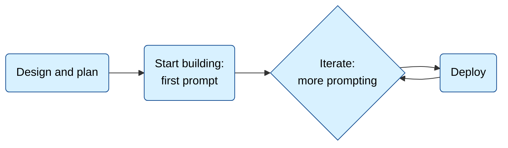

# bolt.new

## Fetch log
- Inbox URL: https://bolt.new/
- Final URL: https://bolt.new/
- Fetched: 2026-07-01
- Pages: 12
- Mode: standard

## Landing page — https://bolt.new/
Title: Bolt AI builder: Websites, apps & prototypes

URL Source: https://bolt.new/

Markdown Content:
## What will you build today?

Create stunning apps & websites by chatting with AI.

or import from

## Your company's design system, now in Bolt

### Porsche

Porsche Design System

### Material UI

Material Design

### Chakra

Chakra UI

### Shadcn

Shadcn UI

### Washington Post

Washington Post Design System

## Use your team's components and brand guidelines to build for production

Try one of the examples above or get started with your own

The #1 professional vibe coding tool trusted by

## Empowering product builders

with the most powerful coding agents

Bolt does the heavy lifting for you, so you can focus on your vision instead of fighting errors.

### The best model, every time

Bolt automatically routes to the right model for each task, balancing quality and cost. No more juggling platforms or guessing which agent to use.

98%

less errors

Bolt automatically tests, refactors, and iterates reducing errors so you keep building instead of fixing.

### Build big without breaking

Bolt handles projects 1,000 times larger than before. Its improved built-in context management can handle complexity and keep your projects running smoothly.

Build with  design system

Stop building from scratch. Start building on-brand.

## Everything you need to scale Built in.

Stop stitching together platforms. Bolt Cloud gives you enterprise-grade backend infrastructure including hosting, databases, integrations and more.

### Unlimited databases

### Enterprise-grade

### User Management & Authentication

### SEO optimization so your project ranks from day one.

### Hosting with analytics & custom domains

Bolt gives you everything you need inside one familiar interface no extra accounts, no steep learning curve.

Whatever your role

## Bolt gives you superpowers

From idea to live product, Bolt adapts to the way you work turning every vision into something real & fast

### Product managers

Go from insight to prototype in hours and test ideas with your team before the day is over.

### Entrepreneurs

Launch a full business in days, not months. From landing page to product, all in one flow.

### Marketers

Spin up high-performing campaign pages in hours, with SEO and hosting built in.

### Agencies

Multiply your impact: deliver more projects, faster, without scaling headcount.

### Students & builders

Learn by doing. Take ideas from class or side projects and turn them into fully working apps.

## Ready to build something amazing?

Try it out and start building for free

## Docs — https://support.bolt.new/home
Title: Bolt Help Center - Bolt

URL Source: https://support.bolt.new/home

Markdown Content:
> ## Documentation Index
> 
> 
> Fetch the complete documentation index at: [/llms.txt](https://support.bolt.new/llms.txt)
> 
> 
> Use this file to discover all available pages before exploring further.

[Skip to main content](https://support.bolt.new/home#content-area)

[Bolt home page](https://bolt.new/)[Help Center](https://support.bolt.new/)

Search...Ctrl K Ask Assistant Ctrl I

*   [Release Notes](https://support.bolt.new/release-notes)
*   [Bolt Status](https://status.bolt.new/)

[Bolt home page](https://bolt.new/)

Search...

Navigation

Bolt Help Center

### Get started with Bolt

*   [Intro to Bolt](https://support.bolt.new/building/intro-bolt)
*   [QuickStart guide](https://support.bolt.new/building/quickstart)
*   [Learn Bolt with video tutorials](https://support.bolt.new/building/video-tutorials)

### Working in Bolt

*   [Choose an agent](https://support.bolt.new/building/using-bolt/agents)
*   [Back up or restore your project](https://support.bolt.new/building/using-bolt/rollback-backup)
*   [Using the chatbox](https://support.bolt.new/building/using-bolt/interacting-ai)
*   [Use Code View](https://support.bolt.new/building/using-bolt/code-view)
*   [Collaborate with others](https://support.bolt.new/building/using-bolt/collaborate)
*   [Share your project](https://support.bolt.new/building/using-bolt/sharing)
*   [Manage your projects](https://support.bolt.new/building/using-bolt/projects-files)

### Switch to Bolt Agent

*   [Switch your v1 projects to Bolt Agent](https://support.bolt.new/building/switch-v1-projects)

### Use your design system in Bolt

*   [Introduction](https://support.bolt.new/building/design-system/introduction)
*   [Add your design system](https://support.bolt.new/building/design-system/add-design-system)
*   [View your design system in Bolt](https://support.bolt.new/building/design-system/view-design-system)
*   [Build with your design system](https://support.bolt.new/building/design-system/use-design-system)
*   [Sync your design system with Bolt](https://support.bolt.new/building/design-system/sync-design-system)
*   [Best practices](https://support.bolt.new/building/design-system/best-practices)

### Bolt Cloud

*   [What is Bolt Cloud?](https://support.bolt.new/cloud/bolt-cloud)
*   Database  
*   Domains  
*   Hosting  

### Best practices

*   [Plan your app](https://support.bolt.new/building/build-your-first-app)
*   [Plan Mode](https://support.bolt.new/best-practices/discussion-mode)
*   [Maximize token efficiency](https://support.bolt.new/best-practices/maximizing-token-efficiency)
*   [Prompt effectively](https://support.bolt.new/best-practices/prompting-effectively)

### Use Bolt with other tools

*   [Expo for mobile apps](https://support.bolt.new/integrations/expo)
*   [Figma for design](https://support.bolt.new/integrations/figma)
*   [GitHub for version control](https://support.bolt.new/integrations/git)
*   [GitHub org access](https://support.bolt.new/integrations/github-org)
*   [Google SSO for authentication](https://support.bolt.new/integrations/google-sso)
*   [Google Stitch for design](https://support.bolt.new/integrations/google-stitch)
*   [Import from Lovable](https://support.bolt.new/integrations/lovable-import)
*   [Netlify for hosting](https://support.bolt.new/integrations/netlify)
*   [Stripe for payments](https://support.bolt.new/integrations/stripe)
*   [Supabase for databases](https://support.bolt.new/integrations/supabase)
*   [Connect to an MCP server](https://support.bolt.new/building/using-bolt/connect-mcp)

### Settings

*   [Account settings](https://support.bolt.new/settings/account-settings)
*   [Workspace settings](https://support.bolt.new/settings/workspace-settings)
*   [Project settings](https://support.bolt.new/settings/project-settings)
*   [Team settings](https://support.bolt.new/settings/team-settings)

### Accounts and subscriptions

*   [Accounts](https://support.bolt.new/account-and-subscription/account-management)
*   [Billing](https://support.bolt.new/account-and-subscription/billing)
*   [Corporate and commercial](https://support.bolt.new/account-and-subscription/corporate-commercial)
*   [Tokens](https://support.bolt.new/account-and-subscription/tokens)
*   [Referral program](https://support.bolt.new/external-resources/referral-program)

### Teams

*   [Overview](https://support.bolt.new/account-and-subscription/team-plans)
*   [Plans and billing](https://support.bolt.new/account-and-subscription/teams/billing-invoices)
*   [Manage your team](https://support.bolt.new/account-and-subscription/teams/manage-team)
*   [Team templates](https://support.bolt.new/account-and-subscription/teams/team-templates)

### Troubleshooting

*   [Login issues](https://support.bolt.new/troubleshooting/login-issues)
*   [Integrations issues](https://support.bolt.new/troubleshooting/integrations-issues)
*   [Bolt issues](https://support.bolt.new/troubleshooting/issues)
*   [Contact support](https://support.bolt.new/troubleshooting/contact-support)

### Reference

*   [Introduction to databases](https://support.bolt.new/concepts/intro-databases)
*   [Introduction to LLMs](https://support.bolt.new/building/intro-llms)
*   [Version history, version control, and GitHub](https://support.bolt.new/concepts/version-history-github)
*   [Supported technologies](https://support.bolt.new/concepts/supported-technologies)
*   [Glossary](https://support.bolt.new/concepts/glossary)

# Bolt Help Center

Get help building with Bolt, an AI tool that turns your ideas into real websites and apps.

## [​](https://support.bolt.new/home#get-started-with-bolt)

Get started with Bolt

## [​](https://support.bolt.new/home#what%E2%80%99s-new)

What’s new

## [Release notes Recently released features and improvements](https://support.bolt.new/release-notes)

## [YouTube Video tutorials for building with Bolt](https://www.youtube.com/@Boltdotnew)

## [Blog Product announcements and updates](https://bolt.new/blog)

## [​](https://support.bolt.new/home#get-the-most-out-of-bolt)

Get the most out of Bolt

*   [**Use Plan mode**](https://support.bolt.new/best-practices/discussion-mode): Plan your app before Bolt writes any code.
*   [**Write better prompts**](https://support.bolt.new/best-practices/prompting-effectively): Learn how to give Bolt better instructions.
*   [**Use tokens efficiently**](https://support.bolt.new/best-practices/maximizing-token-efficiency): Tips to avoid token waste.

## [​](https://support.bolt.new/home#popular-docs)

Popular docs

## [Database Store and manage data with Bolt Database.](https://support.bolt.new/cloud/database)

## [Publish Publish your project to a live website.](https://support.bolt.new/cloud/hosting/publish)

## [Connect a domain Use a third-party domain with your Bolt site.](https://support.bolt.new/cloud/domains/connect)

## [Bolt agent Understand which agent to use for your project.](https://support.bolt.new/building/using-bolt/agents)

## [Version control and version history Understand your options for tracking changes to your project.](https://support.bolt.new/concepts/version-history-github)

## [Troubleshooting Troubleshoot Bolt issues.](https://support.bolt.new/troubleshooting/issues)

## [​](https://support.bolt.new/home#account-and-subscriptions)

Account and subscriptions

*   [**Accounts**](https://support.bolt.new/account-and-subscription/account-management): Manage your Bolt and StackBlitz account.
*   [**Billing**](https://support.bolt.new/account-and-subscription/billing): View and manage your subscription and payment details.
*   [**Tokens**](https://support.bolt.new/account-and-subscription/tokens): Understand token usage.

## [​](https://support.bolt.new/home#contact-support)

Contact support

Email support for product and technical questions is available to paid plan users. Community support is available to all in [our Discord community](https://discord.com/invite/stackblitz).
*   **If you’re on a free plan**: Reach out for community support on Discord. The Bolt Discord community is full of knowledgeable members who may be able to help. To view paid plan options, visit the [Pricing page](https://bolt.new/?showPricing=true).
*   **If you’re on a paid plan**: Email us at [support@bolt.new](mailto:support@bolt.new) using the email address associated with your account. Our team responds Monday through Friday during business hours.

When contacting Bolt Support, use the email address associated with your Bolt account. For security reasons, we can’t look up your account using a different email address.

For security or abuse-related inquiries, email [security@bolt.new](mailto:security@bolt.new).

Was this page helpful?

Yes No

Ctrl+I

## On this page

*   [Get started with Bolt](https://support.bolt.new/home#get-started-with-bolt)
*   [What’s new](https://support.bolt.new/home#what%E2%80%99s-new)
*   [Get the most out of Bolt](https://support.bolt.new/home#get-the-most-out-of-bolt)
*   [Popular docs](https://support.bolt.new/home#popular-docs)
*   [Account and subscriptions](https://support.bolt.new/home#account-and-subscriptions)
*   [Contact support](https://support.bolt.new/home#contact-support)

Copy page View as Markdown

[Bolt home page](https://bolt.new/)

[x](https://x.com/boltdotnew)[github](https://github.com/stackblitz/bolt.new)[discord](https://discord.com/invite/stackblitz)[linkedin](https://www.linkedin.com/company/stackblitz)[youtube](https://www.youtube.com/@BoltDotNew)[reddit](https://www.reddit.com/r/boltnewbuilders)[instagram](https://www.instagram.com/boltdotnew)

[Terms of Service](https://stackblitz.com/terms-of-service)[Privacy Policy](https://stackblitz.com/privacy-policy)

[x](https://x.com/boltdotnew)[github](https://github.com/stackblitz/bolt.new)[discord](https://discord.com/invite/stackblitz)[linkedin](https://www.linkedin.com/company/stackblitz)[youtube](https://www.youtube.com/@BoltDotNew)[reddit](https://www.reddit.com/r/boltnewbuilders)[instagram](https://www.instagram.com/boltdotnew)

[Powered by This documentation is built and hosted on Mintlify, a developer documentation platform](https://www.mintlify.com/?utm_campaign=poweredBy&utm_medium=referral&utm_source=stackblitz)

Assistant

Responses are generated using AI and may contain mistakes.

Suggestions

What's the best way to use Bolt?How do I manage my account?How do I publish my app?

## Intro to Bolt — https://support.bolt.new/building/intro-bolt
> ## Documentation Index
> Fetch the complete documentation index at: https://support.bolt.new/llms.txt
> Use this file to discover all available pages before exploring further.

# Intro to Bolt

> Learn what Bolt is, what you can build, and how to take your idea from prompt to published app.

[Bolt](https://bolt.new) is an AI-powered builder for websites, web apps, and mobile apps.

Type your idea into the chat, click **Build now**, and Bolt transforms your idea into a working product.

With a single prompt, you can build:

* **Websites** like landing pages, personal and corporate websites, e-commerce shops, and more
* **Web apps** such as project management tools, job boards, CRMs, SaaS platforms, booking platforms, and beyond
* **Mobile apps** including games, productivity tools, social apps, workout planners, and whatever you imagine next

Bolt builds full-stack web applications using a wide range of JavaScript-based web frameworks. To build mobile apps, you use the [Expo integration](/integrations/expo).

## Who is Bolt for?

Bolt is for everyone.

Whether you've never written a line of code or you're a full-stack developer, Bolt helps you build more and build faster.

**New to coding?** Bolt removes the technical roadblocks. Describe what you want, and Bolt creates it for you. Then, make changes by chatting with Bolt. No coding knowledge required: bring your ideas and feedback, and Bolt does the rest.

**Experienced developer?** Bolt gives you speed, flexibility, and full control. Choose your languages and frameworks, connect to source control, and edit your code directly in [code view](/building/using-bolt/code-view). Or don't. If you have a technical background, that's the beauty of Bolt: code when you want, prompt when you want.

Bolt solves a different problem for each kind of builder:

* **Product managers**: Go from insight to working prototype and test ideas with your team.
* **Entrepreneurs**: Build a full business, from your company website to a complete product.
* **Marketers**: Build high-performing campaign pages, with SEO and hosting included.
* **Agencies**: Work faster and deliver more client projects without growing your team.
* **Students and builders**: Turn class work or side projects into fully working apps.

## What makes Bolt different

Here's what makes Bolt a unique solution:

* **Everything in one place**: [Bolt Cloud](#bolt-cloud) gives you databases, hosting, and domains in one project, with no separate services or external accounts to set up.
* **Your choice of AI agent**: [Pick the agent](#build-with-your-preferred-agent) that powers your builds, based on the type of work you're doing.
* **You own your code.** The code you create is yours to use for any legal purpose, including [commercial projects](/account-and-subscription/corporate-commercial).
* **Nothing to install**: Bolt runs in your browser and [sets up your development environment for you](#bolt-and-stackblitz), so there's no local setup to manage.

## Ways to start a project

You can start a new project from scratch or bring in work you already have:

* **Describe your idea.** Type what you want to build into the chat, then click **Build now**. Bolt turns your prompt into a working project.
* **Import a Figma design.** Turn a Figma frame into a working project. To learn more, see [Import designs from Figma](/integrations/figma).
* **Import designs from Google Stitch.** Export your Google Stitch designs to Bolt and build them into a fully functional app. To learn more, see [Use Google Stitch designs in Bolt](/integrations/google-stitch).
* **Import a GitHub repository.** Load an existing repository as a Bolt project. To learn more, see [Import an existing repository](/integrations/git).
* **Import from Lovable.** Bring a Lovable project into Bolt. To learn more, see [Import from Lovable](/integrations/lovable-import).

## Build with your preferred agent

Bolt is powered by large language models (LLMs), which are advanced generative AI systems that turn your natural language prompts into working code. Bolt gives you the choice of which AI agent powers your builds, so you can work in the way that suits you best.

<Info>
  If you're new to the concept of large language models, learn more about how they work in [Introduction to LLMs](/building/intro-llms).
</Info>

Bolt offers different agents to choose from, and each has different strengths. To learn more, see [Choose an agent](/building/using-bolt/agents).

## Connect tools

Bolt works with external tools to extend what your app can do:

* [Expo](/integrations/expo) to build and ship mobile apps
* [Stripe](/integrations/stripe) to handle payments
* [GitHub](/integrations/git) for version control, backups, and collaboration
* [Google SSO](/integrations/google-sso) for user authentication
* [MCP servers](/building/using-bolt/connect-mcp) to connect other tools and data you need

## Collaborate with others

You can build on your own or share your project and work with others. On every project, you can:

* Invite collaborators and manage their access
* Find and access shared projects from the projects dashboard
* Work together in real time using multiplayer mode
* Share integrations like databases and GitHub

For details, see [Collaborate with others](/building/using-bolt/collaborate).

With a Teams plan, you can also share prompts, create team templates, and apply Team-level controls. Learn more about [Teams plans](/account-and-subscription/team-plans).

## Bolt Cloud

Bolt Cloud provides a complete solution for launching and running your app.

Instead of managing separate services for databases, hosting, and domains, you can handle everything inside Bolt. This keeps your workflow focused on building your product rather than setting up infrastructure.

### Databases

When your app needs a database, Bolt automatically creates one for you.

You can explore and edit data in a table view, review activity logs, edge functions, and secrets, and manage users and authentication without leaving your project. If you prefer, you can also claim your database and connect it to Supabase. Learn more about [databases](/cloud/database).

### Hosting

Publish your project to the web so you can share your work right away. Every project comes with a free `bolt.host` subdomain. Paid users can connect custom domains and access more publishing options. There's nothing extra to configure and no external accounts to maintain. Learn more about [hosting](/cloud/hosting).

### Domains

You can manage your domains directly inside Bolt. Connect a custom domain, adjust settings, and see everything in one place. This provides a streamlined way to manage your app's web presence without switching between providers. Learn more about [domains](/cloud/domains).

## Bolt and StackBlitz

Bolt is developed by StackBlitz, the team behind [WebContainers](https://webcontainers.io), the technology that first made it possible to run Node.js directly in your browser. Bolt runs on WebContainers, so you don't have to install anything or set up a local environment before you start building.

Bolt links with StackBlitz for account and project management, and some account actions, like resetting your email, are done through StackBlitz. To learn more, see [Accounts and subscriptions](/account-and-subscription/).

## Security and compliance

Bolt is SOC 2 Type II compliant. To learn more about our compliance report, visit the [Enterprise page](https://bolt.new/enterprise/) and contact our sales team.

## Pricing

View the [Pricing page](https://bolt.new/?showPricing=true) on the Bolt website.

Pricing is based on tokens and token usage. Learn more about [Tokens](/account-and-subscription/tokens) and [Maximizing token efficiency](/best-practices/maximizing-token-efficiency).

## Plan your app — https://support.bolt.new/building/build-your-first-app
> ## Documentation Index
> Fetch the complete documentation index at: https://support.bolt.new/llms.txt
> Use this file to discover all available pages before exploring further.

# Plan your app

> The lifecycle of an app, and how to work through it with Bolt.

This guide is for people who are new to Bolt and software development. It's designed to help you plan your project, create a good first <Tooltip tip="A prompt is a message you send to the AI">prompt</Tooltip>, and understand the steps involved in building an application.

## The lifecycle of an application

## Step 1: Design and plan

Before you start building, you need to know what you're building and why.

Bolt provides multiple ways to add your designs:

* Describe them in the prompt.
* [Attach files](/building/using-bolt/interacting-ai#upload-files) to the conversation.
* [Import from Figma](/integrations/figma).

Although you can start with an open-ended prompt, such as `Hey Bolt, please build a todo list app`, you'll have more success if you design and plan first. Try to come up with answers to the following questions.

**What do you want to build?**

In general terms, what are you creating? For example: a todo list application, or a portfolio website, or a mobile habit tracker app.

**Who is it for?**

Your user should be at the center of your design choices. Think about what they need and how they'll use your application.

**What features does it have?**

List out the features: the things users can do. For example, if building a to-do list app, your feature list might include:

> * Create new todos
> * Edit existing todos
> * Delete todos
> * Schedule the time and date for a todo

**What look and feel do you want?**

Give Bolt guidance on the aesthetic you want for your application. You can describe it, or [attach images](/building/using-bolt/interacting-ai#upload-files) for inspiration.

**How will users access it?**

It’s important to make this decision at the start, so that Bolt can structure your application to work with the platforms you want to publish to.

Think about the format:

* Website: the user accesses this in their browser. It's mostly content and information. For example: blogs, news sites, portfolios, galleries, and so on.
* Web application: the user accesses this in their browser. It's interactive, allowing users to add their own data. It's a tool, not just a content site. For example: Bolt is a web application!
* Mobile application: the user installs an app on their phone or tablet.

Then you'll prompt Bolt to build for the format you want:

* If users will access your application in their browser, the easiest way is to publish and host using [Bolt's built-in hosting](/cloud/hosting).
* If you want to build a mobile app, Bolt integrates with [Expo](/integrations/expo), which allows you to build your application once, then package it up for multiple platforms.

**An example answer**

> I want to build a todo list app. It's for people who love timeblocking and the pomodoro productivity method. Its features should include: adding and scheduling todos, and a pomodoro timer. It should have a modern, clean, but colorful aesthetic. Users should be able to add, edit, and delete todos. Users should be able to schedule the time and date for their todos. Users should be able to view both their unscheduled task list, and a daily schedule with any scheduled tasks. Users will access the application in their browser, so make sure it's suitable for hosting on Netlify.

## Step 2: Your first prompt

Writing good prompts is key to success with AI tools.

<Tip>
  For detailed guidance, there's a full best practices article on how to [prompt effectively](/best-practices/prompting-effectively). It's recommended to read this in full. You may also want to check out [Intro to LLMs](/building/intro-llms) for a quick introduction to AI terminology and concepts.
</Tip>

If you built up answers to the questions above, you can use those as the basis for your first prompt. Before you start, use Bolt to improve your prompt:

<Frame>
  <video className="block mx-auto" src="https://res.cloudinary.com/dlq2nawz5/video/upload/f_auto,q_auto/v1776453551/enhance-prompt-guided-questions_t74hvs.mp4" alt="The chatbox with the Enhance prompt option open and guided questions displayed." controls={true} autoPlay={true} muted={true} loop={true} />
</Frame>

1. In the chatbox, type your prompt.
2. In the bottom-left corner of the chatbox, click the **plus icon**, then click **Enhance prompt**.
3. In the **Help us enhance your prompt** dialog, answer each question to give Bolt more information about what you're building.
4. Bolt generates a recommended prompt, which you can edit.

### Comparing original and enhanced prompt results

The image below compares two websites created with the same prompt. The version on the right was built with a simple prompt, while the version on the left was enhanced to produce a more engaging homepage and additional pages.

<Frame>
  
</Frame>

For example, taking the example answer from the previous section and enhancing it generates a much longer, more detailed prompt.

<Accordion title="Full enhanced prompt result">
  Create a web-based task management application optimized for time-blocking and Pomodoro technique enthusiasts. The application should be built using modern web technologies (React/Vue.js) and include the following core features:

  Core Functionality:

  * Task Management System
    * Add, edit, and delete tasks
    * Mark tasks as complete/incomplete
    * Add descriptions, priority levels, and categories to tasks
    * Drag-and-drop functionality for task reordering
  * Scheduling Features
    * Schedule tasks with specific dates and time blocks
    * Visual calendar interface for time blocking
    * Split view showing both unscheduled task list and daily schedule
    * Ability to reschedule tasks via drag-and-drop
  * Pomodoro Timer Integration
    * 25-minute work sessions with 5-minute breaks
    * Customizable timer durations
    * Visual and audio notifications
    * Track completed Pomodoro sessions per task

  Technical Requirements:

  * Single Page Application (SPA) architecture
  * Responsive design for all screen sizes
  * Local storage for data persistence
  * Static site compatible for Netlify hosting
  * Progressive Web App capabilities

  Design Guidelines:

  * Modern, minimalist interface
  * Vibrant but professional color palette
  * Clear visual hierarchy
  * Intuitive navigation
  * Smooth animations for interactions
  * High contrast for accessibility

  Optional Enhancements:

  * Dark/light mode toggle
  * Keyboard shortcuts
  * Task statistics and productivity insights
  * Export/import task data
  * Integration with calendar applications
</Accordion>

Once you enhance your prompt, read through the new prompt to make sure it still does what you want.

## Step 3: Iterate

After Bolt generates your application from your first prompt, you'll probably want to make changes:

* Adding more features.
* Tweaking behavior or appearance.
* Fixing bugs.

Do one thing at a time. Don't try to add multiple features in one go. Remember the guidance in [prompt effectively](/best-practices/prompting-effectively).

## Step 4: Publish

After building your application, the next step is to make it available to users. This is where publishing and hosting come in.

The easiest way to publish your app is to use [Bolt hosting](/cloud/hosting), but you also have other options. You can choose to:

* Use Bolt's Netlify integration: this connects Bolt to Netlify, enabling one-click publishing from within Bolt. Follow the [Netlify integration](/integrations/netlify) guide to set this up and to learn more about building for Netlify.
* For mobile applications, build with Expo and publish to the app stores. Follow the [Expo integration](/integrations/expo) guide.
* Connect to GitHub and set up publishing from GitHub using other CI/CD tools: this is a common devops pattern. The [GitHub integration](/integrations/git) guide walks you through connecting Bolt and GitHub. You'll then need to set up your own build and publishing tools.
* [Download your project](/building/using-bolt/projects-files#download-projects), and use any publishing option you prefer.

If you're new to building applications and unsure which option to choose, Bolt's built-in hosting is usually the best option.

Now that you're ready to use Bolt hosting or you’ve successfully connected to Netlify, Expo, or GitHub by following the instructions above, the final step is to publish your application.

In the top-right corner, click the **Publish** button to open a dropdown menu with the following options:

1. A URL to your published site, which you can copy and share as needed.
2. The timestamp of the most recent publish.
3. Share buttons for X (formerly Twitter), LinkedIn, and Reddit.

## Plan before building with Plan or Discussion Mode — https://support.bolt.new/best-practices/discussion-mode
> ## Documentation Index
> Fetch the complete documentation index at: https://support.bolt.new/llms.txt
> Use this file to discover all available pages before exploring further.

# Plan before building with Plan or Discussion Mode

> Chat with Bolt to get help without immediately generating code.

## Overview

Each agent in Bolt has its own chat mode where you can plan and ask questions without making changes to your code.

With **Bolt Agent**, this is called **Plan Mode**, and with the **v1 Agent (legacy)**, it's called **Discussion Mode**. Both modes provide project-specific help, drawing on Bolt’s documentation and other online sources when needed.

<Note>
  As of April 13, 2026, the v1 Agent is no longer available for new projects. After August 3, 2026, remaining projects that use the v1 Agent will be automatically switched to use the Standard agent. Make sure to [switch to Bolt Agent](/building/switch-v1-projects) before that date to save your chat history and choose the agent you want to use.
</Note>

Using Plan or Discussion Mode lets you explore ideas safely, save tokens by avoiding unnecessary code exchanges, and ensure you get things right before moving into Build Mode.

## Features

### Project context awareness

Every discussion message includes your project codebase for context-aware responses, as well as the most recent messages.

Because Plan and Discussion Modes have the entire context of your projects, there is a wide range of use cases, including:

* Debugging assistance
* Recommendations on tools, libraries and APIs
* Product/project decision-making
* Suggestions on how to improve design
* Suggestions for new features
* Understanding and integrating external APIs
* Generating implementation plans for later execution
* Use the Inspector tool to highlight a component within a page, and discuss potential changes

### Web research

When Bolt answers a question, it can pull in real-time, up-to-date information from trusted web sources instead of just relying on what it was trained on. This helps ensure the answers are accurate, relevant, and not outdated. When a search has been conducted, Bolt displays the sources at the top of the response.

For example:

* If you ask about the latest Stripe API updates, Bolt won't just rely on old knowledge; it will search for the latest documentation and give you a more reliable answer.
* If you ask about a bug in a popular library, it can check forums or support pages for the most recent solutions.

### Quick action buttons

If your question or prompt has an intuitive action associated with it, Bolt will likely generate quick action buttons at the end of its response.

With these buttons, you can take immediate actions such as:

* **Implement this plan** (auto-switches to Build Mode to apply changes)
* **Show an example**
* **Refine this idea**

The quick action buttons are contextual and will vary depending on your project and the topic of discussion.

## How to use Plan Mode

Plan Mode is available when you're using Bolt Agent. It helps you map out steps, reason through complex problems, and build strategies.

While its main strength is structured planning, it can also search the web or explore your codebase if needed.

### Use Plan Mode on the Bolt homepage

You can begin your Bolt project in Plan Mode right from the first prompt. This lets you create and refine a plan through back-and-forth discussion before executing a build, helping you avoid unwanted changes and use fewer tokens overall.

Simply click **Plan** before submitting your prompt to generate a plan for your build.

<Warning>
  When you use Plan mode from the homepage, it starts by creating the base structure of your app. After that, it shares a plan in the chatbox. You can review this plan, suggest changes, and continue building step by step.
</Warning>

<Note>
  If you want to create a mobile app, it’s important to mention this directly in your prompt. For example, you might prompt: “Build a mobile app that helps people track their daily habits.”
</Note>

<Frame>
  
</Frame>

Plan Mode highlights blue when active. Click it again to turn it off and return to Build mode.

### Use Plan Mode in a project

1. Open your project.
2. In the bottom-right corner of the chatbox, click **Plan**.
3. Enter your question or prompt, and read the response. You can then either:
   * Continue the discussion.
   * Use one of the quick action buttons to implement the suggestion.

<Tip>
  Plan Mode highlights blue when active. Click it again to turn it off and return to Build mode.
</Tip>

## How to use Discussion Mode

<Note>
  As of April 13, 2026, the v1 Agent is no longer available for new projects. After August 3, 2026, remaining projects that use the v1 Agent will be automatically switched to use the Standard agent. Make sure to [switch to Bolt Agent](/building/switch-v1-projects) before that date to save your chat history and choose the agent you want to use.
</Note>

Discussion Mode appears when you are using the v1 Agent (legacy). It lets you explore ideas by chatting with Bolt without making changes to your code. Powered by Google Gemini, it is versatile and works well for a wide range of topics. You can use it any time you want to brainstorm or think through ideas.

Follow the steps below to use Discussion Mode in a Bolt project:

1. Open a project working with the v1 Agent (legacy).
2. In the bottom-right corner of the chatbox, click **Discuss**.
3. Enter your question or prompt, and read the response. You can then either:
   * Continue the discussion.
   * Use one of the quick action buttons to implement the suggestion.

<Tip>
  Discussion Mode highlights blue when active. Click it again to turn it off and return to Build mode.
</Tip>

## Choose an agent — https://support.bolt.new/building/using-bolt/agents
> ## Documentation Index
> Fetch the complete documentation index at: https://support.bolt.new/llms.txt
> Use this file to discover all available pages before exploring further.

# Choose an agent

> Learn about the agents you can use to build your Bolt projects.

Bolt uses an AI agent to plan your project, write code, and troubleshoot as you build. Bolt offers two agents, Standard and Max, powered by large language models.

You choose the agent that matches your work, and Bolt handles model selection behind the scenes. As new models become available, Bolt can update how agents perform without changing your workflow.

<Info>
  To learn more about the technology behind Bolt's agents, see [Introduction to LLMs](/building/intro-llms).
</Info>

## Agents

Choose the agent that's best suited to what you're building.

<Note>
  Only Standard is available on the free plan. To use Max, [upgrade to a paid plan](/account-and-subscription/billing#upgrade-your-free-plan-to-a-paid-plan).
</Note>

### Standard

Balanced for everyday building.

Standard is fast and token-efficient, which makes it a good default for most development work. It performs best when the task is well defined.

Best for:

* Small or medium-scale applications
* UI updates
* General development
* Clear, well-defined tasks

### Max

Maximum reasoning for complex tasks.

Max thinks more about each step, which makes a difference when the task involves working through large codebases with complex dependencies or solving problems without an obvious solution. Max is also more responsive to detailed prompts: if you describe a specific problem and ask it to think carefully, it uses deeper reasoning in that area.

For tasks where Standard already performs well, Max may not show a noticeable difference.

Best for:

* Large-scale applications
* Complex or interconnected features
* Refactoring existing code
* Open-ended tasks

The best way to find what works for your projects is to experiment. Try both agents on the kinds of tasks you do most and see which one gives you the results you want.

## Switch agents

You can switch agents in two places: from the Bolt homepage when starting a build, or inside a project while working. For each project, Bolt remembers your selection and automatically uses the same agent the next time you open the project.

If you want all new projects to use a specific agent, you can [set a default agent in your account settings](/settings/account-settings#general-account-settings). Bolt then automatically selects that agent when you start a new project.

### Switch agents on the homepage

<Frame>
  
</Frame>

From the Bolt homepage, use the drop-down selector at the bottom of the chatbox to choose your agent.

### Switch agents in a project

<Frame>
  
</Frame>

To switch agents while working inside a project:

1. In the bottom-left corner of the chatbox, click the **current agent name**.
2. Select the agent you want to use.

<Tip>
  Hover over an agent's name to see more details about it.
</Tip>

## Use an agents.md file

Bolt supports importing an `agents.md` file directly into projects. When an `agents.md` file is present, it's detected and used automatically, with no additional setup required.

To upload a file:

1. Open your project.
2. Click the **plus icon** in the chatbox.
3. Click **Attach file**, and choose your file.

Using an `agents.md` file is especially helpful for users who rely on Project Knowledge settings. Instead of adding content manually through the UI, you manage project context in Markdown files. This makes it easier to include links, organize information across multiple files, and maintain project knowledge in a more flexible and scalable way.

<Note>
  The `agents.md` file acts as the entry point for agent instructions. While it can reference other files, such as text or additional Markdown files, the primary instructions must live in `agents.md` itself. The file name is required and can't be changed. Agents only look for instructions starting from `agents.md`, then follow any links or references you include from there.
</Note>

## How Bolt handles context

Bolt agents support large context windows. However, to keep performance smooth, Bolt limits the active history to recent messages. This helps reduce token usage and keeps building responsive.

If a detail from earlier becomes important again, briefly restate it to bring it back into context. For any ongoing context or instructions that are important, add them to either your Project Knowledge, Account Knowledge, or, if applicable, Teams Knowledge.

## Projects using v1 Agent (legacy)

<Note>
  As of April 13, 2026, you can no longer select **v1 Agent (legacy)** when starting a new project. The v1 agent will be retired on August 3, 2026, and any remaining projects that use it will be automatically switched to the default Bolt agent.
</Note>

If you have existing projects that still use the v1 agent, they continue to work for now. You can still edit, build, and publish as usual until August 3, 2026.

However, the v1 agent doesn't support several features available with Bolt agents, including Plan Mode and the ability to create Bolt Databases. It also tends to produce less complete results and require more rework.

To get the best results from Bolt, you can manually switch your projects to a Bolt agent. Switching agents clears your project's chat history, so save anything you want to keep before transferring, and add any ongoing instructions to **Project Knowledge** afterward.

For step-by-step instructions and more details about the transition, see [Switch your v1 projects to a Bolt agent](/building/switch-v1-projects).

## Connect to an MCP server — https://support.bolt.new/building/using-bolt/connect-mcp
> ## Documentation Index
> Fetch the complete documentation index at: https://support.bolt.new/llms.txt
> Use this file to discover all available pages before exploring further.

# Connect to an MCP server

> Connect to an MCP server to give Bolt context from your external tools and data.

A Model Context Protocol (MCP) server is a standardized connection that lets Bolt access real-world information from the apps and data sources you use, rather than relying only on its built-in knowledge. When you connect an MCP server, Bolt can directly interact with your applications and data while chatting. For example, you can:

* Connect to Notion to let Bolt read or edit your Notion pages
* Connect to Linear to pull in context from your Linear tasks
* Connect to GitHub to let Bolt read or create issues and pull requests

This gives Bolt more precise, up-to-date context and lets you build more powerful workflows without switching between apps.

<Info>
  New to MCP? To learn how it works in-depth, visit the [official MCP documentation](https://modelcontextprotocol.io/docs/getting-started/intro). For an introduction to MCP's uses and benefits, try [What is MCP? The Universal Connector for AI Explained](https://www.backslash.security/blog/what-is-mcp-model-context-protocol).
</Info>

## Before you start

Most connectors require you to prove that you have access to an external app or data source, either by entering a key or by signing in to the app. Before you connect, make sure you have the necessary credentials from the app or service provider. Bolt verifies these credentials when you set up your connection.

## Authentication methods

Bolt supports these authentication methods:

* `API key`: Get an API key from the app you're connecting to. You can usually find this in the app's developer or account settings. An API key is like a password, so keep it secret and don't share it with others.
* `MCP OAuth`: Sign in to the app you're connecting to. This works the same way as signing in to an app using Google or another third-party account.

If you're connecting to a site that's open to the public and has no login, like the [Bolt Help Center](https://support.bolt.new), you can leave the authentication setting for your server as `None`. This is uncommon, and in most cases you need to use either an API key or MCP OAuth.

## Add a connector

Bolt offers built-in connectors for several tools, including Notion, Linear, GitHub, and others. To add a connector to a different tool, like Slack, Google Workspace, or another tool you use, set up a custom MCP server.

### Access your connector settings

1. From the Bolt homepage, in the chatbox, click the plus icon.
2. Click **Connectors**, then click **Manage connectors**.

<Frame>
  
</Frame>

This opens the Connectors (MCP) page in your account settings. Here, you [select from built-in connectors](#add-a-built-in-connector) or [set up a custom connector](#add-a-custom-connector) to another tool you use.

<Frame>
  
</Frame>

### Add a built-in connector

When you choose a built-in connector, the server information is added for you, and you only have to provide your credentials.

<Steps>
  <Step title="Set up a built-in connector">
    1. From the Connectors (MCP) page, click a built-in connector (like Notion or GitHub).
    2. Click **Connect**.
    3. When prompted, enter your API key or log in to the application. The type of authentication Bolt asks for depends on the connector.

           <Check>
             Once Bolt confirms you have access to the server, a `Connected` status appears in the upper-right corner of the screen.
           </Check>
  </Step>

  <Step title="Manage how the connector is turned on for projects">
    The **Auto-enable for all projects** setting controls whether or not a connector is turned on automatically when you create a new project.

    * If you want a connector to be turned on automatically, select **Auto-enable for all projects**.
    * If you prefer to [turn on the connector for each project as you need it](#turn-connectors-on-or-off-for-a-project), leave **Auto-enable for all projects** deselected.
  </Step>
</Steps>

### Add a custom connector

To add a custom connector, you need the server URL, transport type, and authentication method. Most apps that support MCP publish documentation with this information. If you're not sure where to find it, try searching the web for the app's name and "MCP server."

<Steps>
  <Step title="Set up a custom connector">
    1. From the Connectors (MCP) page, click **Custom MCP server**.
    2. Enter the following information.

       | Setting          | Description                                                                                                                                                                    |
       | ---------------- | ------------------------------------------------------------------------------------------------------------------------------------------------------------------------------ |
       | `Name`           | A recognizable name to show in your connector settings.                                                                                                                        |
       | `URL`            | The server address, similar to a web address. For example, `https://support.bolt.new/mcp`.                                                                                     |
       | `Transport type` | The method Bolt uses to communicate with the server. `HTTP` is the standard transport type for most MCP servers. Use this unless the server's documentation says to use `SSE`. |
       | `Authentication` | The method used to verify your access. Select `API key` and enter your key, or select `MCP OAuth` to use a sign-in flow.                                                       |
    3. Click **Connect**.

           <Check>
             Once Bolt confirms you have access to the server, a `Connected` status appears in the upper-right corner of the screen.
           </Check>
  </Step>

  <Step title="Manage how the connector is turned on for projects">
    The **Auto-enable for all projects** setting controls whether or not a connector is turned on automatically when you create a new project.

    * If you want a connector to be turned on automatically, select **Auto-enable for all projects**.
    * If you prefer to [turn on the connector for each project as you need it](#turn-connectors-on-or-off-for-a-project), leave **Auto-enable for all projects** deselected.
  </Step>
</Steps>

### Manage which tools are turned on

Each connector includes tools, which are actions the server allows Bolt to do, like reading, creating, or editing data on your behalf. The number and type of tools available vary by app.

When you add a connector, all available tools are turned on by default. We recommend that you review these tools and turn off any that you don't want or need. For example, if you want Bolt to be able to create data but not delete it, turn off any tools that can delete files or information.

<video autoPlay={true} muted={true} controls={true} loop={true} playsInline={true} src="https://res.cloudinary.com/dlq2nawz5/video/upload/f_auto,q_auto/v1771617358/Edit_MCP_tools_r9ikjc.mp4" />

<Info>
  The tools you enable in the connector apply to all projects. You can't turn on and off tools individually by project.
</Info>

To manage your tools:

1. From the Connectors (MCP) page, select a connector, then click the three dots in the upper-right corner of the screen.
2. Click **Edit**.
3. In the Tools list, deselect any tools you don't want to use. You can select them again later if you change your mind.
4. Click **Save changes**.

## Turn connectors on or off for a project

To optimize performance, we recommend that you turn on a connector for a given project only if you need it.

To turn on a connector for your Bolt project:

1. Log in to the project.
2. In the chatbox, click the plus icon.
3. Click **Connectors**.

   A list appears that shows connectors you've added.
4. Turn on the toggle next to the connector's name.

<Frame>
  
</Frame>

<Tip>
  You can turn off a connector at any time while chatting to reduce the amount of context Bolt is working with.
</Tip>

## Best practices for using connectors

When you turn on a connector, Bolt adds its data to your project's context, which is the information Bolt processes when thinking or building. This is what makes connectors powerful, but it also means that having multiple connectors turned on, each with multiple tools, can slow Bolt down and reduce the quality of its output. It can also increase your token consumption. To make sure you use connectors effectively, follow these guidelines:

* Turn off connectors for projects where they don't add relevant information.
* Turn off tools you don't need in the connector settings. Tools you turn on apply across all projects. To adjust your available tools, see [Manage which tools are turned on](#manage-which-tools-are-turned-on).
* Turn on and off connectors for a project as needed while building, rather than leaving connections on all the time.

## Refresh a connector

When a service provider updates their MCP server, Bolt automatically discovers new tools. You don't need to make any updates to your connector for new tools to work. However, you can refresh your connection to check for new tools and review or turn them off before Bolt uses them. If a connector is showing as offline, refreshing the connection can help confirm whether it's back online.

To refresh a connector:

1. From the Connectors (MCP) page, select a connector, then click the three dots in the upper-right corner of the screen.
2. Click **Edit**.
3. Click **Refresh connection**.

## Edit or delete a connector

1. From the Bolt homepage, in the chatbox, click the plus icon.
2. Click **Connectors**, then click **Manage connectors**.
3. Click the connector you want to change.
4. In the upper right corner of the screen, click the three dots.
5. Do one of the following:
   * To edit the connector, click **Edit**, make your changes, then click **Save changes**.
   * To delete the connector, click **Delete**, then click **Delete server** to confirm.

## GitHub for version control — https://support.bolt.new/integrations/git
> ## Documentation Index
> Fetch the complete documentation index at: https://support.bolt.new/llms.txt
> Use this file to discover all available pages before exploring further.

# GitHub for version control

> Bolt integrates directly with GitHub, handling all commit and update operations automatically.

<Tip>
  If you're new to version control and GitHub, we strongly recommend reading our [Introduction to version history, version control, and GitHub](/concepts/version-history-github) to get familiar with the basics.
</Tip>

When you connect Bolt to GitHub, your work is automatically backed up with a full history of changes.

This means you’re never locked into using Bolt. You can build in Bolt, switch to working directly in GitHub, and then come back to Bolt whenever you want. And since your code lives in GitHub, you can publish your site with other services too, not just through Bolt hosting or the Bolt/Netlify integration.

The GitHub connection is designed to:

* **Keep things simple**: Bolt handles the tricky parts of Git for you.
* **Keep branches separate**: Each branch has its own memory, so nothing “bleeds over” between them.
* **Give you control**: You decide which projects connect to GitHub.
* **Give GitHub organization admins control:** Admins can decide which organization repos are available to which organization accounts.

You can bring an existing GitHub project into Bolt, or start fresh in Bolt and create a new GitHub repository for it.

For an introduction to version control and GitHub with Bolt, watch the video below:

<Frame>
  <iframe width="700" height="394" src="https://www.youtube.com/embed/22cixPj2EUs?si=z4-UJfYs3-VbrSLx" title="YouTube video player" frameborder="0" allow="accelerometer; autoplay; clipboard-write; encrypted-media; gyroscope; picture-in-picture; web-share" referrerpolicy="strict-origin-when-cross-origin" allowfullscreen />
</Frame>

## Connect GitHub

To connect your GitHub account to Bolt, you'll first need an **individual** GitHub account.

<Note>
  If your GitHub organization is connected to Bolt, you can access organization repositories through your org instead. See [GitHub organization setup](/integrations/github-org) for details.
</Note>

[Sign up for one](https://github.com/signup) if you don't already have one.

To connect an individual GitHub account to Bolt, follow these steps:

1. Log in to your Bolt account and open a project.
2. Click the **GitHub icon** in the top right of your screen.
3. Click **Log in to GitHub**.
4. Click **Authorize stackblitz**. (StackBlitz is Bolt's parent company.)
5. Follow any further verification steps required.

## Create a new repository from a Bolt project

<Info>
  Prerequisite: You must have GitHub connected to Bolt.
</Info>

To create a repository from your Bolt project:

1. Log in to your Bolt account and open the project you want to link with a new GitHub repository.
2. Click the **GitHub icon** in the top right of your screen.
3. In the Create a repository window that appears, enter a name for your new repository.
4. Click **Create repository**.
5. Click **Start building** to return to Bolt.

The repository starts as private, on a `main` branch. You can set the repository to public in your GitHub settings, and you can create new branches in Bolt or on GitHub. See [Branching and merging](#branching-and-merging) for more information.

## Import an existing repository

To import a project into Bolt from one of your GitHub repositories, follow the steps below:

1. On the [Bolt homepage](https://bolt.new), click the GitHub icon below the primary chatbot.
2. Choose how you want to import:
   * Use the drop-down menu to select the repository you'd like to import, or
   * Click the **Import from URL** button, then enter your GitHub repository URL.
3. Click **Choose this repository**.
4. Bolt will load your repository as a new Bolt project.

## GitHub organizations integration

Bolt supports working with GitHub organizations, which allow teams to install the Bolt app at the organizational level and choose which repositories are visible to members inside Bolt.

To learn more, see [GitHub organization setup](/integrations/github-org).

## Disconnect GitHub

Fully removing your GitHub integration is a one-step process if you used your GitHub account to create your Bolt account, or a two-step process if you did not.

Either way, start by following the steps below:

<Steps>
  <Step title="Revoke access in GitHub">
    1. [Log in to GitHub](https://github.com/login).
    2. Click your profile icon in the top-right corner of your screen.
    3. Click **Settings**.
    4. Click **Applications** in the left-side navigation menu (likely near the bottom of the menu).
    5. Click the **Authorized GitHub Apps** tab.
    6. Click **Revoke** in the Bolt/StackBlitz row.
    7. Click **I understand, revoke access**.

    <Warning>
      If you signed up for your StackBlitz/Bolt account using Google or your email address, continue to part 2 to complete the process. If you signed up using GitHub, your GitHub integration is now removed.
    </Warning>
  </Step>

  <Step title="Delete the GitHub connection in StackBlitz">
    1. Log in to [StackBlitz](https://stackblitz.com/).
    2. Click **Settings** in the left navigation menu.
    3. Click the **Credentials** tab.
    4. Click **Delete** in the GitHub section.

    <Tip>
      If you added a second email to your account specifically for GitHub, you can go to **Settings** > **Profile** to delete it from your account.
    </Tip>
  </Step>
</Steps>

## Branching and merging

When working with a shared GitHub repository it is a good habit to create a new branch for your changes rather than committing directly to the `main` branch. This helps keep work isolated, reduces the chance of merge conflicts, and makes it easier to review and collaborate on changes. You can create a branch from the default branch and then open a pull request when your changes are ready to be merged.

When you create or import a repository in Bolt, you’ll start on the **main** branch. This is usually the live version of your project. You can do all your work on main, or create branches.

Branches allow you to:

* Work with others without overwriting each other’s changes.
* Work on different features separately, so unfinished work doesn’t go live.

  <Info>
    For example, if you’re building three new features on the main branch, you’d have to finish all three before publishing. With branches, you can finish and merge each one into main as they're ready.
  </Info>

### Create a new branch in Bolt

<Info>
  Prerequisite: You must have GitHub connected to Bolt and a repository already created.
</Info>

1. Log in to Bolt and open a project that is already linked to a GitHub repository.
2. Click the GitHub icon in the top-right of your screen.

   
3. Click **Create new branch**.
4. Enter a branch name.
5. Click **Create branch**.

<Check>
  You're now working on your new branch, which is also created in your GitHub repository.
</Check>

### Change branches in Bolt

<Info>
  Prerequisite: You must have GitHub connected to Bolt, a repository already created, and multiple branches created.
</Info>

1. Log in to Bolt and open a project that is already linked to a GitHub repository.
2. Click the GitHub icon in the top-right of your screen.
   
3. Select the branch you want to switch to.

<Tip>
  Bolt currently doesn't support merging branches in-app. You need to merge branches in GitHub.
</Tip>

### Committing and fetching

Bolt saves your work automatically. Every time you make a change that doesn’t break the project, Bolt creates a commit for you.

It also checks GitHub every 30 seconds for any updates made outside Bolt and pulls those in.

<Warning>
  Very rarely, both Bolt and GitHub might update at almost the same time. If that happens, Bolt will keep your changes and overwrite the GitHub version.
</Warning>

## What is Bolt Cloud? — https://support.bolt.new/cloud/bolt-cloud
> ## Documentation Index
> Fetch the complete documentation index at: https://support.bolt.new/llms.txt
> Use this file to discover all available pages before exploring further.

# What is Bolt Cloud?

> Bring everything you need to launch your website or app together in one place.

With Bolt Cloud, there’s no need to create extra accounts or connect outside services for hosting, databases, or domains.

Powered by trusted platforms like Netlify and Supabase, Bolt Cloud is built to be simple, fast, and dependable so you can focus on creating instead of configuring.

### Why use Bolt Cloud

* Launch your website or app in just a few minutes
* No setup or separate tools required
* Runs on proven, high-performance software
* All features work seamlessly together
* Grows automatically as your audience expands

## Hosting

Every new Bolt project is automatically hosted on secure, high-performance servers. Your site loads quickly, stays online under heavy traffic, and is ready for search engines from the start.

When you’re ready to share your project, you can either click **Share** (to publish your site with restricted access) or **Publish** (to publish your site fully publicly) in the top-right corner of your screen. There’s nothing else to configure.

<Frame>
  
</Frame>

<Info>
  To learn more, see Bolt Cloud [Hosting](/cloud/hosting).
</Info>

## Domains

With Bolt Cloud, you can manage your domain directly from your Bolt workspace. You can buy a new domain or connect one you already own.

If you purchase a domain through Bolt, you don’t have to visit other websites or edit DNS records. Bolt connects everything for you so your domain goes live in just a few clicks.

<Info>
  To learn more, see Bolt Cloud [Domains](/cloud/domains).
</Info>

## Bolt Database

Every project includes **unlimited databases**. You don’t need to create servers or handle setup files.

Your databases grow automatically as your project gets more data and users, so you can build confidently without worrying about limits.

<Info>
  To learn more, see Bolt Cloud [Database](/cloud/database).
</Info>

### Authentication and User Accounts

Bolt Cloud lets you add signups, logins, and password resets to your app without writing them from scratch. You can also create roles and permissions for different types of users.

Everything is handled securely behind the scenes, so your users can sign in safely and your app can grow smoothly.

### File storage

Bolt Cloud gives you a place to store and share files such as images, documents, or user uploads.

File storage allows you to view all your files in one place, and you don’t need to manage separate storage systems or connect third-party tools. Everything is built in and ready to use as soon as your project is created.

### Server functions (edge functions)

Functions let you add your own backend code inside Bolt. These small pieces of code can power things like forms, data processing, or custom features.

As soon as you add a function, Bolt Cloud handles everything behind the scenes, running it on servers close to your users for quick response times.

### Analytics

Analytics in Bolt Cloud show you how people are using your website or app. You can view pageviews, visitors, and where your traffic comes from.

There’s no need to install any extra scripts or create another account. Everything is already built in.

## Payments

You can accept payments right inside Bolt using Bolt Cloud paired with Stripe. This works for one-time purchases, subscriptions, or other paid services.

You don’t have to store or process any payment information yourself because Bolt Cloud and Stripe handle security and compliance for you.

<Info>
  Learn more about [Stripe for payments](/integrations/stripe).
</Info>

## Database — https://support.bolt.new/cloud/database
> ## Documentation Index
> Fetch the complete documentation index at: https://support.bolt.new/llms.txt
> Use this file to discover all available pages before exploring further.

# Database

> Create and manage databases in Bolt without the need for third-party tools.

Bolt makes it easy to add database functionality to your app without the hassle of extra infrastructure. You get a ready-to-use database whenever your project needs one, helping you focus on building features rather than configuring servers.

## Database settings

<Frame>
  
</Frame>

Bolt’s Database Settings include several sections that let you manage your project’s data and related features. Click any item below to learn more about that topic.

* [Advanced settings](/cloud/database/advanced)
* [Authentication](/cloud/database/authentication)
* [File Storage](/cloud/database/file-storage)
* [Logs](/cloud/database/logs)
* [Secrets](/cloud/database/secrets)
* [Security Audit](/cloud/database/security)
* [Server Functions](/cloud/database/server-functions)
* [Tables](/cloud/database/tables)
* [User Management](/cloud/database/user-management)
* [FAQs](/cloud/database/troubleshoot-db)

## Benefits of Bolt Database

Using a Bolt database helps you get more complicated web apps up and running quickly:

* **Unlimited databases:** Create as many databases as needed.
* **No manual setup:** Skip configuring servers or hosting. Bolt handles it for you.
* **Built-in authentication management:** Easily add user sign-up capabilities to your project.
* **One place for monitoring:** Keep track of security and logs without switching tools.
* **Future-proof connections:** Easily connect external tools later for advanced control.

This setup is ideal for quickly building, testing, and scaling your app.

<Info>
  If you’re new to the concept of databases and their importance in web development, you can learn more in our [Introduction to databases](/concepts/intro-databases) article.
</Info>

## Creating and using databases

Bolt creates a database automatically if your project needs one, or if you explicitly ask Bolt to create a database or a database-related feature. This makes it easy to get started without manually setting anything up.

### Ask Bolt not to create a database

If you don't want Bolt to provision a database, you can explicitly request that it not do so.

For example, when submitting a prompt, add the instruction: `Don't use a database, I want to use local storage for this app.`

### Use Supabase instead of Bolt database

If you prefer to use Supabase when creating a new project, you can select it during setup.

<Info>
  See [Start a project using Supabase](/integrations/supabase#start-a-project-using-supabase) to learn more.
</Info>

### Version history and database restores

<Warning>
  Bolt's [Version History](/building/using-bolt/rollback-backup#restore-using-version-history) feature currently does not support database restores.
</Warning>

Restoring to an earlier project version will not change your current databases.

## Automatically paused databases

If your project’s Bolt database hasn’t been used for six days or more, it may be automatically paused to conserve resources.

When you next open your project, you’ll see a message letting you know that the database is being restored. This process usually only takes a few minutes.

This is a normal, routine operation. Please wait for the restoration to finish before making any changes to your project to avoid potential issues.

## View Bolt Database limits

You can view database-related limits on the Cloud settings page. Your Cloud settings appear in a different location depending on your plan. For individual accounts, **Cloud** is under your Account settings. For Teams accounts, it's under your team's workspace settings.

<Frame>
  
</Frame>

To view limits, follow these steps:

1. Click your **profile icon** in the top left of your screen, then click **Settings**.
2. Click **Cloud**.
3. Review the database-related rows in the table.

## How Bolt provisions a database

When you create a project, Bolt can automatically create a database if your app requires one or if you explicitly request it.

For example, if you create a trivia app, Bolt will set up a database to store questions and answers.

Features like user authentication may not be added automatically, but you can prompt Bolt to include sign-up and log-in if your app requires them.

For example: `Create user accounts via email signup and login, then add account sign in/log out buttons in the top right corner of the home page.`

## Publish your project to a live website — https://support.bolt.new/cloud/hosting/publish
> ## Documentation Index
> Fetch the complete documentation index at: https://support.bolt.new/llms.txt
> Use this file to discover all available pages before exploring further.

# Publish your project to a live website

> Publish your project to a free `bolt.host` address.

Bolt offers built-in hosting, so you can publish your Bolt project for free at a web address ending in `bolt.host`. You don't need to set up a separate account with a third-party hosting service: just open the **Publish** menu to get started.

When you publish, you choose whether your site is visible to everyone on the web (public) or only to your team and other people you invite (private). Private sites are useful for sharing in-progress work with specific collaborators or with your organization before it's ready for public launch.

<Note>
  If you belong to a team, other members of your team can view your site by default, even if it's private. Team admins can also [set site visibility to private only or public only](/settings/team-settings#set-published-site-visibility) for all team projects. If your team has a global visibility setting, you'll see it in the **Publish** menu.
</Note>

If you're on a paid plan and you'd rather use your own web address, you can [attach a custom domain](/cloud/domains/connect) you own (like `yoursite.com`) or [buy a domain through Bolt](/cloud/domains/purchase).

Bolt also checks for security vulnerabilities each time you publish, so you can catch issues before they go live.

<Tip>
  Always use the **Publish** or **Update** button in the `Publish` menu to publish your site, since these options don't use tokens. Prompting Bolt to publish your project decreases your token balance.
</Tip>

## Publish your project as a publicly available site

<Note>
  Only the project owner or collaborators with [Co-owner permissions](/building/using-bolt/sharing/#access-by-role) can publish the project, update its visibility, and manage access. Collaborators and teammates can view the published site but can't perform these actions themselves.
</Note>

When your site is public, anyone on the web can view it and search engines can find and list it in search results. In the `Publish` menu, the default visibility is public. If you only want invited users to see your site, [publish it as private](#publish-your-project-as-a-private-site-with-restricted-access) instead.

To publish your project as a public site:

<Frame>
  
</Frame>

1. In the top-right corner of your screen, click **Publish**.
2. In the `Publish your project` menu, click **Publish** again.
3. Wait about a minute for Bolt to deploy your site.
4. Click the link that appears in the chat window to open your site in a new browser tab.
5. (Optional) Attach a [custom domain](/cloud/domains) if you're on a paid plan.

## Publish your project as a private site with restricted access

When your site is private, only your team and invited users can see it. It's not generally accessible on the web, and search engines can't find or list it in search results. Publishing a project as a private site lets you share it with collaborators while continuing to develop it for public launch.

<Note>
  Sites with a custom domain can only be published publicly. To publish privately, first [disconnect the domain](/cloud/domains/connect#disconnect-a-domain).
</Note>

To publish your project as a private site:

1. In the top-right corner of your screen, click **Publish**.
2. In the `Publish your project` menu, change the visibility from **Public** to **Private**.

<Frame>
  
</Frame>

3. (Optional) Click **Manage access** to [add collaborators or domain access](#manage-access-for-collaborators-and-trusted-domains) to your site. If you're not ready to add viewers yet, you can update your site later to manage who can see it.
4. Wait about a minute for Bolt to deploy your site.
5. Click the link that appears in the chat window to open your site in a new browser tab.

### Manage access for collaborators and trusted domains

You can invite individual collaborators using an email address or add a trusted domain so that any user whose email address belongs to a certain domain (for example, `exampleco.com`) can view your site. Adding a trusted domain reduces the effort when sharing openly within your company or organization.

<Note>
  If you're on a team, you don't have to invite your teammates individually. They have access to view your site by default.
</Note>

To manage access to your private site:

<Steps>
  <Step title="Go to your site's access settings">
    1. In the upper-right corner of your screen, in the `Publish` menu, make sure the site visibility is set to `Private`.
    2. Click **Manage access**.
  </Step>

  <Step title="Invite individual viewers">
    Enter the email address of each user you want to add, then click **Invite**.

    <Frame>
      
    </Frame>
  </Step>

  <Step title="Add trusted domains">
    1. To the right of `Trusted domains`, click **Manage**.
    2. Enter any domain whose viewers should automatically get viewing access. For example, if you enter `exampleco.com`, any user whose address ends in `@exampleco.com` can see your site.
    3. Click **Save domains**.

    <Frame>
      
    </Frame>
  </Step>

  <Step title="Publish your site">
    Do one of the following:

    * To publish your project for the first time, click **Publish**.
    * To update access to a previously published site, click **Update**.
  </Step>
</Steps>

You can see that you've added a trusted domain or invited individual viewers. You can also see that viewers who haven't yet accepted your invitation show a `Pending` status.

### Resend an invitation or remove a viewer

To resend an invitation or remove a viewer from your private site:

1. In the upper-right corner of your screen, click **Publish**.
2. Click **Manage access**.
3. Next to the viewer you want to manage, click the three dots (**...**).
4. Do one of the following:
   * To resend an invitation to a pending viewer, click **Resend invite**.
   * To remove a viewer's access, click **Remove**.

## Review security

During publishing, Bolt automatically checks for security vulnerabilities. If Bolt finds any issues it alerts you and provides a `Review security` link, which takes you to the [Security Audit](/cloud/database/security) section in your Project Settings. From there, you can click the **Ask Bolt to fix** button to resolve issues automatically.

<Frame>
  <video className="block mx-auto" src="https://res.cloudinary.com/dlq2nawz5/video/upload/f_auto,q_auto/v1773954835/Review-security_ufu2kx.mp4" alt="Show security warning, review security, and ask Bolt to fix" controls autoPlay muted loop />
</Frame>

If Bolt doesn't detect any vulnerabilities, or if you've already fixed them, the `Publish` menu shows the message `No security issues`.

## Change your `bolt.host` URL

The first time you publish your site, Bolt automatically creates a random `bolt.host` URL name for you.

<Frame>
  
</Frame>

After publishing, you can change your `bolt.host` domain name by following these steps:

1. In the `Publish` menu, to the right of your domain URL, click the **Edit domain** (pencil icon).
2. Enter your new domain URL.
3. If you want to immediately republish your site using the new domain URL, select **Republish after updating**.
4. Click **Save**.

## Publish changes to your live site

After you publish, changes you make to your Bolt project aren't automatically applied to your published site. This lets you continue working on your project and control when to make updates live.

To publish changes, in the `Publish` menu, click **Update**.

## Unpublish your Bolt-hosted site

If you need to take your site offline, and you published it with Bolt hosting, follow the steps in this section to unpublish your project safely.

<Info>
  Before you begin, check whether your project is using a custom domain. If so, you have to [disconnect the custom domain](/cloud/domains/connect#disconnect-a-domain) before you unpublish your site. After the site is unpublished, you can reconnect the domain at any time if you decide to publish again.
</Info>

<Frame>
  
</Frame>

1. In the **Publish** menu, click **Unpublish**.
2. Click **Unpublish** again to confirm.

## Introduction to design systems — https://support.bolt.new/building/design-system/introduction
> ## Documentation Index
> Fetch the complete documentation index at: https://support.bolt.new/llms.txt
> Use this file to discover all available pages before exploring further.

# Introduction to design systems

> Learn how design systems in Bolt help your team build high-fidelity, on-brand prototypes and user interfaces from your own components.

A design system gives Bolt a set of visual rules to follow when creating prototypes or user interfaces for your projects. These rules can include guidelines like colors, typography, spacing, and component styles.

When you use a design system, Bolt generates UI code that's ready to use because it's built from your actual components, not stand-in code you'd have to replace later. This helps keep UIs consistent and on-brand without extra manual effort.

Bolt compiles your design system from your own sources, like your component library and design system website. Your design system is defined by those sources. When they change, you can [sync Bolt](/building/design-system/sync-design-system) to reflect the latest version.

To learn more about the types of documentation you can upload when you add a design system, see [Add your design sources](/building/design-system/add-design-system#add-your-design-sources).

## Preview a design system

Bolt includes pre-loaded design systems you can explore before adding your own. When you preview one, you can get a sense of the output quality when Bolt builds from real components instead of generic ones.

<Note>
  The design system section is only visible on the Bolt homepage when you're logged out.
</Note>

<Frame>
  <video className="block mx-auto" src="https://res.cloudinary.com/dlq2nawz5/video/upload/f_auto,q_auto/v1774474774/preview-design-system_rx1anp.mp4" alt="The Bolt homepage showing the Your company's design system, now in Bolt section. The AWS Cloudscape design system is selected and the Try example button is clicked to open a preview project." controls autoPlay muted loop />
</Frame>

This video is sped up. Build times vary based on your prompt.

To preview an example design system:

1. On the Bolt homepage, scroll down to the design system section.
2. Select a design system, then click **Try example** to open a preview project and run a sample prompt.

When you select a design system, Bolt automatically creates a project using the sample prompt. From there, you can continue with your own prompts.

## Build with a pre-loaded design system

If a pre-loaded design system matches the look and feel you want, you can use it to start a real project.

All Bolt users can [build](/building/design-system/use-design-system) with pre-loaded design systems using the **Design System** option in the prompt toolbar or the **Build now** button on any pre-loaded design system card in the design system section.

You can build with pre-loaded design systems but can't update or change them.

<Note>
  The design system section is only visible on the Bolt homepage when you're logged out.
</Note>

<Frame>
  <video className="block mx-auto" src="https://res.cloudinary.com/dlq2nawz5/video/upload/f_auto,q_auto/v1774559996/build-preloaded-DS_kt5p0p.mp4" alt="The Bolt homepage showing the Your company's design system, now in Bolt section. The AWS Cloudscape design system is selected and a prompt is entered to build a dashboard for a multi-user task management app." controls autoPlay muted loop />
</Frame>

This video is sped up. Build times vary based on your prompt.

To build with a pre-loaded design system:

1. On the Bolt homepage, scroll down to the design system section.
2. Select a design system, enter your prompt, then click **Build now**.

## Add your own design system

To add your own design system and use it across your team's projects, you need a paid Team plan.

See [Add your design system](/building/design-system/add-design-system) to get started, or [upgrade to a Team plan](https://bolt.new/?showPricing=true) first.

Before you add your design system, we strongly recommend reading [Design system best practices](/building/design-system/best-practices). The sources you choose and instructions you provide during design system creation have a significant impact on the quality of your results.
